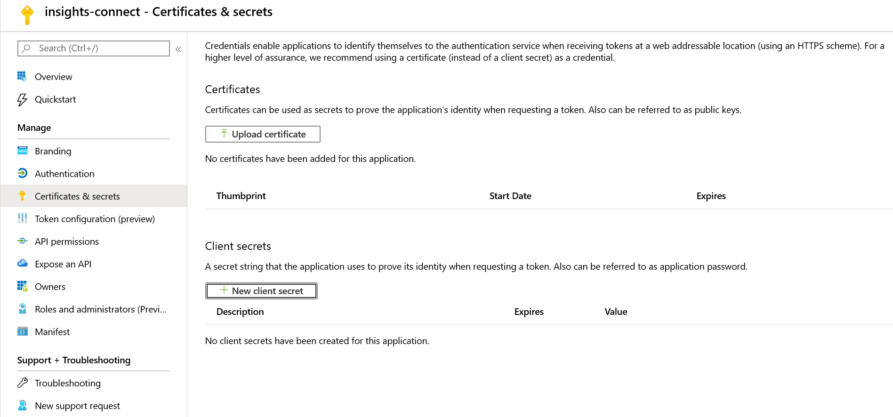
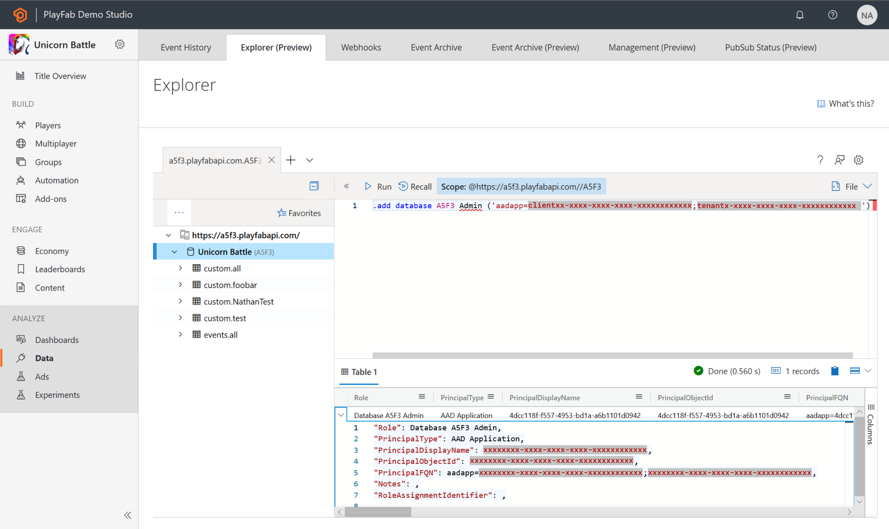
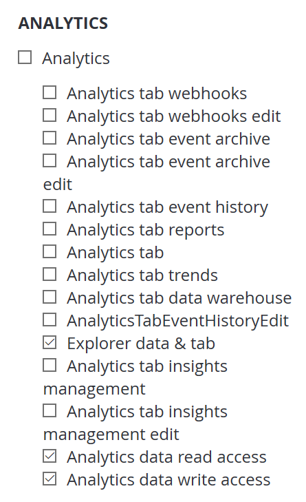
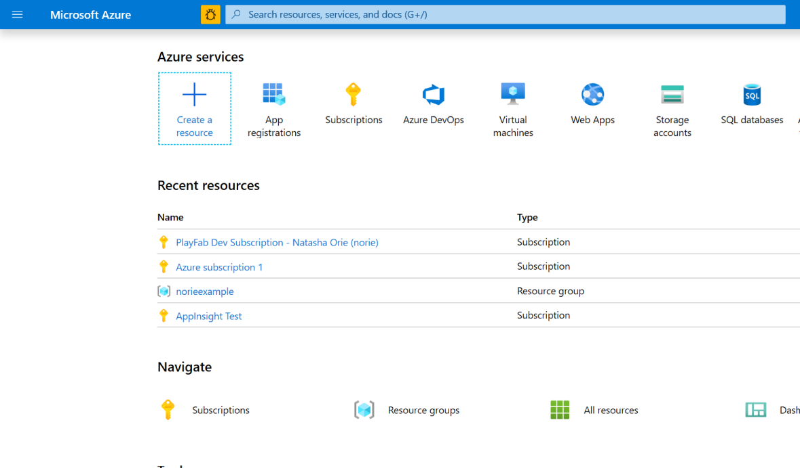
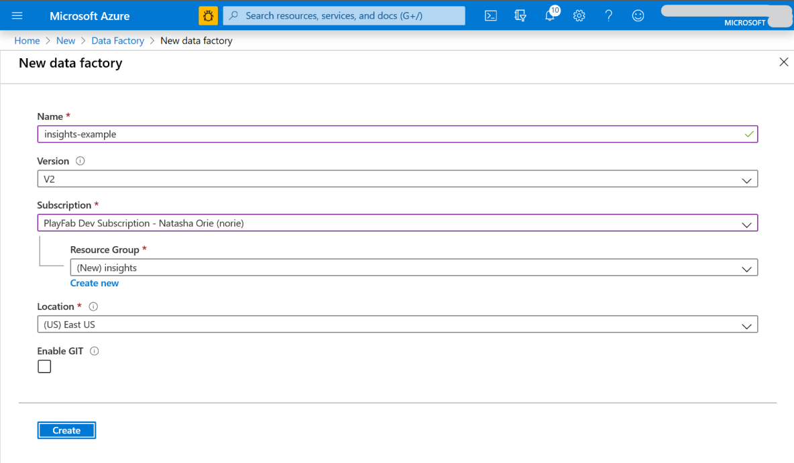

# Connecting Insights to Azure Data Factory (ADF)

[comment]: < Replace links with relative links once placement of article is determined. >
This guide helps you get started using Insights along with Azure Data Factory. To learn more about other tools you can connect Insights with, go [here](insights-connectivity.md).

## Prerequisites
* A PlayFab user account authenticated with [AAD (Azure Active Directory)](https://docs.microsoft.com/gaming/playfab/features/authentication/aad-authentication/).
* The following [Game Manager permissions](https://docs.microsoft.com/gaming/playfab/features/config/gamemanager/playfab-user-roles#assigning-roles) enabled for your user:
    *  Admin status.
    *  Access to the Explorer tab and associated data.
    *  Read and write access to Analytics data.

## Create an Azure Active Directory (AAD) application

You are going to create a new AAD application to link to your title database.

1. Log into the [Azure portal](https://portal.azure.com). If you don't have an Azure subscription, [create a free trial account](https://azure.microsoft.com).

2. After logging into the portal, use the search bar to find and select **App Registrations**. Then, select **New registration** in the upper left-hand corner.  

   

3. In the **Register an application** window enter a name for your registration, then select which account types you would like this registration to support. (If you need help deciding, select the **Help me choose** link which will open a window with more information.)

       

4. Select **Register**. You will be directed to a page with an overview of your newly-registered applcation. Save the **Application (client) ID** and **Directory (tenant) ID** somewhere (you will need these later).

5. In the navigation panel on the left-hand side select **Certificates & secrets** -> **New client secret**. 

   

6. Enter a description for the secret and select how long you would like it to be valid. 

   

7. Select **Add**, and the new secret will appear below **Client secrets**. Now make sure to copy the secret key and save it somewhere secure. *It's essential that you do this now, since you won't be able to access the secret key once you leave this page.*  

## Connect the Azure app to Kusto Explorer
Now we will connect the Azure app to your title database. 

1. From the **Explorer** page in GameManager or in Kusto.Explorer, run the following command, replacing with your own Title ID and client/tenant ID:
   > `.add database <titleID> Admin ('aadapp=<app/client ID>;<tenant ID>') `

   `titleID` is case sensitive, so make sure it is in all caps.

   

   You can verify that this command was successful by going to the **Users** page in [GameManager](https://developer.playfab.com/login). There should be an entry that matches the Client/Tenant ID.

   Note that this will make the Azure app an Admin on your game in PlayFab. If you would like the Azure app to have lesser permissions, assign the Azure app a [custom role](https://docs.microsoft.com/gaming/playfab/features/config/gamemanager/playfab-user-roles#assigning-roles) in PlayFab that only has permissions for the Kusto database. The necessary permissions are:
   * Explorer data & tab.
   * Analytics data read access.
   * Analytics data write access.

   

## Create a new Data Factory
1. Go back to the Azure portal. From the homepage, select **Create a resource**. Search for and select **Data Factory**. Select **Create**.

   

2. Fill out the required fields:
   * Give your data factory a **Name**.
   * Select the **Azure subscription** that you would like to create it in.
   * Create a new **resource group** or select an existing one to use.
   * You do not need to enable GIT right now, so uncheck the box below.

   

3. Once the deployment has completed, under **Next steps** select **Go to resource**. 
   
4. Select **Author & Monitor** to open the Data Factory UI in a separate tab. 

## Create a pipeline

We are now going to create a new pipeline. 

1. On the **Let's get started** page, select **Create pipeline**.

   

 2. In the **Activities** panel under **Azure Data Explorer**, drag and drop an **Azure Data Explorer Command** into the blank workspace. In the bottom panel under **General**, fill out the name and description.
 
    

 3. Switch to the **Connection** tab and select **New**. 
 
    
 
 4. In the **New linked service (Azure Data Explorer (Kusto))** window, fill out the fields:
    * For **Name**, use the Title ID.
    * For **Account selection method**, select **Enter manually**.
    * For the **Endpoint**, use the title's API URL. It will follow the format `https://<titleid>.playfabapi.com`.
    * For **Service Principal ID**, enter your Client ID from your Azure app.
    * For **Service Principal Key**, enter your Client secret from your Azure app.
    * In the **Database** box, type the Title ID in all upper case.
   
    

   Select **Create**.

2.  Select **Test connection** to verify that all of the information is correct. If everything is set up correctly, it will return a **Connection successful** response. 

   

3. Finally, **Validate** and **Debug** the pipeline using the buttons in the toolbar above the workspace. 

## Additional resources

* Azure Data Factory (ADF) [documentation](https://docs.microsoft.com/azure/data-factory/).
* Connect Insights with [more tools](insights-connectivity.md).