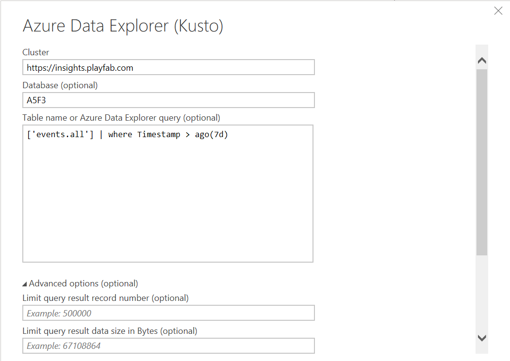
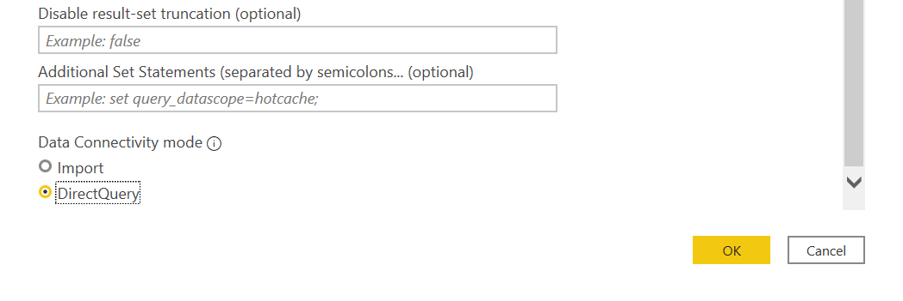

# Tutorial: Connecting Power BI to Insights

This guide helps you get started using Power BI along with Insights. After connecting, you can use Power BI to create visualizations of your game data and more. To learn more about other tools you can connect Insights with, see [Connecting external tools to Insights](index.md).

## Prerequisites
* A PlayFab account or user for which the authentication provider is set to Microsoft. The Microsoft authentication provider uses Azure Active Directory (AAD) for authentication which is required to use the Azure services. See [Azure Active Directory Authentication for Game Manager](../../authentication/aad-authentication/index.md) for instructions on creating an AAD-authenticated account or user. 
  
> [!NOTE]
> To verify that the account, or user, is set to use the Microsoft authentication provider:
>    * Visit the PlayFab [log in page](https://developer.playfab.com/login).
>    * Use the the Sign in with Microsoft link to access your PlayFab account.
> 
> If you can sign in, then the account is set to use the Microsoft authentication provider.
* The following [Game Manager permissions](https://docs.microsoft.com/gaming/playfab/features/config/gamemanager/playfab-user-roles#permissions-and-roles) enabled for your user:
    *  Admin status.
    *  Access to the Explorer tab and associated data.
    *  Read and write access to Analytics data.
*  [Power BI for desktop](https://powerbi.microsoft.com/desktop/)

## Connect with Power BI
On your local machine, open Power BI.

1. In the **Power BI Desktop** window, select **Get Data** > **Azure Data Explorer (Kusto)**.
2. In the **Azure Data Explorer (Kusto)** dialog box take the following steps:
   * Under **Cluster** enter your API endpoint, which follows the format `https://<titleid>.playfabapi.com`. 
   * Under **Database** enter your title ID in all uppercase, as Database names are case sensitive. 
   * Scroll down, and under **Data Connectivity mode** select **DirectQuery**.

   Optionally, enter a table or query. You can set limits for max records or max size. If your query exceeds these limits, it returns a `PartialQueryFailure` error and a message stating that you exceeded the limits.

   The following example specifies a query on the table `events.all` that returns events occurring in the last seven days.

   
   

3. Select **OK**. You can now execute queries and commands on the database. 

## Additional resources

* [Power BI documentation](https://docs.microsoft.com/power-bi/)
* Connect more tools to Insights at [Connecting external tools to Insights](index.md)