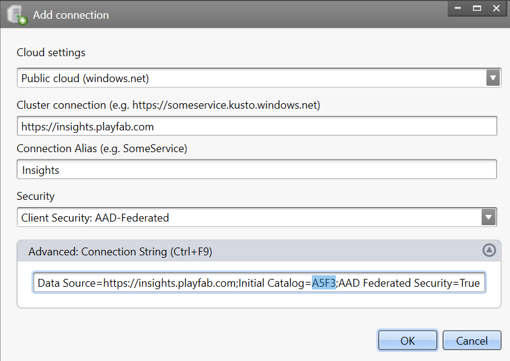
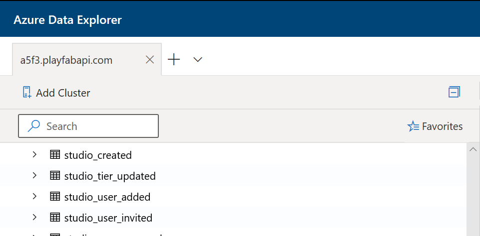

# Connecting Insights to other tools

[comment]: < Replace links with relative links once placement of article is determined. >

placeholder [PlayFab Insights offers an unprecedented look into your game's data and the trends of your users. Part of Insights' power is the flexibility to sync with many other data and analytics tools. This guide will help you connect your Insights to other tools.]

## Prerequisites
* A PlayFab user account authenticated with [AAD (Azure Active Directory)](https://docs.microsoft.com/gaming/playfab/features/authentication/aad-authentication/).
* The following [Game Manager permissions](https://docs.microsoft.com/gaming/playfab/features/config/gamemanager/playfab-user-roles#assigning-roles) enabled for your user:
    *  Admin status.
    *  Access to the Explorer tab and associated data.
    *  Read and write access to Analytics data.

Once you have completed all the prerequisites, proceed to the section on the tool that you would like to connect with: 
  - [Connect with Power BI](#connect-with-power-bi)
  - [Connect with Kusto Explorer](#connect-with-kusto-explorer)
  - [Connect with Azure Data Explorer (ADX)](#connect-with-azure-data-explorer-adx)
  - [Connect with Azure Data Factory (ADF)](#connect-with-azure-data-factory-adf)
  - [Connect with Grafana](#connect-with-grafana)
  - [Connect with Python](#connect-with-python)
  
## Connect with Power BI
Open [Power BI](https://powerbi.microsoft.com/desktop/) for desktop. 

### 
1. Select **Get Data** -> **Azure Data Explorer (Kusto)**.
2. In the **Azure Data Explorer (Kusto)** dialog box take the following steps:
   * Under **Cluster** enter your API endpoint, which will follow the format `https://<titleid>.playfabapi.com`. 
   * Under **Database** enter your title ID in all uppercase. 
   * Scroll down, and under **Data Connectivity mode** select **DirectQuery**.

   Optionally, enter a table or query. You can also set limits for max records or max size. Note that if your query exceeds these limits, it will fail as `PartialQueryFailure` and return a message saying you exceeded limits. 

   You can see in our example that we entered a query on the table `events.all` that returns events occuring in the last seven days. 

   

3. Select **OK**, and you should now be able to execute queries and commands on the database. 

## Connect with Kusto Explorer
Open [Kusto.Explorer](https://docs.microsoft.com/azure/kusto/tools/kusto-explorer). 
1. First, add a connection. You can do this in two different ways:
   * Select the **Connections** tab, then select **Add connection**.
   * Right-click on the **Connections** folder in the left navigation panel, then select **Add connection**.

2. In the **Add connection** dialog box take the following steps:
   * Under **Cluster connection** enter your API endpoint, which will follow the format `https://<titleid>.playfabapi.com`. 
   * Under **Security**, make sure **AAD Federated** is selected. 
   * Expand the **Advanced: Connection String** box and change the value of **Initial Catalog** from `NetDefaultDB` to `<titleID>`. In the example below, this change is highlighted in the string. 
  
   

3. Select **OK**, and you should now be able to execute queries and commands on the database.

## Connect with Azure Data Explorer (ADX)

Open [Azure Data Explorer](https://dataexplorer.azure.com/). 
1. Select **Add Cluster**. 

   

2. Enter your title API endpoint, which follows the format `https://<titleID>.playfabapi.com`. 
3. Select **Add**, and you should now be able to execute queries or commands on the database. 

## Connect with Azure Data Factory (ADF)

Follow the steps in the [Connecting Insights to Azure Data Factory (ADF)](connecting-insights-to-azure-data-factory.md) guide.

## Connect with Grafana

Follow the steps in the [Connecting Insights to Grafana](connecting-insights-to-grafana.md) guide.

## Connect with Python