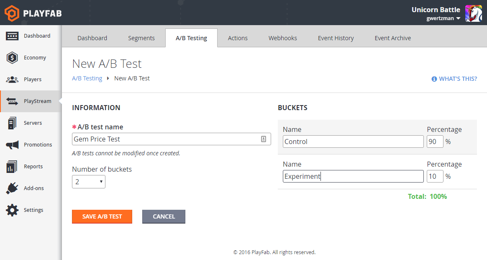
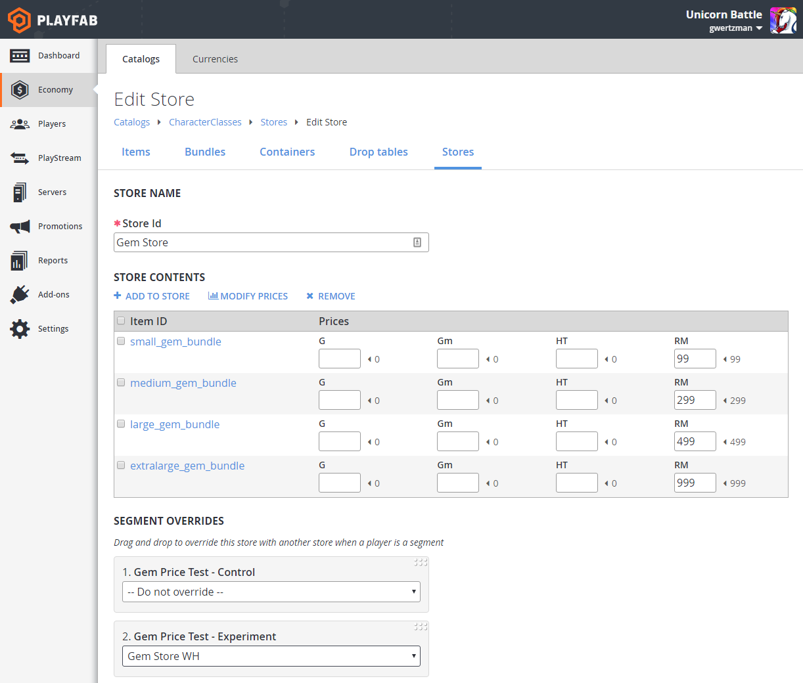

# What is A/B testing?

A/B testing is a technique for running experiments to determine the optimal setting for a particular variable. For example, let’s say you want to test out different sale prices for an item in your in-game store.

With A/B testing, you create a series of player “buckets” into which you partition your players randomly, with weights assigned to each bucket. Each bucket is assigned a different price. Players see the price assigned to their bucket. You then compare the results for each bucket, to determine the most effective price.

Consider this test, for example:

|                      |A                   |B                      |C                      |
| :--------------------|:-------------------|:----------------------|:----------------------|
|Weight                |50%                 |25%                    |25%                    |
|Price per item        |$1.99               |$2.99                  |$4.99                  |
|Total users           |10,020              |4,996                  |5,025                  |
|% paying users        |2.1%                |2.0%                   |1.8%                   |
|Revenue               |$418                |$298                   |$451                   |
|ARPU                  |$0.0417             |$0.0596                |$0.0898                |

Here, bucket “C”, despite having the highest price, ended up generating the higher Average Revenue Per User (ARPU), and would appear to be the “winner” of the test.

## How PlayFab Supports A/B Testing

We are building support for A/B testing on top of our player segmentation feature of PlayStream. Each test bucket is implemented as a player segment. So if you are running an A/B test called “Price Test” with two buckets, “A” and “B”, then we will create two new segments, “Price Test - A” and “Price Test - B”. All players will be automatically assigned to one of these two segments, based on the bucket weights you selected.

Today, the only feature in PlayFab that can directly show different players different results based on segment is the [targeted store override feature](https://blog.playfab.com/blog/introducing-targeted-stores) of the in-game economy. Effectively, this means the only thing you can A/B test today are stores (including both prices, and collection of items).

However, we will soon be adding the ability for other PlayFab features to target different data to different players, such as title data.

Once a test is turned on, we will start generating a daily report for basic Key Performance Indicators (KPIs), based on buckets. This will allow you to determine the effectiveness of your tests. Later, we will make it possible to do more detailed analysis using an external analytics provider.

## Creating your first A/B test

After signing into the **PlayFab Game Manager**, select the **PlayStream** tab, and then on the **A/B testing** sub-tab.

  

From here, you can create your first A/B test. At test creation time, you’ll need to provide an **A/B test name**, the **Number of buckets**, and a **Name** and **Percentage** (weight) for each bucket.

The weights must add up to 100, and the names must be unique. The corresponding segments are then automatically named *test name* - *bucket name*. For example, *Gem Price Test - Control*.

  

Note that bucket assignment is probabilistic, so the populations of each bucket may vary by up to a few percent of the specified weight. This evens out as your player base grows.

## Hooking your test up to stores

Once your test is set up, head to the **Stores** sub-section of the **Catalogs** section in your **Economy** tab. From here, you’ll be able to set overrides for a store on the **Edit Store** page.

  

See our [store segment override blog](https://blog.playfab.com/blog/introducing-targeted-stores) for more details on this.

## Reviewing Results

Once you’ve created a test, we will begin to generate a report called “Daily A/B Test KPI Report” each day. This will give you key KPIs by player bucket for each test you’re currently running.

We recommend letting this report run for at least a few days, to get a baseline before configuring store overrides. We partition your users based on their PlayFab IDs, which are randomly assigned at creation time. Due to the probabilistic assignment of players, it is unlikely that the KPI will be uniform at the beginning of the test.

Once you're confident about the results of your test, you can then reconfigure your primary store and safely delete the test.

## Future Work on A/B Testing

Today, Stores are the only PlayFab feature area that have segment overrides. We have plans for overriding Title Data by segments, as well as other areas. This will look much like store overrides, where title-wide variables will be configurable, based on the segment of the user requesting title data. This will allow for tuning a much wider variety of features for your title.

We also have plans to allow you to run A/B tests within an existing segment, instead of for all players. So, for example, you could try running an A/B test on pricing, that applies only to members of the VIP segment.

## Links

- [A/B testing quickstart](quickstart.md)
- [A/B testing tutorials](tutorials.md)