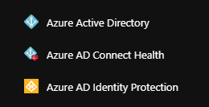
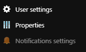
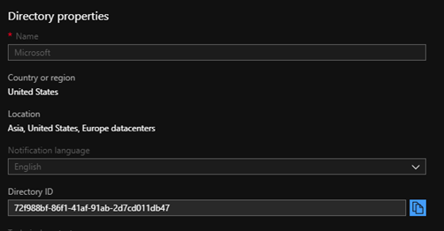
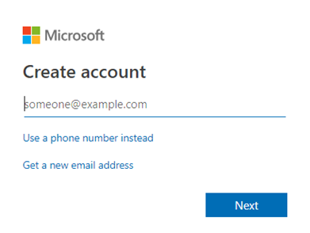

# PlayFab Insights quickstart

> [!IMPORTANT]
> This feature is currently in **Private Preview**.  
>
> It is provided to give you an early look at an upcoming feature, and to allow you to provide feedback while it is still in development.  
>
> Access to this feature is restricted to select titles. If you are interested in trying it, please contact us at [helloplayfab@microsoft.com](mailto:helloplayfab@microsoft.com).

To enable using a dedicated compute and storage cluster, you must provide an account ID for administering databases in one of the following formats:

1. Organizational account (i.e. AAD ID)

2. Microsoft account (i.e. MSA)

Having one of these account types allows you to administer and access the Insights Service's databases. Neither an AAD nor an MSA ID are required for accessing PlayFab Insights' non-dedicated (i.e. shared) cluster.

It takes approximately 24-48 hours to completely provision an isolated cluster for customers to preview. After the private preview window is over, the provisioning process will be automated.
  
## Organizational account

An organizational account is an account created by an organization’s administrator to enable a member of the organization access to all Microsoft Cloud services - such as Microsoft Azure, Windows Intune, or Office 365.

It can take the form of a user’s organizational email address, such as username@orgname.com, when an organization federates or synchronizes its Active Directory accounts with Azure Active Directory.

If you want to provision the Insight service with an organizational account, you will also need to provide the Azure Active Directory ID associated with your organization. Follow the steps outlined below to capture your directory ID:

1. Visit the Azure Portal:  [https://portal.azure.com](https://portal.azure.com)

2. Select **All services** from the portal menu.

   

3. Select the **Azure Active Directory** service.

   

4. Select **Properties**.

   

5. Copy the contents of the **Directory ID** field.

   

## Microsoft account

A Microsoft account (MSA) is the combination of an email address and a password used to sign in to all Microsoft products and services. If a user uses an email address and password to sign in to these or other services, then the user already has a Microsoft account.

However, the user can also sign up for a new one at any time. You can find more information at [account.microsoft.com](https://account.microsoft.com/account).

If you don't have an organizational account or a Microsoft account, you can quickly create an organizational account at [signup.live.com](https://signup.live.com), as shown below.

