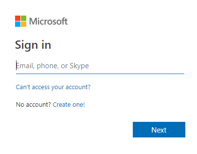
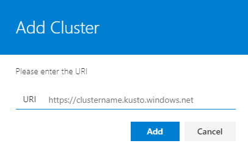
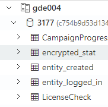

# Viewing or analyzing event data with PlayFab Insights

> [!IMPORTANT]
> This feature is currently in **Private Preview**.  
>
> It is provided to give you an early look at an upcoming feature, and to allow you to provide feedback while it is still in development.  
>
> Access to this feature is restricted to select titles. If you are interested in trying it, please contact us at [helloplayfab@microsoft.com](mailto:helloplayfab@microsoft.com).

Creating and editing queries - in addition to working interactively with returned data - can be accomplished with the Azure Data Explorer Web or Desktop Client. Both tools provide powerful client querying capabilities. It's simply a matter of preference between which tool you chose.

## 1. Log into the Data Explorer Web Client

- Log in to [AzureData Explorer](https://dataexplorer.azure.com).

- Sign in with your organizational or Microsoft account.



## 2. Connect your PlayFab Insights cluster to Azure Data Explorer

- Return to the **Analytics > Insights** page, and capture the name of the cluster assigned to your title.
- Select the **Add Cluster** button in the Azure Data Explorer.

   

- Enter the URI in the format `https://`*clustername*`.kusto.windows.net`.  

     For example, if the cluster is named **PlayFab34239**, then the URI is: `https://PlayFab34239.kusto.windows.net`

   

   > [!NOTE]
   > Only user organizational or Microsoft accounts entered in the provisioning process will have access to the PlayFab Insights cluster. You may optionally grant other users access to your cluster.

## 3. Locate the Insights service database to query

Your Insight service will contain a database with the icon of a database.  Every corresponding table in the database will contain the icon of a table.

To query an asset:

- Select the table, then navigate to the script window.



## 4. Create a simple search

The quickest way to retrieve some data to work with is a simple query that returns all records in table.

- Enter the query shown below to return all records of players logged in.

```cmd
player_logged_in
```

- Enter the query shown below to return the top 10 rows of the players logged in.

```cmd
player_logged_in | limit 10
```

- Enter the query shown below to return all player logged in events between now and 3 days ago.

```cmd
player_logged_in | where Timestamp >= ago(3d)
```

- Enter the query shown below to return the count of all players logged in, grouped by platform.

```cmd
player_logged_in | summarize count() by Platform
```

- Enter the query shown below to return the count of all players logged in, grouped by platform and visualized in a pie chart.

```cmd
player_logged_in | summarize count() by Platform | render piechart
```

## 5. Data Explorer resources

Here are some links for additional resources to help you take the full advantage of the Data Explorer:

### Tutorials

- [Visualize data from Azure Data Explorer in Power BI](https://docs.microsoft.com/en-us/azure/data-explorer/visualize-power-bi)
- [Querying data in the Azure Data Explorer](https://docs.microsoft.com/en-us/azure/data-explorer/web-query-data)

### User Guides

- [Writing queries for the Azure Data Explorer](https://docs.microsoft.com/en-us/azure/data-explorer/write-queries)
- [Azure Data Explorer Query Language Guide](https://docs.microsoft.com/en-us/azure/kusto/query/)
