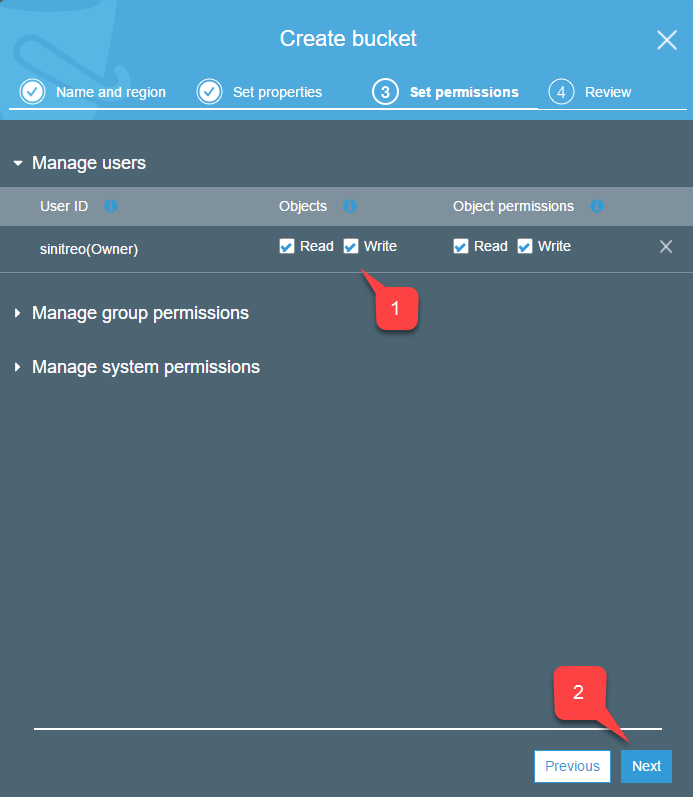

# Set up an Amazon S3 bucket for PlayFab event archiving

This topic describes how to set up an Amazon S3 bucket so that you can archive your PlayFab events to it.

## Setting up Amazon S3 bucket

Once you have created an Amazon account:

- Navigate to **Services (1)**.
- Select **S3 (2)**.

  

- The **S3** page contains an overview of all your buckets.
- Click the **Create bucket** button to create a new bucket.

  
To create your new S3 bucket, you must go though a 4-step wizard:

1. Assign a unique, DNS-compliant **Bucket name** for your bucket. Remember this name, you will need it when configuring your PlayFab event archiving.
2. When you are done, select the **Next** button.

  

- This step offers you the option of adding **Versioning**, **Logging**, and **Tags** for your **Bucket**.
- Select the **Next** button when you are done **(1)**.

  

- During this step, make sure that you have **Read/Write** access **(1)** for objects.
- Select the **Next** button **(2)** when you are done.

  

In this last step, double-check your settings and select the **Create bucket** button **(1)**.

  

## Configuring Amazon access

In order to archive events, you will need to give PlayFab access to the bucket on your behalf. This is done by means of an access key.

- Double-check that you have your newly created bucket in the list of **S3** services **(1)**.
- Select your account **Name** in the top right corner **(2)**.
- Then select **My Security Credentials (3)**.

  

- Locate the **Access Key** list.
- Select the **Create New Access Key** button.

  

- Expand the **Access Key** data **(1)**.
- Save the **Access Key ID (2)** and **Secret Access Key (3)**. You will need them when configuring your PlayFab Event archiving.
- Select the **Close** button **(4)**.

  
