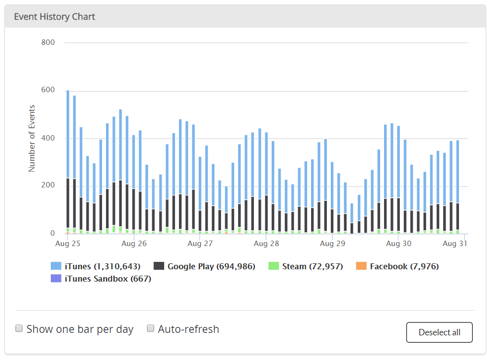
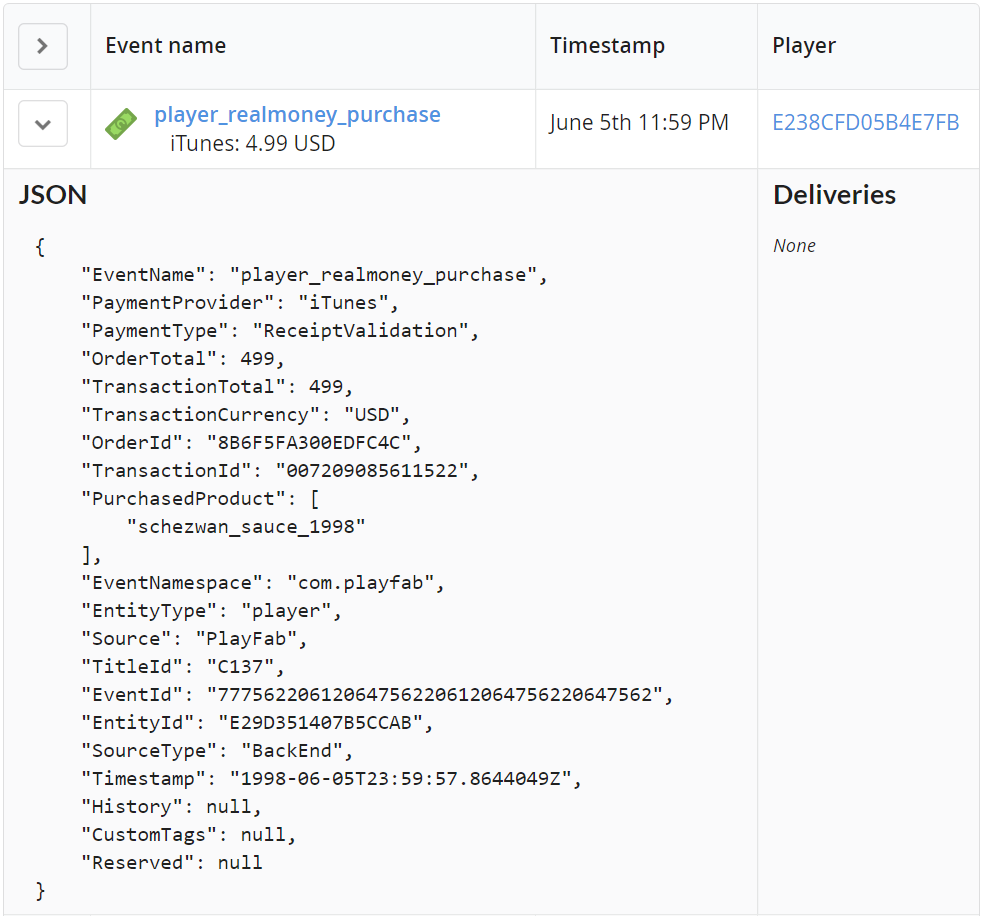
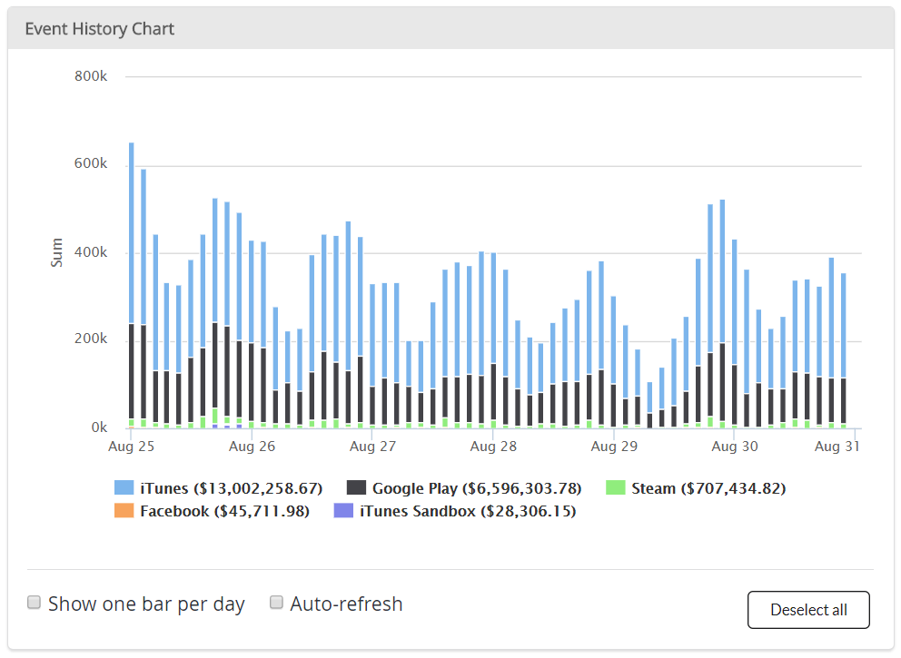

# Constructing an Event History Search

This tutorial illustrates how to construct an **Event History Search**, the components of a **Search**, and how to use **Elastic Search** syntax in your **Queries**.

Let's start by looking at the final results of a successful **Search**, displaying a comparison of how much money goes through each payment provider in the most recent week.

  

**Searches** are constructed from three fields:

- The **Query** field
- The **Group by** field
- The **Sum by** field

The first field to edit will usually be the **Query** field, which is constructed by selecting an **Event Type**, a **Start Date**, and an **End Date**.

  

By editing anything within the **Event Type**, **Start Date**, or **End Date**, the **Query** field itself will be constructed.

  

At this point, the search will result in showing only [player_realmoney_purchase](https://api.playfab.com/playstream/events/player_realmoney_purchase) **Events**, as shown below.

  

By default, **Group by** will aggregate **Events** by their **Event Type**. Here, we are only querying for a *single* **Event Type**.

Instead, let's group by a **Property** of the **Event**. Looking at the [documentation for the event](https://api.playfab.com/playstream/events/player_realmoney_purchase), we can see that **paymentProvider** is a **Property**.

  

Now, the chart shows the counts of how many **Events** occurred for each group, as shown below.

  

By default, **Sum by** will count the number of **Events** per group. We can sum a **Property** of the **Event** instead. We could find a **Property** by again looking at the [event documentation](https://api.playfab.com/playstream/events/player_realmoney_purchase).

There is another way to see the **Properties** of the **Events** - you **Query** by looking at the **Event JSON** itself.

We do this by selecting the **Show JSON** button to the left of the **Event**, as seen in the following screen shot.

  

Now we can find for a **Value** to compute with. Looking at the **JSON**, an appropriate **Value** (a number **Value**, not an **ID**) is **OrderTotal**.

  

Let's set the **Sum by** to that **Value**.

  

After searching again, we can see that our chart is now what we want, as shown in the following example.

  

We could be done here, but there's one issue - If you want to *save* this search, the dates will still be the week of Aug 25 to Aug 31!

We can do better by *manually editing* the **Query** field.

The constructed **Query** field uses **Elastic Search** syntax, meaning that you can use **Elastic Search's** features, such as **Logical Operators** (see the **AND** between **eventName** and **timestamp**) in your queries. Or, what we want here, [date math expressions](https://www.elastic.co/guide/en/elasticsearch/client/net-api/current/date-math-expressions.html).

We can directly substitute the dates in the **Query** field for relative dates, as indicated in the following example.

  

Now, if we save the search...

  

When you select the **Search** from your **Saved Searches** drop-down, your **Search** will be reconstructed, and the dates will be relative to the current time.

