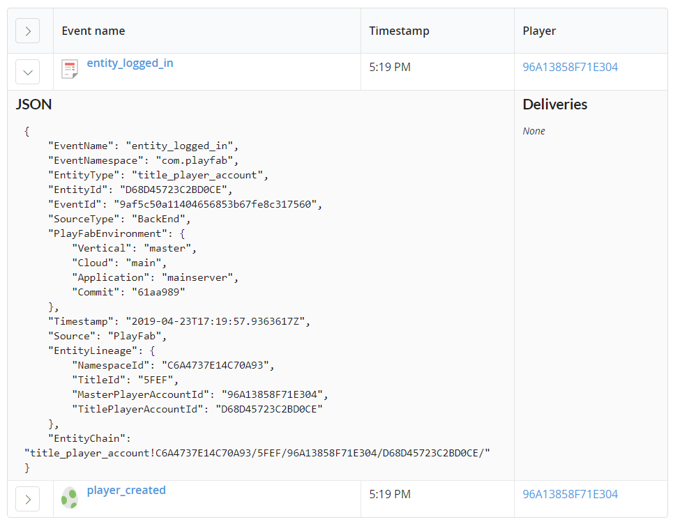
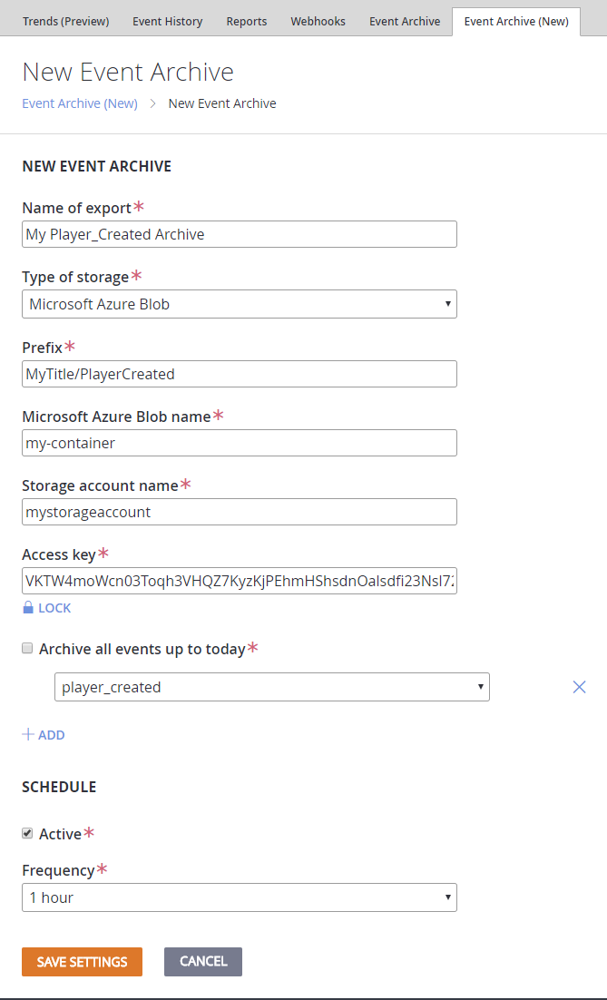
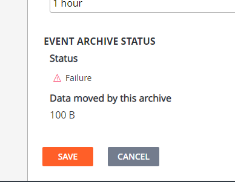

# Event Archiving (preview)

> [!IMPORTANT]
> This feature is currently in **Private Preview**.  
>
> It is provided to give you an early look at an upcoming feature, and to allow you to provide feedback while it is still in development.  
>
> Access to this feature is restricted to select titles. If you are interested in trying it, please contact us at [helloplayfab@microsoft.com](mailto:helloplayfab@microsoft.com).

 Event Archive (preview) can be used to get your events out of PlayFab and into your Azure Blob Storage (ABS) account or Amazon Simple Storage Service (S3) bucket. Event Archive allows you to decide which of your title’s events to export, and how often. The events are dropped in [JSONL format](#event-output-format), each event in its own individual file.

This tutorial shows you how to configure event archiving from scratch.

## Event Archiving overview

### Setup Storage Account

- To create an Amazon S3 bucket, navigate to this section:  [Create an Amazon S3 Bucket](configure-s3-bucket.md).
- To create an Azure storage account, visit [Create a Storage Account](https://docs.microsoft.com/en-us/azure/storage/common/storage-quickstart-create-account?tabs=azure-portal).
  - You also need to [Create a Container](https://docs.microsoft.com/en-us/azure/storage/blobs/storage-quickstart-blobs-portal).

### Viewing Your Events

Before you begin, visit the [Event History](event-history.md) section to learn how to find all the events your title has sent. Event archiving allows you to select which of those events you wish to export. You may export any standard and custom events, up to 250 total per archive (see [Limits and Notes](#limits-and-notes)).

#### Example events


#### Event format

  

### Event Output Format

The files we output to your storage system have a maximum size of 1GB. They are given the following naming format:
`{eventName}_{unique identifier}.json`, where the unique identifier is `{digit(s)}_{guid}`. The files contain a list of events formatted in JSONL (see example below). The contents of the JSON should match what you see when digging into events in event history.

> [!NOTE]
> Events are separated by newline characters rather than commas. Learn more about the JSONL format here: <http://jsonlines.org/.>

#### Example format

```json
{
    "Export": {
        "ver": "3.0",
        "name": "player_logged_in",
        "time": "2019-04-18T00:48:31.6936829Z",
        "popSample": 0.0,
        "iKey": "",
        "flags": 1,
        "tags": "{}",
        "EventName": "player_logged_in",
        "Platform": "AndroidDevice",
        "PlatformUserId": "794048642ecd3e03",
        "Location_ContinentCode": "NA",
        "Location_CountryCode": "US",
        "Location_City": "Benicia",
        "EventNamespace": "com.playfab",
        "EntityType": "player",
        "Source": "PlayFab",
        "TitleId": "",
        "EntityId": "",
        "EventId": "",
        "Timestamp": "2019-04-18T00:48:28.5332232Z"
    }
    "Export": {
        "ver": "3.0",
        "name": "player_logged_in",
        ...
        "Timestamp": "2019-04-18T00:48:28.5332232Z"
    }
}
```

> [!NOTE]
> While many of these fields will be shared between events, different events can have different schemas.

### Frequency

The frequency you select will affect how often your data is output. A frequency of 1 hour means once per hour, and files will be dropped into your storage system with the events that were processed since the last successful export. If no events were processed, no file will be outputted.

### Limits and Notes

- Event archiving does not support archiving historical data. It only archives data starting when the archive is created.
- There is a limit of 250 events per archive and 3 *active* archives per title. You may request to have this limit increased by reaching out to the PlayFab team.
- Event archiving V2 does not support subdividing outputs by date. (e.g. /2019/04/22/my_event_1.json).
- Event archiving to Azure blob storage does not support SAS tokens.
- Event archiving does not guarantee that each record will be written only once. The output may contain duplicates if a failure (rare) occurs during an export.

## Configuring an Event Archive through Game Manager

### Accessing the PlayFab **Event Archive (Preview)**

1. Select **Analytics** in the menu on the left.
2. Then select the **Event Archive (Preview)** tab.
3. Finally, select the **New Event Archive** button.


This brings you to a **New Event Archive** page where you:

- Set the name for your event archive.
- Select where to export to – Azure Blob Storage container or Amazon S3 Bucket.
- Determine the prefix (the *root folder* within your storage account or S3 bucket, under which all data will be dropped).
- Provide us with the credentials for your account.
  - Azure Blob Storage:
    - Microsoft azure blob name: The azure blob **container name**.
    - Storage account name: The name of your storage account (e.g. `\<storageaccountname>` in `https://<storageaccountname>.blob.core.windows.net/`).
    - Storage account key: The primary or secondary key for your storage account.
  - AWS S3 Bucket:
    - If you haven't already, follow these instructions: [Getting your S3 credentials](configure-s3-bucket.md).
    - Bucket name: use the one you created while configuring the **Amazon S3 Bucket**.
    - Access key id: use the one you obtained while configuring access to the Amazon account.
    - Secret Key: use the one you obtained while configuring access to the Amazon account.
- Choose which events you wish to archive, or archive all events.

>[!NOTE]
> Any new events sent by your titles will *not* automatically be exported. You will have to come back and add the event to your archive.

- To choose all events, select **Archive all events up to today** (see [Limits and Notes](#limits-and-notes)).
  - To select *specific* events:
    - Un-select **Archive all events up to today**.
    - Select **+ Add**.
    - Select your event from the drop-down.
  - Select the frequency at which you wish to archive your events.
  - Select whether you want this archive to be active or inactive (aka **enabled**/**disabled**). By default, new archives are set to active.

Select the **Save Settings** button when everything is in place. **This operation can take up to a couple minutes, depending on how many events you are archiving.**

> [!NOTE]
> The same flow applies for editing an existing event archive. **Your key will be encrypted and you can never view it again.**

Azure Blob Storage Example:

  

## Testing your Archive

To ensure everything is working properly, make sure to post some events. Wait for whatever interval you set (1h or 24h), and you should see your export light up as **Succeeded**. Then check and make sure the data is showing properly in your Azure storage account or S3 bucket.


## Monitoring your Archives

Once your archive is created, you will see it on the home page of your event archives, as seen below.
  

Your archive will show as **Pending** until data starts being exported, at which point it will update to **Succeeded** or **Failed**. This page also shows you how much data was exported by a given archive.

## Handling Failures

You can see the status of a given event by going to the archive details page. The status and failures will be displayed on the archive details page below the events:

  

Selecting the **FAILURES** icon will show you the error report. A green check mark indicates that there are no ongoing errors and your data is archiving properly.
