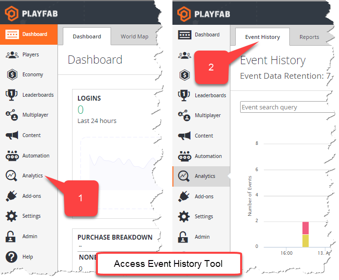

# Event history

This tutorial shows you how to access and utilize the event history in PlayFab.

> [!IMPORTANT]
> Before using this tutorial, make sure that you already have some recent events posted to your title. Otherwise, the event flow will render empty. Most PlayFab **APIs** will post **PlayStream** events, or you can post your *own* custom events. For an overview of automatic and custom events, see the [PlayStream quickstart](quickstart.md).

## Access event history

1. Open the PlayFab *Game Manager* and select **Analytics** from the navigation sidebar.
2. Locate and select the **Event History** tab.

  

### Event History Page overview

  

1. The **Event Data Retention** area shows the time interval for the events. For example, when it says **7 Days**, only events that happened a week ago or later will be queried.
2. The [Event Search Query panel](../../analytics/metrics/real-time-analytics-event-search-query-panel.md) allows the changing of graph behavior and the filtering of event flow by different event properties.
3. The [Event History Chart panel](../../analytics/metrics/real-time-analytics-event-history-chart-panel.md) displays a chart that shows the number and types of events happening in your title during the specified time interval.
4. The [Events Timeline panel](../../analytics/metrics/real-time-analytics-events-timeline-panel.md) is a list of events data sorted by time (starting with the most recent).

  

### Search and inspect events

In this section we have the following goals:

- Sign the player in and produce a **player_logged_in** event.
- Use the [Event Search Query Panel](../../analytics/metrics/real-time-analytics-event-search-query-panel.md) to find this event using search query.
- Inspect this event using the [Events Timeline Panel](../../analytics/metrics/real-time-analytics-events-timeline-panel.md).
- Observe how this event effects the [Event History Chart](../../analytics/metrics/real-time-analytics-event-history-chart-panel.md).

#### Demonstration

We are going to use the **CustomID** method to sign the player in and produce a **player_logged_in** event.

Execute the **API** call shown below.

```csharp
PlayFabClientAPI.LoginWithCustomID(new LoginWithCustomIDRequest()
{
    CreateAccount = true,
    CustomId = "12345QWERY"
},
result => Debug.Log("Logged in"),
error => Debug.LogError(error.GenerateErrorReport()));
```

- If no player is registered with the given **CustomID "12345QWERY"**, the player will be generated thanks to the second parameter that we passed (see below).

```csharp
CreateAccount = true
```

We now have to locate the event.

- The easiest way to do this is by means of the [Event Search Query panel](../../analytics/metrics/real-time-analytics-event-search-query-panel.md). We know the **Custom ID**, and we can use it as a search query.

  

Once you have located the event in the [Events Timeline panel](
../../analytics/metrics/real-time-analytics-events-timeline-panel.md) you can further inspect it by selecting the timestamp label, as shown below.


- Finally, you may analyze how this event effects the overall event flow using the [Event History Chart](
../../analytics/metrics/real-time-analytics-event-history-chart-panel.md).

  

The graph shows the **player_logged_in** event being a part of several events (that match the current query) produced on May 5th.

### How to inspect player events

It is possible to access the event history for a specific player (see below).

  

1. Use the **Game Manager**, and navigate to **Players** in the menu to the left.
2. Select the **Players** tab.
3. Locate the player you want to inspect, and select the **Player ID** label.
4. Select **Event History** from the toolbar.

You will be presented with an event history page where only events related to the inspected player are shown.
