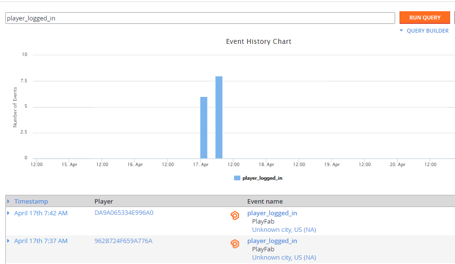

# Generating PlayStream events

This tutorial provides an overview of automatic and custom **PlayStream** events in PlayFab.

## Automatic event overview

As the name implies, an automatic event is one that occurs *automatically* with a normal **API** method call. Most existing **API** methods will generate **PlayStream** events.

Sometimes, however, you will need to capture events that are very specific for your game, and are not provided by PlayFab out of the box.

For that purpose, consider using a custom event (as described in the next section, [Custom Event Overview](#custom-event-overview)).

### Example

If an email and password pair is valid, The following **API** call will sign in a player with email and password.

```csharp
PlayFabClientAPI.LoginWithEmailAddress(new LoginWithEmailAddressRequest() {
    Email = "my@email.com",
    Password = "qwerty"
}, 
result=> Debug.Log(result.PlayFabId), 
error=> Debug.LogError(error.GenerateErrorReport()));
```

As a side effect, PlayFab will record a **player_logged_in** event. Consider using the [Event History](event-history.md) to test the described behavior.

  

## Custom event overview

While PlayFab records a lot of events automatically, sometimes you need events that are very specific for your game.

The concept of custom events allows you to post events with an arbitrary type and name.

Similar to automatic events, custom events are fully reflected through [real-time analytics tools](../../analytics/metrics/real-time-analytics-core-concepts.md). Unlike automatic events, you need a little bit of custom code to post custom events.

Custom events can be classified by entity. A custom event can be bound to a player, character, or title. An event entity reference is specified using two fields:

- **EntityType**
- **EntityID**.

### Relevant API Calls

[WritePlayerEvent](xref:titleid.playfabapi.com.client.analytics.writeplayerevent), [WriteCharacterEvent](xref:titleid.playfabapi.com.client.analytics.writecharacterevent), [WriteTitleEvent](xref:titleid.playfabapi.com.client.analytics.writetitleevent)

### Example: Post your own custom event

You want to aggregate information about players opening various chests. Along with standard event information, you want to record **ChestType** and **LevelID**.

Unfortunately, PlayFab does not provide a corresponding [Automatic Event](#automatic-event-overview) out of the box. Use a custom player event to solve the problem.

### Prerequisites

Your player is already logged in. In your code, you have a callback **OnChestOpen**. **LevelID** and **ChestType** are passed into that callback.

### Solution

Once executed, the following code will post your custom player event.

```csharp
private void OnChestOpened(string chestType, int levelId) {
    PlayFabClientAPI.WritePlayerEvent(new WriteClientPlayerEventRequest() {
        Body = new Dictionary<string, object>() {
            { "ChestType", chestType },
            { "LevelId", levelId }
        },
        EventName = "player_chest_opened"
    },
    result => Debug.Log("Success"),
    error => Debug.LogError(error.GenerateErrorReport()));
}
```

1. The method receives **ChestType** and **LevelId**.
2. Use the [WritePlayerEvent](xref:titleid.playfabapi.com.client.analytics.writeplayerevent) **API** call for posting a custom event bound to a player.
3. Provide a body, specific for your events and your needs. In this case we provide the **ChestType** and **LevelId** fields.
4. Provide an event name identifying your custom event. In this case we use the **""player_chest_opened" Event Type Name**.

### Testing

Once the solution code is executed, consider using the [Event History](event-history.md) to check that your event has been successfully registered.

1. Filter using the event name.
2. Ensure the **player_chest_opened** events are in the list.
3. Ensure that your custom body fields are recorded: **ChestType** and **LevelId**.

  
