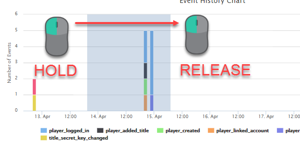

# Real-time analytics - Event History Chart panel

This tutorial illustrates how to use the Event History Chart panel.

## Overview

The [Event history](../../automation/playstream-events/event-history.md) Chart panel represents the event flow as a chart of events distributed over a timeline and grouped by time intervals. To generate events for testing purposes, see the [PlayStream quickstart](../../automation/playstream-events/playstream-quickstart.md) for examples of how to post custom events.

  

1. The vertical axis shows the **amount of events** for each given period of time.
2. The horizontal axis represents a **timeline, grouped by intervals**.
3. The **Legend** is represented as a **color map**, where each event name is mapped to a certain color.
4. Events are **grouped by intervals** into columns. Within a certain interval, events are **grouped by name** (visually by color).
5. Hovering over a color rectangle reveals **additional info** about that event group.

## Tips and Tricks

- It is possible to select an interval in the chart and adjust the chart to reflect only the selected interval:
  
     

- You can click event names in the legend to optionally show/hide certain event types. This will not reload the query:

     
