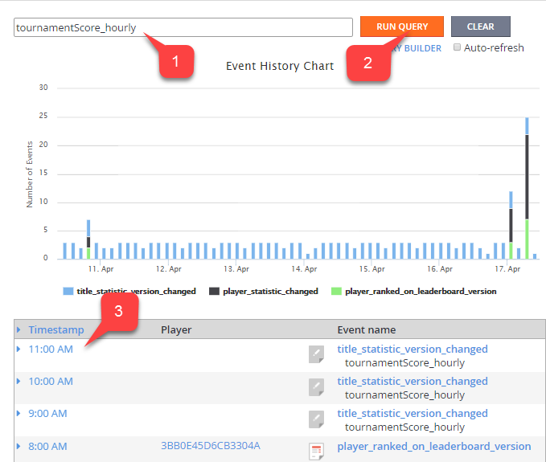
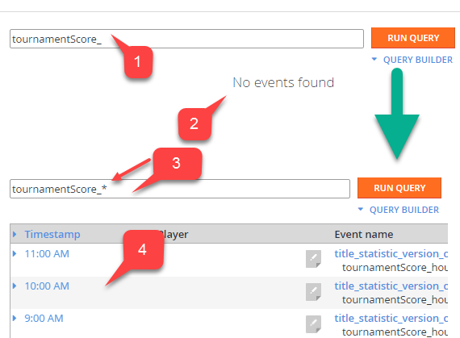
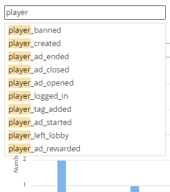

# Real-time Analytics - Event Queries

Several PlayFab Real-time Analytics tools support querying for a specific set of events. Each query is represented as a text expression and follows the rules described in this tutorial.

Consider the following event:

```json
{
    "EventName": "title_statistic_version_changed",
    "StatisticName": "tournamentScore_hourly",
    "StatisticVersion": 1290,
    "ScheduledResetInterval": "Hour",
    "ScheduledResetTime": "2017-04-17T09:00:00Z",
    "EventNamespace": "com.playfab",
    "EntityType": "title",
    "Source": "PlayFab",
    "EventId": "a1883560c93b43f5b0543ade2d8cd093",
    "EntityId": "6EEA",
    "SourceType": "BackEnd",
    "Timestamp": "2017-04-17T09:00:22.4012656Z",
    "History": null,
    "CustomTags": null,
    "Reserved": null
}
```

In PlayFab, an event is represented as an object with a set of fields. Each field has a value. You can compose a query expression to filter events by specific values on one or more fields. Query expressions can be [simplistic](#simplistic-queries) or [complex](#complex-queries).

PlayFab Free Tier only allows searching by the default event fields. The Paid Tier enables searching by custom event fields. Please post on our [forums](https://community.playfab.com/questions/ask.html) to ask about paid tiers and enabling PlayStream history.

## Simplistic Queries

A Simplistic Query is just a value you want to search for. PlayFab goes through each property of each event looking for that specific value.

For example, consider the aforementioned event and it's field called "StatisticName". This field has the value: "tournamentScore_hourly". Using the event search query "tournamentScore_hourly" **(1)**, click the "Run Query" button **(2)**. The result will be rendered in the Event Timeline list **(3)** and will contain the specified event.

  

This happens because PlayFab analyzed all the events and found that this particular event has some property with the value of "tournamentScore_hourly".

> [!IMPORTANT]
> PlayFab supports wildcards and some of the regex expressions.

This means that you may search by part of the value, as shown in the following image:

  

In the example shown in the preceding image, the query "tournamentScore_" **(1)** will result in no events in the list **(2)**. Using a wildcard, we adjust the query to "tournamentScore_*" **(3)** and this results in all events that have a field with the value starting with "tournamentScore_" **(4)**. 

Using this technique, you can quickly search for relevant events with no need to build complex queries or to use a query builder.

## Complex Queries

To run a complex analysis you will need complex queries with several conditions. For this purpose you can use complex queries. A Complex Query consists of one or more query expressions separated by AND/OR operators.

A **filter expression** is an expression that consists of 2 parts and has the following format:

`object_property:value_descriptor`.

**object_property** points to a property on your event data (that you want to filter by), and generally looks like this: `eventData.propertyName<.otherPropertyName*>`. The `eventData` part is absolutely necessary to point PlayFab to an event object. You can then extract specific properties using dot notation: `eventData.eventName`. You may also refer to nested properties like this: `eventData.history.triggeredEvents`.

> [!IMPORTANT]
> object property requires camelCase parts starting from a lowercase letter. For example, each event has a property called *EventName*. However, to access this property in a query you have to adjust the first letter of the property and use: *eventData.eventName*.

**value_descriptor** is an expression that describes the value of the field you want to filter by. The simplest form of value descriptor is the value itself. The following query will look for all events with names equal to *player_created*:

`eventData.eventName:player_created`

We can customize the value descriptor by kicking in some regular expression elements, like wildcards. By convention, all of PlayFab's player oriented event names start with *player_:*

  

The following query will let us locate all such events:

`eventData.eventName:player_*`

Another example of a complicated value descriptor is a descriptor for the date property. The following query incorporates all the events which have a timestamp between April 1st and April 17th:

`eventData.timestamp:[2017-04-01T00:00:00 TO 2017-04-17T00:00:00]`

Finally, we can combine several filter expressions using AND/OR operators and parenthesis for grouping. The following query will locate all the events that happened from April 1st to April 17th and have the event name player_logged_in or player_statistic_changed:

`eventData.timestamp:[2017-04-01T00:00:00 TO 2017-04-17T00:00:00]  AND ( eventData.eventName:player_logged_in OR eventData.eventName:player_statistic_changed )`
