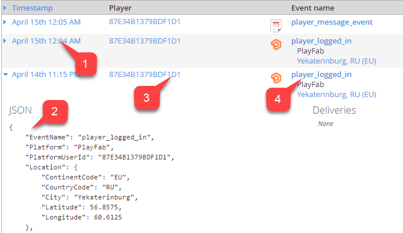

# Real-time analytics - Events timeline panel

This tutorial illustrates how to use the **Events Timeline** panel.

## Overview

This panel is a subsection of [PlayStream Event History](../../automation/playstream-events/event-history.md) in the form of a table of **Event** data sorted by **Time**. To generate **Events** for testing purposes, see the [PlayStream Quickstart](../../automation/playstream-events/quickstart.md) for examples of how to post **Custom Events**.

  
In this panel:

1. The **Timestamp** label shows the **Date** and **Time** of the **Event** in an easily readable format.
2. The full **JSON** body of the **Event**. This can be accessed by selecting the **Event Timestamp**.
3. The **Player ID** is a reference to the **Player** that initiated the **Event**.
4. **Event Details** show the **Details** associated with an **Event Name**, as well as other useful information.

## Tips

- The **JSON** body of the **Event (2)** is a mix of **PlayFab Event Data** and any custom body that is attached to the **Event** when it is posted. You will find that all of this data is stored in one object.
- The **Player ID (3)** may render empty for **Events** that are bound to a **Title** instead of the **Player**.
- You can select the **Player ID (3)** to quickly navigate to the **Player's** personal **PlayFab** page, where you can obtain additional information about the **Player**, their account activities, etc.
- You can select the **Event Name** label (**4**) to adjust the **Query** to filter the **Event Timeline** by that **Event Name**.
- If present, you can select the **Region Label** to open a **Google** map pointing to the **Region** location.
- **Event** details may contain several indicators:
  - **Region** is available when the **Event** body contains location information.
  - **Icon** is based on the **Event Name**.
  - The **PlayFab** label indicates that the **Event** is an [automatic event](../../automation/playstream-events/quickstart.md) (generated by **PlayFab**).
