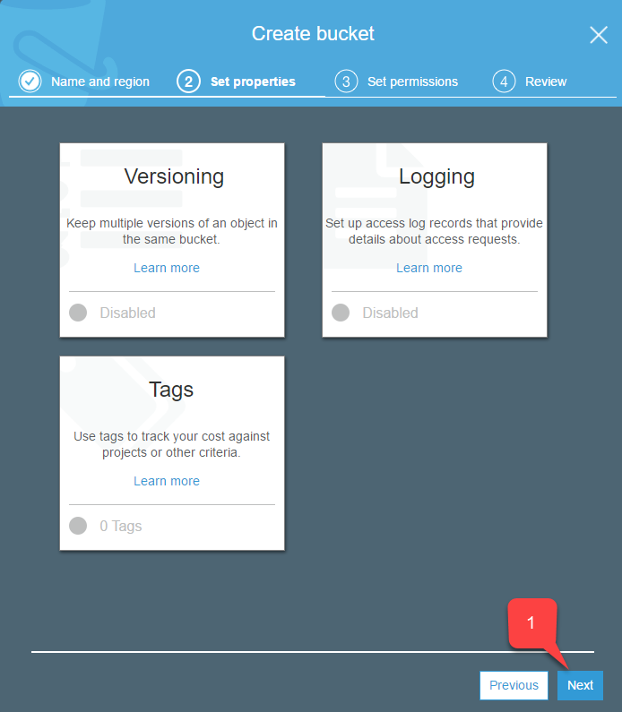
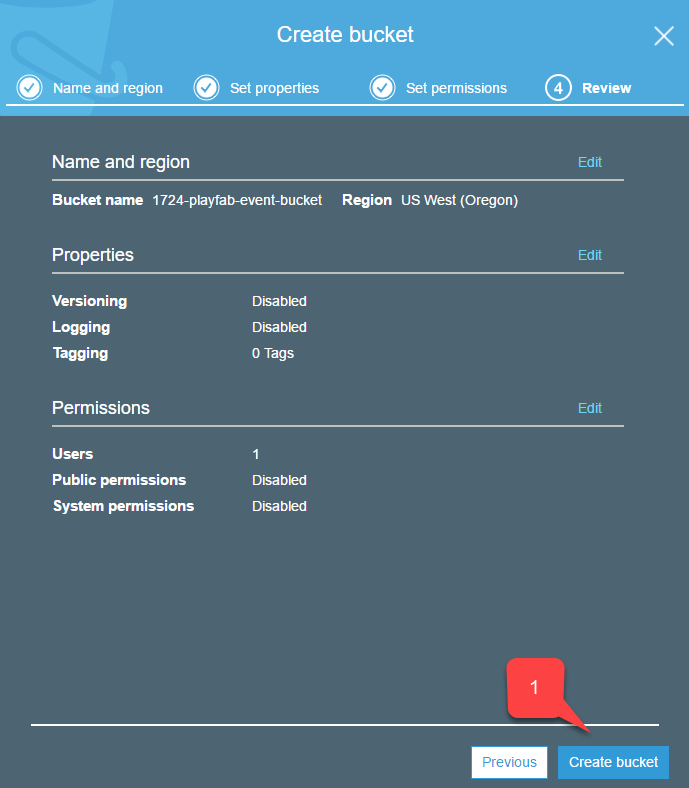
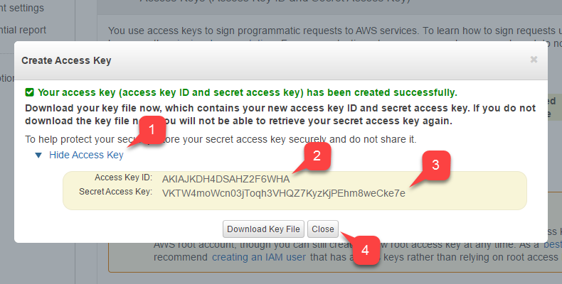
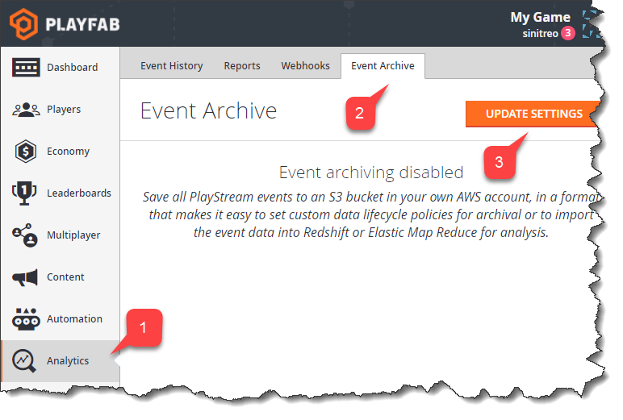
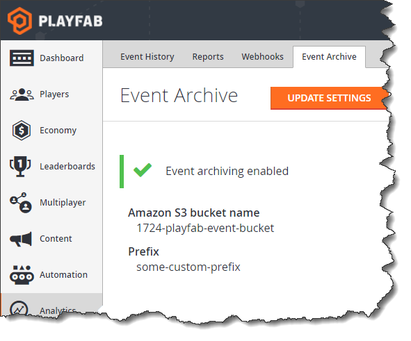

# S3 Event Archiving

**PlayFab** allows you to archive the entire event flow using th

 **Amazon S3 Bucket**. This tutorial shows you step-by-step how to configure **Event Archiving** from scratch.

## Configuring Amazon S3 Bucket

Once you have created an **Amazon** account:

- Navigate to **Services (1)**.
- Select **S3 (2)**.

  

- On the **S3** page, you will have an overview of all your **Buckets**.
- Notice the **Create Bucket** button?  Use it to create a new bucket by selecting it.

  
To create your new S3 bucket, you must go though a 4-step wizard:

1. Requires you to assign a unique, **DNS**-compliant **Name** for your **Bucket**. Make sure to have that name available somewhere for copying and pasting. We will need it when we configure PlayFab event archiving.
2. When you are done, select the **Next** button.

  

- This step offers you the option of adding **Versioning**, **Logging**, and **Tags** for your **Bucket**.
- Select the **Next** button when you are done **(1)**.

  

- During this step, make sure that you have **Read/Write** access **(1)** for objects.
 - Select the **Next** button **(2)** when you are done.

  

In this last step, double-check your settings and select the **Create Bucket** button **(1)**.

  

## Configuring Amazon Access

In order to **Archive Events**, you will need to give **PlayFab** access to the **Bucket** on your behalf.

This is done by means of an **Access Key**.

- Double-check that you have your newly created **Bucket** in the list of **S3** services **(1)**.
- Select your **Account Name** in the top right corner **(2)**.
- Then select **My Security Credentials (3)**.

  

- Locate the **Access Key** list.
- Select the **Create New Access Key** button.

  

- Expand the **Access Key** data **(1)**.
- Save the **Access Key ID (2)** and **Secret Access Key (3)**.
- Make sure they are available for copy/paste. We will need them when we configure **PlayFab Event** archiving.
- Select the **Close** button **(4)**.

  

## Configuring PlayFab Event Archiving

When your **Amazon S3 Bucket** is ready, it's time to set up the **PlayFab** side of things.

We need to pass the **Access Key Data** and **Bucket Name** to **PlayFab** to enable **Event Archiving**.

To access the PlayFab Event Archive:

- Select **Analytics** in the menu on the left **(1)**.
- Then select the **Event Archive** tab **(2)**.
- Finally, select the **Update Settings** button **(3)**.

  

The **Update Settings** page will offer you the following settings:

1. The **Amazon S3 Bucket Name** (use the one you created while configuring the **Amazon S3 Bucket**).
2. **Prefix** is the *root folder* under which **PlayFab** will store all the relevant data.
3. **Access Key ID** (use the one you obtained while configuring access to the **Amazon Account**).
4. **Secret Key** (use the one you obtained while configuring access to the **Amazon Account**).
5. Select the **Save Settings** button when everything is in place.

**PlayFab** should present you with a nice page indicating that **Event Archiving** is enabled.

  

Make sure to post some **Events** and then check your **Bucket** on the **Amazon** portal.

After a short period of time, you should see that new compressed **JSON** streams are appearing, nicely broken out by **Title**, **Event Name**, **Year**, **Month** and **Day**.

  
