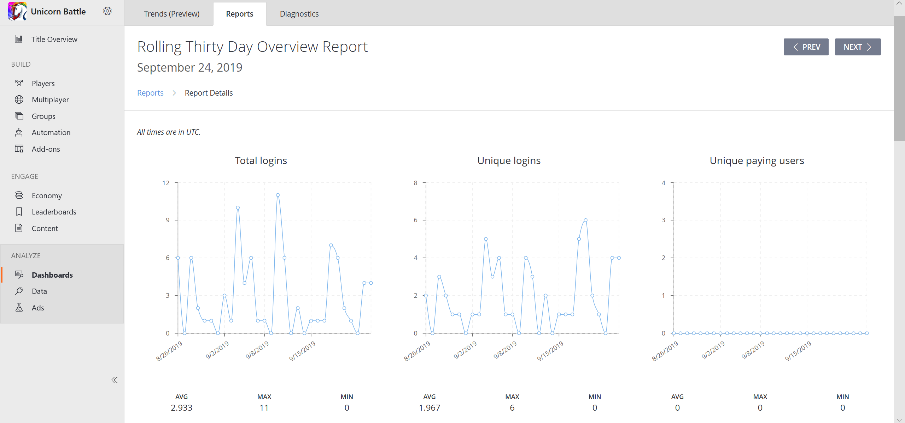

# Daily, Monthly, and Rolling 30-Day Overview and Totals Reports

## Introduction

PlayFab offers a set of daily and monthly Key Performance Indicator (KPI) reports, including:

- Total Logins
- Unique Logins: DAU (daily reports) or MAU (monthly and rolling 30-day reports)
- New Users
- Unique Paying Users
- Transaction Revenue
- Purchases
- Total API Calls
- Total Successful API Calls
- Total API Call Errors
- Average Revenue Per User (ARPU)
- Average Revenue Per Paying User (ARPPU)
- Average Purchase Price

An **Overview Report** contains trend charts of each metric during the past 24 hours (daily), past 30 days (rolling 30-day), and in last month (monthly). 

A **Totals Report** contains the summary of each metric shown in the Overview Report. Daily and rolling 30-day reports are generated on a daily basis, whereas monthly reports are generated on the first day of each month.

Report times are based on Coordinated Universal Time (UTC). For additional details on metrics, see [Metrics and Terminology](../metrics/metrics-and-terminology.md).

## Totals Report

Totals reports contain a table which contains the 12 key performance metrics described in the introduction.

  

## Overview Report

Overview reports consist of 12 trend charts, one for each metric described in the introduction. Working with charts is described later in this tutorial.

  

  

  

  

## Populating the reports

Any API call may introduce new data for *Total API Calls*, *Total Successful API Calls* and *Total API Call Errors*. Once executed, an API call will be added to *Total API Calls*. Then, if an error is introduced, it will be recorded to *Total API Call Errors*. Otherwise, it will belong to *Total Successful API Calls*.

Please, consult our [Client API Documentation](https://api.playfab.com/documentation/client) to review all available API calls.

The following API calls will introduce new data for *Total Logins* and *Total Unique Logins*:

- [LoginWithAndroidDeviceID](https://api.playfab.com/documentation/client/method/LoginWithAndroidDeviceID)
- [LoginWithCustomID](https://api.playfab.com/documentation/client/method/LoginWithCustomID)
- [LoginWithEmailAddress](https://api.playfab.com/documentation/client/method/LoginWithEmailAddress)
- [LoginWithFacebook](https://api.playfab.com/documentation/client/method/LoginWithFacebook)
- [LoginWithGameCenter](https://api.playfab.com/documentation/client/method/LoginWithGameCenter)
- [LoginWithGoogleAccount](https://api.playfab.com/documentation/client/method/LoginWithGoogleAccount)
- [LoginWithIOSDeviceID](https://api.playfab.com/documentation/client/method/LoginWithIOSDeviceID)
- [LoginWithKongregate](https://api.playfab.com/documentation/client/method/LoginWithKongregate)
- [LoginWithPlayFab](https://api.playfab.com/documentation/client/method/LoginWithPlayFab)
- [LoginWithSteam](https://api.playfab.com/documentation/client/method/LoginWithSteam)
- [LoginWithTwitch](https://api.playfab.com/documentation/client/method/LoginWithTwitch)
- [LoginWithWindowsHello](https://api.playfab.com/documentation/client/method/LoginWithWindowsHello)

The following API calls will introduce new data for *Total New Users*:

- [RegisterPlayFabUser](https://api.playfab.com/documentation/client/method/RegisterPlayFabUser)
- [RegisterWithWindowsHello](https://api.playfab.com/documentation/client/method/RegisterWithWindowsHello)

The following API calls will introduce new data for *Total New Users* if the CreateAccount flag is set:

- [LoginWithAndroidDeviceID](https://api.playfab.com/documentation/client/method/LoginWithAndroidDeviceID)
- [LoginWithCustomID](https://api.playfab.com/documentation/client/method/LoginWithCustomID)
- [LoginWithFacebook](https://api.playfab.com/documentation/client/method/LoginWithFacebook)
- [LoginWithGameCenter](https://api.playfab.com/documentation/client/method/LoginWithGameCenter)
- [LoginWithGoogleAccount](https://api.playfab.com/documentation/client/method/LoginWithGoogleAccount)
- [LoginWithIOSDeviceID](https://api.playfab.com/documentation/client/method/LoginWithIOSDeviceID)
- [LoginWithKongregate](https://api.playfab.com/documentation/client/method/LoginWithKongregate)
- [LoginWithSteam](https://api.playfab.com/documentation/client/method/LoginWithSteam)
- [LoginWithTwitch](https://api.playfab.com/documentation/client/method/LoginWithTwitch)

The *Unique Paying Users*, *Revenue*, *Purchases*, *Average Revenue Per User (ARPU)*, *Average Revenue Per Paying User (ARPPU)* and *Average Purchase Price* metrics are used to analyze purchases and payments. See the [Non-receipt Payment Processing](../../commerce/economy/non-receipt-payment-processing.md) tutorial for more information on conducting payments.

## How to work with report charts

  

PlayFab Report Charts all follow the same model. In the top space of the page, you usually get a control panel **(1)**. The control panel contains a report name, observed time period, and "Prev/Next" buttons to switch between the time periods.

Chart panel **(2)** shows the available data as a chart, where the horizontal axis corresponds to the time flow, and the vertical axis corresponds to the number of relevant instances, such as API calls, purchases, users, and so on, depending on the report type.

There are some metrics available below the chart panel **(3)**. Those contain the sum of all the instance across the time period (SUM), the average number of instances through all the timestamps (AVG), the peak value (MAX), and the lowest value (MIN).
