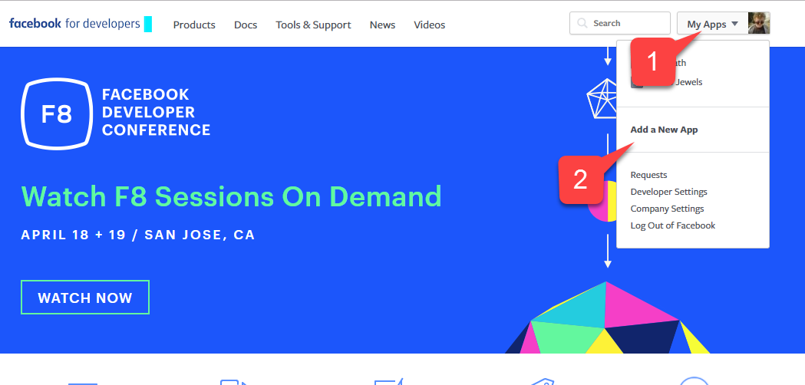
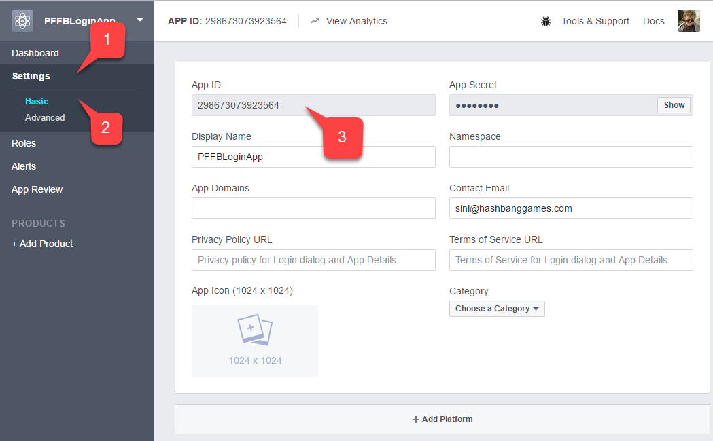
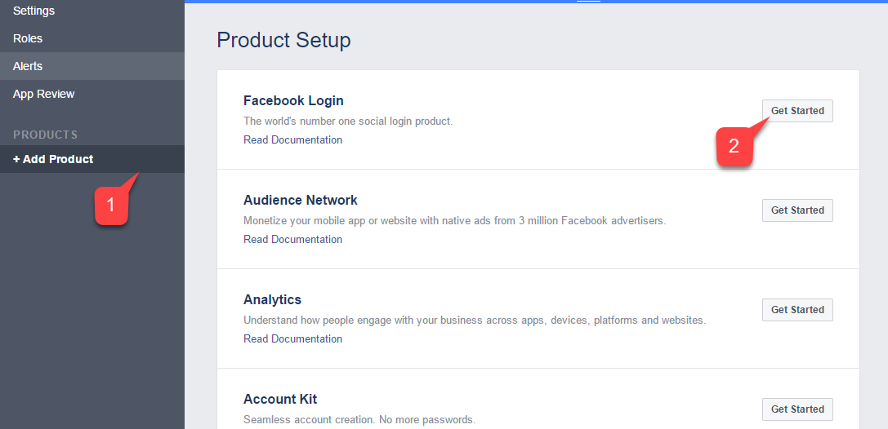
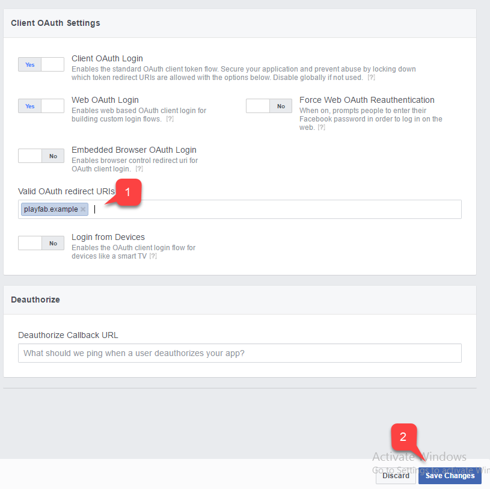
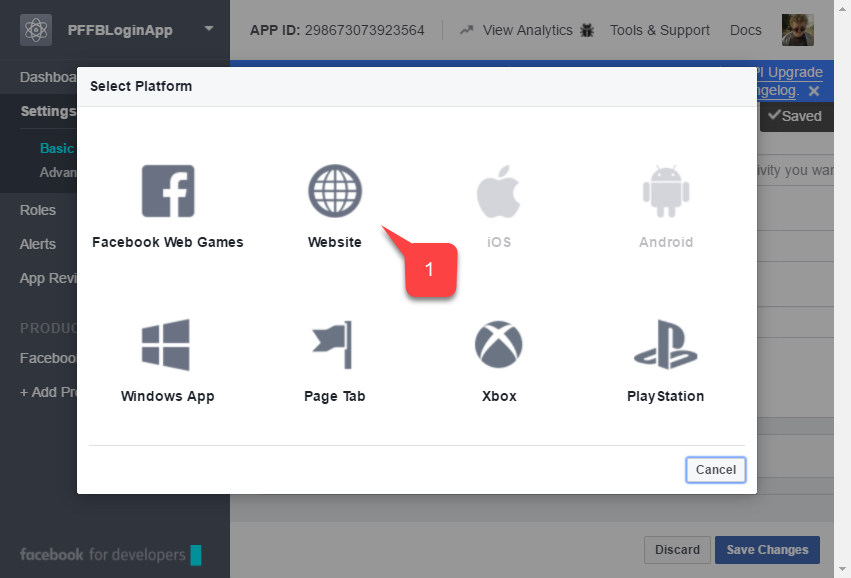
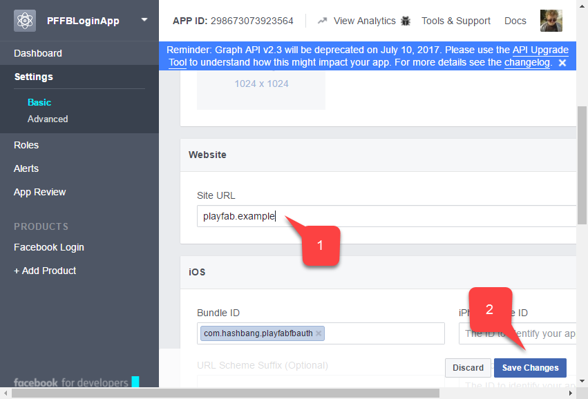
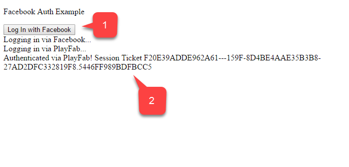

# Setting up PlayFab authentication using Facebook and HTML5

This tutorial guides you through an example of PlayFab authentication using Facebook and HTML5/JavaScript.

## Requirements

- [Facebook account](https://www.facebook.com/) for testing
- Registered [PlayFab](https://playfab.com/) Title
- Familiarity with [Login Basics & Best Practices guide](https://api.playfab.com/docs/tutorials/landing-players/best-login)
- Minimal server with a valid domain name to serve static HTML file. Consult with [Running Test HTTP Server](https://api.playfab.com/docs/tutorials/http-server) guide to set up one.

## Server and Domain

This guide requires a server with a valid domain to follow. If you do not have a registered domain and remote web server yet, please follow our [Running Test HTTP Server](https://api.playfab.com/docs/tutorials/http-server) guide to run a local web server with a valid domain name. Throughout this guide, we will assume your domain is ['http://playfab.example'](http://playfab.example).

## Registering a Facebook Application

Start by navigating to the [Facebook Developer Portal](https://developers.facebook.com/). Move your mouse over the "My Apps" button **(1, top right corner**) and select "Add a New App" **(2)**, as shown on the picture below:

  

A new application pop up will open. Enter a name for your application **(1)** and enter a contact email **(2)**. Make sure to come up with your own unique application name and email, as shown on the picture below:

  

Navigate to the "Settings" tab **(1)**, then to the "Basic" sub-tab **(2)**. Locate your Application ID **(3)**. Copy it somewhere, we will use it later to set up the Facebook SDK:

  

On your application manager page, navigate to products **(1)**, locate the "Facebook Login" entry and click "Get Started" **(2)**:

  

A page with Login product settings should open. Make sure that you have the Login product settings page opened **(1)**, and ensure Client and Web OAuth is on **(2)**:

  

Set Valid OAuth redirect URIs **(1)** to your own auth page URI. This will be `playfab.example` in your case. Click "Save Changes" **(2)** to commit:

  

On you application manager page, navigate to Settings->Basic **(1)** and click the "Add Platform" button **(2)**:

  

Select "Website" options **(1)**:

  

The Website configuration panel will appear in the list. Set "Site URL" **(1)** to your auth page URL. This will be `playfab.example` in your case. Click "Save Changes" **(2)** to commit.

  

## Testing

Use the following HTML file to test PlayFab authentication using Facebook. Make sure to replace YOUR-APPLICATION-ID and YOUR-PLAYFAB-TITLE with your own:

```html
<!DOCTYPE html>
<html>
<head>
   <script>
        // This function will be called when Facebook SDK is loaded
        window.fbAsyncInit = function() {

            // Make sure to use your own App ID for the configuration
            FB.init({
                appId      : 'YOUR-APPLICATION-ID',
                xfbml      : true,
                version    : 'v2.9'
            });

            // Record PageView event for analytics
            FB.AppEvents.logPageView();
        };

        // Facebook SDK loader. Creates a script entry to load the SDK
        (function(d, s, id){
            var js, fjs = d.getElementsByTagName(s)[0];
            if (d.getElementById(id)) {return;}
            js = d.createElement(s); js.id = id;
            js.src = "//connect.facebook.net/en_US/sdk.js";
            fjs.parentNode.insertBefore(js, fjs);
        }(document, 'script', 'facebook-jssdk'));
    </script>
    <script src="https://download.playfab.com/PlayFabClientApi.js"></script>
</head>
<body>
    <p>Facebook Auth Example</p>
    <button onclick="loginWithFacebook()">Log In with Facebook</button>
    <script>
        // This method is invoked when you press the button
        function loginWithFacebook() {
            logLine("Logging in via Facebook...");

            // Standart practice: make call to FB.login.
            // This will show Facebook popup window. To prevent browsers from locking it,
            // always make sure to call it from Button click event
            FB.login(function(response){
                if(!response.authResponse){
                    logLine("Problem authenticating via Facebook!");
                } else {
                    loginWithPlayfab(response.authResponse.accessToken);
                }
            });
        }

        function loginWithPlayfab(accessToken){

            logLine("Logging in via PlayFab...");

            // When given accessToken, make call to LoginWithFacebook API Call
            // Make sure to use your own PlayFab Title ID
            PlayFabClientSDK.LoginWithFacebook({
                AccessToken: accessToken,
                TitleId: "YOUR-PLAYFAB-TITLE",
                CreateAccount: true
            }, onPlayFabResponse);
        }

        // Handles response from playfab.
        function onPlayFabResponse(response, error) {
            if (response)
                logLine("Response: " + JSON.stringify(response));
            if (error)
                logLine("Error: " + JSON.stringify(error));
        }

        function logLine(message) {
            var textnode = document.createTextNode(message);
            document.body.appendChild(textnode);
            var br = document.createElement("br");
            document.body.appendChild(br);
        }
    </script>
</body>
</html>
```

Request the following file from your server using the domain you set up during Facebook Application configuration ( `playfab.example' in our case). Once the page opens, click the "Log In with Facebook" button **(1)**. Follow any Facebook instructions in the pop up window. Watch the output **(2)**:

  

You will obtain a PlayFab session ticket. At this point you have successfully configured PlayFab and Facebook authentication using HTML5 and JavaScript.

