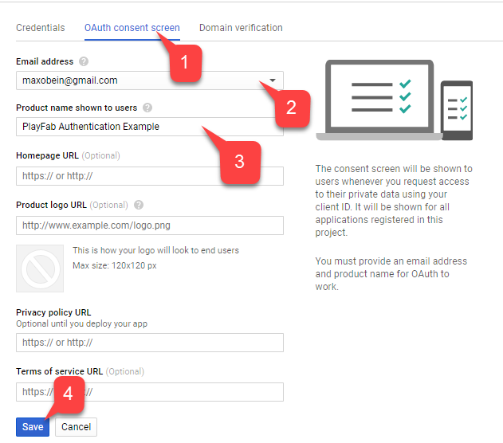
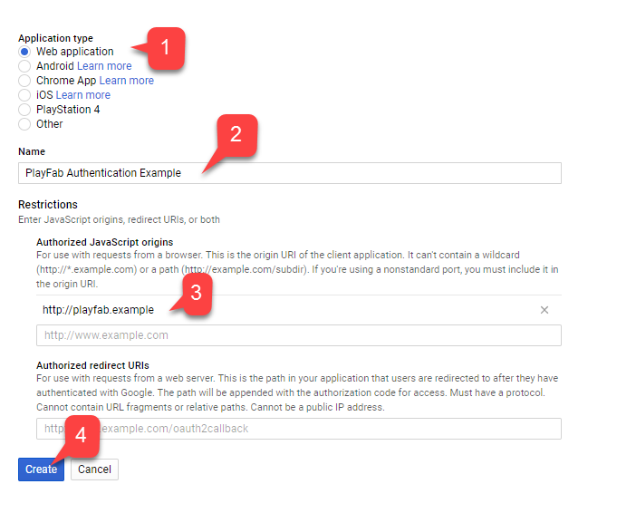
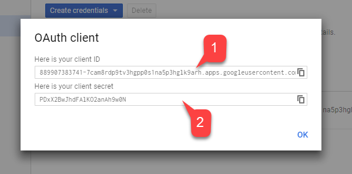
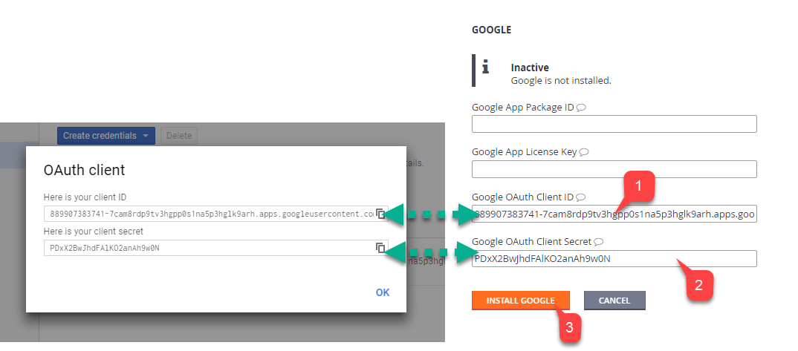

# Setting up PlayFab authentication using Google and HTML5

This tutorial guides you through an example of PlayFab authentication using Google and HTML5/JavaScript.

## Requirements

- [Google account](https://google.com/) for testing
- Registered [PlayFab](https://playfab.com/) Title
- Familiarity with [Login basics and Best Practices](../../authentication/platform-specific-authentication/login-basics-best-practices)
- Minimal server with a valid domain name to serve static HTML file. Consult with [Running Test HTTP Server](https://api.playfab.com/docs/tutorials/http-server) guide to set up one.

## Server and Domain

This guide requires a server with a valid domain to follow. If you do not have a registered domain and remote web server yet, please follow our [Running Test HTTP Server](https://api.playfab.com/docs/tutorials/http-server) guide to run a local web server with a valid domain name. Throughout this guide, we will assume your domain is ['http://playfab.example'](http://playfab.example).

## Registering a Google API Project

Start by navigating to the [Google API Console](https://console.developers.google.com/). Navigate to "Credentials" **(1)**, locate the API Manager panel and click "Create" **(2)**:

  

Fill in the project name **(1)** and click "Create" **(2)**:

  

It is normal for API Manager to take 10-20 seconds to generate the project:

  

Once the project is created, navigate to the "OAuth consent screen" **(1)**. Make sure the correct email is selected **(2)**. Add a name for your application **(3)** and click "Save" **(4)**:

  

Next, navigate to "Credentials" **(1)**, click "Create credentials" **(2)** and select "OAuth client ID" **(3)**:

  

Select "Web Application" **(1)** as your application type. Give your application a name **(2)**. Add your domain to Authorized JavaScript Origins **(3)** ("http://playfab.example" in our case). Finally, click "Create" (4) to commit:

  

On the OAuth client screen, displayed in the following image, the Google API Manager reveals two important pieces of information: Client ID **(1)** and Client Secret **(2)**. Be sure to copy and save these values, as they will be used in the authorization process shown in this tutorial.

  

Go to the PlayFab Game Manager page for your title. Navigate to "Add-ons" **(1)**, then locate and click the Google Add-on **(2)**:

  

Fill in the Client ID **(1)** and Client Secret **(2)**, and click "Install Google" **(3)**:

  

> [!NOTE]
> As of July 2017, Google API Manager has a bad habit of not hooking the Allowed JS origin domain properly. If you receive the following error:  
> "idpiframe_initialization_failed", details: "Not a valid origin for the client: somedomain.com...  
> Please remove the credentials and recreate them. There is no need to delete the entire project, just the credentials.

## Testing using an Access Token

This example shows testing using the classic Access Token approach. Use the following HTML file for testing. Please make sure to replace "YOUR_CLIENT_ID" and "YOUR_PLAYFAB_TITLE" with your own values:

```html
<!DOCTYPE html>
<html>
<head>
    <!-- Special meta tag allows you to pass Google Client ID. Replace the content attribute value with your own Client Id -->
    <meta name="google-signin-client_id" content="YOUR_CLIENT_ID"><!-- // TODO: PUT YOUR GOOGLE CLIENT_ID HERE! -->
    <!-- Load Google platform SDK-->
    <script src="https://apis.google.com/js/platform.js" async defer></script>
    <!-- Load PlayFab Client JavaScript SDK -->
    <script src="https://download.playfab.com/PlayFabClientApi.js"></script>
</head>
<body>
    <p>Google Access Token Auth Example</p>
    <!-- Neat Google button gets styled automatically when Google platform SDK is loaded -->
    <div class="g-signin2" data-onsuccess="onSignIn"></div>
    <script>
        // Invoked when user has signed in with Google
        function onSignIn() {
            // Retrieve access token
            var accessToken = gapi.auth2.getAuthInstance().currentUser.get().getAuthResponse(true).access_token;
            
            // Execute LoginWithGoogleAccount API call using the access token. Please replace TitleID with your own.
            logLine("Attempting PlayFab Sign-in");
            PlayFabClientSDK.LoginWithGoogleAccount({
                AccessToken: accessToken,
                CreateAccount : true,            
                TitleId: "YOUR_PLAYFAB_TITLE", // TODO: PUT YOUR TITLE ID HERE!
            }, onPlayFabResponse);
        }

        // Handles response from playfab.
        function onPlayFabResponse(response, error) {
            if (response)
                logLine("Response: " + JSON.stringify(response));
            if (error)
                logLine("Error: " + JSON.stringify(error));
        }

        function logLine(message) {
            var textnode = document.createTextNode(message);
            document.body.appendChild(textnode);
            var br = document.createElement("br");
            document.body.appendChild(br);
        }
    </script>
</body>
</html>
```

Make sure to serve this page using using your web server. Make sure to access this page using the URL you specified while configuring Google Project (`http://playfab.example` in our case). Once the page opens, click "G Sign In" **(1)** and follow the general Google authentication flow. Once this is done, the script will try to authenticate on the  PlayFab side and output the result **(2)**:

  

If you already have a Google authentication session running, you will not have to click "G Sign In". Everything will happen automatically.