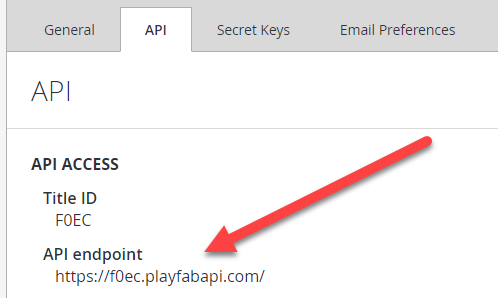
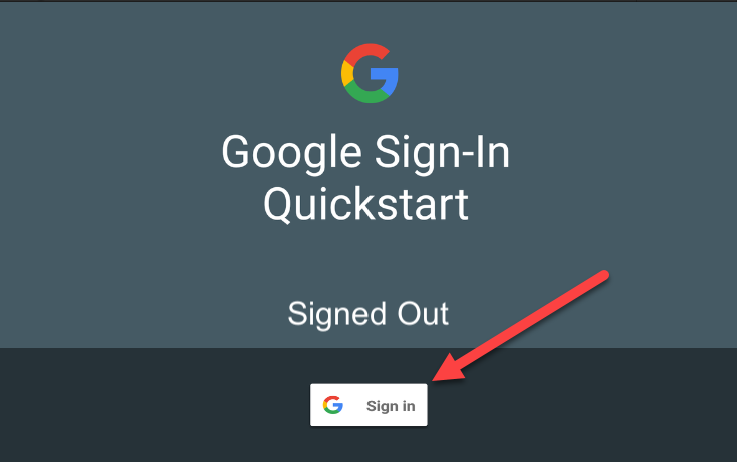
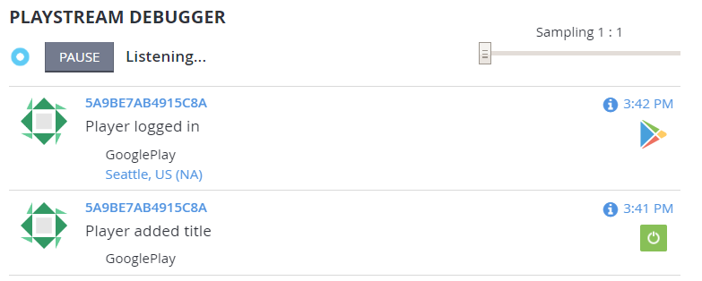

# Setting up PlayFab authentication using Google Play Games Sign-In in Unity

## Tutorial Video

> [!NOTE]
> Audio is broken on the video - new recording coming soon.

[HowTo: Use Google SignIn (GPG) + PlayFab (Unity)](https://youtu.be/igup53sdmHg)

In this tutorial you will learn how to successfully add Google Play Games Sign-In to your PlayFab games built with the Unity SDK. Truth be told, this is fairly trivial to do once you know all the steps. However, finding all the required information can be tricky. So, this guide also aims to centralize all the steps you need to get this feature working. You can also download the sample for this tutorial [here](https://github.com/PlayFab/PlayFab-Samples/tree/master/Recipes/GoogleSignInSample).

## Prerequisites

- A project built using the Unity game engine
- A Google developer account
- A PlayFab developer account which has access to a game title in PlayFab
- The [PlayFab Unity Editor Extensions & Unity SDK](https://api.playfab.com/docs/getting-started/unity-getting-started)
- The [Google Play Games SDK](https://github.com/playgameservices/play-games-plugin-for-unity)
- Familiarity with [Login basics and Best Practices](../../authentication/platform-specific-authentication/login-basics-best-practices.md)

## Getting Started

First, we will start by getting the basic stuff set up in Google Play. There are a few good guides on how to do this, and we are not going to reinvent the wheel.

1. Create an application - If you have not done so already, you will need to create an application in the [Google Play Developer Console](https://play.google.com/apps/publish).
2. Build your game APK and upload it as an Alpha Build.
    1. Click on **Manage Releases**.
    2. Click on **Manage Alpha**.
    3. Click on **Upload APK**.
3. [Setting Up Google Play Games Services]() - Watch the YouTube video as the Link here does not reflect the exact UI of Google Play Games Services anymore.
4. Download the [Google Play Games SDK]() (if you have not done so already) and install it.
5. Install the **PlayFab Unity SDK**. if you do not know how to do this, follow the [PlayFab Unity Getting Started Guide](https://api.playfab.com/docs/getting-started/unity-getting-started).

## Configuring Google Play Games

You can configure Google Play Games from the tool set that is installed with the Google Play Games SDK. You can get to these tools by going to Window -> Google Play Games -> Setup -> Android Setup

  

Copy your Application ID from the **Linked apps** section of Game Services in the [Google Play Developer Console](https://play.google.com/apps/publish), as shown in the following image.

  

Then, populate your app_id and package_name in the resource definition.

```xml
<?xml version="1.0" encoding="utf-8"?>
<resources>
<string name="app_id">[your app_id]</string>
<string name="package_name">[package name]</string>
</resources>
```

The Client ID that is generated for you when you link the app (shown in this image) is **NOT** the correct one!

  

In order to get Google Sign-In working with PlayFab, you need to use a Web Client ID. To obtain your Web Client ID, you must link a web application in the Game Services section of the Google Play Console under the Services & API section.

  

Then Configure your app for Web.

  

From here, you enter your API Endpoint which can be found in PlayFab under Settings -> API

  

Enter this endpoint https://[titleid].playfabapi.com in the Launch URL field and click save. This will provide you with the proper Client ID to use.

To obtain your **secret key** follow the link to your API's Console.

  

Click on your Web Application (Type) and the client secret is at the top.

> [!IMPORTANT]
> You must change the default callback for Authorized redirect URIs. The proper URI is [https://oauth.playfab.com/oauth2/google](https://oauth.playfab.com/oauth2/google).
> If you do not do this step you will get a mismatch redirect_uri error.

## PlayFab Google Sign-In Setup

PlayFab has its own process for setting up Google Sign-In. You can do this in your PlayFab developer account. If you don't have one, you can [sign-up here](https://developer.playfab.com/en-us/sign-up). The way that you set up Google in PlayFab is by navigating to the Add-ons section in your dashboard and going to the Google Add-On. Once there, click on the **Install Addon** button.

There are a few things you need to enter into this form:

- Google App Package ID - This is the name of your Android package. For example, our sample uses "com.playfab.gpgexample".
- Google App License Key - While this is a required field, it is not related to Google Sign-In. This field is for setting up Receipt Validation via our Receipt Validation APIs. You can get this License Key from the [Google Developer Console](https://play.google.com/apps/publish) under the Services & APIs section. There you will find a section titled **YOUR LICENSE KEY FOR THIS APPLICATION**. Copy and paste the Base64-encoded RSA Public Key into this field.
- Google OAuth Client ID - This is the Web Client ID that you used in the Google Play Games SDK Setup in Unity.
- Google OAuth Client Secret - This is the secret key that you obtained in the last step.

Be sure to **Save Settings!**

## Adding Google Sign-In to your Unity Game

The code to get Google Sign-In working is fairly minimal. There is the initialization code which you will put in your "Start" or anywhere you are initializing or starting up your app. This can be in different places depending on the architecture and framework of your game or app. In any case, the code below will initialize Google Play Games.

Make sure that you don't forget the **Using** statements so that you can use the Google Play Games SDK.

```csharp
//These three using statements are required.
using GooglePlayGames;
using GooglePlayGames.BasicApi;
```

```csharp
//The following grants profile access to the Google Play Games SDK.
//Note: If you also want to capture the player's Google email, be sure to add
//.RequestEmail() to the PlayGamesClientConfiguration
PlayGamesClientConfiguration config = new PlayGamesClientConfiguration.Builder()
.AddOauthScope("profile")
.RequestServerAuthCode(false)
.Build();
PlayGamesPlatform.InitializeInstance(config);

// recommended for debugging:
PlayGamesPlatform.DebugLogEnabled = true;

// Activate the Google Play Games platform
PlayGamesPlatform.Activate();
```

The next set of code, the **OnSignInButtonClicked()** function shown below, is bound to a Sign-In button in the UI in our example:

  

```csharp
    private void OnSignInButtonClicked()
    {
        Social.localUser.Authenticate((bool success) => {

            if (success)
            {

                GoogleStatusText.text = "Google Signed In";
                var serverAuthCode = PlayGamesPlatform.Instance.GetServerAuthCode();
                Debug.Log("Server Auth Code: " + serverAuthCode);

                PlayFabClientAPI.LoginWithGoogleAccount(new LoginWithGoogleAccountRequest()
                {
                    TitleId = PlayFabSettings.TitleId,
                    ServerAuthCode = serverAuthCode,
                    CreateAccount = true
                }, (result) =>
                {
                    GoogleStatusText.text = "Signed In as " + result.PlayFabId;

                }, OnPlayFabError);
            }
            else
            {
                GoogleStatusText.text = "Google Failed to Authroize your login";
            }

        });
        
    }
```

The **OnSignInButtonClicked()** code can be a bit overwhelming, so let me break down exactly what it is doing.

First, we log in with **Social.localUser.Authenticate**, this will return a boolean if we are able to successfully login. Be aware that if you have not added your test account to your app this will always return false when testing. So, important step, [add your test account](https://developers.google.com/games/services/console/testpub). The link will take you to instructions on adding testers to your Google application. Also note, this is what will trigger the Google Play Games sign-in dialog to pop up.

Next, and if we have a successful login, we make a call to **PlayGamesPlatform.Instance.GetServerAuthCode** and store it in a variable.

Lastly, we make the **LoginWithGoogleAccount** call and pass the AuthCode we just got from Google in as the ServerAuthCode parameter. There is a callback which will have the results of your login to PlayFab. At this point, you should see a successful login in your dashboard!

  

I hope this guide helps, but if you have questions feel free to ask them in our [community forums](https://community.playfab.com/).

You can download the sample for this Tutorial [here](http://s3-us-west-2.amazonaws.com/api-playfab-com-craft-files/FileAssets/GooglePlayGamesSignInExample.zip).