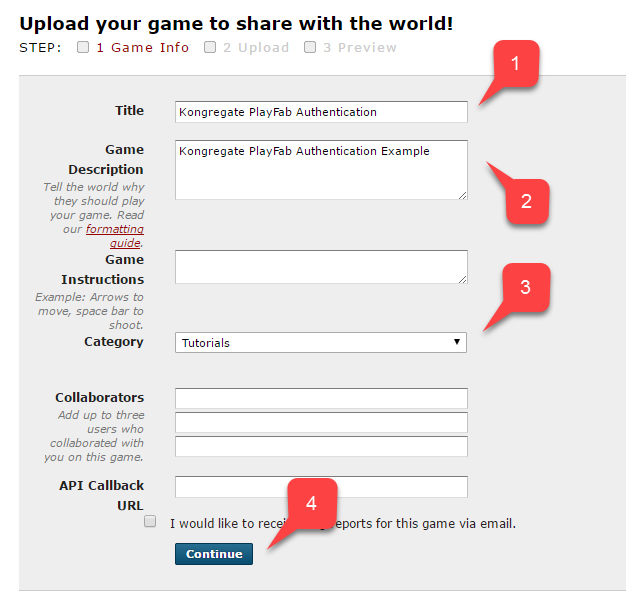
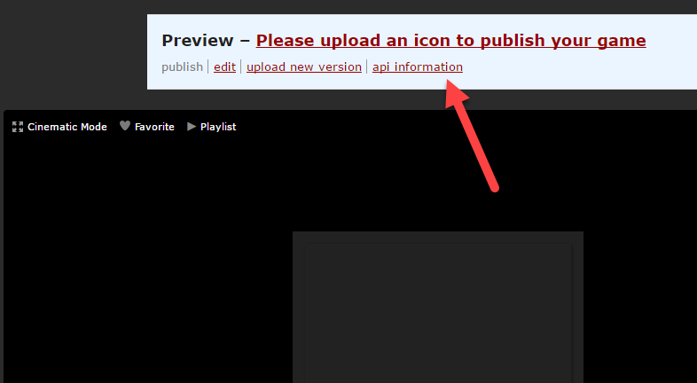
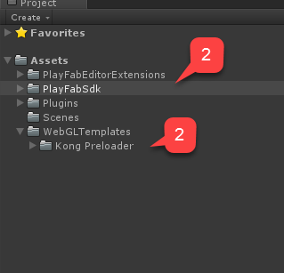
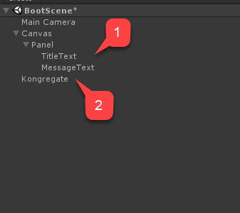
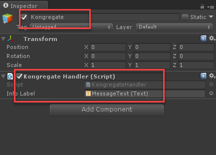
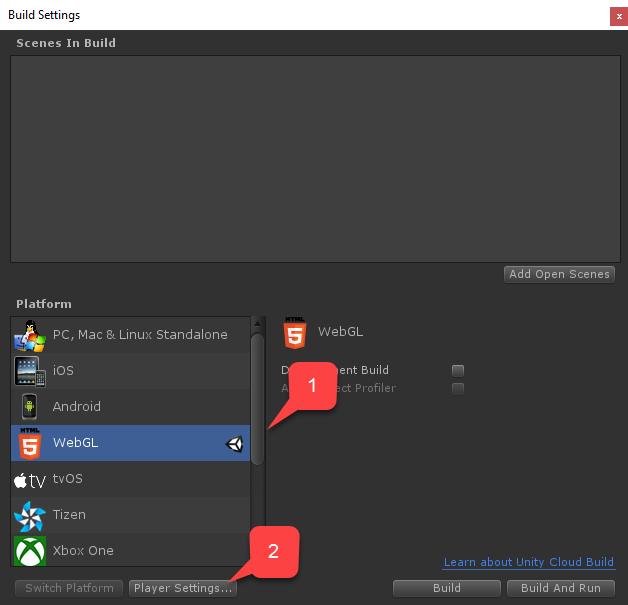
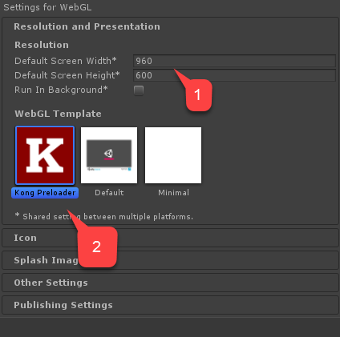
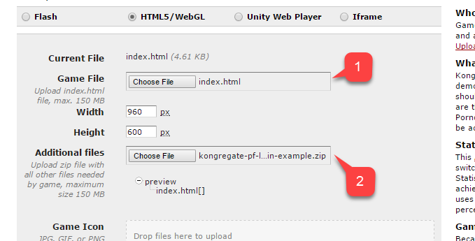

# Setting up PlayFab authentication using Kongregate and Unity

This tutorial shows you the minimal setup required to authenticate your players in PlayFab using Kongregate and Unity.

## Requirements

- Registered [Kongregate](http://www.kongregate.com/) account
  - Familiarity with the [Kongregate Developers Guide](http://developers.kongregate.com/docs/api-overview/intro)
- Registered PlayFab Title
- Unity project with PlayFab configured for your title
- Unity WebGL support installed
- Familiarity with [Login basics and Best Practices](../../authentication/platform-specific-authentication/login-basics-best-practices.md)

## Setting up a Kongregate App

Kongregate requires you to upload a preview version of the app, before you gain access to the necessary API information. So we need to prepare an index.html file with the following content:

```html
<!doctype html>
<html lang="en-us">
<head></head>
<body>
 <h1>Placeholder</h1>
</body>
</html>
```

Navigate to the [Kongregate website](http://www.kongregate.com/), select the "Games" tab **(1)**. Then click the "Upload your game" button **(2)**, as shown in the following picture:

  

A page to set up a new application will open. Make sure to type in the application name **(1)**, description **(2)** and select a category **(3)**. Submit the new app by clicking the "Continue" button **(4)**, as shown in the following picture:

  

You will be transferred to the application upload page. First and very important, make sure to save the URL from your web address bar. This will save you a lot of time trying to restore access to the application once you close the page.

Once this is done, select the prepared index.html file as your Game File **(1)** and set up the screen size **(2)**. Make sure to accept all the required licenses **(3)**. Then, upload your application by clicking the "Upload" button in the bottom of the page **(4)**, as shown in the following picture:


Once the preview opens, ignore the content and click on the "api information" link, as shown in the following image:



When the API information page opens, locate the API Key and save it for later use.


## Configuring PlayFab title

In your PlayFab Title Game Manager navigate to Add-ons **(1)**, then locate and click "Kongregate" **(2)**, as shown in the following picture:


A page will open, allowing you to set up Kongregate integration. Enter the API Key **(1)** you acquired in the previous section, and click the "Install Kongregate" button **(2)** as shown in the following picture:


If you receive no error message, then you have configured PlayFab title integration with your Kongregate application.

## Setting up a Unity project

Unity setup checklist:

- [OPTIONAL] Install [PlayFab Editor Extensions](https://api.playfab.com/downloads/unity-edex)
  - Setup your TitleId in the PlayFabSharedSettings Scriptable Object
- For Unity 5.6+, download the [Kongregate Preloader WebGL Template](https://github.com/kongregate/webgl-preloader) and place it inside the  Assets/WebGLTemplates folder **(2)**
- For Unity < 5.6, download the [Kongregate Preloader WebGL Template 5.5 and below](https://github.com/kongregate/webgl-preloader/tree/unity-5.5-and-below) and place it inside the Assets/WebGLTemplates folder **(2)**



Create your working scene. For testing purposes, use a screen-scaling canvas **(1)** with a couple of text labels. We will only need one text label to display debug messages. Create an empty GameObject and rename it to "Kongregate" **(2)**.



This GameObject will contain a KongregateHandler component with a wired text label for debug messages:



The code for the KongregateHandler component is the following:

```csharp
// We are specifically interested in importing PlayFab related namespaces 
using PlayFab;
using PlayFab.ClientModels;
using UnityEngine;
using UnityEngine.UI;

public class KongregateHandler : MonoBehaviour
{
   
    // Standard unity callback, executed once for the script to start
    public void Start()
    {
        // Utility: show feedback
        SetMessage("Loading kongregate api...");
        
        /* 
         * Important: execute Javascript in the external context to initialize
         * Kongregate API, Unity Support and set up callback GameObject and Method.
         * In this case, callback is set to a GameObject called Kongregate and a 
         * method called OnKongregateAPILoaded, which we define later in this class.
         * Once Kongregate API is initialized, Unity will locate this object by name 
         * ("Kongregate") and execute a method "OnKongregateAPILoaded" passing in user 
         * info string as an argument. 
         */
        Application.ExternalEval(
          "if(typeof(kongregateUnitySupport) != 'undefined'){" +
          " kongregateUnitySupport.initAPI('Kongregate', 'OnKongregateAPILoaded');" +
          "} else {" +
          " console.error('No unity support!');" +
          "};"
        );
    }

    /*
     * Executed once Kongregate API is ready. This method is invoked by KongregateAPI 
     * and receives a structured text with multiple pieces of data you must parse manually. 
     * The userInfo string parameter has the following structure: 'user_identifier|user_name|auth_token'
     */
    public void OnKongregateAPILoaded(string userInfo)
    {
        SetMessage("Recieved user info! Logging though playfab...");
        
        // We split userInfo string using '|' character to acquire auth token and Kongregate ID.
        var userInfoArray = userInfo.Split('|');
        var authTicket = userInfoArray[2];
        var kongregateId = userInfoArray[0];

        LogToBrowser("Auth Token: " + authTicket);
        LogToBrowser("Kongregate Id: " + kongregateId);

        /* 
         * We then execute PlayFab API call called LoginWithKongregate.
         * LoginWithKongregate requires KongregateID and AuthTicket. 
         * We also pass CreateAccount flag, to automatically create player account.
         */
        PlayFabClientAPI.LoginWithKongregate(new LoginWithKongregateRequest
        {
            KongregateId = kongregateId,
            AuthTicket = authTicket,
            CreateAccount = true
        }, OnLoggedIn, OnFailed);
    }


    /* 
     * The rest of the code serves as a utility to process results, log debug statements 
     * and display them using Text message label.
     */ 

    private void OnLoggedIn(LoginResult obj)
    {
        SetMessage("Logged in through PlayFab!");
    }
    private void OnFailed(PlayFabError error)
    {
        SetMessage("Failed to login in with PlayFab: " + error.GenerateErrorReport());
    }

    private void SetMessage(string message)
    {
        InfoLabel.text = message;
    }

    private void LogToBrowser(string message)
    {
        Application.ExternalEval(string.Format("console.log('{0}')", message));
    }

    public Text InfoLabel;
}
```

## Testing

The only way you can truly test the integration is by uploading your prototype to Kongregate. Open the build window and make sure WebGL is selected **(1)**. Then open Player Settings **(2)**, as shown in the following picture:



Inside player settings, locate the WebGL build settings. Ensure that you have a size set up correctly **(1)** and make sure to select the Kongregate Preloader Template **(2)**, as shown in the following picture:



Build the application and open the build folder. You will end up with index.html and a bunch of other files (depending on Unity version). Take all the files except index.html and place them inside a zip archive, as shown in the following picture:


Use the URL you saved earlier to access your application upload page. Select index.html as your Game File **(1)**. Select the ZIP archive as Additional files **(2)**. Accept the licenses and hit upload:



Once the preview opens, you should be able to see your game live with the message changing. In the end, the message should indicate successful login through PlayFab.

At this point, you have successfully integrated PlayFab and Kongregate.