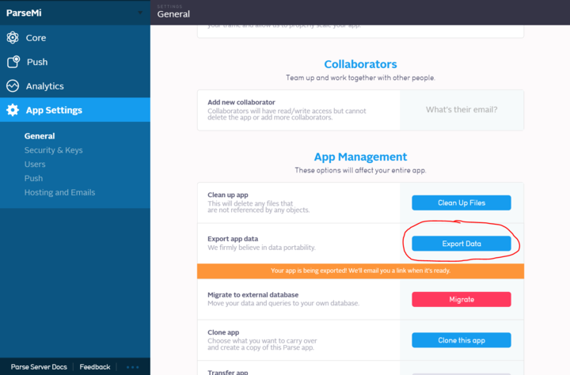
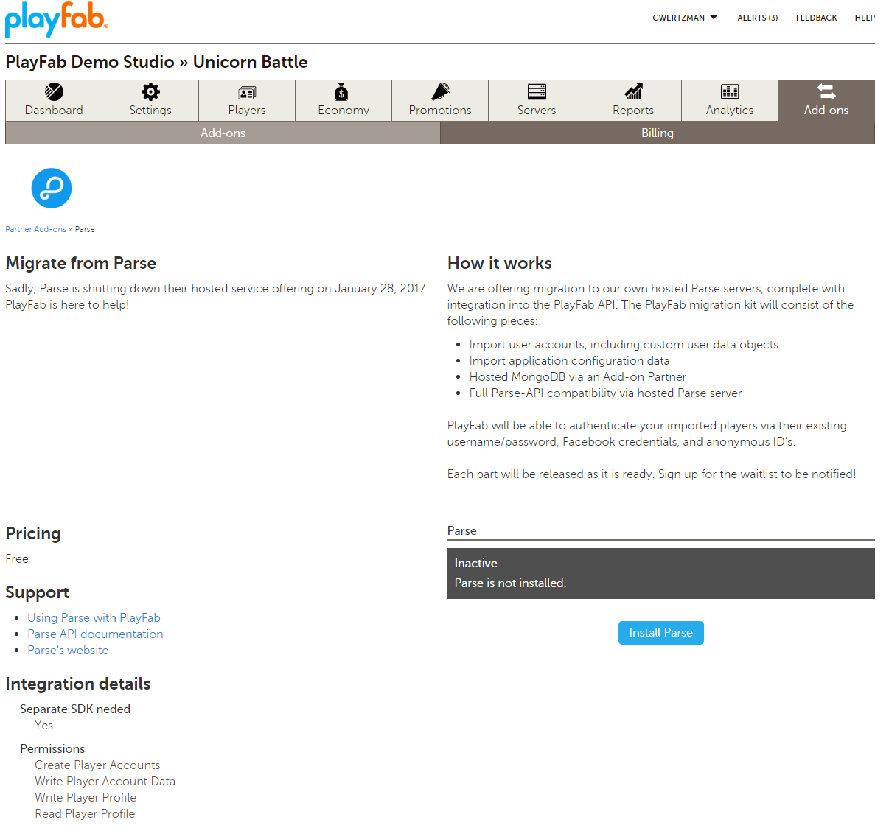
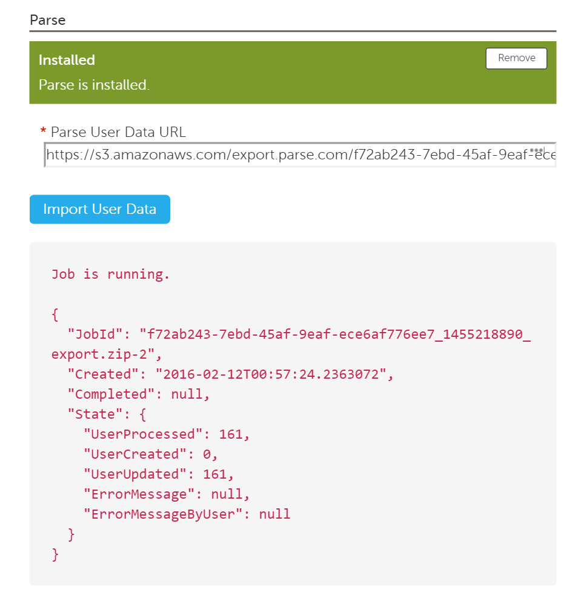

# Migrating from Parse to PlayFab

## A PlayFab comparison to Parse

### Parse

Both PlayFab and Parse provide back-end tools and services for building and operating your game, but there are several differences. Understanding these differences is important for planning a migration from one to the other.

The most important difference is that Parse is a *general purpose mobile back end*, with very few game-specific features.

With Parse, you need to write and test game-specific systems *yourself*, using the basic building blocks that it provides.

### PlayFab

PlayFab, on the other hand, is *specifically designed* for games, and includes a large number of game-specific systems that you can *immediately* start using *without* writing any custom code.

Most developers tell us that building their game on PlayFab is much faster, but that it is less flexible. There may be tasks that you could do in Parse that you cannot easily do in PlayFab - at least, not without writing some custom code yourself.

This migration tutorial assumes that you have *already* familiarized yourself with PlayFab’s features.

## Storing files and data

Both PlayFab and Parse provide systems for storing files and data for your game and players, but they do it differently.

Parse uses MongoDB and loosely-typed objects to allow clients to store whatever information they would like in whatever format is convenient.

Games can write arbitrary SQL queries to retrieve data for the game. This is very flexible, but it’s *also easy* to make mistakes that impact your game’s performance. In addition, it’s  *hard to scale* -- if your game suddenly takes off, you may need to shard your database to keep up with growth.

PlayFab takes a different approach...

PlayFab *also* stores data in an underlying database, but the raw database is hidden from the developer. *Instead*, all data is accessed via a set of game and player-specific APIs. This is *slightly* less flexible - *but much more scalable*.

In fact, using the PlayFab APIs, you *don’t have to worry about growth*. Whether you have 100 players each day or 10,000,000 - PlayFab will handle it.

With PlayFab, custom data is stored in these places:

- **Game title data**: Game-wide data which can be accessed by all players and game clients. This data is typically used for game content or configuration, such as level maps, upcoming events, or current promotions.

  > [!NOTE]
  > For more information on this subject, see the [Title Data quickstart](../../config/titledata/quickstart.md).

- **Files**: PlayFab provides support for uploading files, and then delivering them via an integrated CDN.

  > [!NOTE]
  > For more information on this subject, see [How to use PlayFab's Content Management API](https://playfab.com/blog/how-use-playfabs-content-management-api/).

- **Catalog data**: Every item in the catalog can have custom properties associated with it, such as rate-of-fire for a weapon, or mana points for a collectible card.

  > [!NOTE]
  > For more information on this subject, see [Catalogs](../../commerce/items/catalogs.md).
  
- **Inventory data**: Every item in a player's inventory can have custom properties associated with it, such as item hit-points, or config data for procedurally generated items.
- **Group data**: Data is shared among a specific group of players, such as a guild or lobby. Examples include a guild name or message of the day. Players can be added and removed from a shared group, and all members in the group can read or write shared group data.
- **Player data**: Data is stored per player account, like Parse Keyed User data.

  > [!NOTE]
  > For more information on this subject, see our quickstart [Player Data](../../data/playerdata/quickstart.md).

  Data can be:

  - **Private** (accessed only by the players).
  - **Public** (accessed by other players).
  - Scoped at:
    - The **Publisher-level** (shared across games by the same publisher).
    - The **Game-level**
    - The **Character-level** (tied to one of several characters the player controls in the game).
  - **Read/write** from the client.
  - **Read-only** from the client.
  - **invisible** to the client.

  > [!NOTE]
  > Player data is always read/write from the server.
  
- **Player Stats**. Stats are a special type of player data. They must be integers, and they have special properties:
  - **Leaderboards** - Any stat can be used to define a leaderboard (see social features).
  - **Segmentation** - Stats can be used to define player segmentation rules.
  - **Match-making** - Stats can be used as part of the match-making logic (e.g., find a match based on player’s level or weapon rating).

One limitation of the **+** approach, is that it is not possible to write your own SQL queries directly against data stored in PlayFab.

But with PlayFab you *can* segment players into different groups, based on player stats and other properties. You can *then* trigger actions automatically, as players enter and exit these segments, and soon you will be able to execute batch actions across an entire segment (e.g., give a gift, or send a message).

Also on our short-term road map is searching for specific players, based on their properties for match-making or challenges.

## Cloud code

Both Parse and PlayFab provide server-side JavaScript for writing custom game code.

With PlayFab, it’s called [CloudScript](../../automation/cloudscript/quickstart.md). Today Parse has better tools for debugging Cloud code, but this is on the PlayFab road map.

PlayFab *does provide* GitHub integration for managing CloudScript, and it is *very* easy to call any of the powerful and trusted PlayFab server API functions from CloudScript.

### User management and authentication

Like Parse, PlayFab provides rich support for creating and managing player profiles. Player accounts can be linked to multiple different authentication mechanisms, such as [Facebook](xref:titleid.playfabapi.com.client.authentication.loginwithfacebook), [Steam](xref:titleid.playfabapi.com.client.authentication.loginwithsteam), an [email/password](xref:titleid.playfabapi.com.client.authentication.loginwithemailaddress), an [iOS](xref:titleid.playfabapi.com.client.authentication.loginwithiosdeviceid) or [Android](xref:titleid.playfabapi.com.client.authentication.loginwithandroiddeviceid) device ID, or your own [custom identifiers](xref:titleid.playfabapi.com.client.authentication.loginwithcustomid), in order to make it easy to share a single player profile across multiple devices or platforms.

The PlayFab Game Manager tool also provides a powerful set of tools for viewing and managing player profiles - ideal for debugging a game in production, or providing customer support for a game post-launch.

Using the Game Manager you can:

- View a player’s login history.
- View and modify all player data and stats.
- View and modify player inventory, virtual currency balances, and purchase history.
- See a history of the player’s multiplayer matches.
- Reset a player’s password, or unlink an authentication type.
- Temporarily or permanently ban a player.

## Push notifications

PlayFab has native support for sending push notifications to players, but this feature is primarily aimed at sending personalized messages directly to *specific* players.

For sending *bulk* messages to many or *all* of your players, we have partnered with OneSignal, and have a OneSignal add-on coming soon in our marketplace.

For now, you can integrate the OneSignal SDK directly in your game. Once the add-on is complete, OneSignal will be integrated directly with PlayFab player segmentation.

## Analytics and reporting

PlayFab has basic support for analytics and reporting built into the Game Manager. More advanced analytics providers are available through the PlayFab Add-on Marketplace, including segment, Appuri, and Omniata (coming soon).

Many analytics events are generated for your game *automatically* (for example, player logged in, player stat changed).

Games can also log custom events using the client [WritePlayerEvent](xref:titleid.playfabapi.com.client.analytics.writeplayerevent) or server [WritePlayerEvent](xref:titleid.playfabapi.com.server.analytics.writeplayerevent) methods.

All events are automatically forwarded to any analytics providers installed via the Marketplace.

## Receipt validation

Like Parse, PlayFab can validate in-app purchase receipts from Apple and Google.

> [!NOTE]
> To learn more on this subject, use this link [Receipt Validation](https://playfab.com/blog/show-me-money-receipt-validation-ios-and-android/).

## Importing Parse users to PlayFab

PlayFab’s user import tool imports Parse user objects directly into PlayFab player profiles. If your title was primarily just using the Parse User object to store player properties, then your migration may be simple:

- Just export your users from Parse.
- Import them into PlayFab.
- Swap SDKs in your game.
- Modify your authentication and player profile storage calls.

There is *no* risk to experimenting with our Parse Player import, since the process does not affect your live game or data.

Also, you can re-run the *import* process as often as necessary during the migration process for your game, in order to ensure that no users are left behind!

### Importing a user

- Generate a Parse migration URL from within the Parse UI by selecting the **Export Data** option in your **Parse Application Settings**.
- Then select the **General** tab (see the following).

     

   Alternatively, if you would like to export only a handful of users for testing:

- Select **Browse**, and then **User**.
- Filter/choose users as needed.
- Then select **Export the Data** (see below).

     

- Sign up for a PlayFab developer account and [create your Game](../../config/gamemanager/quickstart.md).
- In the **Game Manager**:
  - Select your **Title**.
  - Then select the **Add-ons** tab.

     

- Select the **Parse Migration** Add-on.

     

- Select the **Install Parse** button.
- Paste in the exported data **URL** from the email sent by Parse.
- Select **Import User Data**.

  - Migration will proceed in the background. There is no need to leave **Game Manager** open.
  - Existing **Users** will be updated with fresh information from the import.
  - If no **User** already exists, one will be created.

        

- You may check back periodically to get the most recent status of the migration, and see any errors that might have been encountered.
- Once migration is completed, review the provided log for any errors and to confirm the count of migrated users. Potential errors include:
  - An invalid URL.
  - An invalid data JSON format.
  - conflicting user name or email addresses.
- Each error message will describe *which* users experienced the error, so you can take appropriate action.

- Select the **Players** tab in the **Game Manager**.
- Review some of your imported players for general correctness.
- Download the PlayFab SDK and update your game client to point to PlayFab for your user functions.
- In particular, the following PlayFab Client APIs will prove useful:

  - [LoginWithFacebook](xref:titleid.playfabapi.com.client.authentication.loginwithfacebook)
  - [LoginWithEmailAddress](xref:titleid.playfabapi.com.client.authentication.loginwithemailaddress)
  - [GetUserData](xref:titleid.playfabapi.com.client.playerdatamanagement.getuserdata)
  - [UpdateUserData](xref:titleid.playfabapi.com.client.playerdatamanagement.updateuserdata)

### Migrating other Parse functionality

If your game is storing more custom data than just user objects, we can *still* help!

Please contact us on our [support forum](https://community.playfab.com/) for customized instructions based upon your specific Parse utilization, and we will help you migrate as painlessly as possible.
