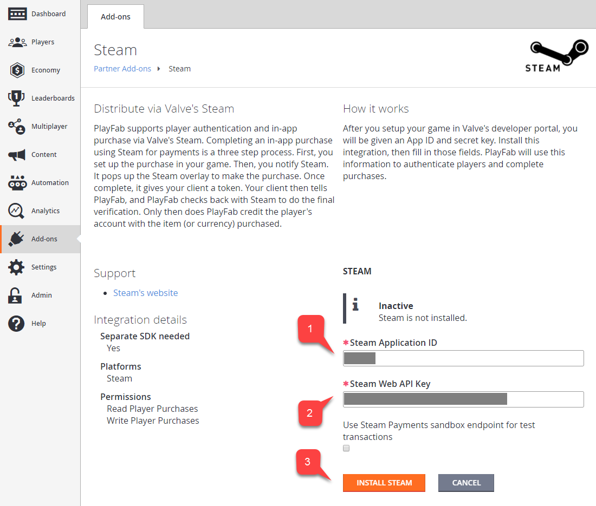
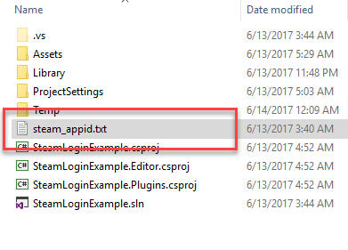
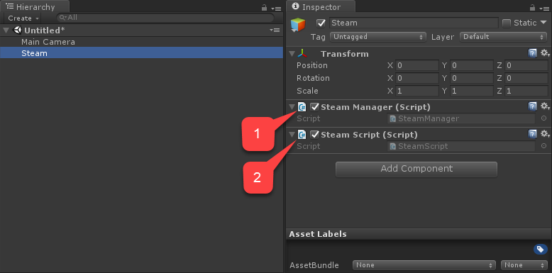
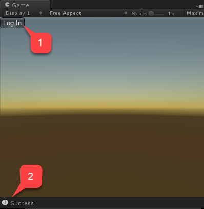

# Setting up PlayFab authentication using Steam and Unity

This tutorial guides you through the steps for logging into PlayFab using Steam through SteamWorks and Unity.

## Prerequisites

Before beginning, you should have:

- A Unity project with an imported PlayFab SDK and a configured title ID.
- A Steam Application with:
  - The AppID already set up. The AppID is usually acquired through the [Steam Direct (Formerly Greenlight)](https://partner.steamgames.com/steamdirect) process.
  - A Steam Publisher Web API Key. Follow [Creating a Publisher Web API Key](https://partner.steamgames.com/doc/webapi_overview/auth#create_publisher_key) in the Steamworks documentation to generate a publisher key.
- Familiarity with [Login basics and Best Practices](../../authentication/login/login-basics-best-practices.md).

## Setting up a PlayFab title

To enable support for Steam authorization, PlayFab requires you to enable the Steam add-on.

- Go to your **Game Manager** page.
- Select the **Add-ons** menu item **(1)**.
- In the list of available **Add-ons**, locate **Steam** and select the title link **(2)**:

  

- Enter your **App ID (1)**.
- Enter the **Web API Key (2)**.
- Then select **Install Steam (3)**.

  

This concludes setting up a PlayFab title for Steam integration.

## Setting up a Unity project

Start by downloading the latest release of Steamworks.NET from the [Releases page](https://github.com/rlabrecque/Steamworks.NET/releases).

- Get the Unity Package version of the release, and import it into the project.
- Once you import the package, close Unity.
- Navigate to the **Project** root folder.
- Locate the **steam_appid.txt** file.
- Open the file and replace the **App ID** value with your own.

  

Re-open Unity and create a new scene.

- Inside that scene create a new **gameobject** called **Steam**.
- Add a **SteamManager** component to the **gameobject (1)**. This component is part of Steamworks.Net.
- Create and add a **SteamScript** component to the **gameobject** **(2)**.

  

The following example shows the code for the **SteamScript** component.

([Thanks to Dylan Hunt for this example.](https://community.playfab.com/answers/8875/view.html))

```csharp
// Import all the necessary namespaces
using System;
using System.Text;
using PlayFab;
using PlayFab.ClientModels;
using Steamworks;
using UnityEngine;

public class SteamScript : MonoBehaviour {
    //This method returns
    public string GetSteamAuthTicket() {
        byte[] ticketBlob = new byte[1024];
        uint ticketSize;

        // Retrieve ticket; hTicket should be a field in the class so you can use it to cancel the ticket later
        // When you pass an object, the object can be modified by the callee. This function modifies the byte array you've passed to it.
        HAuthTicket hTicket = SteamUser.GetAuthSessionTicket(ticketBlob, ticketBlob.Length, out ticketSize);

        // Resize the buffer to actual length
        Array.Resize(ref ticketBlob, (int)ticketSize);

        // Convert bytes to string
        StringBuilder sb = new StringBuilder();
        foreach (byte b in ticketBlob) {
            sb.AppendFormat("{0:x2}", b);
        }
        return sb.ToString();
    }

    public void OnGUI() {
        if (GUILayout.Button("Log In")) {
            if (SteamManager.Initialized) {
                // Execute PlayFab API call to log in with steam ticket
                PlayFabClientAPI.LoginWithSteam(new LoginWithSteamRequest {
                    CreateAccount = true,
                    SteamTicket = GetSteamAuthTicket()
                }, OnComplete,OnFailed);
            }
        }
    }

    // Utility callbacks to log the result
    private void OnComplete(LoginResult obj) {
        Debug.Log("Success!");
    }

    private void OnFailed(PlayFabError error) {
        Debug.Log("Failed: " + error.GenerateErrorReport());
    }
}
```

## Testing

You may test right inside the editor:

- Run the scene and select the **Log In** button **(1)**.
- The console message should appear after a moment, indicating the authentication result **Success! (2)**.


