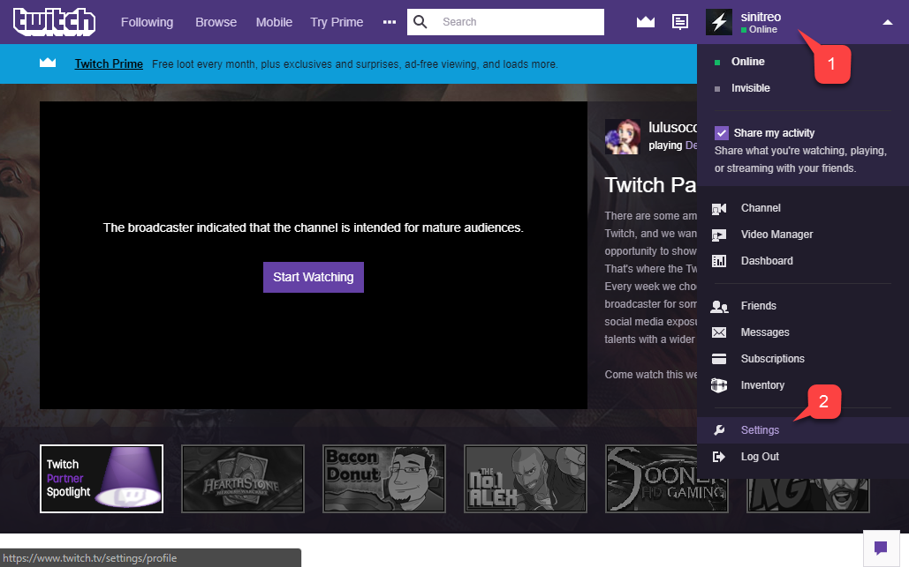
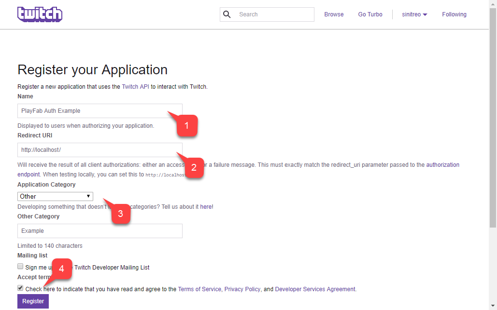
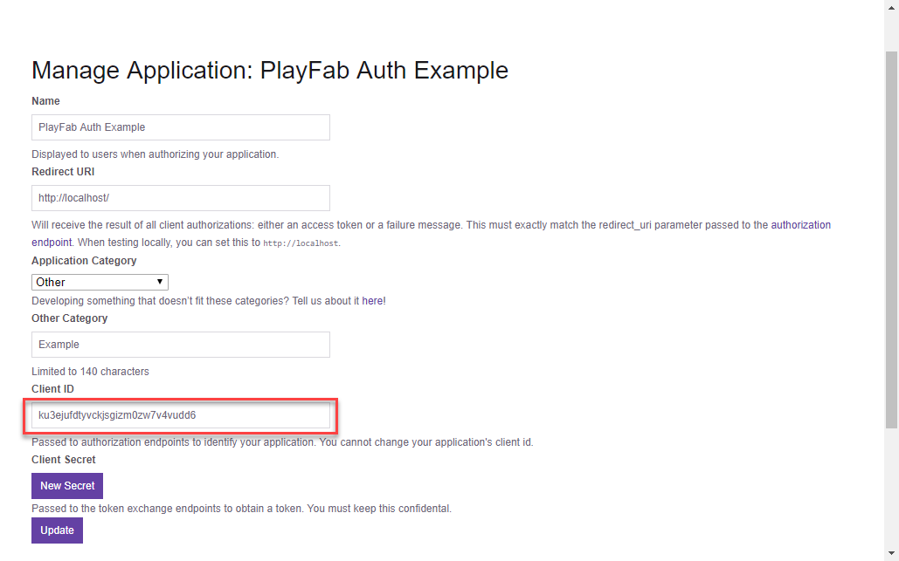
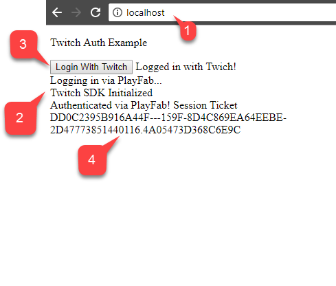

# Setting up PlayFab authentication using Twitch and HTML5

This tutorial guides you through the process of **PlayFab** authentication using **Twitch** and **HTML5/JavaScript**.

## Requirements

Prior to beginning, you should have:

- A [Twitch Account](https://www.twitch.tv/) for testing.
- A Registered [PlayFab](https://playfab.com/) **Title**.
- Familiarity with [Login basics and Best Practices](../../authentication/platform-specific-authentication/login-basics-best-practices.md).
- At the minimum, a server with a valid domain name to serve static **HTML** files.

> [!NOTE]
> Consult the [Running an HTTP server for testing](../../config/dev-test-live/running-an-http-server-for-testing.md) tutorial for information on how to set one up.

## Server and Domain

This tutorial requires a **Web Server** in order to follow the instructions. If you do not have a registered remote **Web Server** yet, please follow our [Running an HTTP server for testing](../../config/dev-test-live/running-an-http-server-for-testing.md) tutorial for information on how to run a local web server. Throughout this tutorial, we will assume your domain is [http://localhost/](http://localhost/).

## Registering a Twitch Application

Start by navigating to the [Twitch website](https://www.twitch.tv/) and make sure you are logged in.

- Navigate to the **Account** drop-down **(1)**.
- Select **Settings (2)** from the menu provided.

  

On the **Settings** page, select **Connections (1)**.

  

At the very bottom of the page, select the **Register your application** button **(1)**.

  

A page will open that lets you configure a new **App**.

- Fill in the **Name** of the **Application (1)**.
- Enter the **Redirect URL (2)**.
- Enter the **Application Category (3)**. 
- Then agree to the **Twitch** terms, and select the **Register**  button **(4)**.

  

> [!IMPORTANT]  
> When testing using a local **Web Server**, **Twitch** allows you to use http://localhost/ as a redirect **URL**. Make sure to include the leading slash **/**. Without a leading slash, **Twitch** will fail to recognize the **localhost URL**.

Once the **Application** is registered, the page will be updated and reveal the **Client ID** for your **Application**.

- Keep this **Client ID** in a safe and easily accessible place, as it will be used later to configure your **PlayFab Title**.

  

## Configuring a PlayFab Title

Once you acquire your **Twitch Client ID**, you may enable and configure a **Twitch Add-on** for your **PlayFab Title**.

- On your **PlayFab Title**, go to the menu and select the **Add-ons** item **(1)**.
- Then select the **Twitch** icon link **(2)**.

  

On the **Twitch** page:

- A Settings page will open for the **Twitch Add-on**.
- Enter your **Twitch Client ID (1)**.
- Select the **Install Twitch** button **(2)**.

  

Take a moment to verify that the add-on was installed, and that no errors have occurred. This concludes configuring the **PlayFab Title**.

## Testing

Use the following **HTML** file to test **PlayFab** authentication using **Twitch**. 

Make sure to replace **TWITCH_CLIENT_ID_GOES_HERE** and **PLAYFAB_TITLE_ID_GOES_HERE** with your own values.

```html
<!DOCTYPE html>
<html>
<head>
    <!-- Include JQuery - dependency of Twitch JS SDK -->
    <script src="//code.jquery.com/jquery.min.js"></script>
    <!-- Include Twitch SDK -->
    <script src="https://ttv-api.s3.amazonaws.com/twitch.min.js"></script>
    <!-- Include PlayFab SDK -->
    <script src="https://download.playfab.com/PlayFabClientApi.js"></script>
</head>
<body>
    <p>Twitch Auth Example</p>
    <button onclick="login()">Login With Twitch</button>
    <script>
        // Establish Twitch Auth Callback (invoked when logged in with Twitch)
        Twitch.events.addListener('auth.login', function() {
            logLine("Logged in with Twitch!");
            // Invoke login with PlayFab code and pass the token
            loginWithPlayFab(Twitch.getToken());
        });

        // Run Twitch SDK initialization
        Twitch.init({clientId: 'TWITCH_CLIENT_ID_GOES_HERE'}, function(error, status) {
            logLine("Twitch SDK Initialized");
        });

        // This method is invoked when you press the button

        function login() {
            logLine("Logging in via Twitch...");
            Twitch.login({
                scope: ['user_read', 'channel_read']
            });
        }

        function loginWithPlayFab(accessToken){
            logLine("Logging in via PlayFab...");

            // When given accessToken, make call to LoginWithTwitch API Call
            // Make sure to use your own PlayFab Title ID
            PlayFabClientSDK.LoginWithTwitch({
                AccessToken: accessToken,
                TitleId: "PLAYFAB_TITLE_ID_GOES_HERE",
                CreateAccount: true
            }, onPlayFabResponse);
        }

        // Handles response from playfab.
        function onPlayFabResponse(response, error) {
            if (response)
                logLine("Response: " + JSON.stringify(response));
            if (error)
                logLine("Error: " + JSON.stringify(error));
        }

        function logLine(message) {
        console.log(message);
            var textnode = document.createTextNode(message);
            document.body.appendChild(textnode);
            var br = document.createElement("br");
            document.body.appendChild(br);
        }
    </script>
</body>
</html>
```

Request the following file from your server, using the domain you set up during the **Twitch Application** configuration ( **http://localhost** in our case) **(1)**.

- Once the page opens, wait for the message indicating that the **Twitch SDK** was initialized **(2)**. 
- Then select the **Login with Twitch** button **(3)**.
- Follow any **Twitch** instructions in the pop-up window. 
- Watch the output **(4)**.

> [!IMPORTANT]
> If you *already have* a **Twitch** auth session going when reaching the page, it is possible for callbacks to fire in a different, unexpected order. This case is shown in the screenshot shown below. However, you should make sure that only **Logging in via PlayFab** follows after **Logged in with Twitch**. This indicates that the **Token** was received or restored from the local storage, and we do not have to wait for the **Twitch SDK** to start signing in to **PlayFab**.

  

If **PlayFab** manages to acquire a **SessionTicket**, you have successfully integrated **Twitch** authentication with your **PlayFab App**.
