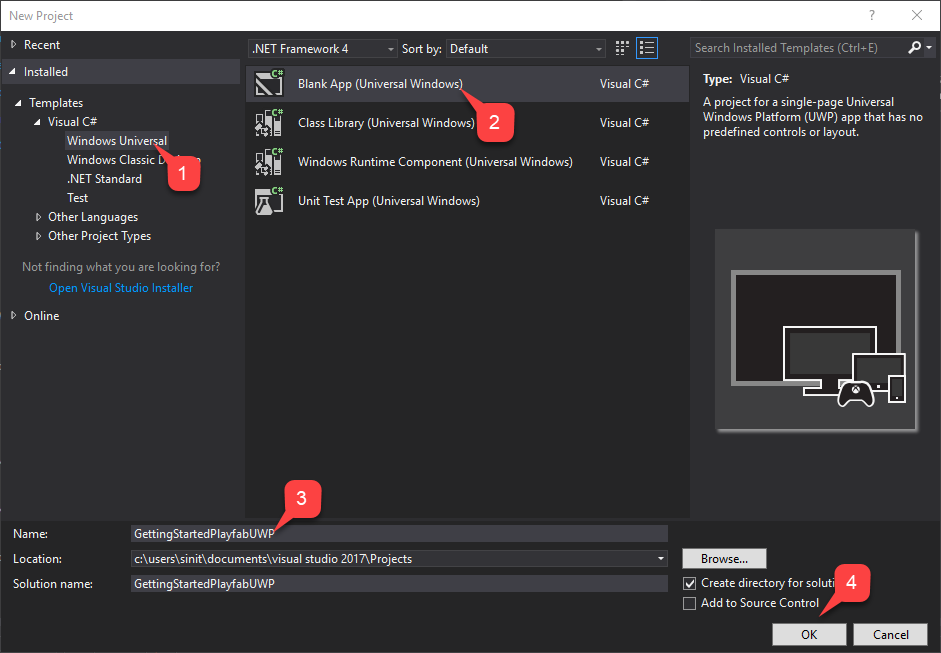
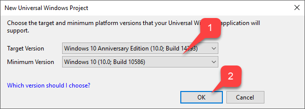
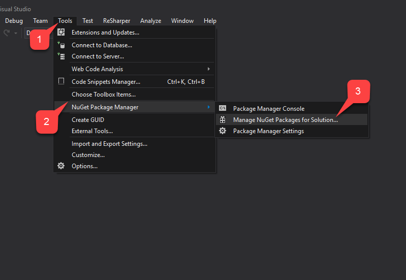
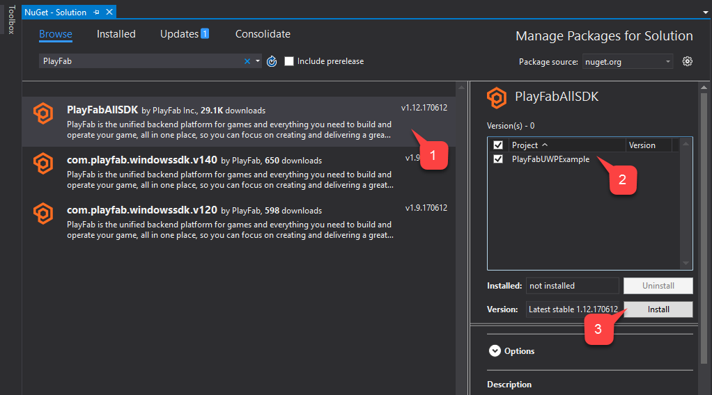
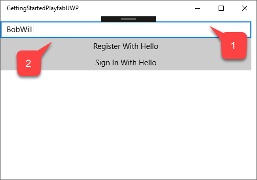
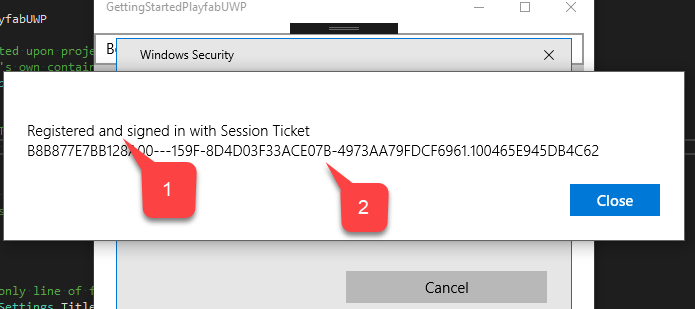

# Setting up PlayFab authentication using Universal Windows Platform

This tutorial guides you through the procedure for PlayFab authentication using the Universal Windows Platform (UWP).

> [!IMPORTANT]
> This procedure serves as a very basic introduction on how you can obtain all entities, and commit authentication via Windows Hello and PlayFab. For a more sophisticated example of Windows Hello and PlayFab authentication, consider our [UWPExample project](https://github.com/PlayFab/UWPExample).

## Requirements

- Follow the [MSDN "Get Set Up" Guide](https://docs.microsoft.com/en-us/windows/uwp/get-started/get-set-up) to prepare Windows and Visual Studio for UWP development.
- Have a registered [PlayFab](https://playfab.com/) title.
- Be familiar with [Login basics and Best Practices](../../authentication/login/login-basics-best-practices.md).

> [!NOTE]
> it is *very* important that you use the Windows 10 operating system, are logged in with a verified Microsoft account, and have configured an access interface such as PIN. If these requirements are *not* met, the app will fail without any useful explanation of why.

## Preparing a Visual Studio project

Start Visual Studio and create a new project.

1. Under **Templates**, select **Windows Universal**.
2. Then select the **Blank App (Universal Windows)** type.
3. Name it **GettingStartedPlayfabUWP**.
4. Select the **OK** button to submit.

  

1. Select the **Target Version** and the **Minimum Version** that match your **Project**.
2. Select the  **OK** button.

  

Once the **Project** is created, add the **PlayFab SDK** using the **NuGet Package Manager**.

1. First, select the **Tools** tab.
2. In the drop-down menu, select **NuGet Package Manager**.
3. Then select **Manage NuGet Packages for Solution**.

  

In the **NuGet Manager** window:

1. Select **Browse** and search for the **PlayFabAllSDK** package.
2. Select your target **Project**.
3. Then select the **Install** button.

  

Once finished, your basic project setup is complete. In the next section we will modify 2 classes that should be automatically generated on project creation:

1. **App**
2. **MainPage**

## Implementation

### App.xaml.cs  

This class will just set up our PlayFab SDK by setting a proper title ID. Do not forget to replace the title ID with your own.

```csharp
using System;
using Windows.ApplicationModel;
using Windows.ApplicationModel.Activation;
using Windows.UI.Xaml;
using Windows.UI.Xaml.Controls;
using Windows.UI.Xaml.Navigation;

namespace GettingStartedPlayfabUWP
{
    // This class is generated upon project creation.
    // While template on it's own contains a lot of xml comments, we are only interested in lines 17 and 27
    sealed partial class App : Application
    {

        // Replace PLAYFAB_TITLE_ID with your own
        public const string PlayfabTitleId = "PLAYFAB_TITLE_ID";

        /// <summary>
        /// Initializes the singleton application object. This is the first line of authored code
        /// executed, and as such is the logical equivalent of main() or WinMain().
        /// </summary>
        public App()
        {

            // This is the only line of functional code we need to add to this class.
            PlayFab.PlayFabSettings.TitleId = PlayfabTitleId;

            this.InitializeComponent();
            this.Suspending += OnSuspending;
        }

        /// <summary>
        /// Invoked when the application is launched normally by the end user. Other entry points
        /// will be used such as when the application is launched to open a specific file.
        /// </summary>
        /// <param name="e">Details about the launch request and process.</param>
        protected override void OnLaunched(LaunchActivatedEventArgs e)
        {
            Frame rootFrame = Window.Current.Content as Frame;

            // Do not repeat app initialization when the Window already has content,
            // just ensure that the window is active
            if (rootFrame == null)
            {
                // Create a Frame to act as the navigation context and navigate to the first page
                rootFrame = new Frame();

                rootFrame.NavigationFailed += OnNavigationFailed;

                if (e.PreviousExecutionState == ApplicationExecutionState.Terminated)
                {
                    //TODO: Load state from previously suspended application
                }

                // Place the frame in the current Window
                Window.Current.Content = rootFrame;
            }

            if (e.PrelaunchActivated == false)
            {
                if (rootFrame.Content == null)
                {
                    // When the navigation stack isn't restored navigate to the first page,
                    // configuring the new page by passing required information as a navigation
                    // parameter
                    rootFrame.Navigate(typeof(MainPage), e.Arguments);
                }
                // Ensure the current window is active
                Window.Current.Activate();
            }
        }

        /// <summary>
        /// Invoked when Navigation to a certain page fails
        /// </summary>
        /// <param name="sender">The Frame which failed navigation</param>
        /// <param name="e">Details about the navigation failure</param>
        void OnNavigationFailed(object sender, NavigationFailedEventArgs e)
        {
            throw new Exception("Failed to load Page " + e.SourcePageType.FullName);
        }

        /// <summary>
        /// Invoked when application execution is being suspended. Application state is saved
        /// without knowing whether the application will be terminated or resumed with the contents
        /// of memory still intact.
        /// </summary>
        /// <param name="sender">The source of the suspend request.</param>
        /// <param name="e">Details about the suspend request.</param>
        private void OnSuspending(object sender, SuspendingEventArgs e)
        {
            var deferral = e.SuspendingOperation.GetDeferral();
            //TODO: Save application state and stop any background activity
            deferral.Complete();
        }
    }
}
```

### MainPage.xaml

This file contains the layout for our main page. This is a *super trivial* layout with 2 buttons, and a text input combined in a vertically oriented grid.

The buttons are bound to specific methods, and the textbox is accessible via its name `UsernameInput`.

```xaml
<Page
    x:Class="GettingStartedPlayfabUWP.MainPage"
    xmlns="http://schemas.microsoft.com/winfx/2006/xaml/presentation"
    xmlns:x="http://schemas.microsoft.com/winfx/2006/xaml"
    xmlns:local="using:GettingStartedPlayfabUWP"
    xmlns:d="http://schemas.microsoft.com/expression/blend/2008"
    xmlns:mc="http://schemas.openxmlformats.org/markup-compatibility/2006"
    mc:Ignorable="d">

    <Grid Background="{ThemeResource ApplicationPageBackgroundThemeBrush}">
        <StackPanel Margin="0,10,10,0">
            <TextBox x:Name="UsernameInput" TextWrapping="Wrap" Text="" PlaceholderText="Username..."/>
            <Button x:Name="RegisterButton" Content="Register With Hello" HorizontalAlignment="Stretch" VerticalAlignment="Stretch" Click="RegisterRequest"/>
            <Button x:Name="LoginButton" Content="Sign In With Hello" HorizontalAlignment="Stretch" VerticalAlignment="Stretch" Click="LogInRequest"/>
        </StackPanel>
    </Grid>
</Page>
```

### MainPage.xaml.cs

This is the functional class for the main page and it is the heart of the example. Please refer to the code comments, and review the different methods that are designed to walk you through PlayFab+Hello register and login.

The easiest approach to start learning the code is to review the methods that are triggered by the corresponding buttons:

- **RegisterRequest**
- **LogInRequest**.

```csharp
using System;
using System.Linq;
using System.Threading.Tasks;
using Windows.Foundation;
using Windows.Networking.Connectivity;
using Windows.Security.Credentials;
using Windows.Security.Cryptography;
using Windows.Security.Cryptography.Core;
using Windows.Storage.Streams;
using Windows.UI.Popups;
using Windows.UI.Xaml;
using Windows.UI.Xaml.Controls;
using PlayFab;
using PlayFab.ClientModels;


namespace GettingStartedPlayfabUWP
{
    public sealed partial class MainPage : Page
    {
        // Shortcut to get current value of UsernameInput
        public string Username => UsernameInput.Text;

        public MainPage()
        {
            this.InitializeComponent();
        }

        /// <summary>
        /// This method is invoked when you select the Register button
        /// This method illustrates the flow for Registration process.
        /// We operate on 2 entities:
        /// - User Credentials of type KeyCredential
        /// - Public Key of type String
        /// We first check if user with this id already has Credentials. If so, we redirect to login procedure.
        /// Then we create new User Credentials. Check CreateKeyCredential for implementation details
        /// Then we get Base64 encoded Public Key using the new User Credentials. Check GetPublicKeyBase64 for implementation details
        /// Then we execute RegisterWithHello api call call. Check CallPlayFabRegisterWithHello for implementation details
        /// </summary>
        private async void RegisterRequest(object sender, RoutedEventArgs e)
        {
            // Check if the user already exists and if so log them in.
            KeyCredentialRetrievalResult retrieveResult = await KeyCredentialManager.OpenAsync(Username);
            if (retrieveResult.Status == KeyCredentialStatus.Success)
            {
                // Redirect to login procedure
                LogInRequest(sender, e);
                return;
            }

            // Create a new KeyCredential for the user on the device.
            var credential = await CreateKeyCredential(Username);
            if (credential == null) return;

            var publicKey = await GetPublicKeyBase64(credential);
            if (string.IsNullOrEmpty(publicKey)) return;
            // Include the name of the current device for the benefit of the user.
            // The server could support a Web interface that shows the user all the devices they
            // have signed in from and revoke access from devices they have lost.

            var registerResponse = await CallPlayFabRegisterWithHello(publicKey, Username);

            await ShowMessage("Registered and signed in with Session Ticket " + registerResponse.Result.SessionTicket);
        }

        //
        /// <summary>
        /// This method is invoked when you select the Log In button
        /// This method shows entities flow during the sign in process.
        /// We have 4 different entities:
        /// - User Credentials of type KeyCredential
        /// - Public Key Hint of type String
        /// - Challenge of type String
        /// - SignedChallenge of type String
        ///
        /// We first acquire the User Credentials. We do it based on Username. Check GetUserCredentials method for implementation details
        /// Next, we get Public Key Hint based on those credentials. Check GetPublicKeyHint for implementation details.
        /// Next we request a Challenge from PlayFab. Check GetPlayFabHelloChallenge for implementation details
        /// Next we sign the Challenge using User Credentials, so we obtain Signed Challenge. Check GetPlayFabHelloChallenge for implementation details
        /// Finally we use Signed Challenge and Public Key Hint to log into PlayFab. Check CallPlayFabLoginWithHello for implementation details
        /// </summary>
        private async void LogInRequest(object sender, RoutedEventArgs e)
        {
            // Get credentials based on current Username.
            var credentials = await GetUserCredentials(Username);
            if (credentials == null) return;

            // Credentials will give us Public Key. We use it to construct Public Key Hint, which is first important entity for PlayFab+UWP authentication.
            var publicKeyHint = GetPublicKeyHintBase64(credentials);
            if (string.IsNullOrEmpty(publicKeyHint)) return;

            // Get PlayFab Challenge to sign for Windows Hello.
            var challenge = await GetPlayFabHelloChallenge(publicKeyHint);
            if (string.IsNullOrEmpty(challenge)) return;

            // Request user to sign the challenge.
            var signedChallenge = await RequestUserSignChallenge(credentials, challenge);
            if (string.IsNullOrEmpty(signedChallenge)) return;

            // Send the signature back to the server to confirm our identity.
            // The publicKeyHint tells the server which public key to use to verify the signature.
            var result = await CallPlayFabLoginWithHello(publicKeyHint, signedChallenge);
            if (result == null) return;

            // Report the result.
            await ShowMessage("Signed in with Session Ticket " + result.Result.SessionTicket);
        }

        public async Task<string> GetPublicKeyBase64(KeyCredential userCredential)
        {

            IBuffer publicKey = userCredential.RetrievePublicKey();

            if (publicKey == null)
            {
                await ShowMessage("Failed to get public key for credential");
                return null;
            }

            return CryptographicBuffer.EncodeToBase64String(publicKey);
        }

        public string GetPublicKeyHintBase64(KeyCredential userCredential)
        {
            HashAlgorithmProvider hashProvider = HashAlgorithmProvider.OpenAlgorithm(HashAlgorithmNames.Sha256);
            var publicKey = userCredential.RetrievePublicKey();
            IBuffer publicKeyHash = hashProvider.HashData(publicKey);
            return CryptographicBuffer.EncodeToBase64String(publicKeyHash);
        }

        public async Task<KeyCredential> GetUserCredentials(string userId)
        {
            // Open credential based on our Username and make sure it is successful
            KeyCredentialRetrievalResult retrieveResult = await KeyCredentialManager.OpenAsync(userId);

            if (retrieveResult.Status != KeyCredentialStatus.Success)
            {
                await ShowMessage("Error: Unable to open credentials! " + retrieveResult.Status);
                return null;
            }

            return retrieveResult.Credential;
        }

        public async Task<string> GetPlayFabHelloChallenge(string publicKeyHint)
        {
            // Request challenge from PlayFab and make sure response has no errors
            var challengeResponse = await PlayFab.PlayFabClientAPI.GetWindowsHelloChallengeAsync(new GetWindowsHelloChallengeRequest
            {
                PublicKeyHint = publicKeyHint,
                TitleId = PlayFab.PlayFabSettings.TitleId
            });

            if (challengeResponse.Error != null)
            {
                await ShowMessage($"Error during getting challenge: {challengeResponse.Error.Error}");
                return null;
            }

            return challengeResponse.Result.Challenge;

        }

        public async Task<string> RequestUserSignChallenge(KeyCredential credentials, string challenge)
        {
            IBuffer challengeBuffer = CryptographicBuffer.DecodeFromBase64String(challenge);
            KeyCredentialOperationResult opResult = await credentials.RequestSignAsync(challengeBuffer);

            if (opResult.Status != KeyCredentialStatus.Success)
            {
                await ShowMessage("Failed sign the challenge string: " + opResult.Status);
                return null;
            }

            return CryptographicBuffer.EncodeToBase64String(opResult.Result);
        }

        public async Task<PlayFabResult<LoginResult>> CallPlayFabLoginWithHello(string publicKeyHint, string signedChallenge)
        {
            var loginResponse = await PlayFab.PlayFabClientAPI.LoginWithWindowsHelloAsync(new LoginWithWindowsHelloRequest
            {
                ChallengeSignature = signedChallenge,
                PublicKeyHint = publicKeyHint
            });

            if (loginResponse.Error != null)
            {
                await ShowMessage($"Failed to log in: {loginResponse.Error.Error}");
                return null;
            }

            return loginResponse;
        }

        public IAsyncOperation<IUICommand> ShowMessage(string messageString)
        {
            MessageDialog message = new MessageDialog($"{messageString}");
            return message.ShowAsync();
        }

        public async Task<PlayFabResult<LoginResult>> CallPlayFabRegisterWithHello(string publicKey, string username)
        {
            var hostNames = NetworkInformation.GetHostNames();
            var localName = hostNames.FirstOrDefault(name => name.DisplayName.Contains(".local"));
            string computerName = localName.DisplayName.Replace(".local", "");

            var registerResult = await PlayFab.PlayFabClientAPI.RegisterWithWindowsHelloAsync(new RegisterWithWindowsHelloRequest
            {
                DeviceName = computerName,
                PublicKey = publicKey,
                UserName = username
            });

            if (registerResult.Error != null)
            {
                await ShowMessage(registerResult.Error.GenerateErrorReport());
                return null;
            }

            return registerResult;
        }

        public async Task<KeyCredential> CreateKeyCredential(string username)
        {
            KeyCredentialRetrievalResult keyCreationResult = await KeyCredentialManager.RequestCreateAsync(username, KeyCredentialCreationOption.ReplaceExisting);
            if (keyCreationResult.Status != KeyCredentialStatus.Success)
            {
                // User has authenticated with Windows Hello and the key credential is created.
                await ShowMessage("Failed to create key credential: " + keyCreationResult.Status);
                return null;
            }

            return keyCreationResult.Credential;
        }

    }


}
```

## Testing

To run the application:

1. Enter your username.
2. Select the **Register With Hello** button.

  

Follow the instruction that **Windows** offers for authentication.

1. Once your identity is confirmed, you will see the confirmation message saying that the account was **Registered and signed in**.
2. With a **Session Ticket**.

  

1. Select the **Sign in With Hello** button.

  

Follow the instruction that Windows offers for authentication.

1. Once your identity is confirmed, you will see the confirmation message saying that the account is **Signed in**.
2. With a **Session Ticket**.

  

At this point you have successfully integrated PlayFab into your UWP application.
