# Bulk Actions for an entire player segment

This tutorial walks you through the steps needed to create a task to perform one or more actions on every player in a segment.

Tasks are a vital part of live operations for any game, they give you a powerful set of tools for engaging with your players.

Examples might include:

- Give a special New Year’s gift to all players who logged in during the last 2 weeks.
- Reward players who spent money in the last week (based on spending tiers), where the more money they spent, the more valuable the gift.
- Fixing corrupted Player state for all players affected by a recent game bug.

In this tutorial, based on our **Unicorn Battle Sample App**, we will grant a special gift to all players with more than **2,725 XP**.

## Prerequisites

You will need to install the **Unicorn Battle Sample App** to run this tutorial. You can read more about it [in our blog](https://playfab.com/check-out-unicorn-battle/), or go directly to the [GitHub repository](https://github.com/PlayFab/UnicornBattle) and follow the instructions there.

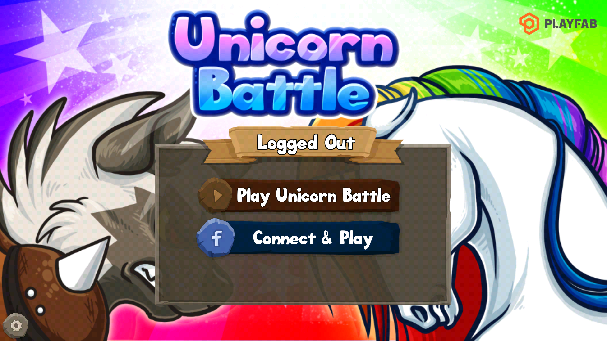  

You will want to play *several* battles in order to level up your character to at least **Level 2** which you reach at **2,725 XP** points.

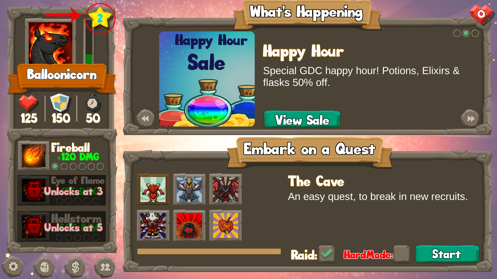

## Step 1 - Create the segment

The first step is to create the segment that defines the group of players who will be affected by this action. In this case, we need to create the **High XP Segment**, defined as all players who have more than **2,725 XP**:

- Select **PlayStream** from the menu on the left.
- Choose the **Segments** tab.
- Then select the **New Segment** button.
- Make the **Segment Name**: **High XP Players**.
- Define it as **Player**, where the **Statistic Value** called **Total_XP Gained** is greater than **2725**.

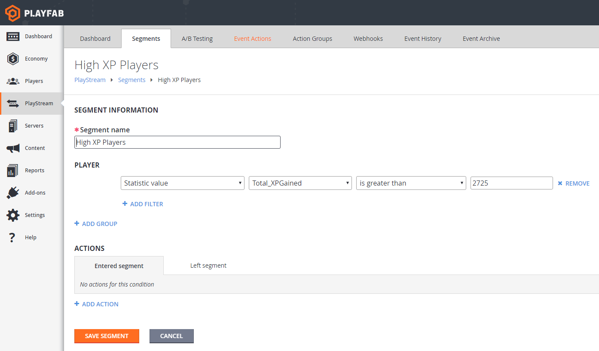

## Step 2 - Create a task for this segment

- Select the **Segments** tab.
- Then select **RUN TASK …**

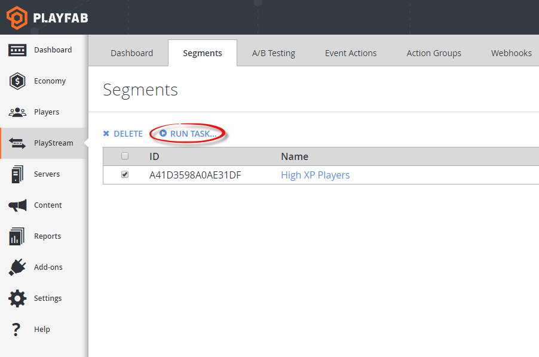

This will take you to the **Create Task** view in the **Servers**->**Tasks** tab, and will pre-populate various fields based on your selected segment.

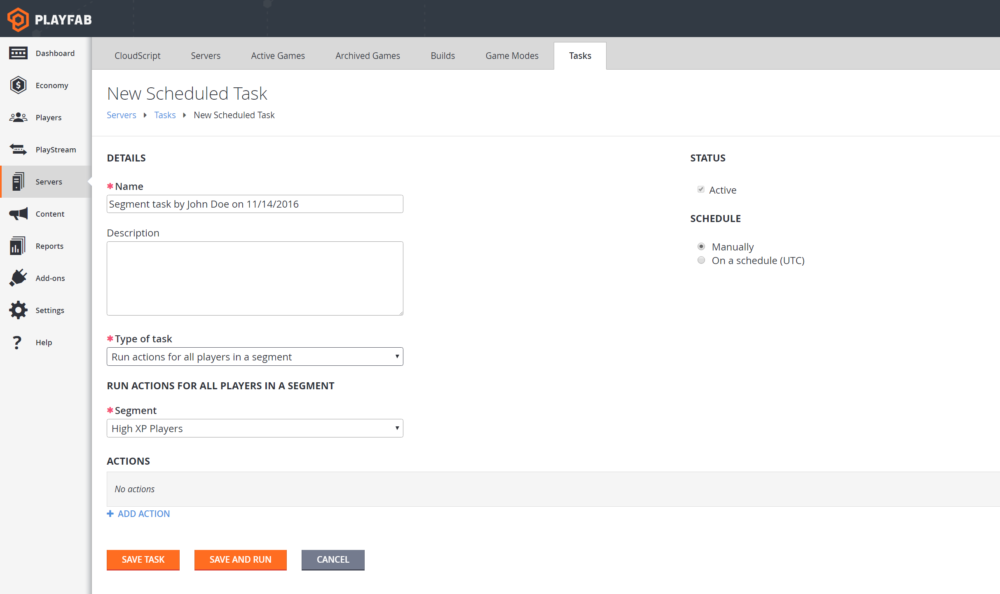

## Step 3 - Add actions to the task

Next, you can finish setting up the task.

- Change the name to **Reward High XP Players**
- Add this description: **Give a gift to Players who are level 2 or higher**.
- Select **ADD ACTION**
  - Type in **Grant virtual currency** in the field provided.
  - **Virtual Currency** code: **GM** (short for **Gems**).
  - Amount: **20**
- Leave the scheduling set to **Manually** for now.
- Select the **SAVE AND RUN** button to run the task.

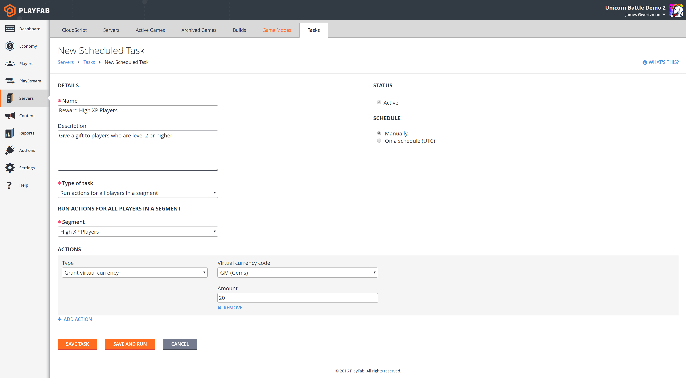

## Step 4 - Monitor your task

The **Tasks** view will show you your running task. Initially the task status will be **InProgress**, but it will quickly change to **Succeeded** since the segment is small.

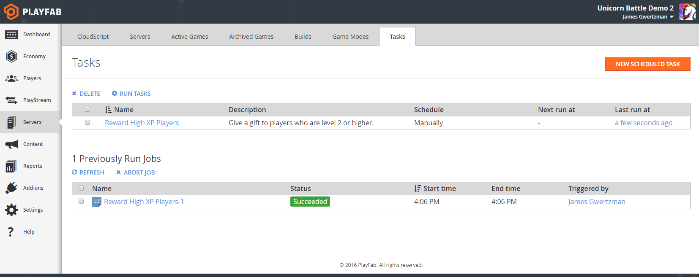

Now, let's check out the task execution detail. Select the completed task in the previously run **Tasks** list. You will see important information, such as:

- How many players were processed.
- When the task started.
- How long it took to complete.
- The parameters it had when it was launched.
- Who ran it.
- If it was scheduled manually, etc.

If the task is still in progress, you can check the **Task Instance Detail** view for the progress and see the estimated time remaining.

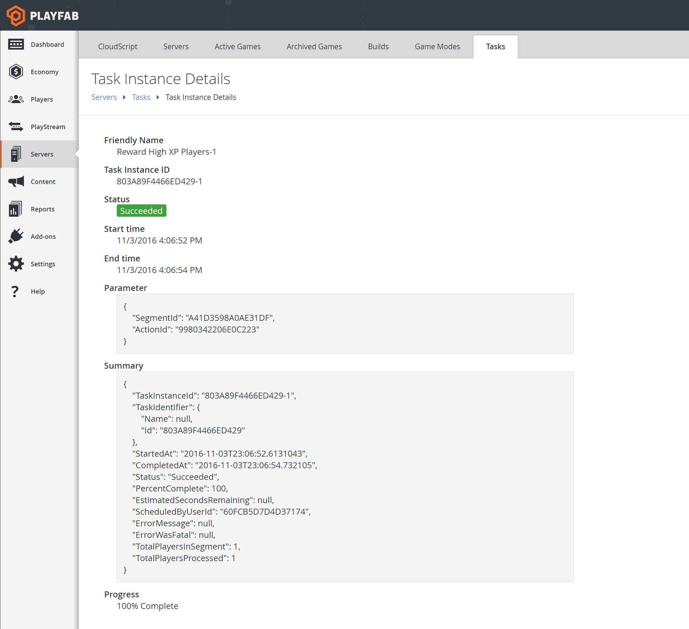

To verify that the task ran successfully:

- Navigate to the **Players** tab.
- Select your **Player**.
- Then choose the **Event History** tab.
- The most recent event in the list should be a **player_virtual_currency_balance_changed**, which should show your **Player’s** gems increasing by **20**.

> [!NOTE]
> You can expand this event to see the details.

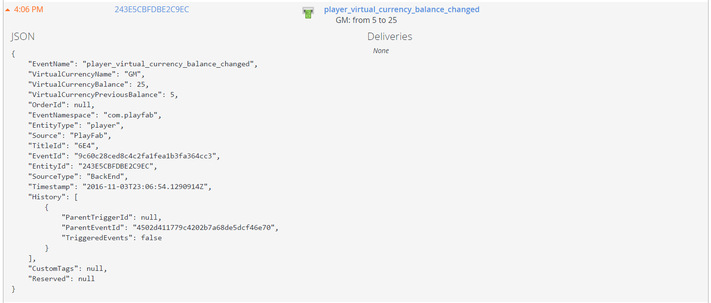

## What’s next

This tutorial has introduced you to the steps involved in performing an action for every player in a segment, but there’s a lot more you can do with tasks.

Here are a few ideas for other things you can try...

### Schedule your tasks

You don’t need to run tasks manually - you can schedule a task to run *automatically* on a *recurring* basis. For example, you could create a segment of all players who played the game in the last 24 hours, then run a scheduled tasks each day to give those players an **XP** boost.

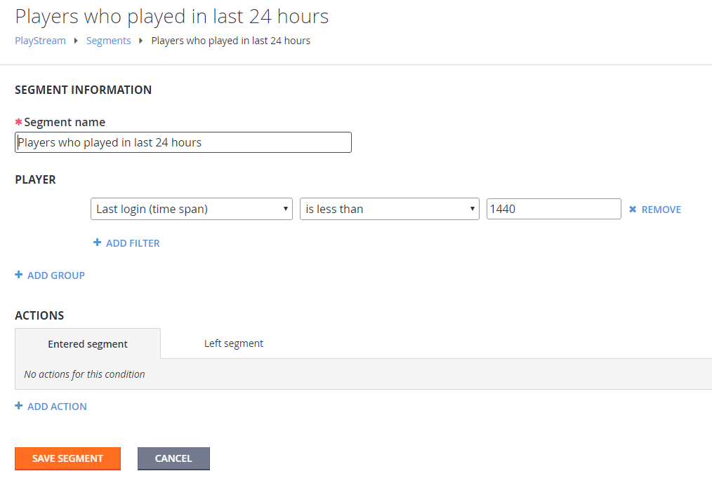

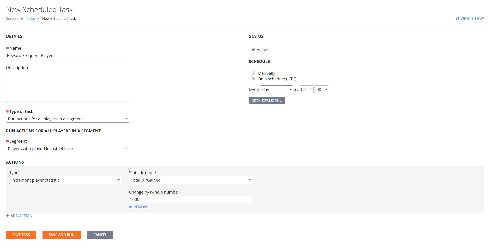

### Run CloudScript for each player

The most powerful use of bulk actions is running an arbitrary **CloudScript** function for each player. This **CloudScript** can do anything the PlayFab server **API** can do - grant items, currency, inspect and change player data, and so on.

For example, imagine you have an event leaderboard that resets every week, and you want to go through all players and give a reward based on the value of the *last* event before it reset. The example provided below is using **Unicorn Battle**.

1. Create a new stat (**Event_QuestsCompleted**) that resets weekly and uses the aggregation method **Last**.

   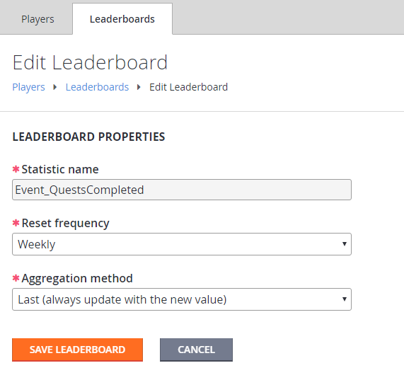

2. Create a new **PlayStream** action that increments this **Event_QuestsCompleted** stat whenever **Total_QuestsCompleted** is changed.

   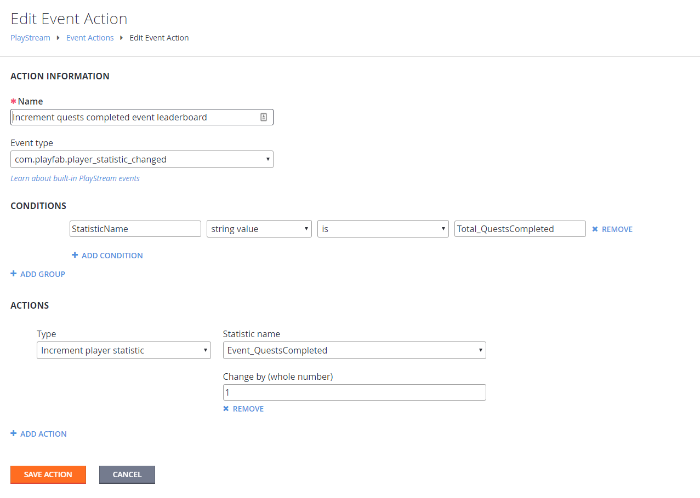

3. Write a **CloudScript** function to be called by a Bulk Action task which will go through players and give rewards based on the last value.

```javascript
// this function will be called as a bulk action by a scheduled task for players in a segment
handlers.GiveTieredReward = function (args, context) {
	var profile = context.playerProfile;

	var statVersion = 0;        // set to whatever version you need to use

	var getStatRequest = {};
	getStatRequest.PlayFabId = profile.PlayerId;
	getStatRequest.StatisticNameVersions = [{ "StatisticName": "Event_QuestsCompleted", "Version": statVersion }];

	try {
		getStatRequest.PlayerResult = server.GetPlayerStatistics(getStatRequest);
	} catch (e) {
	};

	if (getStatRequest.PlayerResult && getStatRequest.PlayerResult.Statistics.length > 0) {
		getStatRequest.lastScore = getStatRequest.PlayerResult.Statistics[0].Value
	}

	if (getStatRequest.lastScore && getStatRequest.lastScore > 2) {
		// give gift to all players with more than 2 quests completed in last event
		// in a real event we would want to use a lookup table of gifts
		// but here we are just hard-coding it
		var giftRequest = {};
		giftRequest.PlayFabId = profile.PlayerId;
		giftRequest.ItemIds = ["CrystalKey"];
		giftRequest.grantResult = server.GrantItemsToUser(giftRequest);
		return giftRequest;
	} else {
		return getStatRequest;
	}
}
```

4. Set the new **CloudScript** version to **Live**, and create a new task that calls **GiveTieredReward** function for all players. Don't forget to **Save** and **Run** the task.

   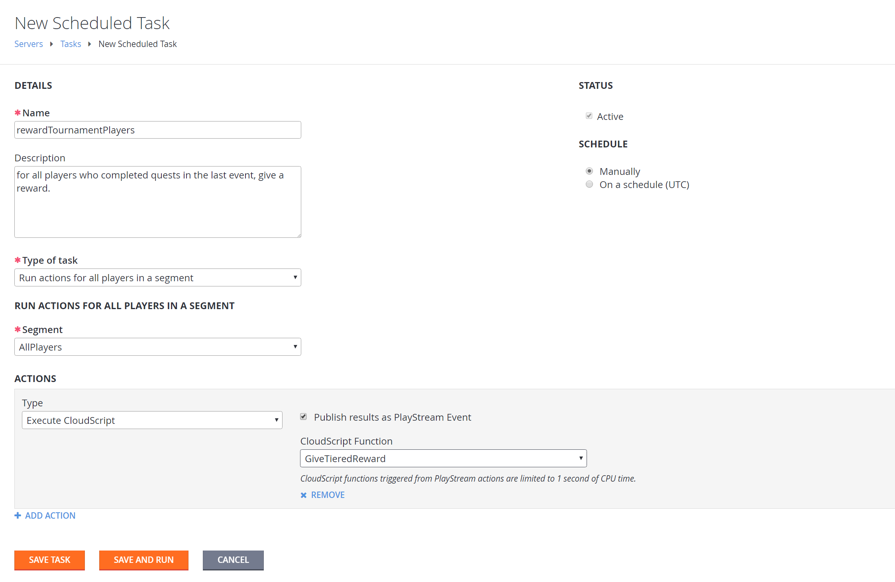

5. You should notice events from this task appear in the **PlayStream** event debugger.

   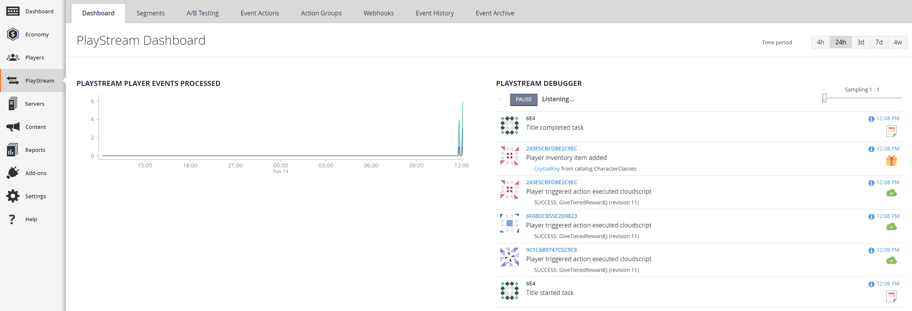

6. You can select any player triggered action executed **CloudScript** event (by selecting the time stamp), and see the detailed result of **CloudScript** execution for each player. This includes useful diagnostic information such as the snapshot of the player profile at the time of the **CloudScript** execution.

   
