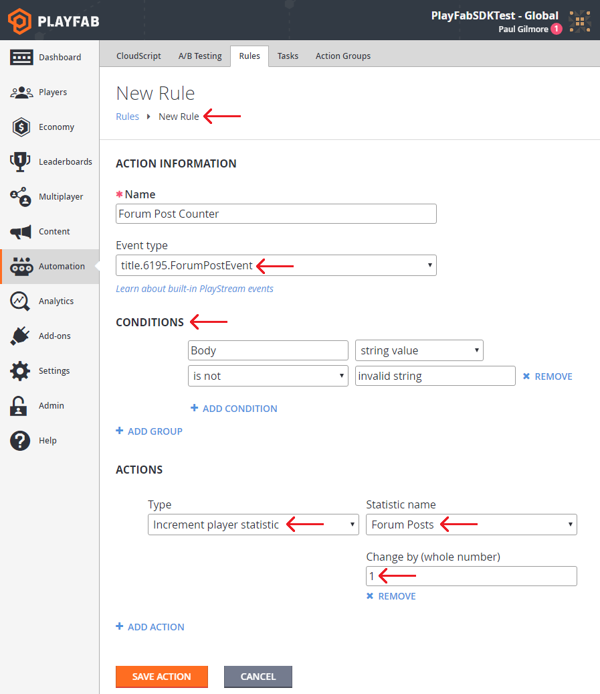
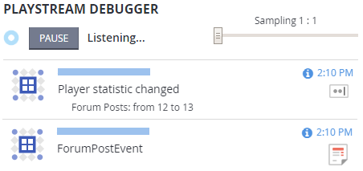
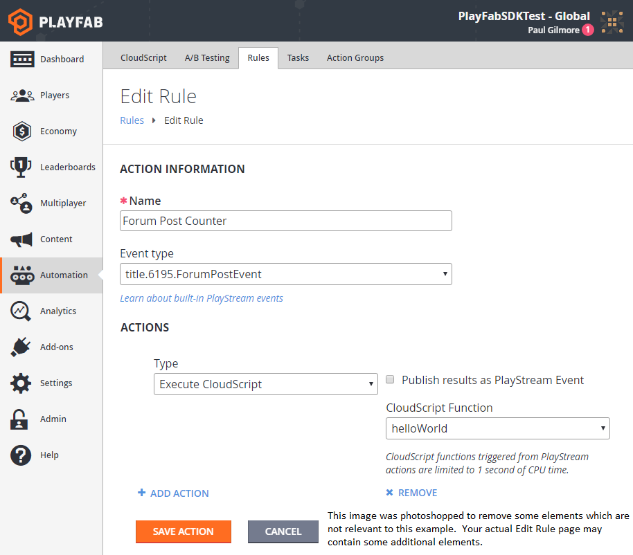

# PlayStream Hooks: Rules, Conditions, and Actions

A PlayStream Rule allows you to react to a subset of one type of PlayStream event in real time.

## Requirements

- [Game Manager Tour](../../config/gamemanager/game-manager-tour.md)
- [Using player statistics](../../data/playerdata/using-player-statistics.md) (Contains information that can help you with the example in this tutorial.)

A quick glossary of relevant terms:

- **PlayStream**: The group of features that make up the PlayFab Event pipeline.
  - A PlayStream Event is a JSON-formatted string describing an event about a Player or Title.
  - PlayStream events have a maximum size based on your Automation feature tier.

- **Rule**: Performs extra logic in response to one type of PlayStream event in real time.
  - The sum of: One Event Trigger, an optional list of conditions, and an optional list of actions.

- **Trigger**: The name of the event which activates this Rule.

- **Condition**: A content filter for Rules and other PlayStream features.
  - Performs a very lightweight evaluation of the PlayStream Event JSON object, and skips Events that don't match requirements.

- **Action**: The contextual work to be done on the appropriate entity.

A Rule consists of exactly one Trigger, an optional list of conditions, and typically at least one action (not required, but quite useless without it).

Triggers, Conditions, and Actions are also part of other systems: [Bulk Actions](../../automation/actions-rules/bulk-actions-for-an-entire-player-segment) and [Tournament Leaderboards](../../social/tournaments-leaderboards/using-resettable-statistics-and-leaderboards.md).

## Example Case: Count custom events from the client

In this example, we post the following custom event from the client:

```csharp
public void WriteEvent() {
    PlayFabClientAPI.WritePlayerEvent(new WriteClientPlayerEventRequest {
        EventName = "ForumPostEvent",
        Body = new Dictionary<string, object> {
            { "Subject", "My First Post" },
            { "Body", "My awesome Post." }
        }
    }, LogSuccess, LogFailure);
}
```

In this case, the client is manually reporting a custom forum post event (this does not currently correspond to any automatic event in PlayFab or supported partners). We will use a PlayStream Rule to count the number of times that a player reports a forum post in this way.

**Requirement**: Your game must already be posting events of this type before the Game Manager GUI will allow you to create a Rule triggering on it.

Game Manager: Navigate to your title -> Automation -> Rules -> New Rule

  

Let's evaluate the new rule in this example piece by piece:

- title.6195.ForumPostEvent
  - 6195 is the title used in this tutorial. Your titleId will match your own title.
  - ForumPostEvent is the "EventName" used in the code for this example case.
  - This line will only be available if you have recently posted at least one "ForumPostEvent" in your title.
- The Condition used specifically in this example, has minimal use
  - However, it does demonstrate filtering our custom event if the "Body" key is mapped to "Invalid string" in our "Body" dictionary.
  - Filters are optional, and should remove irrelevant players from your Rule.
- The chosen action in this case increments a statistic counter by one.
  - Requirement: The "Forum Posts" statistic must be defined under "Leaderboards" in the Game Manager.

In the Game Manager PlayStream Debugger, you can watch as the trigger takes effect:

  

As you can see, the custom ForumPostEvent automatically triggers the statistic that we set under Actions for our new rule.

## Advanced: CloudScript Actions

Many of the built-in actions in PlayFab are fairly simple, and might not give you the full power you need. That's why we allow you to fully customize the Action logic with CloudScript.

Let's edit the rule, remove the condition, set the Action to Execute CloudScript, and Save Action.

  

Now, if we post a new ForumPostEvent, we will see a CloudScript execution:

  

Writing your CloudScript to react to PlayStream rules is an advanced topic covered in our tutorial: [Using CloudScript actions with PlayStream](using-cloudscript-actions-with-playstream.md).