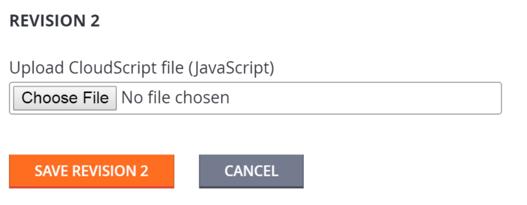
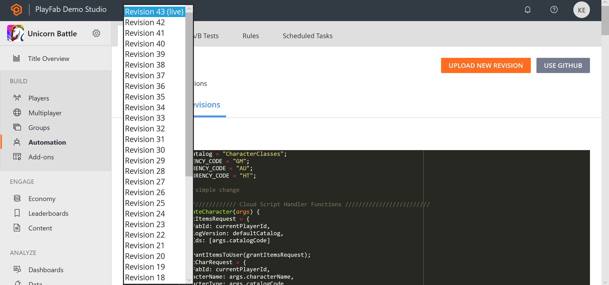
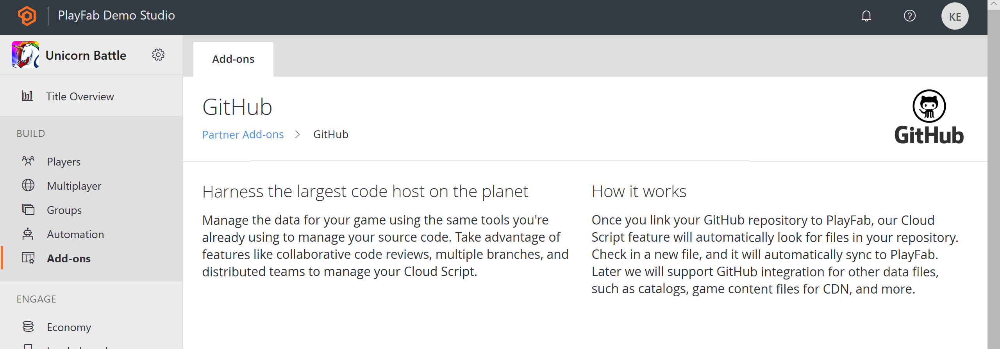

# CloudScript quickstart

CloudScript offers a fast, secure and scalable alternative to dedicated servers. Your custom JavaScript lives and executes directly on PlayFab machines.

From here, your code can be called *directly* by your game clients - or indirectly via PlayStream actions. Additionally, CloudScript methods have full access to PlayFab's [Server](../../../api-references/index.md) API set.

This quickstart covers uploading and managing your CloudScript files in the PlayFab Game Manager.

> [!NOTE]
> The [Writing custom CloudScript](writing-custom-cloudscript.md) tutorial covers writing the CloudScript code itself.

Please note the following when reading this:

- You should be familiar with the basics of PlayFab.
- The **C#** samples shown correspond to using the PlayFab Unity SDK.
- JavaScript samples correspond to using the PlayFab CloudScript service.

## Your first CloudScript revision

After creating a title, PlayFab automatically includes an example script as your first revision. This revision includes a number of methods that you can use for learning and testing CloudScript.

To see these functions:

- Open [Game Manager](https://developer.playfab.com/).
- Select your title.
- Select **Automation** on the left side bar.

You should see a number of CloudScript methods - such as **HelloWorld**, which logs the message **Hello PLAYERID** - where **PLAYERID** is the current player's PlayFab ID.

  

## Uploading your own revisions

You can upload your own custom methods via the Game Manager. Each file you upload will create a new revision. During the upload, the PlayFab service runs a simple LINT check over your CloudScript for syntax errors.

If it finds an error:

- An error message will be displayed.
- Fix the error, and select **SUBMIT** again.
- By default, new uploads must be deployed by selecting the **DEPLOY REVISION # TO LIVE** link. This enables you to update or roll back to/from multiple versions of CloudScript.

The first time you press the orange **UPLOAD NEW REVISION** button, you will see a file selector where you can upload a file from your local machine.

  

After you have added several revisions, you can select *which* submitted revision is live with the drop-down.

  

## GitHub integration

You may also use GitHub to manage your CloudScript revisions. You must have a GitHub account, and you must be logged in.

- Select the **USE GITHUB** button (the gray button in the previous screenshot).
- The next window will have an orange **AUTHORIZE GITHUB ACCOUNT** button.
- Create a new, empty repository in **GitHub**.
- Return to the **GitHub** page in the PlayFab Game Manager (refresh tab).
- At this point, you should be able to select your **GitHub** repository, and bind it to your title.

  

Once bound to GitHub, the manual upload option is removed, and new CloudScript revisions are automatically made for each GitHub commit to the "master" branch.

If you commit *multiple* files, they will be concatenated together into a single PlayFab CloudScript revision. Live revision selection remains the same: new commits to GitHub must be set to live in Game Manager as described above.

## Conclusion

CloudScript allows you to upload files to PlayFab, and execute your code on our server. You can manage your CloudScript files from the **Automation** option in the left side bar. You can upload files manually from your own computer, or bind your title to a GitHub account.

This quickstart covers managing your code files and uploading them to PlayFab.

If you have more questions, the [Writing custom CloudScript](writing-custom-cloudscript.md) tutorial explains more about how to write your CloudScript code files.
