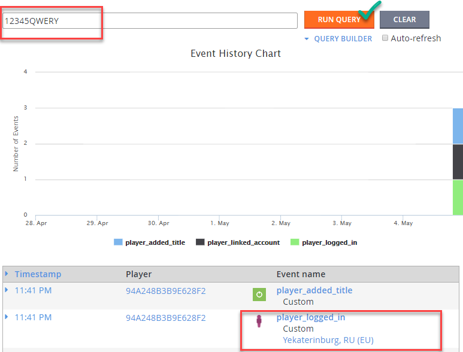
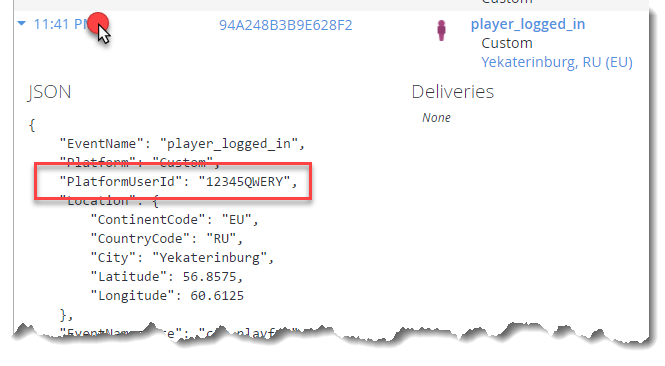
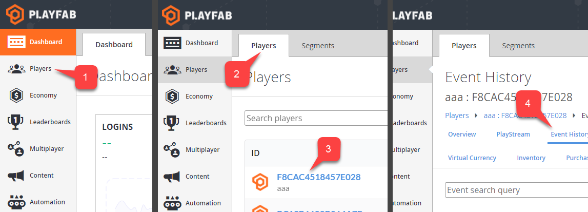

# Event History

This tutorial shows you how to access and utilize the **Event History** in **PlayFab**.

> [!IMPORTANT]
> Before using this tutorial, make sure that you already have some recent **Events** posted to your **Title**. Otherwise, the **Event** flow will render empty. Most **PlayFab APIs** will post **PlayStream Events**, or you can post your *own* custom events. For an overview of **Automatic** and **Custom Events**, see the [PlayStream Quickstart](playstream-quickstart.md).

## Access Event History

1. Open the **PlayFab Game Manager** and select **Analytics** from the navigation sidebar.
2. Locate the tabs panel and select the **Event History** tab.

  

### Event History Page Overview

1. **Event Data Retention** - This label shows the time interval for the **Events**. For example, when it says **7 Days**, only **Events** that happened a week ago or later will be queried.
2. [Event Search Query Panel](../../analytics/metrics/real-time-analytics-event-search-query-panel.md) - Allows the changing of graph behavior and the filtering of **Event** flow by different **Event** properties.
3. [Event History Chart Panel](../../analytics/metrics/real-time-analytics-event-history-chart-panel.md) - This chart shows the number and types of **Events** happening in your **Title** during the specified time interval.
4. [Events Timeline Panel](../../analytics/metrics/real-time-analytics-events-timeline-panel.md) - This is a list of **Events** data sorted by time (starting with the most recent).

  

### Search and inspect Events

In this section we have the following goals:

- Sign the **Player** in and produce a **player_logged_in Event**.
- Use the [Event Search Query Panel](../../analytics/metrics/real-time-analytics-event-search-query-panel.md) to find this **Event** using search query.
- Inspect this **Event** using the [Events Timeline Panel](../../analytics/metrics/real-time-analytics-events-timeline-panel.md).
- Observe how this **Event** effects the [Event History Chart](../../analytics/metrics/real-time-analytics-event-history-chart-panel.md).

#### Demonstration

We are going to use the **CustomID** method to sign the **Player** in and produce a **player_logged_in Event**.

Execute the **API** call shown below.

```csharp
PlayFabClientAPI.LoginWithCustomID(new LoginWithCustomIDRequest()
{
    CreateAccount = true,
    CustomId = "12345QWERY"
}, 
result => Debug.Log("Logged in"), 
error => Debug.LogError(error.GenerateErrorReport()));
```

If no **Player** is registered with the given **customID 12345QWERY**, the **Player** will be generated, thanks to the second parameter that we passed.

```csharp
CreateAccount = true
```

We now have to **locate** the **Event**. The easiest way to do this is by means of the [Event Search Query Panel](../../analytics/metrics/real-time-analytics-event-search-query-panel.md).

We know the **Custom ID**, and we can enter it in the field provided and select **Run Query** to initiate a search query.

  

Once you have located the event in the [Events Timeline Panel](
../../analytics/metrics/real-time-analytics-events-timeline-panel.md), you can further **inspect** it by selecting the **timestamp label**, as shown below.

  

Finally, you may analyze how this **Event** effects the overall **Event** flow using the [Event History Chart](
../../analytics/metrics/real-time-analytics-event-history-chart-panel.md).

  

The graph shows the **player_logged_in Event** being a part of several **Events** (that match the current query) produced on May 5th.

### How to inspect Player Events

It is possible to access the **Event History** for a specific **Player**:

  

1. Use the **Game Manager**, and navigate to **Players** in the menu to the left.
2. Select the **Players** tab.
3. Locate the **Player** you want to inspect, and select the **Player ID** label.
4. Select **Event History** from the toolbar.

You will be presented with an **Event History** page where only **Events** related to the inspected **Player** are shown.
