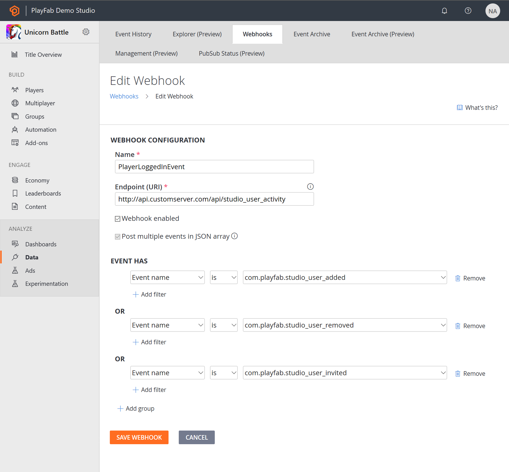

# PlayStream

PlayStream offers the following features to developers:

- **An event pipeline** which unifies the entire data flow from your game into a single data stream. The PlayFab Game Services will automatically insert events into PlayStream, and you can add custom events from your using our new WriteEvent API client and server methods. Our Marketplace Add-ons will also generate events automatically. Events are managed as JSON data.
- **A real-time rules engine,** which can evaluate complex rules in response to incoming events through PlayStream, and trigger a variety of actions, including CloudScript.
- **A real-time segmentation system,** which can group players into segments based on a variety of player properties. Segments are calculated in real-time and always up-to-date. Actions may be triggered automatically as players enter or exit segments.
- **Real-time visualization of event data,** including a real-time event debugger.
- The ability to send some or all of the events to **external web services via webhooks**. These can be configured automatically by installing Marketplace Add-ons, or configured manually to send events to your own servers.
- **An event archive** where you can filter, search, and view historical events, including event delivery history.

Let’s look at these features in more detail.

## PlayStream Event Pipeline and Monitor

The easiest way to see the event pipeline in action is through the PlayStream Debugger. You’ll notice the monitor as soon as you click on the PlayStream Monitor tab for your game.

The PlayStream monitor is a real-time stream of all the events for your game, including any custom events you choose to send, using our WriteEvent API methods. This is immensely valuable during development, as it gives you a way to immediately see what’s happening on the back end as you test out your client- and server-side code, linking you straight to the player accounts so that you can check them against the game logic you’re working on.

There are several clickable fields in each event. If you click the “(i)” information circle, you will see the raw event JSON data.

You can also click the player’s ID to jump straight to the player’s profile, and certain other events have other clickable fields.

## Player Segmentation and Actions

Using those events, you can set up segments which define players within your user base based upon most player properties. This all happens in real time -- there should be no perceptual lag, even at large scale. If you can tie an event to the thing you want to use as a differentiating factor, you can make a segment for it. And segments will apply retroactively to all players, based on the data in their profiles -- so if you define a segment of players where XP > 3,000, then every player with XP > 3,000 will now be in that segment.

This particular segment will be evaluated anytime the statistic called "Total_XPGained" changes. If the condition (> 3000) evaluates to true, then the player will enter the “High XP Players" segment, and the corresponding action(s) will be triggered -- in this case, it will send a push notification, and grants gold to the player. You can also trigger a different custom action(s) when the player leaves a segment, allowing you to make any other changes needed as a result.

There are a variety of basic actions available, including granting an item to the player, granting virtual currency, changing a statistic, banning a player, sending a player an email or sending a Push notification. You can also trigger custom CloudScript to be run instead.

## Rules and Actions

The same action system shown above can also be utilized to respond on specific events coming from your game.  For example, the following rule demonstrates how when a custom event (Client_StoreVisit) is seen, the player receives some virtual currency and receives a push notification thanking them for their visit.

Using rules and actions, you can affect LiveOps behaviors in your game without making any changes to the game client.

## Webhooks

You can also set up webhooks, such that some or all of the events going through PlayStream will get pushed out to an external service. For example, you could use this feature to call your own back end server on any player login, as follows:

PlayStream webhooks are POST calls to your provided endpoint, which pass along all the data for the event in the body of the call. Using this mechanism, you could then enable additional custom actions on your real-time data, using your own custom services.

## Event History

You can also access a historical archive of events. By default, events are kept for a certain period of time that depends on your service tier. You can view the event history in two places -- you can view all events for your title in the **PlayStream Event History** tab, or only events for a particular player on that player’s **PlayStream** tab.

You can click on a particular event to see details for that particular event, including its delivery history. This particular event below, for example, has been delivered to three different Marketplace Add-ons - **Appuri** (both legacy and current), and Segment.com.

## Getting Started With PlayStream

- [Actions and Rules](../actions-rules/index.md)
- [Segmentation](../../analytics/segmentation/index.md)
- [PlayStream Events](../../analytics/metrics/playstream-events.md)
- [Event History](../../analytics/metrics/event-history.md)
- [PlayStream Event Reference](../../../api-references/events/index.md)
