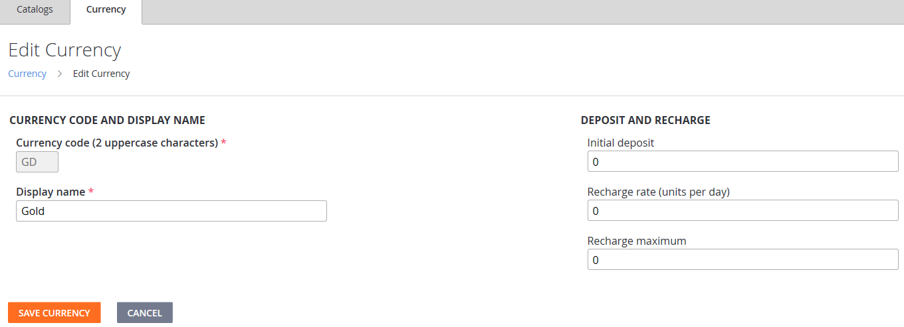

# Currencies

This tutorial describes the function of the **Currency** tab in the **Economy** section in **Game Manager**. From this tab, you configure the virtual currencies that you will use in your game.

Virtual Currencies are the foundation of in-game economies. Players and characters can be granted these currencies, which can then be used to buy or trade items. Items can have a cost in either a virtual currency or real money.

It's *exactly* like real life - except it's *virtual!* Economic regulation in-game is up to *you*.

## What is virtual currency?

Virtual currencies provide a medium of exchange for players to purchase virtual items and services from within a title.

Each title can support multiple arbitrary virtual currencies. This provides flexibility for your game to implement any medium of exchange you desire (e.g. gold, gems, hearts or interstellar credits).

After the initial setup, store and catalog items can be assigned prices corresponding to the virtual currencies.

Our Game Manager provides tools to make managing your virtual economy straightforward and reliable.

## Field reference

This section describes each field in the **Currency** section of the **Economy** area in **Game Manager**. These are the fields that you'll use to create and maintain the virtual currencies that make up your in-game economy.

All of these fields are present in the **New Currency** screen (shown below).

- **Currency code** and **Display name** are *required* fields with no default values. The other fields have a default value of **zero**.

- Leaving **Recharge rate** and **Recharge maximum** set to **zero** (default) will specify that this currency amount will not auto-regenerate.

  

### Currency code

**Currency code** is a *required* field. It represents the currency, and will be used in the other economy sections.

It must be a two-character code, and the convention is *all upper-case* (although a two-digit number is also allowed).

> [!NOTE]
> **RM** is reserved for Real Money and cannot be used as a Currency Code.

### Display name

**Display name** is a *required* field. It represents the name that is attached to the currency that is typically displayed to the user in your game.

The only restriction is that it must be *at least one letter long*. Common examples include **Gold** or **Space Bux**.

### Initial deposit

**Initial deposit** indicates how much of this virtual currency is given to each player when they first sign-up for a PlayFab account (which is typically the first time they play your game).

### Recharge rate (units per day)

**Recharge rate** is an *optional* field. It specifies how much of this virtual currency is granted to each player per day.

Virtual currency that is granted to the player via a recharge rate is granted to them *gradually*, and is evenly distributed over a 24 hour period.

### Recharge maximum

**Recharge maximum** is an *optional* field. It specifies the maximum amount of this virtual currency that can be granted to each player per day.

## Example

To create a virtual currency, use the following steps:

1. Select your **Game** in **Game Manager**.
2. Choose **Economy**.
3. Select **Currency**.
4. Choose **NEW CURRENCY**.
5. Set the **Currency code**. We'll use **GD** in this example.
6. Set the **Display name**. We'll use **Gold** in this example.
7. Set the **Initial deposit**. We'll use **1000** in this example. This gives new players **1,000 units** of this virtual currency when they begin the game.
8. By leaving the **Recharge rate** and **Recharge maximum** at the default value of **0** - we don't give the players any additional virtual currency every day, so we're done.
9. Select **SAVE CURRENCY**.

This returns you to the **Currencies** screen where you will see that your new virtual currency is added.

For any subsequent operations on your currency, such as deleting, renaming, or modifying the recharge values, select the **Code** or **Display name** of your currency to open the **Edit Currency** screen.

The grayed-out **Currency code** means your new currency has been saved.

  
