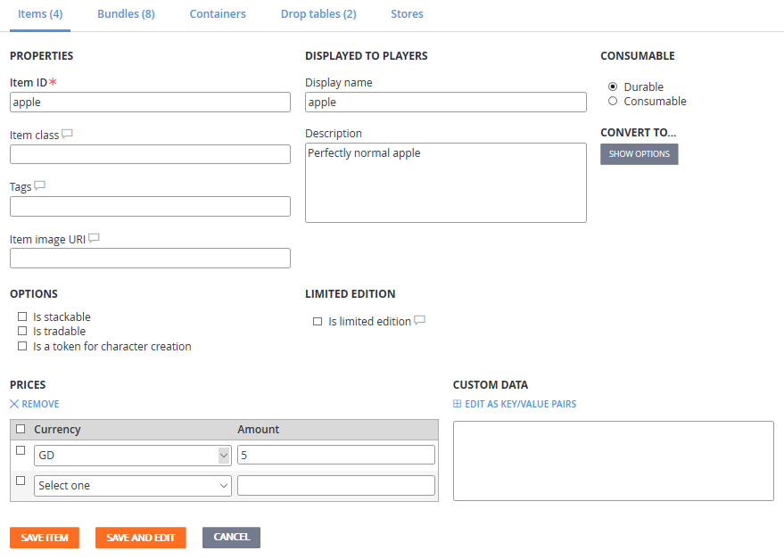

# Economy quickstart

Making monetization work is one of the biggest challenges of games. Playfab helps make this easy by building on top of three foundational pieces: Currencies, Items, and Inventory.

In this quickstart tutorial, you will:

1. Set up a virtual currency.
2. Create an item.
3. Add an item to a player inventory.
4. Learn next steps for customizing your economy.

## Set up a virtual currency

Virtual currencies are the foundation of in-game economies. Players and characters can be granted these currencies, which can then be used to buy or trade Items. Items can have a cost in either a virtual currency or real money. Each title can support multiple arbitrary virtual currencies. This provides flexibility for your Game to implement whatever medium of exchange you desire (e.g. gold, gems, hearts or interstellar credits).
 
1. Go to Economy and select Currencies.
2. Click New Currency and change these fields:
    Currency code (2 uppercase characters): "GD"
    Display name: "Gold"
3. Click Save Currency.

Now that currencies have been setup, store and catalog items can be assigned prices corresponding to the virtual currencies.

## Create an item

Many games offer the player items for purchase such as a shield, a level-unlock, or a power-up. These items are specified in a catalog. Before the player can purchase an item from any catalog, you must create the items with which you want to populate it.

To make a catalog with an item:

1. Go to Economy and select Catalogs.
2. Create a new catalog named "main." An item with the ID of "One" has been added automatically.
3. Click on One and change these fields:
    Item ID: "apple"
    Display name: "Perfectly normal apple"
4. At the bottom of the form is the Prices section, where you define how much an item costs in your           game's virtual currency.
5. Set the apple's price in gold ("GD") to 5.
6. Click Save Item.

## Add an item to a player inventory

Playfab’s catalog APIs support many strategies for item purchasing, such as simple real money or virtual currency purchases of items, triggered item grants based on buying another item, locked (with a potentially purchasable key) and unlocked boxes, random result tables, and non-purchasable items that are granted based on events within a game. In this quickstart we cover the virtual currency purchase use case.

1. In your game, call GetCatalogItems
    CatalogVersion: "main"
2. Verify that you see an "apple" with a "GO" price of 5.
3. Then call PurchaseItem to buy the apple.
    CatalogVersion: "main"
    ItemId: "apple"
    VirtualCurrency: "GO"
    Price: 5
4. Finally, call GetUserInventory and take a look at the player inventory. You should see an apple!

## Next Steps for Customizing your Economy

Once you have a Catalog with Items supported by Virtual Currencies, you can use light up your economy with all sorts of scenarios:

1. Real World Purchases: our Getting Started with In App Purchasing and our Non-Receipt Payment Processing    tutorials help you connect your virtual economy with existing stores
2. You can leverage your Catalog to create Bundles, Containers and Drop Tables. 
3. You can use Item attributes to define multiple prices and specify stackable, tradable, and limited         edition Items. 
4. Set up unique in-game vendors or Sales events using Stores and Sales.
5. Create some player Segments and use Stores to drive different item and bundle offers to your players       regardless of where they are in your game lifecycle:  Custom Stores for Player Segments
6. Verify your assumptions using A/B Testing 
7. Finally, gather economic data so that you can improve and iterate on your game using Playfab Reports
