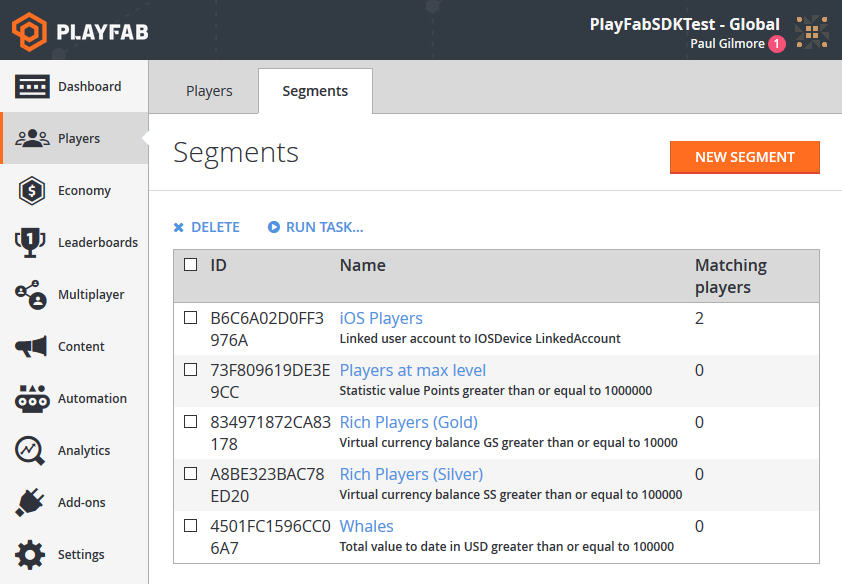

# Custom Stores for player segments

In our [Stores and Sales](stores-and-sales.md) tutorial, we demonstrate how to set up a store and make a few items available to a player at special or alternate prices.

In our [Player Segmentation](../../analytics/segmentation/index.md) overview, we describe how to group your players into segments, based on player information or behavior.

This tutorial lets you *combine* these features, and produce alternate stores available *only* to players from defined player segments.

First, we need some example segments, so here are some segments that are segmented-store-testing friendly.

  

For the next image, we will reuse the equipment store created in the [Stores and Sales](stores-and-sales.md) tutorial, and add player segmentation.

First, you must create each store separately, and give it an identifiable name. Each store should have content that is customized for that segment.

  

Finally, return to the base equipment store, and fill in the **Segment Overrides** section at the bottom (This section is *only visible* if there are defined **Player Segments**).

  

## Best Practices for Store Segmentation

- Store Segmentation is public information:
  - There are many ways for player to gain information about alternate stores.
  - Players naturally transition between segments, and they'll see those changes when they transition.
  - Players discuss content on forums, community sites, wikis, etc.
  - In the PlayFab **API**, store information is public unless you disable those **APIs** with our [API Access Policy](../../config/gamemanager/api-access-policy.md).
  - You should assume that players will be aware of other stores and their details.

- Provide varying content, *not* varying pricing:
  - Players will feel cheated if: 
    - If prices go up or down when they transition segments.
    - If prices described on wikis are different than their own.

  - The *only* exception to the pricing rule would be *first time* purchases:
    - You must secure the client **API** methods with our [API Access Policy](../../config/gamemanager/api-access-policy.md) to prevent multiple purchases, or make repurchasing less meaningful through game design.

- Content should be relevant to the segment:
  - Whales are willing to spend large amounts of real money, and thus are likely to buy more expensive bundles, if the value is worthwhile.
  - First time buyers may be given an option which is a particularly good deal, but can only be (usefully) obtained once.
  - End game players may only be interested in a specific subset of items.
