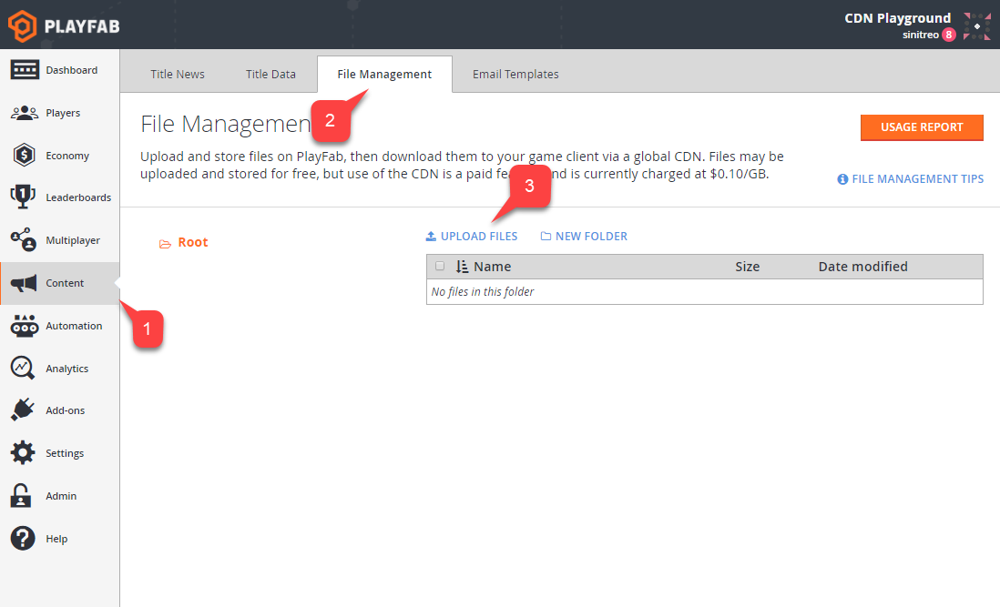
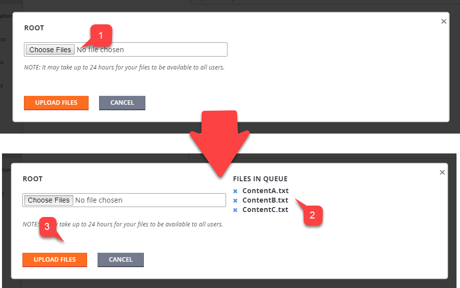

# Chapter 4 - Try out content management

Welcome to Chapter 4 of our tutorial [Getting Started with PlayFab](getting-started-with-playfab.md), the tutorial contains the following chapters:

[Chapter 1 - Get started with players and tournaments](get-started-with-players-and-tournaments.md)
[Chapter 2 - Set up your game's in-game economy](set-up-your-games-in-game-economy.md)
[Chapter 3 - Explore automation](explore-automation.md)
**Chapter 4 - Try out content management**

## Overview

Chapter 4 contains the following sections to help you try out content management:

[CDN](#cdn)
[Uploading assets](#uploading-assets)
[Fetching Assets](#fetching-assets)

## CDN

CDN stands for **C**ontent **D**elivery **N**etwork - an infrastructure to deliver assets (images, audio, binary content, etc) to the end user that focuses on speed and availability.

CDN costs are independent from your tier (Essentials, Professional, etc) and require a payment account to be set up with PlayFab. This can be done by entering your credit card information in the Admin->Billing tab of your title. CDN costs are based on your usage - see the Content->File Management tab for more information on this. Please, contact our [developer forum](https://community.playfab.com/) with questions.

PlayFab CDN stores individual assets as files uniquely identified by the file name, also referred to as a key. This implies that you add, update, remove, and retrieve assets by key.

PlayFab CDN allows segregating assets by folders. The folder path to the asset becomes part of the asset key. The following is a valid asset key stored inside the folder named 'Android': `Android/Image.png`.

When the user is fetching assets, their requests are automatically routed to the nearest edge location, so content is delivered with the best possible performance. This, however, can introduce delays into file management actions, like the following:

- **File uploading**: Your file will be available immediately.

- **File overwriting**: The old file will appear to users for up to 24 hours until it's overwritten with the new file.

- **File deletion**: The file will continue to exist for up to 24 hours while the delete command removes it from all edge locations.

## Uploading assets

Before your users are able to fetch an asset, it must be uploaded to the CDN. This can be done using Game Manager. Navigate to the "Content" tab **(1)**. Select the "File Management" sub-tab **(2)**. Click the "Upload Files" button **(3)**:

  

You may select multiple files **(1)**. Every file selected will appear in the list **(2)**. Submit your files by clicking the "Upload Files" button **(3)**:

  

Uploaded files will appear in the list **(1)**. Keep in mind that you may also manage folders: to create a folder, click the "New Folder" button **(2)**:

  

Fill in the folder name **(1)** and click "Create Folder" **(2)**:

  

This will create a new folder in the tree. You may then select this folder and upload the files normally:

  

Alternatively, you may upload assets via code using the Admin SDK. This is a two step process: first, you call [GetContentUploadUrl](https://api.playfab.com/documentation/admin/method/GetContentUploadUrl) and obtain the pre-signed URL that will authorize your upload. Then, use the URL to make a HTTP PUT request and provide your data, and (optionally) content type. Consider the following snippet that shows how to get a pre-signed URL:

```csharp
public void UploadFileToCDN(string key, byte[] content, string contentType = "binary/octet-stream") {
    GetUploadUrl(key, contentType, presignedUrl => {
        PutFile(presignedUrl, content, contentType);
    });
}

void GetUploadUrl(string key, string contentType, Action<string> onComplete) {
    PlayFabAdminAPI.GetContentUploadUrl(new GetContentUploadUrlRequest() {
        ContentType = contentType,
        Key = key
    }, result => onComplete(result.URL), 
    error => Debug.LogError(error.GenerateErrorReport()));
}

void PutFile(string presignedUrl, byte[] content, string contentType = "binary/octet-stream") {
    // Implement your own PUT HTTP request here.
    // - Must use PUT method
    // - Must set content type Header
}
```

You may then check the result through the PlayFab Game Manager and make sure the file is in the list.

## Fetching Assets

Downloading the asset via code is identical to uploading the asset: it is a two step process. First, you make a call to [GetContentDownloadUrl](https://api.playfab.com/documentation/client/method/GetContentDownloadUrl) and obtain a pre-signed URL that will authorize your download. You then use the  pre-signed URL to make a HTTP GET request and fetch the data. Consider the following snippet that shows the bare bones of the process:

```csharp
public void DownloadFileFromCDN(string key) {
    GetDownloadUrl(key, presignedUrl =>
    {
        GetFile(presignedUrl);
    });
}

void GetDownloadUrl(string key, Action<string> onComplete) {
    PlayFabClientAPI.GetContentDownloadUrl(new GetContentDownloadUrlRequest() {
        Key = key,
        ThruCDN = true
    }, result => onComplete(result.URL), 
    error => Debug.LogError(error.GenerateErrorReport()));
}

void GetFile(string preauthorizedUrl) {
    // Implement your own GET HTTP request here.
}
```

As mentioned above, CDN may involve latency in regards to file updates. During development it is sometimes useful to force fetch the latest, fresh files. The  [GetContentDownloadUrl](https://api.playfab.com/documentation/client/method/GetContentDownloadUrl) call allows you to set the "ThruCDN" parameter to false. The URL returned will then point to non-cached fresh files. (Your published game client should never use this option!)
