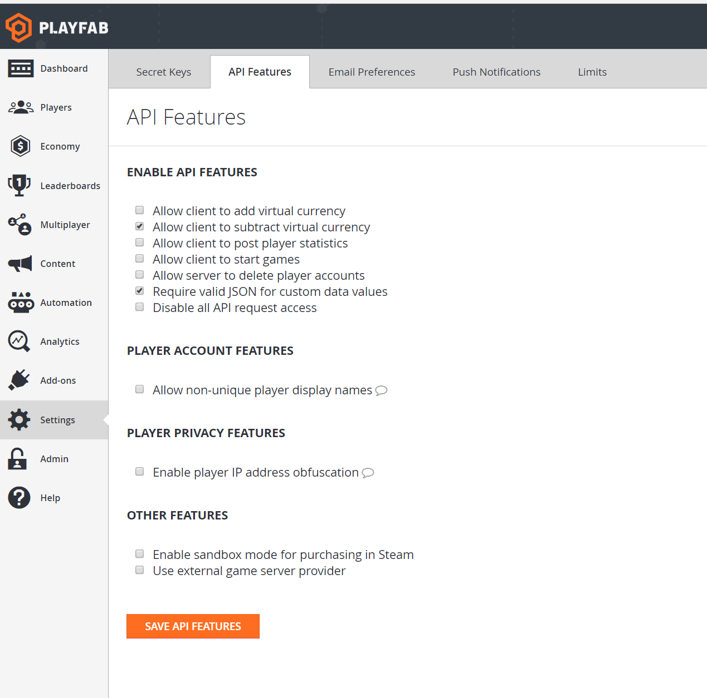
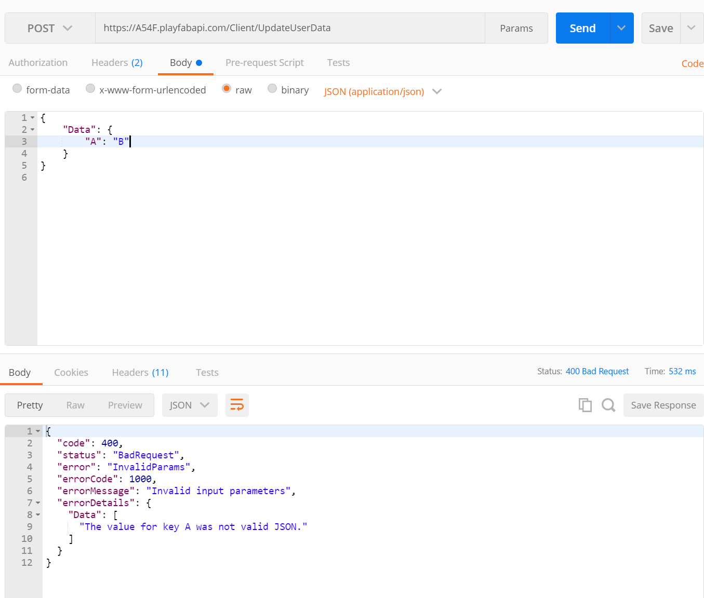
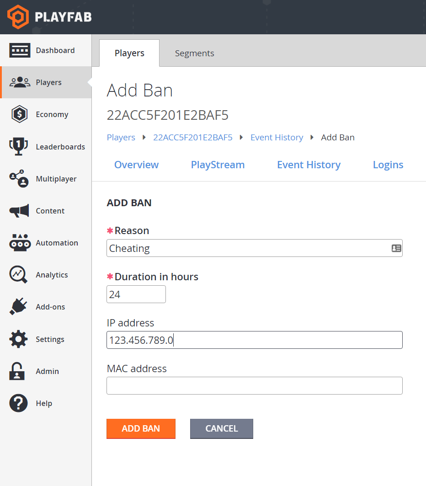

# API Feature Settings in the PlayFab Game Manager

The API Features in the PlayFab Game Manager are a handful of options for managing the behavior of PlayFab APIs for your title. These options give you the tools for managing access, privacy, and other features. The screen for configuring these options, is in the Game Manager, under Settings -> API Features

  

Some of these check-boxes are obvious, and some not so much. In this tutorial, we will go into detail about several of them.

> [!NOTE]
> Several screenshots and demonstrations in this tutorial utilize [Postman](../dev-test-live/executing-the-playfab-api-via-postman.md).

## Requiring valid JSON for custom data values

Hacked clients can cause serious problems for games. Rogue API callers posting badly formatted data can produce noise, bugs, and issues for developers. Players who have poorly formatted data will often require manual intervention to cleanup. Requiring valid JSON for custom data values will perform basic content type validation before data is saved to the database. Catching these problems early prevents these issues from lingering on, and stops hackers from interfering with normal development.

When this flag is set, it forces clients to pass in valid JSON for each key of their custom data. Simple JSON validation by itself won't prevent all issues, but can help weed out some bad behavior. Checking this option will require that each key saved across all custom data, including Player, Publisher, Character, Title, and Item data must be valid JSON. This flag can be toggled on or off at any time. But, it’s not retroactive. That is, existing values will not be affected. Only newly written values will be validated.

If you attempt to pass invalid JSON as a value, it will reject the request with an HTTP Status Code 400 "Bad Request".

  

## Disabling all API request access

Surprisingly, it can be useful to disable all API access to your title. If, for example, you are performing a sensitive migration with downtime, stray API requests could cause serious interruptions. If you are retiring your game, this will guarantee your game really is off. Keep in mind, marking this checkbox will LITERALLY BREAK YOUR GAME, so use it with caution.

Once you have decided you need to turn API access off, and you check this box, all API requests will begin to fail within a few minutes. PlayFab will return an HTTP Status Code 400 "Bad Request" indicating that the title has disabled such usage.

  

These HTTP Status Code 400 responses will persist until you un-check the box. Again, un-checking may take a few minutes to have effect.

## Enabling player IP address obfuscation

For many studios, owning Personally Identifiable Information (PII) is a liability best avoided. One common, and useful, form of PII is IP address. IP address is useful for a handful of reasons, including geo-location. However, the full accuracy of the IP is often considered PII. So, PlayFab can help limit this is by obfuscating parts of the IP addresses. Now, by checking a box, you can stop gathering this sensitive data.

After you check this box, PlayFab will always record “0” for the last octet of a player's IP. You can verify this is working by checking the login history for players in the Players tab. You should see that every IP ends in ".0". Note that any IPs that were recorded before IP address obfuscation was enabled will retain their full detail. So, if your game is PII sensitive, set this checkbox before you launch.

Be aware that enabling obfuscation will impact other features that use the IP address. In particular, IP based geo-location and player banning by IP are the two most directly impacted. PlayFab automatically performs IP based geo-location on logins. This helps you automatically learn about where on earth your players come from. However, you may experience reduced accuracy, particularly at the city level, when using obfuscated IPs. This is intentional, as the goal of obfuscating IPs is to avoid recording PII, including exact locations.

Additionally, obfuscating IPs can affect bans. When adding a ban, you can optionally ban an IP as well. Often banning by IP is more practical than banning one account at a time, because the bad actor can just make new accounts. Banning an IP prevents the bad actor from making new accounts from the same internet connection. In many cases, this is an effective tool. However, with obfuscated IPs, banning an exact IP cannot work. Instead, you must use a ban on an IP with ".0" as the final octet.

  

However, keep in mind this will effectively ban an entire IP range. This will still ban the bad actor, but other innocent players with similar IP addresses may be affected. Furthermore, existing precise IP bans will cease to be effective.