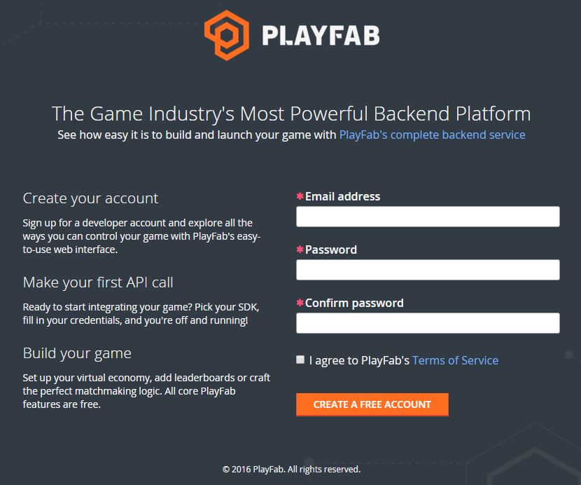
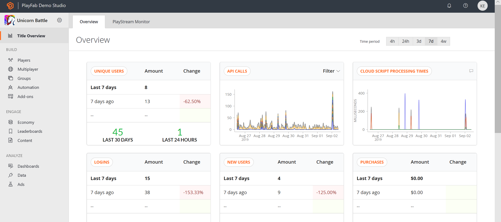
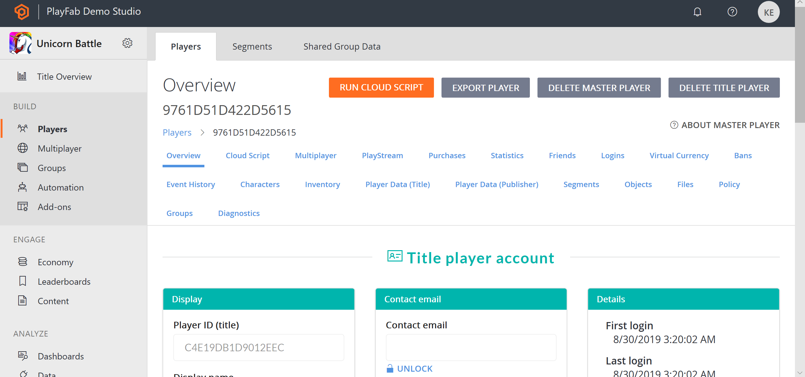
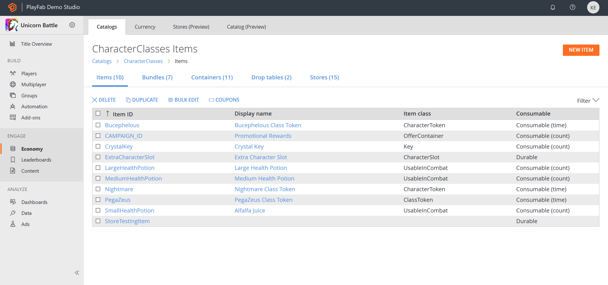
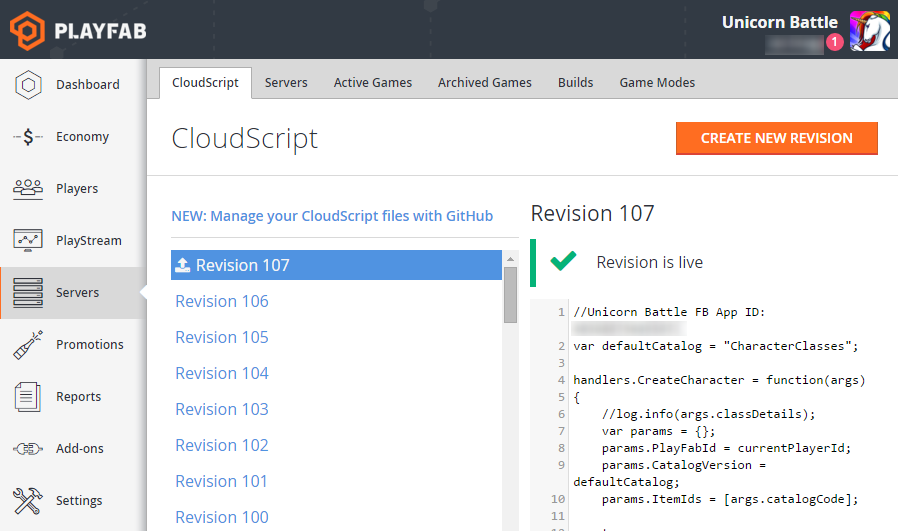
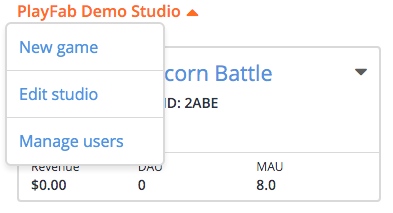
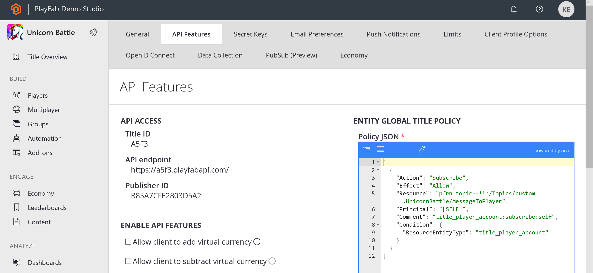
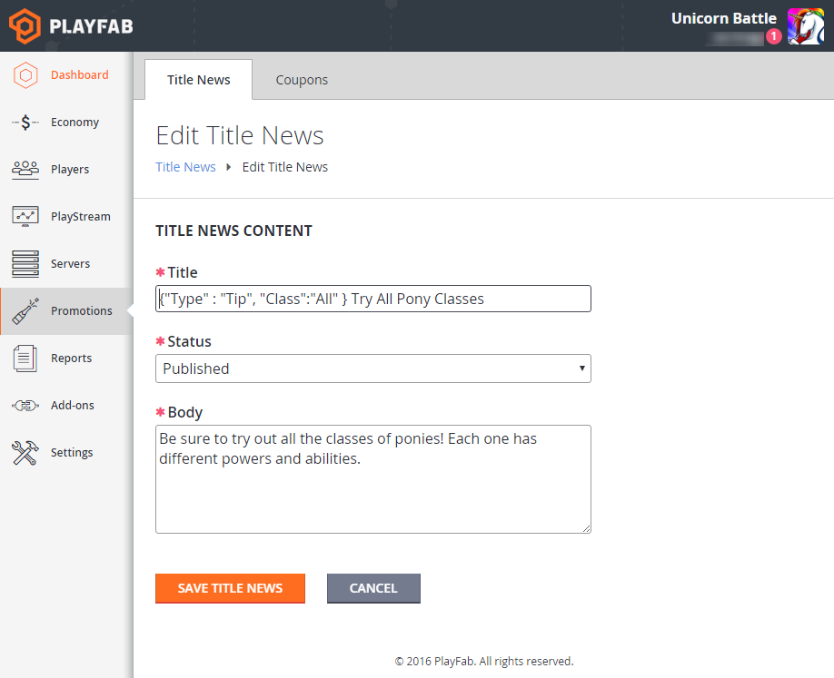

# Game Manager Tour

## Let's begin with the basics: Your Developer Account

Before you can call any PlayFab API, you must [have a PlayFab developer account](https://developer.playfab.com/en-us/sign-up). If you already have a PlayFab account, you can skip this step.

Once you have a PlayFab account, navigate to the PlayFab home page, [https://playfab.com](https://playfab.com), and log in.

Since PlayFab does not know the name of your game studio or the title of your game, initial values for these fields are assigned. **Unnamed Studio** is the default name of your game studio and **Unnamed Title** is the default title of your game, as shown in the following screenshot. You can rename these at any time.

Note the Title ID. This value is unique to your game, which we call a “Title”, and you will use this value when you make PlayFab API calls. (Your Title ID will not be BCFE)

Your first title is auto-generated by us.  If you need a new title later, you can create additional titles by clicking "Create a new game" (Don't do this yet).

The current title and user can be found in the top right. An admin menu appears when the user is clicked.

## Game Manager Sections

Now that you have an account, select a title (either the one we created or one of your own) to follow along. Within each title, the scope of a new Game Manager is distributed across the following major sections:

1. **Dashboard** - An overview of the performance of your title.
2. **Players** - Settings and Data pertaining to your individual players, including player segmentation.
3. **Economy** - Settings and Data pertaining to virtual items, stores, currencies and 'loot' distribution. Also stores and coupons.
4. **Leaderboards** - Configure leaderboard settings, and view current rankings.
5. **Multiplayer** - Configure server hosting, and view match records.
6. **Content** - Manage content for your game, including news, remote configuration, and files.
7. **Automation** - Server-side logic for your game, including scriptings, rules, and tasks. Trigger actions based on events from your title.
8. **Analytics** - View reports and event data for your game, and configure how data is routed to other systems.
9. **Add-ons** - The control center for managing partner integrations.
10. **Settings** - Settings and Data pertaining to the entire title.
11. **Admin** - Billing and audit history.

### 1. Settings

The credentials tab provides basic information that you will use to configure your SDK.

Never share your PlayFab API Secret Key with anyone; doing so may jeopardize your title's security.

- **Game Title ID**: The unique identifier for your title in the PlayFab system.
- **PlayFab API Endpoint**: The unique base URI for your title. API calls to this endpoint are tracked in your title’s reports.
- **PlayFab API Secret Key**: The unique identifier for your game when making Admin and Server API calls. This key should only be shared with trusted members of your development team, since it enables API calls that can affect game data and player accounts.
- **Publisher ID**: The unique identifier for your studio.

### 2. Dashboard
   
The Dashboard shows your game’s basic statistics and key performance indicators (KPIs). In the top left, you will find filter controls that limit the information displayed:

- *4h*: will load data generated within the last 4 hours
- *24h*: will load data generated within the last 24 hours
- *3d*: will load data generated within the last 3 days
- *7d*: will load data generated within the last 7 days
- *mtd*: will load data generated within the current month

You can see data for previous months in the [Reports Section](#reports).

> [!NOTE]
> In Game Manager, all times are displayed in local time.

Monitor your title's KPIs and watch your PlayStream events in real time.

The dashboard has six sections. Left to right, top to bottom they are the following.

1. **LOGIN**: The number of logins recorded for the selected time-span.
2. **INSTALL**: The number of accounts created (players logging in for the very first time) for the selected time-span.
3. **REVENUE**: The USD value of real-money transactions processed for the selected time-span.
4. **MONTH OVERVIEW**: Useful KPIs pulled from the month-to-date data
    - *Revenue*: the USD value of real-money transactions processed
    - *DAU (Daily Active Users)*: the average number of unique players logging in per day
    - *MAU (Monthly Active Users)*: the average number of unique players logging in per month
5. **PLAYSTREAM DEBUGGER**: Will display title events as they are generated in real-time.
6. **VIRTUAL CURRENCY TRANSACTIONS**: The number of virtual currency transactions recorded for the selected time-span.

[Back to Game Manager Sections](#game-manager-sections)

### 3. PlayStream

This section houses the control panel for everything that is PlayStream. Here you will find a graph of the PlayStream activity (filtered for the selected time-span). The stream debugger (like in other sections) displays title events as they are generated in real-time.

Use the sampling controls to gather more or less events per second.

PlayStream is our latest and greatest addition to the PlayFab platform. More information will be coming soon on what actions you can do with PlayStream.

[Back to Game Manager Sections](#game-manager-sections)

### 4. Players

The "Players" tab presents you with a sorted list by most recent login. Clicking any of the records will take you to that player's overview. Using the search box you can easily search for players by ID, username, display name, or email.

#### Player Overview

This detailed screen provides a wealth of insight into the player's activity. The Overview sub-menu contains many links to other player-centric information:

Tools your team can use to remedy defrauded players and identify potential abusers.

- **Overview**- View basic details and linked account status.
- **PlayStream**- View player generated events.
- **Logins**- View player login history.
- **Segments**- View which segments this player has entered.
- **Statistics**- View and edit player statistics.
- **Data**- View and edit player data records.
- **Inventory**- View, grant, and revoke ItemInstances.
- **Purchases**- View this player's real-money purchase history.
- **Virtual Currency**- View and edit player Virtual Currency (VC) balances.
- **Characters**- View player owned characters and edit basic details.
- **Multiplayer**- View player match history from multiplayer sessions.
- **Bans**- View player ban history.

#### Leaderboards

"Leaderboards", the second tab, displays all the active leaderboards for your title. PlayFab leaderboards are driven by your players' statistics. Clicking on a statistic will display the corresponding leaders.

Clicking a player name will take you to that player's overview.

The leaderboard reset frequency controls when one "season" begins and another ends. Our leaderboards can optionally to reset themselves hourly, daily, weekly and monthly. Clicking the orange "EDIT LEADERBOARD" allows you to edit your leaderboard's name as well as the reset frequency. 

**Additional Information:**

- [Using resettable statistics and leaderboards](../../social/tournaments-leaderboards/using-resettable-statistics-and-leaderboards.md)

[Back to Game Manager Sections](#game-manager-sections)

### 5. Economy

At the center of PlayFab Economies is the concept of Catalogs. Catalogs are a collection of items, currencies, stores, and droptables. This section provides all the tools needed to manage your game's virtual economy.

As an example, the following image shows Unicorn Battle's primary catalog.

- **Catalog Items** - An item within the catalog. Items can be of several different types.
- **Virtual Currencies** - Arbitrary trackers for the mediums that can be exchanged for Catalog Items.
- **Stores**- A subset of Catalog Items that can be set to prices that are different than those specified by the Catalog.
- **Drop Tables** - Control the item distribution when players open containers and bundles.

Clicking on any Catalog Items opens a detailed editor for the item properties.

The following example shows the Edit Currency page for the Unicorn Battle's VC called "Hearts". The settings show that it is being used as a "lives" mechanic that regenerates every hour.

**Additional Information:**

- [Catalogs Tutorial](../../commerce/items/catalogs.md)
- [Currencies Tutorial](../../commerce/economy/currencies.md)

[Back to Game Manager Sections](#game-manager-sections)

### 6. Servers

PlayFab works with many architectures and game types. Whether you are looking to hosting multi-player matches or just need a secure environment that can reduce many common forms of hacking and abuse.

Cloud Script offers an excellent alternative when compared with the overhead of dedicated game servers.

The servers section of the Game Manager has two major roles:

1. The main interface for uploading CloudScript files.
2. A control panel for your hosted multiplayer servers.

**Additional Information:**

- [Using CloudScript Tutorial](../../automation/cloudscript/using-cloudscript.md)
- [Building Custom Game Servers Tutorial](../../multiplayer/compute/custom-game-servers)

[Back to Game Manager Sections](#game-manager-sections)

### 7. Promotions

The "Promotions" section offers tools for engaging with your players.

The following example shows the active news articles within Unicorn Battle.

[Back to Game Manager Sections](#game-manager-sections)

### 8. Add-ons

We have many great vendors that each bring something unique to the table. We could tell you all about it here, but its better if you see it for yourself.

- To configure marketplace integrations for your title: Explore the add-ons section of the Game Manager for details on the various add-ons

  

Setup instructions for Each Add-on may vary. Additional billing information may also be required.

[Back to Game Manager Sections](#game-manager-sections)

### 9. Reports

PlayFab generates reports that capture daily and monthly activity. Currently, there are three reports available to all developers:

- *Daily Overview Report*: Reports the daily KPIs for your title.
- *Monthly Overview Report*: Reports the aggregated KPIs for the month.
- *Monthly Top Spender Report*: Reports the month's top paying players.

For additional or custom reports, please open a Feature Request in our [community forums](https://community.playfab.com/spaces/24/index.html).

[Back to Game Manager Sections](#game-manager-sections)

## Basic Actions

### Editing Profile Settings

1. Open the Admin menu by clicking on the current user. Then click "Edit profile".
2. Here you can specify your name, set a password, add a telephone number, set your time zone, and specify whether you want to enable two-factor authentication.
3. Save your changes and return to the studios page.

- **Two-factor authentication** - Two-factor authentication improves the security of your developer accounts by requiring a code to be supplied when logging in.

### View PlayFab Notifications

New notifications will be called out with a pink delimiter containing the number of new notifications.

1. Open the Admin menu by clicking on the current user. Then click "News".
2. Here you can view the published notifications.

Notifications include information on new features, API updates, and service outages.

### Create and Edit Studios and Titles

#### To add a new studio

1. Click the orange "NEW STUDIO" button in the top right of the studios page.
2. Enter a studio name.
3. Save your changes and return to the studios page.

#### To edit an existing studio

1. Click the down-arrow next to your studio's name, and then click "Edit studio".
2. Make your edits.
3. Save your changes and return to the studios page.

#### To add a new title

1. Click the create a new game button under your existing titles.
2. Enter your title details. Optionally, this information can be added after title creation.
3. Save your changes and return to the studios page.

#### To edit an existing title

1. Click the down-arrow next to the title you wish to edit and click "Edit game".
2. Make your edits.
3. Save your changes and return to the studios page.
    - **Title** - An individual instance of a game within PlayFab.
    - **Studio** - A group of titles that can share data and developer access.

### Manage Developer Accounts

Developer accounts are special PlayFab accounts permitting access to one or more sections on one or more titles of a given studio.

1. Click the down-arrow next to your studio's name, and then click "Manage users".
2. Add developer accounts using the orange "NEW USER" button in the top right.
3. Remove developer accounts by checking the box next to the account and then clicking the "X DELETE" link in the top-left, above the user table.

If you do not already have a PlayFab developer account, an email will be sent to the address you provided. Upon confirmation, the new account will have access to the title.

## Settings Actions

### Toggle API Features

The API Features tab provides optional permissions that affect what an API set has permission to do. By default, all options are off. Enabling these features will allow your title to be client authoritative at the expense of security.

Select your preferred permissions and click "Save API Features".

### View and Edit Title Data

Title Data is accessible from all API sets by all users. This makes Title Data an ideal place to store your custom title settings. In the example below, we store: quests, enemy encounter details, achievement thresholds, events and sales data, and more.

We provide tall and short views that make viewing text blobs easier.

#### Add or Edit Title Data Keys

1. Enter text for your key (keys must be unique).
2. Enter text for your value (accepts strings up to 10KB).
3. Save your changes with the orange "SAVE TITLE DATA" button under the data table.

#### Remove Title Data Keys

1. Check the box that corresponds to the row(s) that you wish to remove.
2. Click the "X Remove" link in the top-left, above the user table.
3. Save your changes with the orange "SAVE TITLE DATA" button under the data table.

### Update Account Permissions and View Audit History

The permissions tab displays an account table containing all of the developer accounts with access to the current title. Users are added and removed at the studio level, but individual permissions are set on a per-title level. This flexibility enables you to provide your team with variable access depending on their role.

#### Update Account Permissions

1. Click on the account you wish to edit.
2. Select the appropriate permissions (note: admins have view and edit permissions for all sections).
3. Save your changes with the orange "SAVE PERMISSIONS" button under the permissions list.

You can set viewing and editing restrictions for virtually every section within the Game Manager.

#### Track changes across your title

Every action taken within the Game Manager is logged for posterity. Check the "Audit History" tab to see what changes have been recently made.

Click on any change to view the complete details.

## Promotions Actions

### View or Edit Title News

1. Select an old news item to edit or create a new one by clicking "NEW TITLE NEWS".
2. Enter a **Title**, set the **Status** to published and enter your text into the **Body** field.
3. Click "SAVE TITLE NEWS" and your news is now ready for the client to recieve.

Title news makes a great tool for in-game tips or message-of-the-week style communication.

### Generate Coupon Codes

1. Select your primary catalog and the item id for the item you wish to grant.
2. Select the appropriate quantity and hit "GENERATE COUPONS"
3. Game Manager will generate the codes in a downloadable .csv file

This coupon tool works great for generating the digital rewards for "backers" and testers.