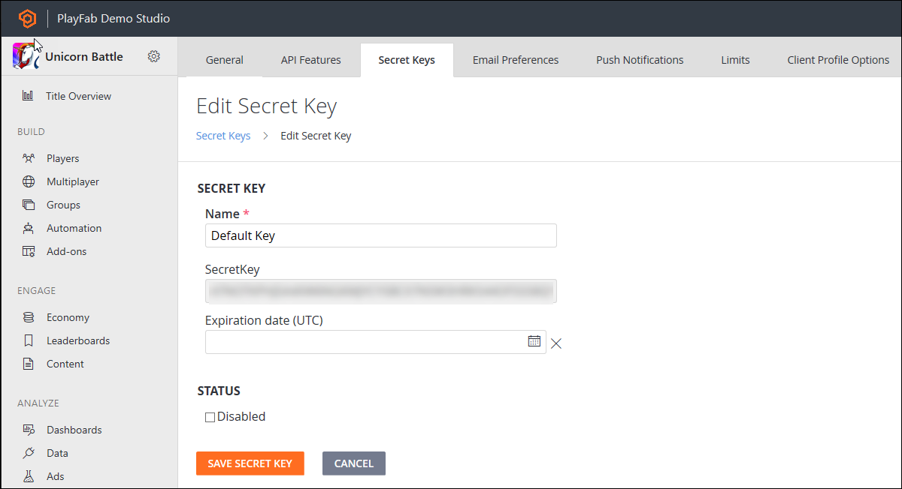

# Secret Key management

**PlayFab** has introduced a feature for managing **Secret Keys**.

**Keys** can now be created, deleted, disabled, and set to expire. This lets you rotate the **Secret Keys** for your **Titles**, which was previously quite hard to do. It *also* allows you to grant temporary access to your **Titles**.

Now, on the **Settings** -> **Secret Keys** tab in **Game Manager**, you will see a list of your **Keys**.

On this list you’ll find options for deleting **Keys**, the status of each **Key**, the **Key's Name**, **Value**, and **Expiration** time, if it has one. This table lets you audit the **Keys** that are available.

  

You can rename, enable, disable, or set expirations for existing **Keys** via the **Dashboard**. Selecting a **Key**, you see options for these. Each **Title** will start with a default **Key**.

To rotate your **Keys**, perform the following steps:

1. Create a new **Key**. Here, you will enter the **Name** of the **Key**, and an optional expiration time.
2. Change your code to use your new **Key** instead of the old **Key**,
3. Disable your old **Key**.

> [!NOTE]
> Even if, for some reason, your old **Key** was compromised, this rotation will leave your **Title** in a secured state.

- This flow is zero-downtime, and each stage can be rolled back safely. If there are issues at step one, you can simply delete your new **Key**. No one should be using it.

- At step two, both **Keys** are active, so you can roll your code forward or back safely.

- At step three, you can re-enable the **Key** while you fix whatever was still depending on it.

Once this whole process is complete, you *do not* need to delete the old **Key**. If you delete that **Key**, it cannot be recovered. The delete is permanent, and irrevocable.

  

Expiring **Keys** can be useful for giving someone temporary access to your **Title**.

If you have a contractor working on your game, you can give them **Keys** that only have access for as long as you expect them to need it. Expiration times can be changed, though, to extend the lifetime of a **Secret Key**.