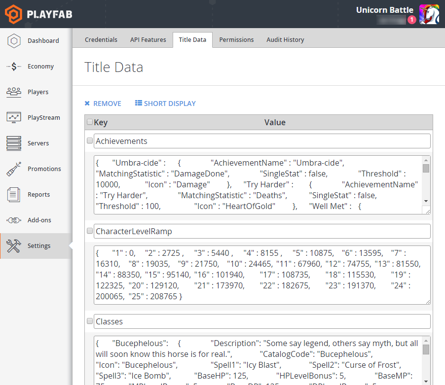

# Title Data Quickstart

This Quickstart describes how to programmatically create and use title data. This an important topic because storing a game's configuration data remotely, on the server, where it can be changed at any time, is one of the most basic reasons to use a service like PlayFab.

Title data is represented as key/value pairs (kvps) that can only be associated with a specific title.

> [!NOTE]
> Title data values are copied and distributed to potentially hundreds of machines in the PlayFab cluster server. As part of this process, title data is cached and changes may take up to fifteen minutes to refresh in those caches. Title data is best suited for "global constant/static data", and is not suitable or reliable as "global variables".

## Getting title data

### From the game client

Use [GetTitleData](xref:titleid.playfabapi.com.client.title-widedatamanagement.gettitledata) from the PlayFabClientAPI to get the kvps for a specific title. The following code example displays the values of all of the title data.

```csharp
public void ClientGetTitleData() {
    PlayFabClientAPI.GetTitleData(new GetTitleDataRequest(),
        result => {
            if(result.Data == null || !result.Data.ContainsKey("MonsterName")) Debug.Log("No MonsterName");
            else Debug.Log("MonsterName: "+result.Data["MonsterName"]);
        },
        error => {
            Debug.Log("Got error getting titleData:");
            Debug.Log(error.GenerateErrorReport());
        }
    );
}
```

### From the game server

Use [GetTitleData](xref:titleid.playfabapi.com.server.title-widedatamanagement.gettitledata) from the PlayFabServerAPI to get the kvps for a specific title. The following code example displays the values of all of the title data.

```csharp
public void ServerGetTitleData() {
    PlayFabServerAPI.GetTitleData( new GetTitleDataRequest(),
        result => {
            if (result.Data == null || !result.Data.ContainsKey("MonsterName")) Debug.Log("No MonsterName");
            else Debug.Log("MonsterName: " + result.Data["MonsterName"]);
        },
        error => {
            Debug.Log("Got error getting titleData:");
            Debug.Log(error.GenerateErrorReport());
        });
}
```

## Setting title data

It is unlikely that title data will change very frequently. For most situations, you should use your title data for static data that is mostly unchanged for the life of the title. You can set title data by using the Game Manager or by a server API function. After the title data is set for initial release, most titles will not make significant changes from that point.

### Setting title data using Game Manager

To add data to a title, perform the following steps.

1. Open the title in Game Manager.
2. Click Content, then Title Data.
3. Click Add Item.
4. Enter a value for the Key and a value for the Value. Both the key and the value are stored as strings.
5. Click SUBMIT to save the new data item.

  

### Setting title data by calling the server API in C#

The [SetTitleData](xref:titleid.playfabapi.com.server.title-widedatamanagement.settitledata) API is a server API that you must call from a dedicated server. You can only set one title data kvp in each call to SetTitleData.

```csharp
public void SetTitleData() {
    PlayFabServerAPI.SetTitleData(
        new SetTitleDataRequest {
            Key = "MonsterName",
            Value = "Dorf"
        }, 
        result => Debug.Log("Set titleData successful"),
        error => {
            Debug.Log("Got error setting titleData:");
            Debug.Log(error.GenerateErrorReport());
        }
    );
}
```

## Internal title data

Similarly to UserData, title data has internal storage that is hidden from the client. This data can also be set in the Game Manager, or via a server API.

### Getting Internal title data by calling the server API in C#

```csharp
public void GetTitleInternalData()
{
    PlayFabServerAPI.GetTitleInternalData( new GetTitleDataRequest(),
        result => {
            if (result.Data == null || !result.Data.ContainsKey("PlayFab")) Debug.Log("No PlayFab");
            else Debug.Log("PlayFab: " + result.Data["PlayFab"]);
        },
        error => {
            Debug.Log("Got error getting titleData:");
            Debug.Log(error.GenerateErrorReport());
        }
    );
}
```

### Setting Internal title data by calling the server API in C#

```csharp
public void SetTitleInternalData() {
    PlayFabServerAPI.SetTitleInternalData(
        new SetTitleDataRequest {
            Key = "PlayFab",
            Value = "{ \"Status\": \"Secretly Awesome\" }"
        }, 
        result => { Debug.Log("Set titleData successful"); },
        error =>
        {
            Debug.Log("Got error setting titleData:");
            Debug.Log(error.GenerateErrorReport());
        });
}
```

## See Also

- [Using Publisher Data](../../config/titledata/using-publisher-data.md)
- [Using Player Data](../../data/playerdata/using-player-data.md)
- [CloudScript Quickstart](../../automation/cloudscript/cloudscript-quickstart.md)
