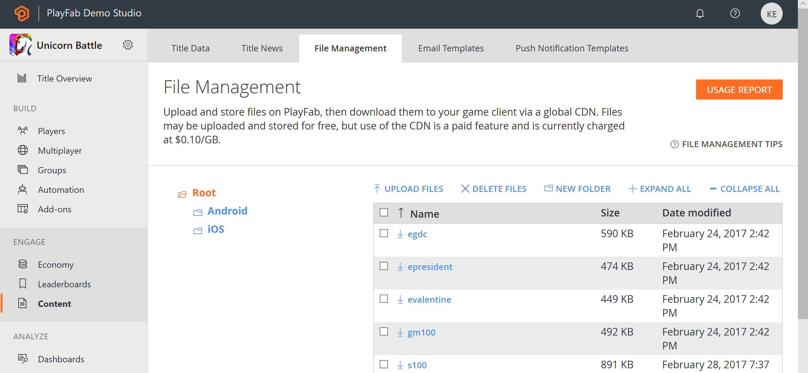

# Content Delivery Network quickstart

The **Content Delivery Network** (**CDN**) is an infrastructure used to deliver **Assets** (images, audio, binary content, etc) to the end user that focuses on speed and availability.

**CDN** costs are independent from your tier (**Essentials**, **Professional**, etc.) and require a payment account to be set up with **PlayFab**.

This can be done by entering your credit card information in the **Admin**->**Billing** tab of your **Title**. **CDN** costs are based on your usage.

> [!NOTE]
> Please use the **Content**->**File Management** tab for more information on this subject, or contact our [developer forum](https://community.playfab.com/) with any questions that you may have.

**PlayFab CDN** stores individual assets as files uniquely identified by the **File Name**, also referred to as a **Key**. This implies that you add, update, remove, and retrieve **Assets** by **Key**.

**PlayFab CDN** allows segregating **Assets** by **Folders**. The **Folder** path to the **Asset** becomes part of the **Asset Key**.

The following example is a valid **Asset Key** stored inside the **Folder** named **Android**.

 `Android/Image.png`.

When the user is fetching **Assets**, their requests are automatically routed to the nearest edge location, so content is delivered with the best possible performance.

This, however, can introduce delays into file management actions, like those found in the following examples:

- **File uploading**: Your file will be available immediately.

- **File overwriting**: The old file will appear to users for up to 24 hours until it's overwritten with the new file.

- **File deletion**: The file will continue to exist for up to 24 hours while the delete command removes it from all edge locations.

## Uploading Assets

Before your users are able to fetch an **Asset**, it must be uploaded to the **CDN**. This can be done using **Game Manager**:

- Select **Content** from the menu on the left **(1)**.
- Choose the **File Management** tab **(2)**.
- Then select the **Upload Files** button **(3)**.

  

You may:

- Select multiple **Files (1)**.
- Every file selected will appear in the list **(2)**.
- Submit your **Files** by selecting the **Upload Files** button **(3)**.

  

- Uploaded **Files** will appear in the list **(1)**.
- Keep in mind that you may also *manage* **Folders**. 
  - To create a **Folder**, select the **New Folder** button **(2)**.

  

- Fill in the **Folder** name **(1)**.
- Select the **Create Folder** button **(2)**.

  

This will create a new **Folder** in the tree. You may then select this **Folder**, and upload the **Files** normally.

  

Alternatively, you may upload assets via code using the **Admin SDK**. This is a two step process:

1. First, call [GetContentUploadUrl](xref:titleid.playfabapi.com.admin.content.getcontentuploadurl) and obtain the pre-signed **URL** that will authorize your upload.
2. Then, use the **URL** to make a **HTTP PUT** request and provide your data, and (optionally) content type.
 
Consider using the snippet provided below that shows how to get a pre-signed **URL**.

```csharp
public void UploadFileToCDN(string key, byte[] content, string contentType = "binary/octet-stream") {
    GetUploadUrl(key, contentType, presignedUrl => {
        PutFile(presignedUrl, content, contentType);
    });
}

void GetUploadUrl(string key, string contentType, Action<string> onComplete) {
    PlayFabAdminAPI.GetContentUploadUrl(new GetContentUploadUrlRequest() {
        ContentType = contentType,
        Key = key
    }, result => onComplete(result.URL), 
    error => Debug.LogError(error.GenerateErrorReport()));
}

void PutFile(string presignedUrl, byte[] content, string contentType = "binary/octet-stream") {
    // Implement your own PUT HTTP request here.
    // - Must use PUT method
    // - Must set content type Header
}
```

You may then check the result through the **PlayFab Game Manager**. Make sure the **File** is in the list.

## Fetching Assets

Downloading the **Asset** via code is identical to uploading the **Asset**. Again, it is a two step process.

1. First, make a call to [GetContentDownloadUrl](xref:titleid.playfabapi.com.client.content.getcontentdownloadurl) and obtain a pre-signed **URL** that will authorize your download.
2. You then use the  pre-signed **URL** to make a **HTTP GET** request and fetch the data.

Consider using the snippet provided below that shows the bare bones of the process.

```csharp
public void DownloadFileFromCDN(string key) {
    GetDownloadUrl(key, presignedUrl =>
    {
        GetFile(presignedUrl);
    });
}

void GetDownloadUrl(string key, Action<string> onComplete) {
    PlayFabClientAPI.GetContentDownloadUrl(new GetContentDownloadUrlRequest() {
        Key = key,
        ThruCDN = true
    }, result => onComplete(result.URL), 
    error => Debug.LogError(error.GenerateErrorReport()));
}

void GetFile(string preauthorizedUrl) {
    // Implement your own GET HTTP request here.
}
```

As mentioned above, **CDN** may involve latency in regards to **File** updates. During development it is sometimes useful to force fetch the latest, fresh **Files**.

The  [GetContentDownloadUrl](xref:titleid.playfabapi.com.client.content.getcontentdownloadurl) call allows you to set the **ThruCDN** parameter to **False**. The **URL** returned will then point to non-cached fresh **Files**.

> [!NOTE]
> Your published **Game Client** should *never* use this option!

