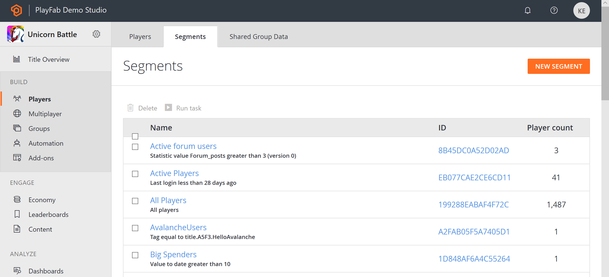
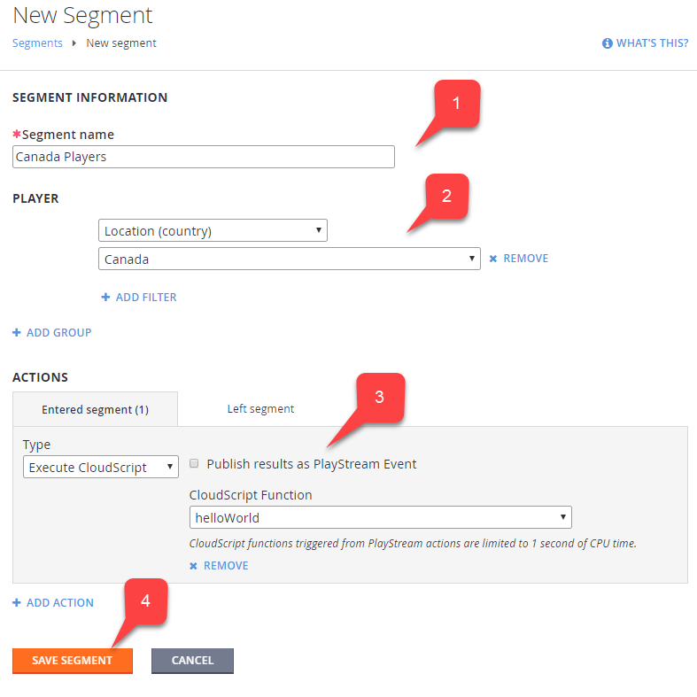

# Player segment configuration

The segment configuration page allows you to configure new or existing segments. You can:

- Adjust the name.
- Define the filters.
- Assign tasks.

Each segment allows you to define useful or interesting groups of players, and perform exclusive actions on that group.

## How to create or access a segment

To access segment configuration:

- Go to the menu on the left of your screen and select **Players (1)**.
- Then select the **Segments** tab **(2)**. You can then opt to:

- To use the **New Segment** button **(3)** to create and configure a new **Segment**.
- Locate an existing **Segment** and select its **Name** label **(4)** to configure the **Segment**.

  

## How to configure a segment

### Prerequisites

Some things must preexist for you to configure a segment. There must be:

- Players with and without a distinctive characteristic defined in PlayFab.
- A defined **CloudScript PlayStream** hook.

> [!NOTE]
> For more about this, see [Using CloudScript actions with PlayStream](../../automation/actions-rules/using-cloudscript-actions-with-playstream.md).

### Configuring

In this example we are going to:

- Configure a segment using the defining characteristic: all players that come from Canada.
- Run a **CloudScript** function **helloWorld** for each player that enters the segment.

A *defining characteristic* of a player might be a:

- Login time
- Linked device type
- Tags
- A real-world location
- Their statistic values
- Their virtual currency values
- Real money purchases, etc.

> [!Note]
> Player country is only one of your *many* possible options, and is only required for this example. Feel free to replace the country requirement with another filter of your choice.

When a segment is defined, you have a variety of action options to run when a player enters or leaves the segment.

 **CloudScript** is by far the most flexible action, granting you full control of the player and segment information at the time of segment-transition.

Use the second parameter - *context* - in your [CloudScript handler](../../automation/actions-rules/using-cloudscript-actions-with-playstream.md) to identify the player and segment transition. Afterwards, you can perform any action you wish for the player, such as granting [inventory items](../../data/playerdata/player-inventory.md), [virtual currency](../../commerce/economy/currencies.md), [player data](../../data/playerdata/quickstart.md), or [statistics](using-player-statistics.md).

In our example shown here, the segment configuration requires 4 simple steps.

1. Assign an appropriate **Segment name (1)** (in our example, that's **Canadian Players**).

1. In the **Player (2)** area, assign any conditions that the **Player** must meet to enter the segment. (In our example, we want a **Location: country** filter with a strict value: **Canada**.
1. In the **Type** area, add an **Execute CloudScript (3)** action for the entered segment trigger.
1. Configure the action to run the function we want (**helloWorld (3)**).
1. Use the **Save Segment** button **(4)** to commit your activities.

  

## Advanced segment filtering

Segment filtering allows you to define what players are included in the segment.

Formally speaking, area **(1)** on the left of the screen shown below is a set of **Players** that belong to at least one group.

**Group (2)** is a set of players that meet all defined conditions, called **filters (3)**.

  

So to be part of a segment:

- A player must be part of at least 1 group.

     - To be part of a group, a player must meet all conditions (filters).
     - This is denoted by the OR/AND operators: 
          - Filters are combined using the AND operator.
          - Groups are combined using the OR operator.

The screenshot shown above is an example of how a segment can be defined. This segment consists of 2 groups:

1. The first group is defined by 2 filters:

     1. A player must be from Canada.
     1. And must have **Apple** push notifications enabled.
1. The second group is *also* for players from Canada, but they must have **Google** push notifications enabled.

In the end, we have a segment of players from Canada with either **Google** or **Apple** push notifications.

Each filter has a unique configuration and purpose. As of 4/30/2017 the following filters are available:

- **All Players** filter - This filter has no configuration and is unique, because it allows you to create a segment of all players. This comes in handy when you want to run automatic operations for every new player (segment actions are described later in this tutorial).

- **First login (date)** filter - Allows you to filter based on the first login datetime (example - players that have first logged in after 1/1/2017).
- **First login (timespan)** filter - Allows you to filter based on first login timespan relative to the current datetime (example - players that have first signed in 20 minutes ago [from now]).
- **Last login (date)** filter - Allows you to filter based on the last login datetime (example - players that have not signed in since 1/1/2017).
- **Last login (timespan)** filter - Allows you to filter based on the last login timespan relative to the current datetime  (example, players that have not signed in for a week [from now]).
- **Linked user account to** filter  - Allows you to filter based on the users' linked accounts (example - players that have a **Steam** account linked with email).
- **Location (country)** filter - Allows you to filter based on a player's country (example - players from Canada).
- **Push notifications enabled with** filter - Allows you to filter based on player push notification settings and capabilities (example - players that have **Google** push notifications enabled.
- **Statistics value** filter - Allows you to filter based on your own custom statistic attribute (example - players that inflicted 20000 damage in total).
- **Tag** filter - Allows you to filter based on whether a player has or doesn't have a certain tag (example - players that have a *cheater* tag).
- **Total value to date in USD** filter - Allows you to filter based on how much USD currency a player spent in your game (example - players that have spent over $30.
- **Value to date** filter - Allows you to filter based on how much of a certain currency a player spent in your game (example - players that have spent 50 RUB).
- **User Origination** filter - Allows you to filter based on the first authentication method that a player used to start playing the game.

> [!NOTE]
> The trick here is that a player may start with authentication based on, say, an **iOS Device ID**. Later, a player may have a **GameCenter** account linked. In this case, the player origination will be the **iOS Device ID** (example, players that first signed in using an **iOS Device ID**).
- **Virtual currency balance** filter - Allows you to filter based on a player's custom virtual currency deposit (example -  players that have less than 50 Crystal).

## How to manage actions

Each action needs a *trigger* in order to run. Some actions are run manually, triggered right from the page.

But sometimes, *you* have to select a trigger - an event that causes an action to run. A trigger defines the context of the action.

For example, the Player Entered Segment Trigger passes you the context containing a reference to the player.

The general workflow for the **Actions** panel is the following:

1. Select an **event condition (1)** a.k.a a *trigger*.

2. Select the **Type** of action.

> [!NOTE]
> PlayFab offers a variety of actions. If, at any point, you need a more flexible action, consider a **CloudScript** action. This action type allows you to run your own **CloudScript** function.

3. **Configure the action (3)** (specific for each action type).

4. **Remove an action (4)** from the trigger.
5. Use **Add Action (5)** to add an action to the trigger.

  

## How to inspect player segments

It is possible to look up what segments a player belongs to by means of the **Player Segments** page.

To access **Player Segments**:

- Select **Players** in the sidebar menu **(1)**.

- Then select the **Players** tab **(2)**. 
- Locate the **Player** you want to inspect, and select the **ID** label **(3)**.
- Finally, select **Segments** in the **Players Toolbar (4)**.

  

On the **Player Segments** page, you will see the following:

- The **Player ID (1)** label identifies the player that you are currently inspecting.

- The **Segment** table contains a list of all the segments that a player belongs to.
- Select the **Segment name** label **(2)** to configure the segment.

  
