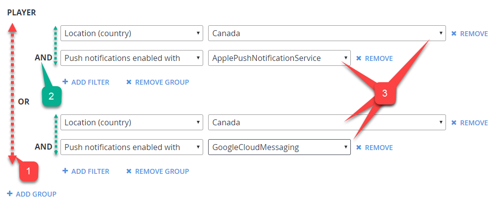
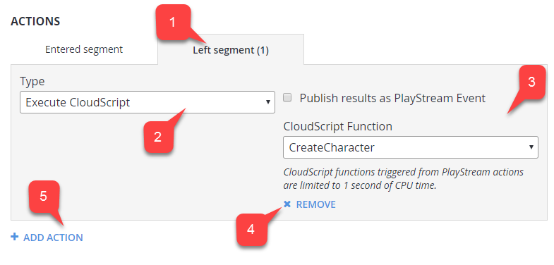

# Player Segment configuration

The Segment configuration page allows you to configure new or existing segments: adjust the name, define filters, and assign tasks. Each segment allows you to define useful or interesting groups of players, and perform exclusive actions on that group.

## How to create or access a segment

To access Segment configuration, navigate to the "Players" tab **(1)**. Then select the "Segments" sub-tab **(2)**. Then, you can choose:

- To use the "New Segment" button **(3)** to create and configure a new segment.
- Locate an existing segment and click it's name label **(4)** to **configure the segment**.

  

## How to configure a segment

### Prerequisites

- Players with and without a distinctive characteristic defined in PlayFab.
- A defined CloudScript PlayStream hook. For more about this, see [Using CloudScript actions with PlayStream](../../automation/actions-rules/using-cloudscript-actions-with-playstream.md).

In this example we are going to:

1. Configure a segment using the "**defining characteristic**" - all players that come from Canada.
2. Run a **CloudScript function** "helloWorld" for each player that enters the segment.

The "**defining characteristic**" of a player can be among: Login time, Linked device type, tags, real-world location, statistic values, virtual currency values, or real money purchases, and more. Player country is one of the many possible options, and is only specifically required for this example. Feel free to replace the country requirement with another filter of your choice.

When a segment is defined, you have a variety of action options to run when a player enters or leaves the segment. CloudScript is by far the most flexible action, granting you full control of the player and segmentation information at the time of segment-transition. Utilize the second parameter, "context" in your [CloudScript handler](../../automation/actions-rules/using-cloudscript-actions-with-playstream.md) to identify the player, and segment transition. Afterwards, perform any action you wish on the player, such as granting [inventory items](https://api.playfab.com/docs/tutorials/landing-players/inventory), [virtual currency](https://api.playfab.com/docs/tutorials/landing-commerce/currencies), [player data](https://api.playfab.com/docs/tutorials/landing-players/using-player-data), or [statistics](using-player-statistics.md).

In this particular case, segment configuration requires 4 simple steps

  

1. Assign an appropriate name for the segment following your **defining characteristic** - "Canada Players"
2. Assign conditions that the player must meet to enter the segment. In this case we want a Country filter with a strict value: "Canada".
3. Add a "CloudScript" action for the "Entered Segment" trigger. Configure the action to run the function we want: "helloWorld"
4. Click the "Save Segment" button to commit.

## Advanced Segment Filtering

Segment filtering allows you to define what players are included in the segment. Formally speaking, **segment (1)** is a set of players that belong to at least one group. **Group (2)** is a set of players that meet all defined conditions (called **filters (3)**).

  

In other words, to be part of a segment, **a player must be part of at least 1 group**. To be part of a group, **a player must meet all conditions (filters)**. This is denoted by the OR/AND operators: filters are combined using the AND operator, while groups are combined using the OR operator.

The preceding screenshot is an example of how a segment can be defined. This segment consists of 2 groups. The first group is defined by 2 filters: a player must be from Canada and must have Apple push notifications enabled. The second group is also for players from Canada, but they must have Google push notifications enabled. In the end, we have a segment of players from Canada with either Google or Apple push notifications.

Each filter has a unique configuration and purpose. As of 4/30/2017 the following filters are available:

- **All Players** filter - This filter has no configuration and is unique, because it allows you to create a segment of all players. This comes in handy when you want to run automatic operations for every new player (Segment actions are described later in this tutorial).
- **First login (date)** filter - Allows you to filter based on first login datetime.For example, players that have first logged in after 1/1/2017.
- **First login (timespan)** filter - Allows you to filter based on first login timespan relative to the current datetime. For example, players that have first signed in 20 minutes ago (from now).
- **Last login (date)** filter - Allows you to filter based on the last login datetime. For exxample, players that have not signed in since 1/1/2017.
- **Last login (timespan)** filter - Allows you to filter based on the last login timespan relative to the current datetime. For example, players that have not signed in for a week (from now).
- **Linked user account to** filter  - Allows you to filter based on the users' linked accounts. For example, players that have a Steam account linked with email.
- **Location (country)** filter - Allows you to filter based on a player's country. For example, players from Canada.
- **Push notifications enabled with** filter - Allows you to filter based on player push notification settings and capabilities. for example, players that have Google push notifications enabled.
- **Statistics value** filter - Allows you to filter based on your own custom statistic attribute. For example, players that inflicted 20000 damage in total.
- **Tag** filter - Allows you to filter based on whether a player has or doesn't have a certain tag. For example, players that have a "cheater" tag.
- **Total value to date in USD** filter - Allows you to filter based on how much USD currency a player spent in your game. For example, players that have spent over $30.
- **Value to date** filter - Allows you to filter based on how much of a certain currency a player spent in your game. For example, players that have spent 50 RUB.
- **User Origination** filter - Allows you to filter based on the first authentication method that a player used to start playing the game. The trick here is that a player may start with authentication based on, say, an iOS Device ID. Later, a player may have a GameCenter account linked. In this case, player origination will be iOS Device ID. For example, players that first signed in using an iOS Device ID.
- **Virtual currency balance** filter - Allows you to filter based on a player's custom virtual currency deposit. For example, players that have less than 50 Crystal.

## How to manage actions

Each action needs a trigger in order to run. Some actions are run manually, triggered right from the page. Sometimes, though, you have to select a trigger - an event that causes an action to run. A trigger defines the context of the action. For example. the "Player Entered Segment" trigger passes you the context containing a reference to the player.

The general workflow for the Actions panel is the following:

  

1. Select an **event condition** a.k.a a trigger.
2. Select the **action type**. PlayFab offers a variety of actions. If, at any point, you need a more flexible action, consider a "CloudScript" action. This action type allows you to run your own CloudScript function.
3. **Configure the action** (specific for each action type).
4. **Remove an action** from the trigger.
5. **Add an action** to the trigger.

## How to inspect player segments

It is possible to look up what segments a player belongs to by means of the Player Segments page. To access Player Segments, select "Players" in the sidebar menu **(1)**. Then select the "Players" tab **(2)**. Locate the player you want to inspect, and click the ID label **(3)**. Finally,select "Segments" in the Players Toolbar **(4)**.

  

On the Player Segments page, you will see the following:

  

1. The **Player ID** label identifies the player that you are currently inspecting.
2. The Segment table contains a list of **all the segments that a player belongs to**. Click the Segment name label to configure the segment.