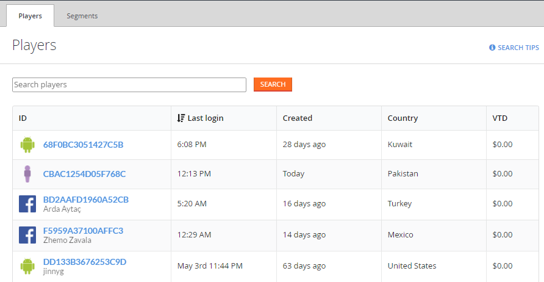

# Using the Players page

## Monitoring Players

It is possible to inspect the **Players** you have in your **Title** using the **Players Page**.

- Go to the **Game Manager** page.
- Select **Players** from the menu on the left.
- Select the **Players** tab.

  

On this page, You can inspect the list of registered **Players** as a table. The table contains general information about the **Player**. You can click a **Player ID** label (blue) to [inspect details about a particular player](player-details.md). You can also use the **Search Query** field to look up **Players**.

## Search Techniques

The **Search Query** field consumes two types of queries:

1. **Simplistic**
2. **Complex**

### Simplistic Queries

A **Simplistic Query** accepts 1 or more tokens separated by a space. It searches through all the fields in the [player profile](xref:titleid.playfabapi.com.admin.accountmanagement.getplayerprofile#playerprofilemodel), and looks strictly for one of the tokens. It is possible to use the **Wildcard** symbol **(*)** in the tokens to make the query more flexible.

  

For example, in the preceding screenshot we chose 2 **Users**:

1. **Lee**
2. **Vicky**

**Display Names** and **IDs** are among the searchable fields, so based only on the information from the screenshot, we have 4 **Tokens** at our disposal:

1. **Lee**
2. **Vicky**
3. **3BB0E45D6CB3304A**
4. **962B724F659A776A**. 

> [!NOTE] 
> Remember - you can use any [searchable player field](xref:titleid.playfabapi.com.admin.accountmanagement.getplayerprofile#playerprofilemodel) as a **Token**.

Now let's test a few querying techniques.

  

1. **Lee** is a value of the **DisplayName** field for one of the **Players** (**Lee**). The **Search Query** results in one matching entry.

2. No **Player** has **Vic** as the value of any field. The **Search Query** results in no entries.
3. **3BB0E45D6CB3304A** is the value of the **ID** field for one of the **Players** (**Vicky**). The **Search Query** results in one matching entry.
4. **962B724F659A776A** is the value of the **ID** field for one of the **Players** (**Lee**). The **Search Query** results in one matching entry.
5. This query involves 2 **Tokens**: **Lee** and **Vicky**. These correspond to the **DisplayName** fields for some of the **Players** (**Lee** and **Vicky**). The **Search Query** results in 2 entries.
6. This **Query** involves 2 **Tokens**: **3BB0E45D6CB3304A** and **Lee**. **Vicky** has the **ID** field set to **3BB0E45D6CB3304A**. **Lee** has the **DisplayName** field set to **Lee**. The **Search Query** results in 2 entries.
7. The **Wildcard** expression **Vic** will look for all **Players** with fields set to something starting with **Vic**. The **Search Query** results in 3 values.

> [!NOTE]
> This is not the best example, because all three of the located fields are display names. However, if you had a **Player** with an **ID** starting with **Vic**, it would also be part of the **Query** results.

8. The combined strict token **Lee** and **Wildcard Token Vick** results in 3 **Players**. One corresponds to **Lee** and 2 others have display names starting with **Vick**.

### Complex Queries

**Complex Queries** add more flexibility by introducing field referencing (dot notation, camelCase), operands, grouping using parenthesis, operators AND/OR/NOT and value descriptors.

The basic element of a **Complex Query** is a **Query** expression in the format **fieldName:valueDescriptor**. The search engine will then look for all **Players** that have the  specified field (denoted by **fieldName**) with the value (denoted by **valueDescriptor**):

- **fieldName** is a [searchable player field](xref:titleid.playfabapi.com.admin.accountmanagement.getplayerprofile#playerprofilemodel) in camel case (**DisplayName** becomes **displayName**). It is possible to use dot notation to dig into nested properties: *virtualCurrencyBalances.GM*.

- **valueDescriptor** is obviously something that describes the desired **Value**. It can be a **Token** (**ABC**), a **Wildcard Token** (**AB*C**), or a **Range Descriptor** (**date range value** [**2016 TO now**]).

Let's learn by example.

  

1. **displayName:Lee** - Looks for **Players** with the field **DisplayName** set (strictly) to **Lee**. The **Search Query** results in 1 entry.
2. **displayName:(NOT Lee)** - Looks for **Players** with the field **DisplayName** set to anything but **Lee**. The **Search Query** results in all entries except the **Player** named **Lee**.
3. **displayName:(Lee OR Vick**) - Looks for **Players** with the field **DisplayName** set to either **Lee** or something that starts with **Vick**. The **Search Query** results in 3 entries.
4. **playerId:3BB0E45D6CB3304A** or **displayName:Lee** * - Looks for **Players** with the field **DisplayName** set to **Lee** or with the field **PlayerId** set to **3BB0E45D6CB3304A**. The **Search Query** results in 2 matching entries.
