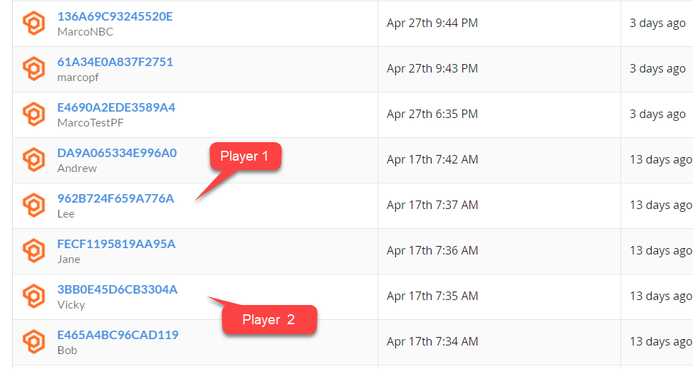
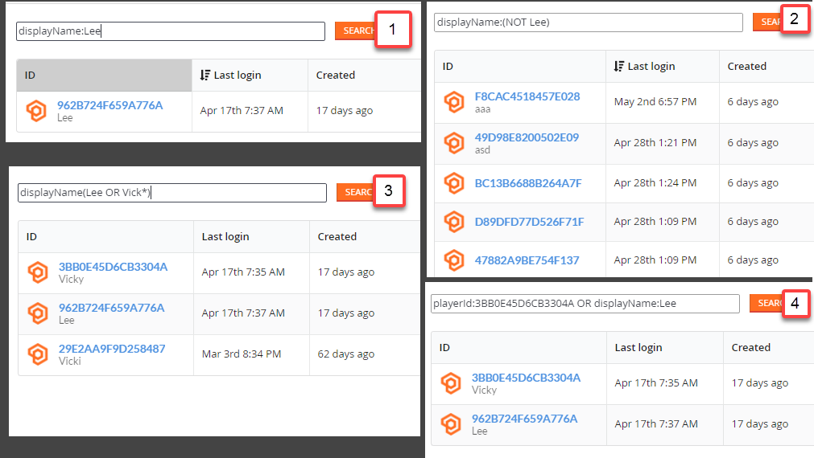

# Using the Players Page

## Monitoring players

It is possible to inspect the players you have in your title using the Players Page. 

Toaccess the Players Page:

- Goto the **Game Manager** page.
- Select **Players** in the menu.
- Then select the **Players** tab.

  

On this page, You can inspect the list of registered players as a table. The table contains general information about the player.

- You can click a Player ID label (blue) to [inspect details about a particular player](player-details.md).
- You can also use the search query field to look up players.

## Search Techniques

The **Search** query field consumes two types of queries: 

1. Simplistic
1. Complex.

### Simplistic queries

A **Simplistic query** accepts 1 or more tokens separated by a space. It searches through all [player fields](https://api.playfab.com/playstream/profile/PlayerProfile),  and looks strictly for one of the tokens. It is possible to use the wildcard symbol (*) in the tokens to make the query more flexible.

  

>[!EXAMPLE]
In the preceding screenshot we chose 2 users: Lee and Vicky. **Display names** and **IDs** are among the searchable fields, so, based only on the information from the screenshot, we have 4 tokens at our disposal: Lee, Vicky, 3BB0E45D6CB3304A, 962B724F659A776A. Remember, you can use *any* [searchable player field](https://api.playfab.com/playstream/profile/PlayerProfile) as a token. 

Now let's test a few querying techniques.

  

- **Lee** is a value of the **DisplayName** field for one of the players (**Lee**). The search query results in one matching entry.

- No player has **Vic** as the value of any field.  The search query results in no entries.
- **3BB0E45D6CB3304A** is the value of the **ID** field for one of the players **Vicky**. The search query results in one matching entry.
- **962B724F659A776A** is the value of the **ID** field for one of the players (**Lee**). The search query results in one matching entry.
- This query involves 2 tokens: **lee** and **Vicky**. These correspond to the **DisplayName** fields for some of the players (**Lee** and **Vicky**). The search query results in 2 entries.
- This query involves 2 tokens: **3BB0E45D6CB3304A** and **Lee**. **Vicky** has the **ID** field set to **3BB0E45D6CB3304A**. **Lee** has the **DisplayName** field set to **Lee**. The search query results in 2 entries.
- The wildcard expression **Vic** * will look for all players with fields set to something starting with **Vic**. The search query results in 3 values.

- The combined strict token **Lee** and wildcard token **Vick** * results in 3 players. One corresponds to **Lee** and 2 others have display names starting with **Vick**.

>[!NOTE]
>This is not the best example, because all three of the located fields are display names. However, if you had a player with an ID starting with **Vic**, it would also be part of the query results.

### Complex queries

**Complex Queries** add more flexibility by introducing field referencing (dot notation, camelCase), operands, grouping using parenthesis, operators AND/OR/NOT and value descriptors.

The basic element of a complex query is a query expression in the format **fieldName:valueDescriptor**. The search engine will then look for all players that have the  specified field (denoted by **fieldName**) with the value (denoted by **valueDescriptor**):

- **fieldName** is a [searchable player field](https://api.playfab.com/playstream/profile/PlayerProfile) in camel case (*DisplayName* becomes *displayName*). It is possible to use dot notation to dig into nested properties: *virtualCurrencyBalances.GM*.

- **valueDescriptor** is obviously something that describes the desired value. It can be a token (**ABC**), a wildcard token (**AB*C**), or a range descriptor (date range value [2016 TO now]).

Let's learn by example.

  

- *displayName:Lee* - looks for players with the field **DisplayName** set (strictly) to **Lee**. The search query results in 1 entry.

- *displayName:(NOT Lee)* - looks for players with the field **"DisplayName"** set to anything but **Lee**. The search query results in all entries except the player **Lee**.
- displayName:(Lee OR Vick*)* - looks for players with the field **"DisplayName"** set to either **Lee** or something that starts with **Vick**. The search query results in 3 entries.
- *playerId:3BB0E45D6CB3304A* OR *displayName:Lee* - looks for players with the field **"DisplayName"** set to **Lee** or with the field **PlayerId** set to **3BB0E45D6CB3304A**. The search query results in 2 matching entries.