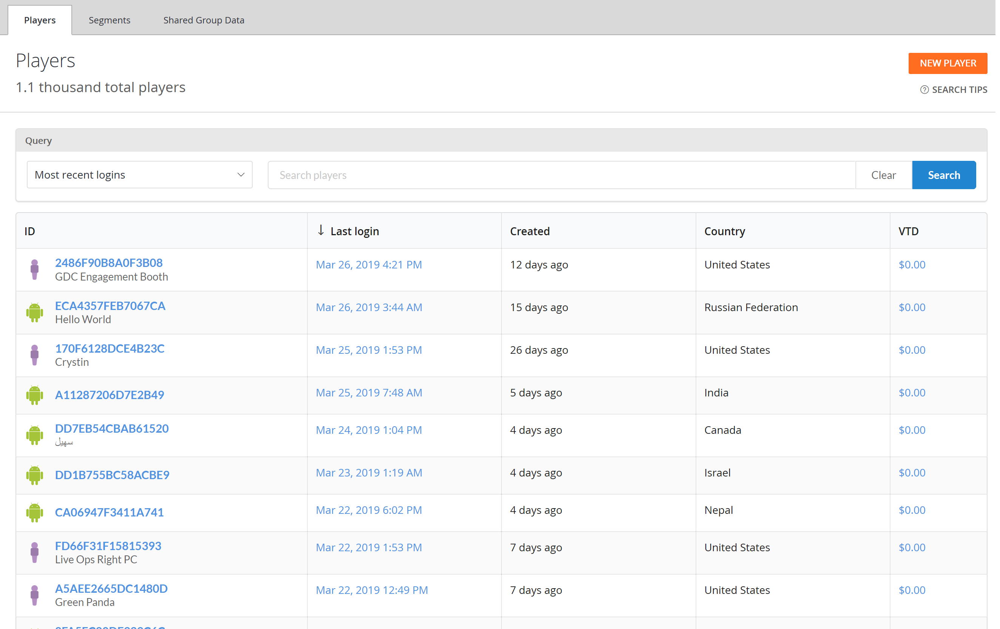

# Using the Players page

## Monitoring players

It is possible to inspect the players you have in your title using the **Players** page.

- Go to the **Game Manager** page.
- Select **Players** from the menu on the left.
- Select the **Players** tab.

  

On this page, You can inspect the list of registered players in a table format. The table contains general information about the player.

You can select a player ID label (blue) to [inspect details about a particular player](player-details.md). You can also use the **Search Query** field to look up players.

## Search Techniques

The **Search** query field accepts two types of queries:

1. **Simple**: Type plain text in the search box to return literal string matches on the ID column.
2. **Complex**: Construct queries using the [KQL syntax](https://docs.microsoft.com/en-us/azure/kusto/query/).

Sample complex queries can be accessed from the **Search Tips** button in the upper right. Selecting a sample query will automatically populate the search box with the correct KQL syntax. You can then edit the query to suit your use case.

There are many attributes of the Player Profile table, not all of which are visualized in the UI. However, you may search on any of these [PlayerProfile](../../../api-references/events/data-types/playerprofile.md) columns using a complex query.

> [!NOTE]
> Remember - you can use any [searchable player field](../../../api-references/events/data-types/playerprofile.md) as a query parameter.
