# Getting Started with Android Studio and Push Notifications

## Overview

This tutorial has been designed to help you get up and running with **Android PlayFab Integration** with **Push Notifications**.

**Push Notifications** require a configuration in several systems. Before getting started, let's talk about how the infrastructure works. There are 4 entities participating in the process:

1. **Google Play Services**
2. **Firebase Cloud Messaging Service**s (**FCM**, built on top of the old **Google Cloud Messaging**.)
3. **PlayFab Services**
4. **Client Application**

**Google Play Services** identifies your page on the play market using a **Package Name**.

An example of this would be: **com.bob.games.matchthree**.

When registered in **Google Play**, the **Package Name** becomes a unique **Application ID** and serves many purposes, from installing through **Play Store** to preventing impersonation.

**Firebase** and its **Cloud Messaging Services** (**FCM**) offer you a cloud-based system to send, direct, and deliver your **Push Notifications**. 

It also allows other services (like **PlayFab**) to send **Push Notifications** on your behalf using the **FCM Server Key**.

**PlayFab Services** then uses the **FCM Server Key** to send **Push Notifications** to your **Clients**.

Finally, your **Client Application** may receive **Notifications** and process them as needed.

As a result, we need to set up *4 different systems*. This tutorial is split into 4 Chapters, covering the configuration for each piece.

> [!NOTE]
> The *order* that you use to configure the systems is important.

## Prerequisites

- You must have a **Google** account.
- You must have a **PlayFab** account.
- A generated notification icon using the **Android Asset Studio** [Notification icon generator](https://romannurik.github.io/AndroidAssetStudio/icons-notification.html).

## Scenario

In this section of our tutorial, we will be assembling an **Application** called **Foo PlayFab App**. It is an **Android App** that has the following functions:

- It signs into **PlayFab** using an **Android Device ID**.
- It receives **Push Notifications** from **PlayFab**.

Our **package name** will be **com.foo.playfab.app**.

> [!IMPORTANT]
> Make sure to use your own **Package Name** and **Title** when following this tutorial.

### Chapter 1: Configuring Firebase

You start configuring **Firebase** by using its [official console page](https://console.firebase.google.com/). You will be presented with a page where you can add a **New Project**.

Do so, by selecting the **Add project** area, as shown in the following picture.


You will be asked to provide a **Project Name**. In this tutorial we use our **Foo PlayFab App**, but **make sure** to come up with your *own* name when following this tutorial.

Select the **Create Project** button to advance to the next step.


You will be redirected to the **New Project Dashboard**. Add a new **Android Application** to the project by selecting the area as shown in the following picture.

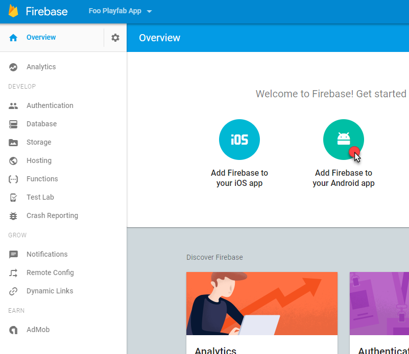

A new **Application** requires 3 steps to be added.

1. First, you must provide an **Android Package Name**. We are using **com.foo.playfab.app**, but make sure to come up with your *own* **Package Name** when following this tutorial.

2. Select the **Register App** button to move to the next step.


Step 2 allows you to download a settings file called **google-services.json**. It will be used later in the **App** to automatically configure **Google** services.

- After you download it, select the **Continue** button to move to the next step.


3. The final step offers information on how to set up your build process to wire up the **Firebase** and **Google Play SDKs**.

> [!Note]
> You may ignore this information, as we will be using an automated tool built into the **Android Studio** that performs this setup automatically.

- Select the **Finish** button to proceed.


- Once the **Application** has been added, it will appear on the **Dashboard**.

- At this point, configuration is complete, and we need to extract the **FCM Server Key** (which we will use to wire up **PlayFab Push Notifications**).
- Navigate to the **Project settings** as shown in the following picture.

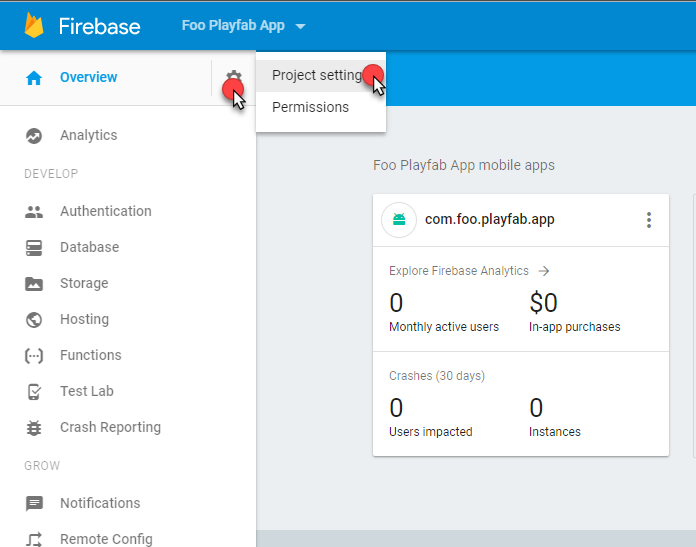

When in **Project settings**, navigate to the **Cloud Messaging** tab.

- Locate the **Server Key** area (the red area in the  picture shown below).

- Copy this **Key** and store it in a safe and easily accessible place.


At this point, we have done everything we need in **Firebase** to enable **Push Notifications**.

### Chapter 2: Configuring Google Play Console

When your app is ready, you will most likely create a **Google Console Project** to maintain a product **Play Store** page. Let's go though the process of creating a **GooglePlay Project** and linking it to the **Firebase Project**.

Start by visiting the [Google Play Console page](https://play.google.com/apps/publish) and creating a **New Project** as shown in the following picture.

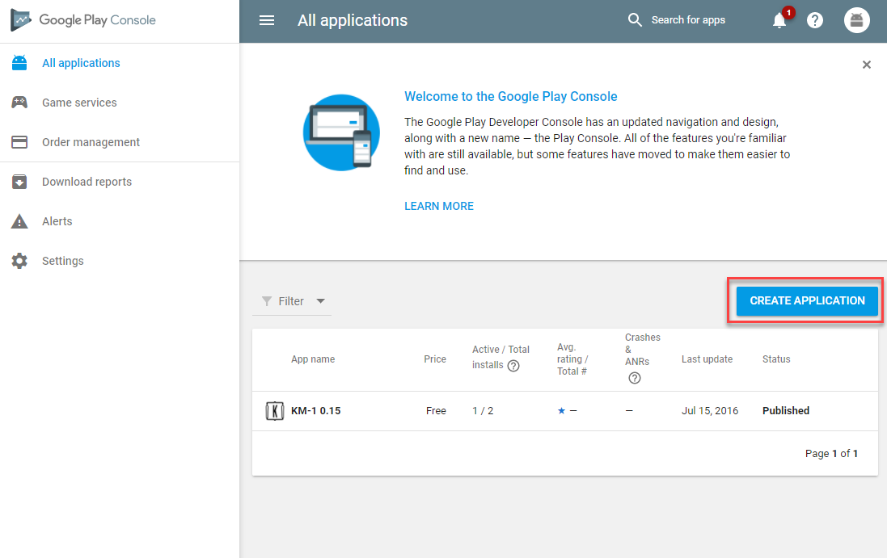

- Assign the **Title**.
> [!NOTE]
> In this example, we use **Foo PlayFab App**. Please make sure to come up with your *own* **Title** and **Package Name** while following this tutorial. 
- Select the **Create** button to continue.


- The **Google Play Console Project** page will open.

- Select **Services & APIs** on the side menu.

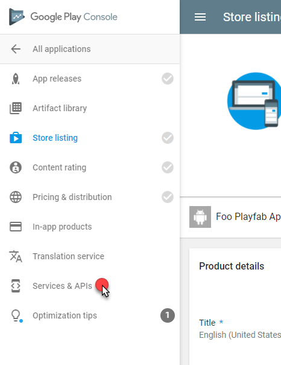

- The **Services configuration** page will open.
- Locate the **Firebase Cloud Messaging** panel.
- Select the **Link a Sender ID** button, as shown in the following picture.


To link the **Sender ID**:
- Use the **FCM Server Key** that you received (and saved) while using the **Firebase** console in the previous Chapter.

- When done, select the **Link** button, as shown in our example.


- Take a moment to verify that the **Sender ID** displayed in the **Google Play** console matches the one from the **Firebase** console, as shown in the example below.


At this point, the **Google Play Console Project** is successfully linked to the **Firebase Project**.

### Chapter 3: Configuring PlayFab Title

The purpose of this Chapter is to show you how to configure **PlayFab Services** so that it can send **Push Notifications** to the **Player** on your behalf. 

- First, you must go to **Settings (1)** in your menu.
- Then select the  **Push Notifications (2)** tab.

- On your screen, select the **Android Settings (3)** button, as shown in the example provided below.

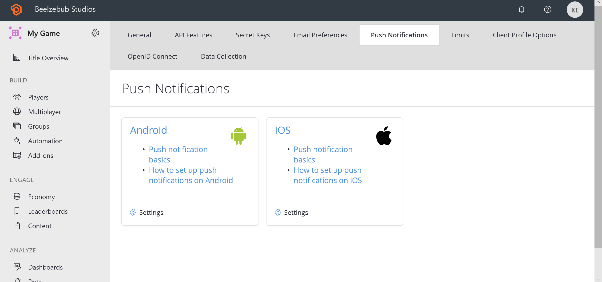

- You will be asked for the **FCM Server Key**.

- Copy the one you received through the **Firebase** console, as shown in the example provided below.

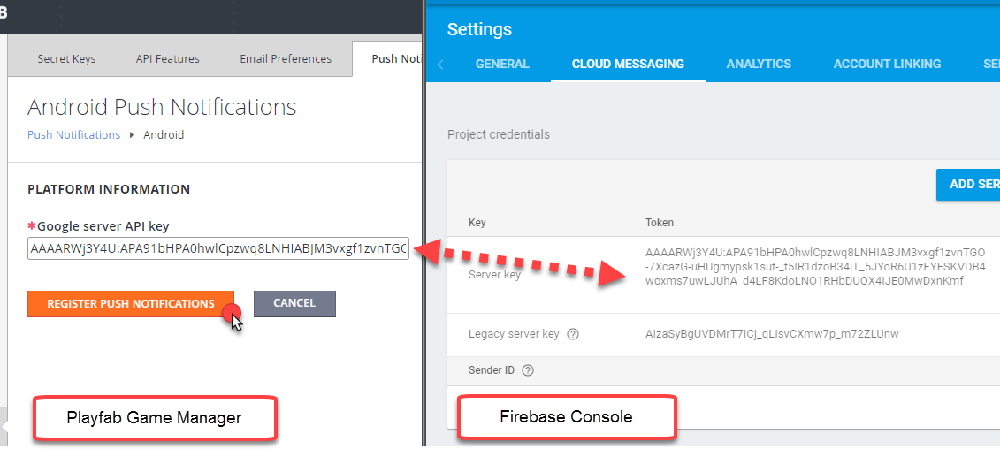

- If everything is correct, you will be presented with a page that shows **Push Notifications** as wired and **Active (1)**.

- Now you must verify that the **Title** is using the newest **FCM** architecture. To do this, select the **Upgrade Push Notifications (2)** button.


This concludes configuring your **PlayFab Title**.

### Chapter 4: Configuring Android Studio Project

In order to utilize the **PlayFab JavaSDK**, you will need the **PlayFab Client JavaSDK** and its dependency, **Google GSON**.

- Download the **PlayFab Client JavaSDK JAR** library here.

- Look for **client-sdk-*.jar** and the corresponding **Java Doc** if you need it.

- Download the latest **Google GSON**.

- Look for **gson-*.jar**.

- Have the previously mentioned **jar** files nearby.

Start by creating a regular **Android Studio** project.

- Verify that the **Package name** matches the one you used throughout this tutorial (in **Firebase**, for instance).
 
  > [!NOTE]
  > For our purposes in *this* example, we are using **com.foo.playfab.app**, but please remember to come up with *your own **Package name** and **Title*** while following this tutorial.

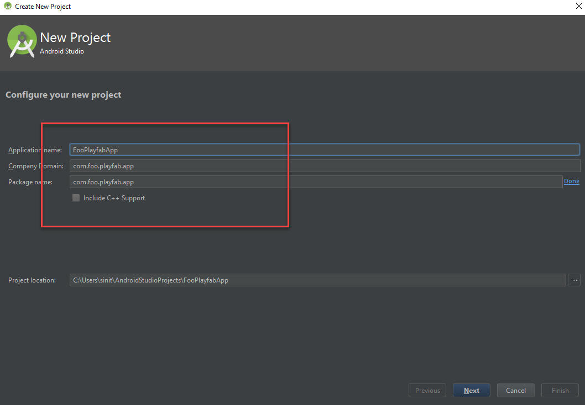

- Select a **Minimum SDK** to your choice.

- Then select the **Next** button.

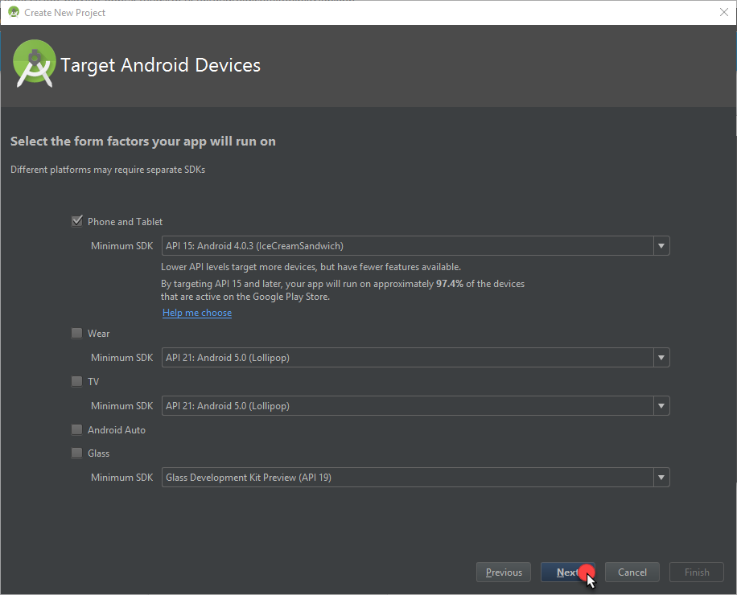

For this tutorial, we suggest using the **Empty Activity** template to begin with.

- Select the template you want to use.

- Then select the **Next** button.

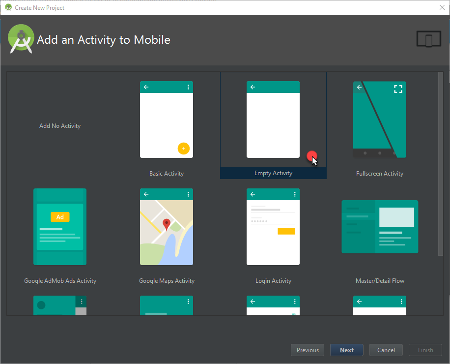

- Configure the template as you want.

- Select the **Finish** button.

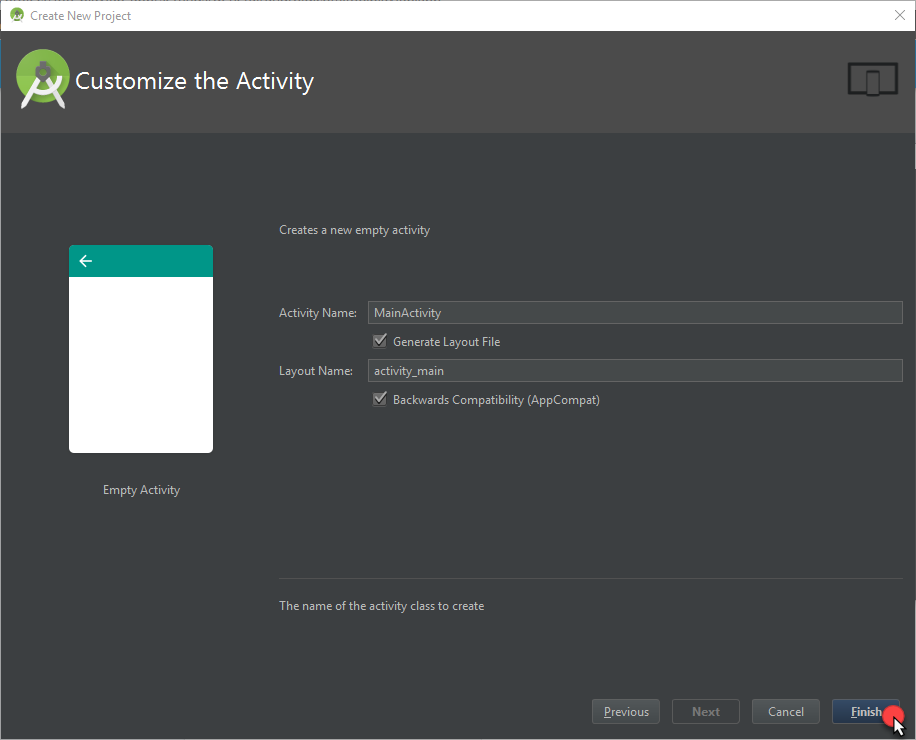

Once you open the newly created **Project**:

- Switch to the **Project** tab **(1)**. 

> [!NOTE]
> In the previous Chapter, you downloaded the **google-services.json** configuration file from the **Firebase** console. Use this for your next step.

- Verify that this file is placed under the **App** folder **(2)**.
- Then, navigate to **Tools (3)**.
- Select **Firebase (4)**, as shown in the example provided below.

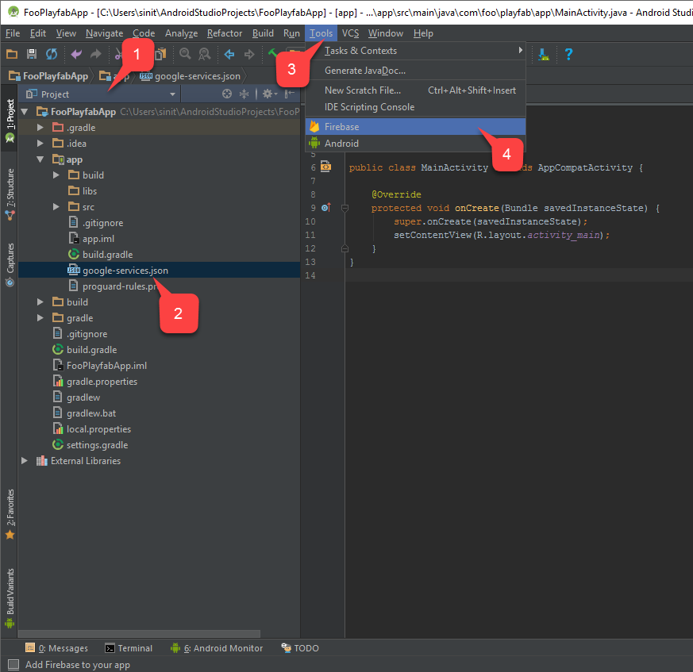

The **Firebase Assistant** will open on the right side of the window.

- Locate the **Cloud Messaging** folder, and select **Set up Firebase Cloud Messaging**, as shown below.

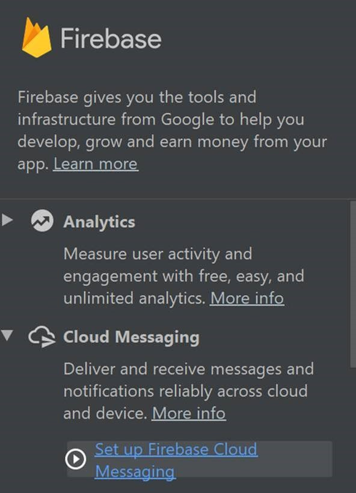

- In the **Firebase Notifications Assistant**, select the **Add FCM to your app (1)** button as shown in the following image.
- A dialog will open indicating that new dependencies will be added via **Gradle**.
- Select **Accept Changes (2)** to grant the changes.

  > [!NOTE]
  > Unfortunately, the **dependencies that are added automatically by the Gradle sync process (3)** are incorrect and will report failure!

- To set up the dependencies correctly, replace the auto-added sentences with the following:

    `implementation 'com.google.firebase:firebase-core:16.0.3`  
    `implementation 'com.google.firebase:firebase-messaging:17.0.0`  

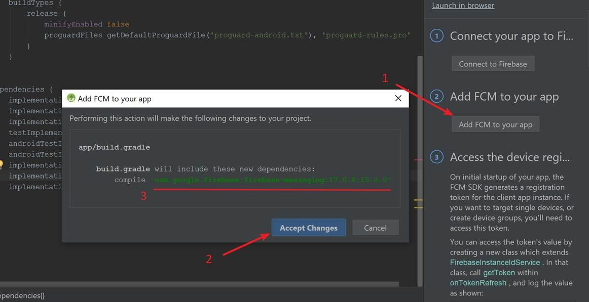

Once that process is complete:

- Verify that the **Firebase Notifications Assistant** indicates that dependencies are now set up correctly **(1)**.

> [!NOTE]
> In the beginning of this chapter, we acquired the necessary **JAR** files. Normally, the build file automatically fetches these files.

- To ensure that these JAR files are listed under the **app/libs** folder **(2)**, select all of the files and right-click them.
- Then choose **Add as library... (3)**, as shown in the example provided below.


- Using the **Android Asset Studio** [Notification icon generator](https://romannurik.github.io/AndroidAssetStudio/icons-notification.html), prepare the icons and place them inside **app/src/main/res**.

- In the example shown below, the icon is called **ic_stat_blur_on**.


- Finally, select **Rebuild Project**.


Now we can start implementing code for receiving and handling **Notifications**. We are going to modify (and create if needed) 4 files:

1. app/src/main/AndroidManifest.xml
2. app/src/main/java/..packagePath../MainActivity.java
3. app/src/main/java/..packagePath../FooAppFirebaseInstanceIdService.java
4. app/src/main/java/..packagePath../FooAppFirebaseMessagingService.java

> [!NOTE]
> The current implementation is crafted to be as short as possible, just to quickly test the **Notifications**. Consider [FCM Guides](https://firebase.google.com/docs/cloud-messaging/concept-options) for high-quality best practices and more complex implementation examples.

#### AndroidManifest.xml

In the following code, replace any **MY_PACKAGE_IDENTIFIER** placeholders with your *own* package identifier.

```xml
<?xml version="1.0" encoding="utf-8"?>
<manifest xmlns:android="http://schemas.android.com/apk/res/android"
    package="MY_PACKAGE_IDENTIFIER">
    <uses-permission android:name="android.permission.INTERNET" />

    <application
        android:allowBackup="true"
        android:icon="@mipmap/ic_launcher"
        android:label="@string/app_name"
        android:supportsRtl="true"
        android:theme="@style/AppTheme">
        <activity android:name=".MainActivity">
            <intent-filter>
                <action android:name="android.intent.action.MAIN" />
                <category android:name="android.intent.category.LAUNCHER" />
            </intent-filter>
        </activity>

        <!-- The following block enables our custom Firebase Instance ID Service-->
        <service android:name=".FooAppFirebaseInstanceIdService" android:exported="true">
            <intent-filter>
                <action android:name="com.google.firebase.INSTANCE_ID_EVENT"/>
            </intent-filter>
        </service>

        <service
            android:name=".FooAppFirebaseMessagingService" android:exported="true">
            <intent-filter>
                <action android:name="com.google.firebase.MESSAGING_EVENT"/>
            </intent-filter>
        </service>

    </application>

</manifest>
```

#### MainActivity.java

The following placeholders in the code should be replaced according to your scenario.

- **PLAYFAB_TITLE_ID**
  - Use the **ID** for your **Title** that you received in **PlayFab Game Manager**.

- **PACKAGE_IDENTIFIER**
  - Use the **Java package identifier** that matches your setup.

```java
package PACKAGE_IDENTIFIER;

import android.os.AsyncTask;
import android.support.v7.app.AppCompatActivity;
import android.os.Bundle;
import android.util.Log;
import com.playfab.PlayFabClientAPI;
import com.playfab.PlayFabClientModels.*;
import com.playfab.PlayFabErrors;
import com.playfab.PlayFabSettings;
import java.util.List;
import java.util.Map;

public class MainActivity extends AppCompatActivity {

    // Invoked when activity is started
    @Override
    protected void onCreate(Bundle savedInstanceState) {
        super.onCreate(savedInstanceState);
        setContentView(R.layout.activity_main);

        // Set PlayFab title
        PlayFabSettings.TitleId = "PLAYFAB_TITLE_ID";

        // Start login operation
        AsyncTask.execute(new Runnable() {
            @Override
            public void run() {
                if(login()) FooAppFirebaseInstanceIdService.setAllowRegisterForPush(true); // Ready to register for push notifications
            }
        });
    }

    public boolean login(){
        LoginWithAndroidDeviceIDRequest request = new LoginWithAndroidDeviceIDRequest();
        request.CreateAccount = true;
        
        // There are several approaches on getting unique android device id.
        // https://stackoverflow.com/questions/2785485/is-there-a-unique-android-device-id
        request.AndroidDeviceId = "qwerty";

        PlayFabErrors.PlayFabResult<LoginResult> response = PlayFabClientAPI.LoginWithAndroidDeviceID(request);
        if(response.Error != null){
            Log.d("Foo PlayFab App",CompileErrorsFromResult(response.Error));
            return false;
        }
        return true;
    }

    // Utility method to compose an error message out of PlayFab result.
    private static String CompileErrorsFromResult(PlayFabErrors.PlayFabError error) {
        if (error == null)
            return null;

        String errorMessage = "";
        if (error.errorMessage != null)
            errorMessage += error.errorMessage;
        if (error.errorDetails != null)
            for (Map.Entry<String, List<String>> pair : error.errorDetails.entrySet())
                for (String msg : pair.getValue())
                    errorMessage += "\n" + pair.getKey() + ": " + msg;
        return errorMessage;
    }
}
```

#### FooAppFirebaseInstanceIdService.java

The placeholder in the code displayed below should be replaced according to your scenario.

- **PACKAGE_IDENTIFIER**
  - The **Java package identifier** that matches your setup.

```java
package PACKAGE_IDENTIFIER;

import android.text.TextUtils;
import android.util.Log;
import com.google.firebase.iid.FirebaseInstanceId;
import com.google.firebase.iid.FirebaseInstanceIdService;
import com.playfab.PlayFabClientAPI;
import com.playfab.PlayFabClientModels;
import com.playfab.PlayFabErrors;
import java.util.List;
import java.util.Map;

public class FooAppFirebaseInstanceIdService extends FirebaseInstanceIdService {

    private static String _token;

    private static boolean _allowRegistration;

    // This is invoked from activity that performs authentication.
    // Once login is complete this method is invoked.
    // If we have a pending token, we use it to register for push notifications
    public static void setAllowRegisterForPush(boolean isAllowed) {
        _allowRegistration = isAllowed;
        if (_allowRegistration && !TextUtils.isEmpty(_token)) {
            registerForPush(_token);
        }
    }

    // Invoked when firebase has fetched a token
    // If we already have logged in, we use new token to register for push
    @Override
    public void onTokenRefresh() {
        _token = FirebaseInstanceId.getInstance().getToken();
        if (_allowRegistration && !TextUtils.isEmpty(_token)) {
            registerForPush(_token);
        }
    }


    private static void registerForPush(String token) {
        PlayFabClientModels.AndroidDevicePushNotificationRegistrationRequest request = new PlayFabClientModels.AndroidDevicePushNotificationRegistrationRequest();
        request.DeviceToken = token;

        PlayFabErrors.PlayFabResult<PlayFabClientModels.AndroidDevicePushNotificationRegistrationResult> response = PlayFabClientAPI.AndroidDevicePushNotificationRegistration(request);

        if (response.Error != null) {
            Log.d("Foo PlayFab App", CompileErrorsFromResult(response.Error));
        }
    }

    // Utility method to compose an error message out of PlayFab result.
    private static String CompileErrorsFromResult(PlayFabErrors.PlayFabError error) {
        if (error == null)
            return null;

        String errorMessage = "";
        if (error.errorMessage != null)
            errorMessage += error.errorMessage;
        if (error.errorDetails != null)
            for (Map.Entry<String, List<String>> pair : error.errorDetails.entrySet())
                for (String msg : pair.getValue())
                    errorMessage += "\n" + pair.getKey() + ": " + msg;
        return errorMessage;
    }

}
```

#### FooAppFirebaseMessagingService.java

The placeholder in the code shown below should be replaced according to your scenario.

- **PACKAGE_IDENTIFIER**
  - The **Java package identifier** that matches your setup.

```java
package com.foo.playfab.app;

import android.util.Log;
import com.google.firebase.messaging.FirebaseMessagingService;
import com.google.firebase.messaging.RemoteMessage;

public class FooAppFirebaseMessagingService extends FirebaseMessagingService {

    @Override
    public void onMessageReceived(RemoteMessage message) {
        // Intercept the message here
        Log.d("Foo PlayFab App","Message received: "+message.getNotification().getBody());
    }
}
```

## Testing

At this point, you should be able to deploy the **Application** to the device.

- Once you start the **Application**, it will automatically log in and register for **Push Notifications**.

- Select the **Home** button on your device to **minimize the Application**. *This is important*, as it allows us to test the **Notification** that arrives into the system tray.
- Next, go to your **PlayFab Title Game Manager** page, use the **Dashboard** to locate the latest **Push Registration**.
- Select the **Player ID (1)**.

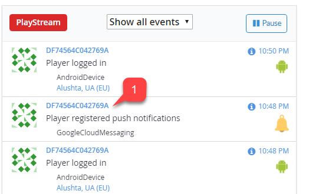

This will open a **Send Push Notification** page for that **Player**.

- Select the **Send Push Notification** button **(1)**.

- Type in the **Title (2)**.
- Enter the body of your message **(3)**.
- Commit your changes by selecting the **Send Push Notification** button **(4)**.

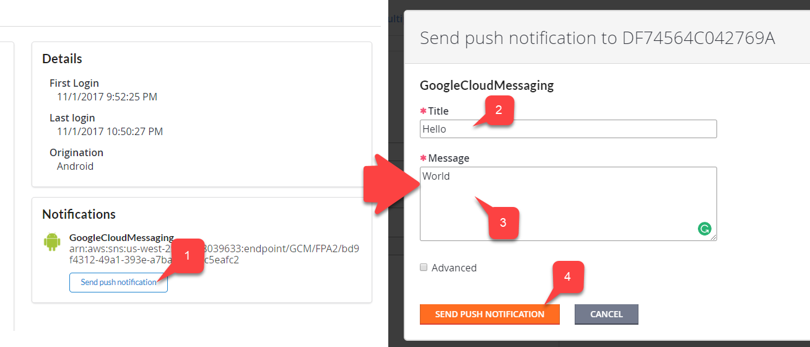

- Verify that the message arrives in your device.

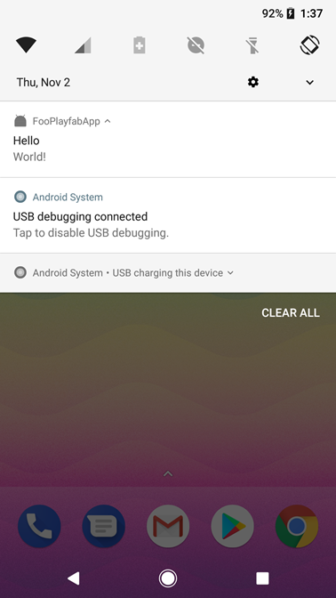

If your message *arrives*, messages are successfully being delivered into your application. 

At this point you have successfully integrated. You may use **FooAppFirebaseMessagingService** to handle the incoming message while your application is actually running.
