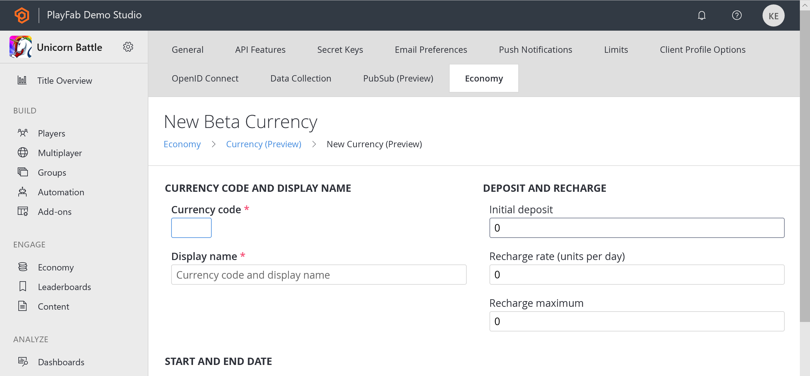
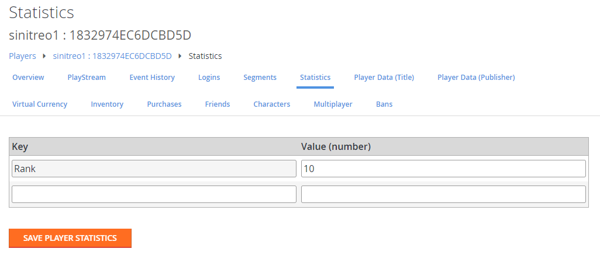

# Push Notifications quickstart

**Push Notifications** give you a channel to send an immediate, customized message to your **Player’s** home screen. Using **PlayFab's Push** feature, you may send unlimited **Push Notifications** to any number of devices completely free of charge.

As a general guideline, always tell **Players** *up front* how you will be using the **Push Notification** service. Explaining to **Players** how your game rewards or communicates via **Push Notification** can be the difference in building community engagement versus driving **Players** away.

The following screenshot is an example from an **Android** device's **Notifications** area showing a **Push Notification**.

  

## The Push Notification system

**Push Notifications** are possible due to a delicate linkage of three major systems:

1. The vendor-specific channel (**Google**, **Apple**, etc.)
2. The **Player’s OS**/device (**Android**, **iOS**, etc.)
3. Cross-platform message routing (**PlayFab** via **Amazon Simple Notification Service** [**SNS**]).

> [!NOTE]
> If any of these systems are unlinked, **Clients** will stop getting notifications. It is fairly simple to accidentally change one of the three systems and thereby break the link. Furthermore, it is difficult to know at any individual point in the flow if all of the systems are configured properly.

## The PlayFab Push routing system

Every **PlayFab Title** can enable one **Google** (**GCM**) and one **Apple Push** (**APNS**, **APNS_SANDBOX**) notification channel at a given time. This can be configured in one of two ways:

1. Using the **UI** in **Game Manager** under **Settings -> Push Notifications**.
2. Using the **PlayFab Admin API** - [SetupPushNotification](xref:titleid.playfabapi.com.admin.title-widedatamanagement.setuppushnotification).

For more detailed setup information, read these tutorials:

- [Push notifications for Android](push-notifications-for-android.md)
- [Push notifications for iOS](push-notifications-for-ios.md)

## Push messages in-game

**Push Messages** will vary based on the development engine/platform. However, the easiest way to receive **Push Notifications** is using a **Unity** project with our **SDK** and the **Firebase Cloud Messaging (FCM)** plugin for **Android**, or just **Unity for iOS**.

- **Receiving push on Android** - This requires a plugin. The best supported plugin is the native **FCM** plugin.
- **Receiving push on iOS** - This *does not* require a plugin for basic **Push** messages.

> [!TIP]
> Please see the **FCM** documentation for instructions on how to set up the [FCM Unity plugin](https://firebase.google.com/docs/cloud-messaging/unity/client), or push on [Android Studio](https://firebase.google.com/docs/cloud-messaging/android/client).

## Testing the setup

After configuring your **Title** and **Client**, you can test your configuration using the **PlayFab Server API** - [SendPushNotification](xref:titleid.playfabapi.com.server.accountmanagement.sendpushnotification). This **API** allows you to send as many **Push Notifications** as needed at no extra cost.

You can use the **PlayFab CloudScript** service as a quick and secure server **API** environment. From there, **Push Notifications** can be sent as needed.

To use this method to test your configuration, upload or append the code in the following example to your **Title’s CloudScript**.

### Example

Consider the following scenario:

- **Players** in your **Title** may access a **Leaderboard** based on **Rank** statistics.

- Each **Player** may pay 1 CH **Currency** and challenge another **Player** who is up to 5 positions away from the current **Player**.

First, consider a **Virtual Currency** as shown in the example screenshot below (see the [Currencies](../../commerce/economy/currencies.md) tutorial for information on how to define a **Virtual Currency**).



Now, consider the following **Statistics** defined for each **Player** (see the [Accessing Archived Tournament Results](../../social/tournaments-leaderboards/accessing-archived-tournament-results.md) tutorial for information on how to generate a test **Leaderboard**).

  

Once you've set up these prerequisites, you can set up a **Push Notification** challenge system.

The following **Client** code will call the **CloudScript** **ChallengePlayer**.

```csharp
public void ChallengeRandomClosePlayer(string currentPlayerId) {
    PlayFabClientAPI.GetLeaderboardAroundPlayer(new GetLeaderboardAroundPlayerRequest() {
        MaxResultsCount = 10,
        StatisticName = "Rank",
        PlayFabId = currentPlayerId,
    }, result => OnLeaderboardLoaded(result,currentPlayerId),OnPlayFabError);
}

private void OnLeaderboardLoaded(GetLeaderboardAroundPlayerResult leaderboard, string currentPlayerId) {
    var index = (int)(UnityEngine.Random.value * (leaderboard.Leaderboard.Count-1));
    if (leaderboard.Leaderboard[index].PlayFabId == currentPlayerId)
        index = (index + 1) % leaderboard.Leaderboard.Count;
    var targetId = leaderboard.Leaderboard[index].PlayFabId;

    PlayFabClientAPI.ExecuteCloudScript(new ExecuteCloudScriptRequest() {
        FunctionName = "ChallengePlayer",
        FunctionParameter = new Dictionary<string, object>() {
            { "TargetId", targetId }
        }
    }, null, OnPlayFabError);
}

public void OnPlayFabError(PlayFabError obj) {
    Debug.Log(obj.GenerateErrorReport());
}
```

The **ChallengePlayer CloudScript** code will handle the request, validate the **Leaderboard** state, and send the challenge **Push Notification** to the target.

```javascript
handlers.ChallengePlayer = function (args) {
    var targetId = args.TargetId;
    var leaderboard = server.GetLeaderboardAroundUser({
        MaxResultsCount : 10,
        PlayFabId : currentPlayerId,
        StatisticName : "Rank"
    });

    for(var i = 0; i < leaderboard.Leaderboard.length; i++) {
        var target = leaderboard.Leaderboard[i];
        if(target.PlayFabId !== targetId) continue;

        // subtract virtual currency from current player
        server.SubtractUserVirtualCurrency({
            VirtualCurrency : "CH",
            PlayFabId : currentPlayerId,
            Amount : 1
        });

        // get current player profile
        var profile = server.GetPlayerProfile({
            PlayFabId : currentPlayerId
        }).PlayerProfile;

        // try to send push notification
        try {
            server.SendPushNotification({
                Recipient : targetId,
                Package : {
                    Message : `${profile.DisplayName} challenges you for a battle!`,
                    Title: "You have been challenged",
                }
            });
        } catch (ex) {
            // Target player has not registered for Push Notifications
        }
        return;
    }
}
```

## Push Notification Best Practices

Having the ability to use **Push Notifications** is an awesome power. When *abused*, however, it can drive away **Users** and cause them to not only opt out of future notifications but to *leave a game entirely*.

If used judiciously, though, **Push Notifications** can be one of your best tools for building and maintaining your game's community.

**Push Notifications** are a *fire and forget* message protocol, similar in vein to **UDP**.

> [!NOTE]
> Remember that there is *no guarantee* that your **Players** will receive, open, or engage with your message. With that caveat, it is a good practice to use messages as *bonus* content, rather than as a critical part of your gameplay loop.

For **iOS** platforms, **Apps** are given a one-time dialog prompt from the **OS**, allowing the **User** to determine the status of **Push Notifications**. After the **User** has made their initial selection, this setting will persist until:

- The **App** is updated or reinstalled.

- The **User** makes changes to the settings from their phone’s settings menu.

For **Android Apps**, notifications are enabled by default, and can be turned on and off at will from the **Client**.

> [!TIP]
> It is a good practice to re-initialize your **Notification** listeners with every session.

## Resources

The following resources provide additional information about the topics in this quickstart:

- [Firebase Unity SDK](https://firebase.google.com/docs/unity/setup):  An all-in-one **FCM** solution for **Unity**. This **SDK**, among all other features, allows you to receive and process push notifications sent via **FCM**.
- [Push It Real Good: How to Get Players to Say Yes to Push Notifications](https://blog.playfab.com/blog/push-it-real-good-how-get-players-say-yes-push-notifications/): This blog post details additional strategies and techniques for using **Push Notifications**.
- [Push Notifications](https://blog.playfab.com/blog/push-sep-17): This blog post describes the most recent upgrade in **Push** functionality, and switching to **FCM** as the primary plugin for **Android**.
- [Executing the PlayFab API via Postman](../../../sdks/postman/executing-the-playfab-api-via-postman.md): This tutorial shows you how to test our **APIs** using **Postman**.
