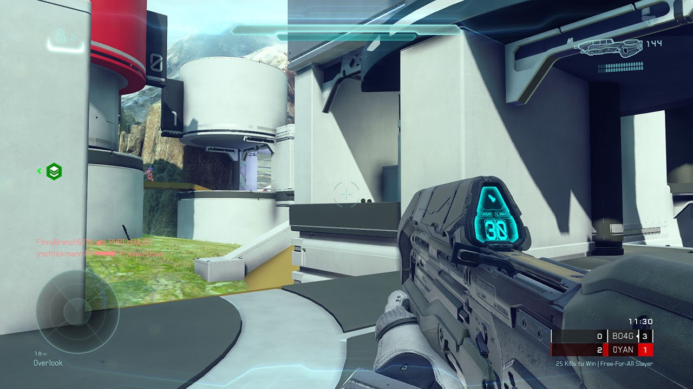
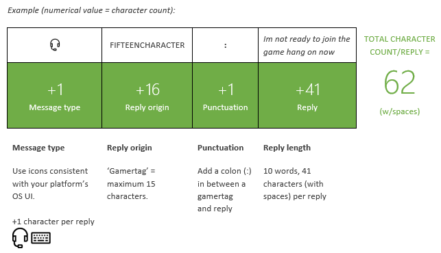
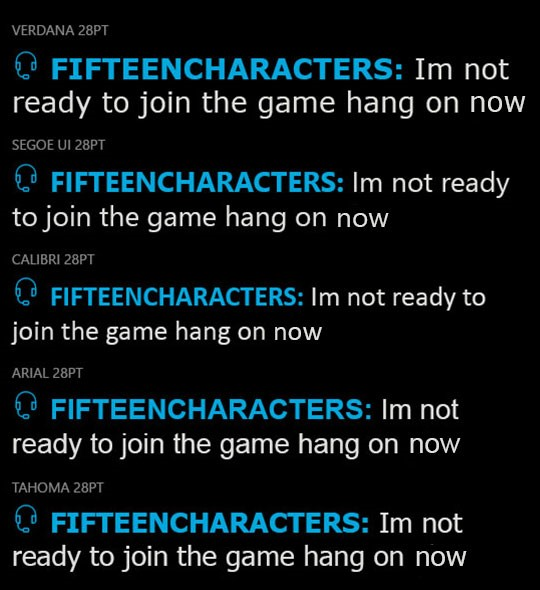
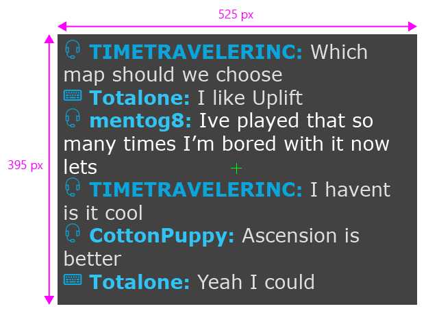
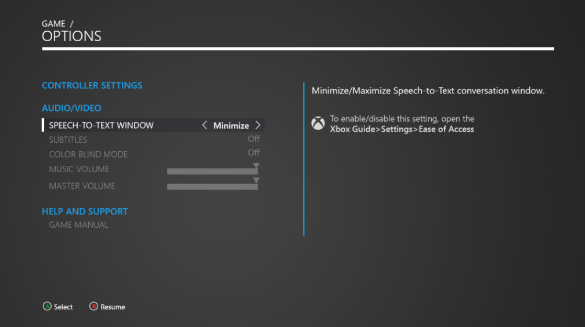
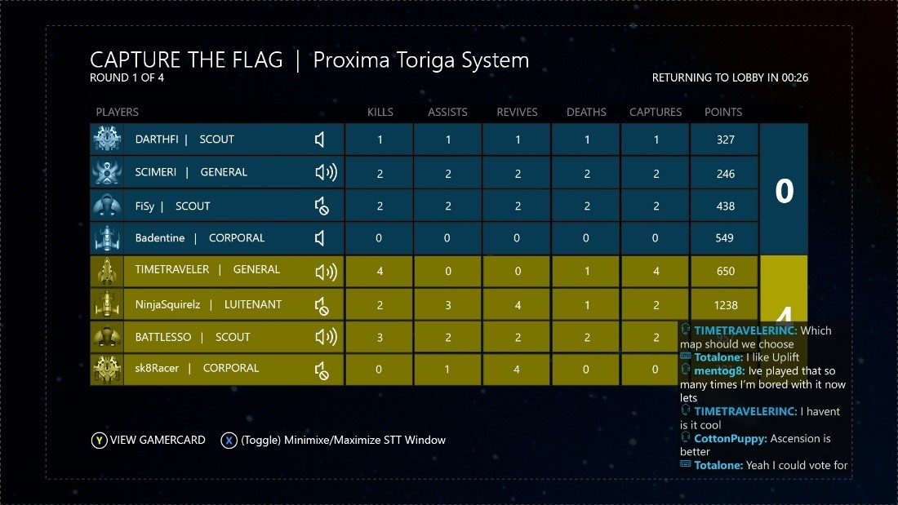
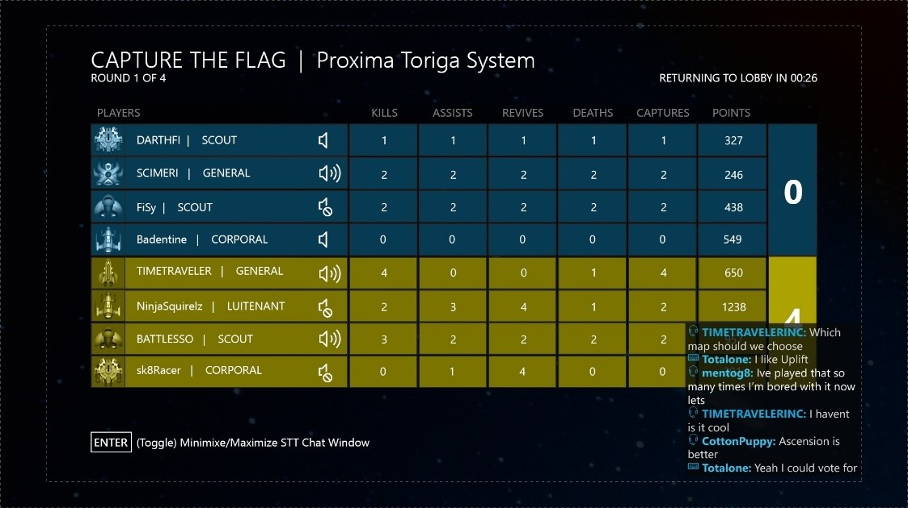
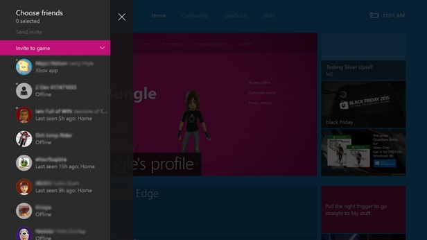

# PlayFab Party Speech to Text UX Guidelines

> [!IMPORTANT]
> This feature is currently in **Private Preview**.  
>
> It is provided to give you an early look at an upcoming feature and to allow you to provide feedback while it is still in development.  
>
> Access to this feature is restricted to select titles, with SDKs available for Windows 10 PCs and Xbox One. Interoperable SDKs for iOS and Android will be available this summer. If you are interested in this feature, you can request access by submitting a ticket on [support.playfab.com](https://support.playfab.com/hc/en-us/requests/new).

The PlayFab Party API gives gamers more options for engaging with and enjoying game chat. It provides a means for voice chat to be transcribed to text and for text input to be converted to synthesized voice. Titles can now surface UI, via either the Xbox or Windows OS or a custom solution within their title.

This document is part two of a two-part series covering UX solutions for speech-to-text (STT) and text-to-speech (TTS) implementation.

[Part one](party-text-to-speech-ux-guidelines.md) focuses on text-to-speech implementation, requirements, console and PC UI solutions, while this topic focuses on speech-to-text implementation, requirements, and custom console and PC UI solutions.

## TTS/STT scenarios

The following chart guides you through scenarios that players will experience when you enable speech-to-text and text-to-speech features. It outlines user impact for three stages of the gaming experience: initial setup, playing a game, and engaging in game chat.

|**Experience Stage**|**SET-UP**                |**PLAY**                           |**CHAT**                 |                           |
| :------------------|:-------------------------|:----------------------------------|:------------------------|:--------------------------|
|**Goal**            |**User enables Setting**  |**User enters a multiplayer game** |**User sends a message** |**User receives messages** 
|**Action**          |STT   **Alternative for** Hearing voice replies |Launches game   Enters MP lobby   Overlay opens when game chat is initiated  |User speaks |User reads team’s voice replies converted to text in a STT chat overlay
| |TTS   **Alternative for** Speaking voice replies |Launches game   Enters MP lobby   Game displays method for text input (keyboard, input field, etc) |User types replies using platform supported input methods   Typed messages are converted to synthesized voice | User hears team member’s voice replies 
| |UI Narration (in-game)   **Alternative for** Reading in-game menus and text replies |User is guided by the Xbox OS synthesized voice to launch game   Game uses the Speech Synthesis API to narrate menu options leading the user to the MP lobby |For text messaging systems: games use the Speech synthesis API to guide the user to launch the Xbox OS keyboard | For text messaging systems: Games use the Speech Synthesis API to narrate replies
| |Narrator (Xbox OS)   **Alternative for** Reading Xbox menus |User is guided by the Xbox OS synthesized voice to launch game |For text messaging systems: a virtual Keyboard is narrated as the user types a message | N/A |

## Understanding the API

### Speech to Text

1. **SetTextToSpeechProfile** (*regional voice selection*)   
   A speech profile can be specified when the chat control is created for the user. It could be changed mid-game (if the title supports it). It will determine the language, dialect, and gender of the transcribed voice output. Refer to the [Language support reference](https://docs.microsoft.com/en-us/azure/cognitive-services/speech-service/language-support) for a complete list of supported languages and voice options.

2. **SetTranscriptionRequested**   
   The Title detects that User A turned the STT preference on.

3. **VoiceChatTranscriptionReceived**   
   When the system receives a chat voice message, it will automatically generate the transcribed text. The game will receive the transcription.

4. a. Render the text (Title-specific code)   
   Transcribed text will be added to a 'queue'. It is up to the Title to initiate the display of the transcription.

   b. **Windows::Xbox::UI::Accessibility::SendSpeechToTextString** (Xbox and Windows only)   
   Call the OS generated Chat UI. This feature is rendered by the Xbox or Windows OS. 

### Text to speech

1. **SetTextToSpeechProfile** (*regional voice selection*)   
   The Title needs to set the regional voice/language for the user. This will determine the language, dialect, and gender of the transcribed voice output. Go to the [Language support reference](https://docs.microsoft.com/en-us/azure/cognitive-services/speech-service/language-support) for a complete list of supported languages and voice options.

2. **SynthesizeTextToSpeech**   
   The text received will be synthesized and shared with the rest of the chat party. If a game calls **SynthesizedTextToSpeech**, synthesized audio data will appear as though it was captured "naturally" by the audio capture device (microphone) associated with user A (the sender). It’s as if you were holding your microphone up to a computer that’s talking on the user’s behalf.

3. **SendText**   
   User A submits a text message (**std::string message**) to the chat group. The Title accepts text input from User A via a virtual keyboard, or other text input method. **SendText** sends this message to the chat group.

4. **ChatTextReceived**   
   The group receives the message. Their only property is the sender. The type determination is whether it’s a text message or a transcribed message and that’s done based on which event is fired.

## Discovery

Users will find TTS and STT settings in the **Accessibility** section under **Settings**, via Xbox Home (console) or Xbox App (Windows 10). For all other platforms, refer to their Accessibility guidelines for TTS/STT locations.

> [!NOTE]
> In general, accessibility options belong under the game’s settings/options menu. Ideally, settings are available as a dedicated button and accessible from any screen, or at least from the pause menu.

## UX guidance for creating a custom conversation window

### General best practices

Subtitles and voice chat transcription tackle a similar challenge: display rapid-fire, conversational text, overlaying rich media. Documentation on subtitles can apply to a conversation window.

#### Basics

1. High contrast between text and background.
2. Avoid presenting too much text onscreen at one time.
3. Use a large enough text size based on screen experience (10’ vs. desktop).

#### Good Practices

1. Ensure users can find and enable TTS settings before engaging in game chat.
2. Avoid clashes with other UI elements.
3. When stacking multiple replies, add newest strings from the bottom.
4. Distinguish between speakers.
5. Use a clear, readable font.
6. Allow the conversation window and content to be customized by the user.

### Window size

To ensure an equivalent experience for all of your gamers, its crucial to consider both user needs and game UI needs.

This section will walk through a method for determining the best display, based on:

- The user’s chat behavior.
- Varying UI layouts using game chat (lobbies, game setup, game session).
- TCUI impact (for example, overlays, toasts, virtual keyboard).
- Presentation requirements such as fonts and formatting.

#### Users’ chat behavior

Different game features will drive varying chat density. For example, the game lobby, during the game session, and end-of-game wrap-up are areas where game chat is engaged. However, the types of discussion change to meet the objectives of the screen. Knowing the type of discussion can help gauge whether a conversation window is critical or optional to gameplay needs.

Discussion types

- **Small talk**: Not critical for achieving objectives. For example; common interests, expletives, socializing.
- **Functional**: Critical for achieving game objectives. For example, coordinating strategy with your team.

#### Chat length: Minimum requirements

Discussion types in game chat influence a wide range of reply types by a single user (from greetings/confirmation to instructional/descriptive). Once you’ve determined a primary discussion type for each screen, you can begin to make some broad assumptions about the type and length of replies.

Researching game chat activity for your game will deliver the most accurate results. It requires identifying common patterns in multiple user conversations. One solution is to conduct a user-research test, using the STT functionality inside your game to capture the UR data of participants. Another suggestion is to watch Twitch streams of similar genres and track conversation patterns.

That data can then be applied to this simple strategy for determining conversation length:

1. Reply frequency   
   Determine how many replies were exchanged before a lull, and then average those replies to arrive at a final number. *Example: Two players chatting averaged five replies before a lull occurred.*

2. Reply length   
   Determine the average word and character count of a single reply. *Example: A single reply averaged 10 words and 35 characters (with spaces) per reply.*

3. Formatting   
   The STT APIs will support **reply origin** (gamertag) and **message type** (voice, text). Combine spoken characters and unspoken characters to arrive at your total character count.

#### Font size and type

Choosing a legible font is important for players who are reading any onscreen text UI, and some of whom might have low vision.

> [!NOTE]
> Verdana is the most legible font that Microsoft ships. Even better than Verdana by itself, is to present the font with high contrast (full black on full white or vice-versa) and at large sizes. Size, contrast, and letterform are the three biggest factors in legibility (in that priority order).

*Example: Different typefaces of the same size can vary in readability.*

A minimum of **28px** for 1080p UI text (14sp) is recommended for chat transcriptions presented in a 10’ experience. Like subtitles, these are displayed for a limited duration and so the text should be notably larger than the minimum acceptable (24pt for 10’) for the rest of the UI.
 
#### Calculating your final minimum-size requirements

Now that you have your average reply frequency, reply length, formatting considerations, and font size and type, you can determine your window size requirement:

*Example: The result of using the specs above inside a window size of **525px (w) x 395px (h)**.*

Start testing your design by using the **ConversationWindow_Template.ai**. Go to [Resources](#resources) for the native Adobe Illustrator (.ai) file.

### Position and proportion

Now that you have minimum text requirements for the conversation window, you can begin testing positioning and size ratio.
 
#### Positioning: Relative vs. fixed

Aligning the conversation window to a grid format provides a very straightforward set of inputs that can scale regardless of the screen resolution. For example, the Xbox OS STT UI references nine quadrants (Left/Top, Left/Center, Left/Bottom, Middle/Top, and so on) for positioning.

If your game outputs to multiple screen resolutions (4K, PC), you won’t have to worry about scaling 1080p X,Y pixel values to a different screen size.

By having a predetermined number of relative positions, you won’t have to fight with legacy code to maintain pixel-perfect positioning of design elements, fonts or safe areas. Your design guarantees a relative position instead.

Consider referencing multiple positions to accommodate varying screen complexity:

- Identify screens where game chat activity is critical.
- Avoid inhibiting interaction. (See Note)
- Avoid hiding critical details. (See Note)

> [!NOTE]
> If the conversation window inhibits game activity and prevents STT users from achieving the same objectives as all users, it defeats the purpose of this feature.

### User-controlled customization

There may be screens where there simply isn’t room to accommodate a conversation window of any size.

*Example: The end-of-game results UI fills the entire screen. A conversation window risks covering critical stats.*

#### Solutions for game UI and conversation window conflicts

1. **The user should be able to disable the feature via the OS**  
   Ideally, the user has the option to leave the game and turn the STT option on or off by using the Ease of Access settings. 

   - **UI impact: NONE**
   - **UX impact: POOR**

   *Example: Disabling the STT setting via OS Settings. (This shows a critical path for the Xbox One console)*

   

2. **The game provides a method for users to minimize the window**   
   Having an STT setting to minimize or move the window offers added flexibility for the designer and the user.

   - **UX impact: GOOD**   
     This is a 3-click solution where settings menus are surfaced in the game. 

   - **UI impact: MODERATE**   
     Requires adding a minimize/maximize chat window button to an in-game settings menu. We recommend that this option appear only when the STT is detected as enabled.

   *Example: Minimize/maximize STT window via in-game Options menu (Xbox Console/PC critical path*

   

   *Console example: Add an STT setting in the Pause menu.*

   

   *PC example: Add an STT setting in the Pause menu.*

   

   Enabling users to minimize or maximize the conversation window puts the choice in their hands. The game doesn’t have to try to avoid compromising critical real estate.

   Game screens that do not require immediate responses give users time to shift focus away and edit their settings. They can minimize or maximize the window without destroying the session. Keep navigation to and from this setting as efficient as possible.

   For game screens that do require immediate responses, or when point-and-click (PC) is not an option, a button or key command can be directly mapped.

   *Console example: A button is mapped to toggle the display ON/OFF, and annotated in the legend.*

   

   *PC example: A button is mapped to toggle the display ON/OFF and is annotated in the legend.*

   

#### Functional requirements

- Conversation continues to be tracked while the window is minimized.
- The user can expand and see the latest replies. (The user does not see a history of missed replies.)
- This option appears when a user profile/STT setting is detected as enabled.
- This setting would not override the OS Profile/STT setting.

### Display frequency

Chat activity will fluctuate between players during game sessions. There is no value to keeping an empty chat window open when players aren’t chatting.

Automatically close the window when chat has been inactive for a set period.

*Example: The STT window closes after 15s of inactivity. This number is based on the time it would take a user to read one message of 280 characters.*

> [!NOTE]
> It’s worth testing various settings to ensure that opening and closing a window isn’t too distracting on a game screen with a lot of activity.

### Scrolling

During ongoing conversations, the window must facilitate a view of most recent replies. Most recent replies are displayed at the bottom of the replies, and scroll up

> [!NOTE]
> Auto-scrolling is a solution that makes managing conversations easier for both developers and users. It comes closest to mimicking fluid conversation. The less effort a user has to make to manage the view, the more time they have to focus on gameplay. A manual scrollbar would require shifting controller focus, which can be disruptive during active gameplay.

### Visual disparity

It may be tempting to design this chat window to match your UI style. However, the chat window has a specific function, unique from other game components. It is presenting information that originates outside of game instruction. Game information that also uses text and frames. A user could confuse the intention of the chat window with actual in-game components, if they look too similar. Therefore, it is recommended that the Chat overlay possess unique attributes that clearly separate it from the game UI. Degree of disparity is up to the designer’s discretion.

### Closing or destroying the conversation window

A game must determine when the conversation window remains active (while a user is multi-tasking) or when it should close (for example, when a user exits a chat session). Keep in mind that this window represents a live chat conversation and is not to be confused with instant messaging (IM). For example, if a user walks away from their console or pauses a game, the conversation will continue but they’ll have missed replies that occurred before they return.

> [!NOTE]
> UX recommendation: Keep the window active when a game is constrained or paused. Close the window when the game is killed.

## TCUI (title-callable UI)

*Console example: The Xbox One Guide is TCUI and has a transparent overlay that dims the screen.*

Its common for a platform’s system UI to be the ‘top’ visible layer of any game or app UI. For example, the Xbox One operating system-initiated UI (error messaging, a virtual keyboard, toasts, the Xbox One Guide, people picker, and other elements) applies a full screen, semi-transparent, black overlay with their content window.

- **UX impact: Visibility of the conversation window will be obscured.** 

## Conclusion

The PlayFab Party TTS and STT APIs are a highly effective feature for including a wider range of users to a game and gaming conversations. The more gamers engage and develop relationships, the more likely they are to continue playing. The APIs and presentation are simple. This guidance will help you ensure that the user experience is too.

## Resources

### Design templates

- [PlayFab Parties_AI_Templates.zip](https://aka.ms/gamechat-ai-templates)   
  Contains:
  - PlayFab Parties_9GridTemplate.ai
  - ConversationWindow_Template.ai

### Text-to-speech narration menu guidelines

- [Speech interactions](https://msdn.microsoft.com/windows/uwp/input-and-devices/speech-interactions) 
- [Speech synthesis API (Windows)](https://msdn.microsoft.com/en-us/library/windows/apps/windows.media.speechsynthesis.aspx)

### PlayFab Party TTS/STT UX series

- Part 1: **PlayFab Party Speech-to-Text (Custom) UX Guidance**
- Part 2: [PlayFab Party Text-to-Speech UX Guidance](party-text-to-speech-ux-guidelines.md)

### SDK documentation

- "Accessible in-game chat overview" in the PlayFab SDK (see [SDK Downloads](https://developer.xboxlive.com/en-us/live/development/Pages/Downloads.aspx)) 

### Accessibility guidance

- Griffiths, Gareth. [Subtitles: Increasing Game Accessibility, Comprehension](http://www.gamasutra.com/view/feature/132315/subtitles_increasing_game_.php?print=1)   
  *Gamasutra*
- [Game Accessibility Guidelines](http://gameaccessibilityguidelines.com/)
A straightforward reference for inclusive game design
- Straub, Josh. [Game Accessibility: What It Is And Why It Matters](http://www.gameinformer.com/b/features/archive/2012/08/03/game-accessibility-what-it-is-and-why-it-matters.aspx)   
  *Game Informer* 

### Inclusive design

- [Xbox’s Gaming for Everyone Initiative](https://news.microsoft.com/gamingforeveryone/) 
- [Inclusive Design](https://www.microsoft.com/design/inclusive)   
  Microsoft Design Toolkit and education
- Kojouharov, Stefan. [10 Tips on Creating an Addictive ChatBot](https://chatbotslife.com/10-tips-on-creating-an-addictive-chatbot-experience-b796ea6d1178#.ka4jz0vk7)   
  Referenced in this document for conversational UI tips.

