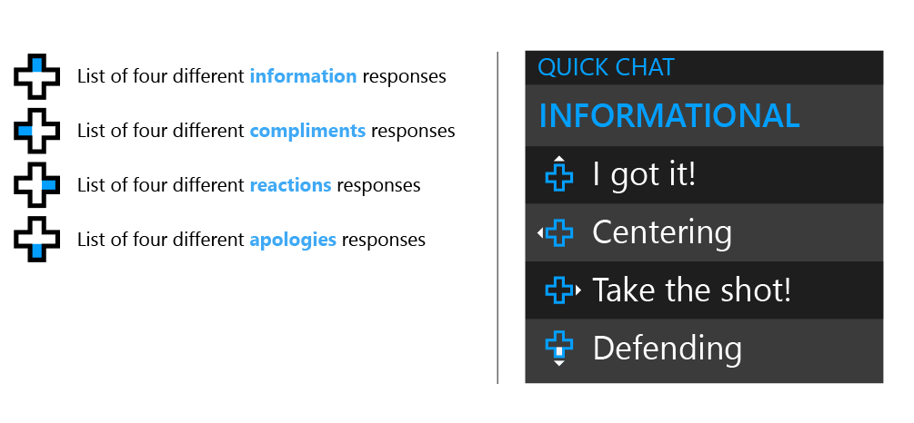
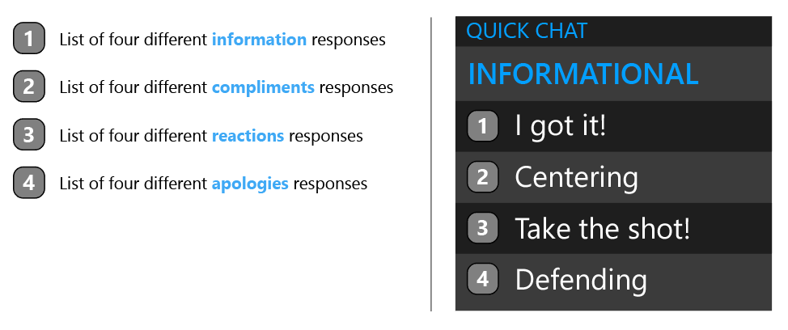
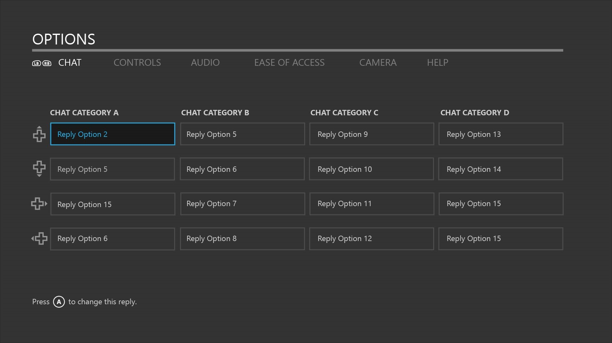
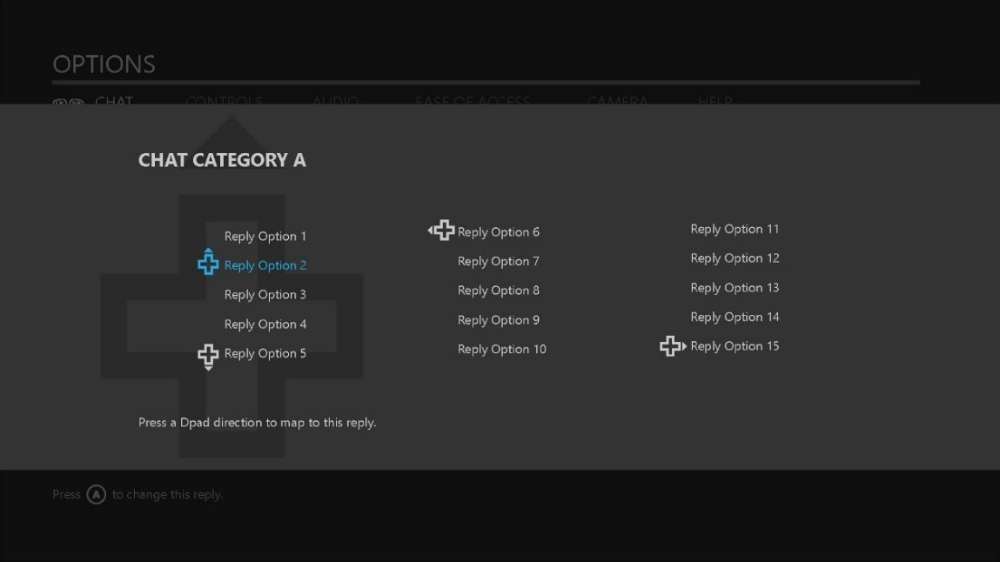
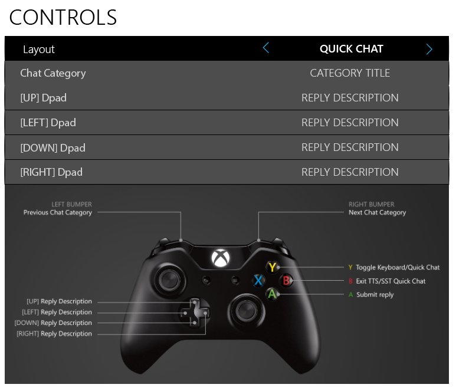

# PlayFab Party Text to Speech UX Guidelines

> [!IMPORTANT]
> This feature is currently in **Private Preview**.  
>
> It is provided to give you an early look at an upcoming feature, and to allow you to provide feedback while it is still in development.  
>
> Access to this feature is restricted to select titles, with SDKs available for Windows 10 PCs and Xbox One. Interoperable SDKs for iOS and Android will be available this summer. If you are interested in this feature, you can request access by submitting a ticket on [support.playfab.com](https://support.playfab.com/hc/en-us/requests/new).

The PlayFab Party service gives creators more options for delivering  great in-game chat experiences. It provides a means for voice chat to be transcribed to text and for text input to be converted to synthesized voice.

This topic is part one of a two-part series covering UX solutions for speech-to-text (STT) and text-to-speech (TTS) implementation.

Part one focuses on text-to-speech implementation, requirements, console and PC UI solutions, while [part two](party-speech-to-text-ux-guidelines.md) focuses on speech-to-text implementation, requirements, and custom console and PC UI solutions.

## TTS/STT scenarios

This chart guides you through scenarios that players will experience when you enable speech-to-text (STT), and text-to-speech (TTS) features. It outlines user impact for three stages of the gaming experience: initial setup, playing a game, and engaging in game chat.

|**Experience Stage**|**SET-UP**                |**PLAY**                           |**CHAT**                 |                           |
| :------------------|:-------------------------|:----------------------------------|:------------------------|:--------------------------|
|**Goal**            |**User enables Setting**  |**User enters a multiplayer game** |**User sends a message** |**User receives messages**
|**Action**          |STT   **Alternative for** Hearing voice replies |Launches game   Enters MP lobby   Overlay opens when game chat is initiated  |User speaks |User reads team’s voice replies converted to text in a STT chat overlay
| |TTS   **Alternative for** Speaking voice replies |Launches game   Enters MP lobby   Game displays method for text input (keyboard, input field, etc) |User types replies using platform supported input methods   Typed messages are converted to synthesized voice | User hears team member’s voice replies
| |UI Narration (in-game)   **Alternative for** Reading in-game menus and text replies |User is guided by the Xbox OS synthesized voice to launch game   Game uses the Speech Synthesis API to narrate menu options leading the user to the MP lobby |For text messaging systems: games use the Speech synthesis API to guide the user to launch the Xbox OS keyboard | For text messaging systems: Games use the Speech Synthesis API to narrate replies
| |Narrator (Xbox OS)   **Alternative for** Reading Xbox menus |User is guided by the Xbox OS synthesized voice to launch game |For text messaging systems: a virtual Keyboard is narrated as the user types a message | N/A |

## Understanding the API

### Text to speech

1. **SetTextToSpeechProfile** (*regional voice selection*)  
The Title needs to set the regional voice/language for the user. This will determine the language, dialect, and gender of the transcribed voice output. Refer to the [Language support reference](https://docs.microsoft.com/en-us/azure/cognitive-services/speech-service/language-support) for a complete list of supported languages and voice options.

2. **SynthesizeTextToSpeech**
The text received will be synthesized and shared with the rest of the chat party. If a game calls **SynthesizedTextToSpeech**, synthesized audio data will appear as though it was captured ”naturally” by the audio capture device (microphone) associated with user A (the sender). It’s as if you were holding your microphone up to a computer that’s talking on the user’s behalf.

3. **SendText**  
User A submits a text message (**std::string message**) to the chat group. The Title accepts text input from User A via a virtual keyboard, or other text input method. **SendText** sends this message to the chat group.

4. **ChatTextReceived**  
The group receives the message. Their only property is the sender. The type determination is whether it’s a text message or a transcribed message and that’s done based on which event is fired.

### Speech to Text

1. **SetTextToSpeechProfile** (*regional voice selection*)  
A speech profile can be specified when the chat control is created for the user. It could be changed mid-game (if the title supports it). It will determine the language, dialect and gender of the transcribed voice output. Refer to the [Language support reference](https://docs.microsoft.com/en-us/azure/cognitive-services/speech-service/language-support) for a complete list of supported languages and voice options.

2. **SetTranscriptionRequested**  
The Title detects that User A turned the STT preference on.

3. **VoiceChatTranscriptionReceived**  
When the system receives a chat voice message, it will automatically generate the transcribed text. The game will receive the transcription.

4. a. Render the text (Title-specific code)  
   Transcribed text will be added to a 'queue'. It is up to the Title to initiate the display of the transcription.

   b. **Windows::Xbox::UI::Accessibility::SendSpeechToTextString** (Xbox and Windows only)  
   Call the OS generated Chat UI. This feature is rendered by the Xbox or Windows OS.

## Text to speech UX (TTS)

Text to speech enables a person to use the platform to send a synthesized voice stream to the active game chat participants. This is great for enabling the person to participate when there is no text chat-based system available, and all communication is active through the in-game voice chat.

### Discovery

Users will find TTS and STT settings in the **Accessibility** section under **Settings**, via Xbox Home (console) or Xbox App (Windows 10). This is a toggle button that enables/disables this feature for all Xbox games specific to the user profile. For all other platforms, refer to their Accessibility guidelines for TTS/STT locations.

- **UX recommendation**  
  If your game chooses to add additional settings that are game specific only, then they should be placed inside your game. In general, accessibility options belong under the game’s settings/options menu. Ideally, settings are available as a dedicated button press and accessible from any screen, or at least, accessible from the pause menu.

### Text input/output options

**A title is responsible for prompting and accepting text**. This could be a custom text-entry field or the platform-provided keyboard. The resulting entry can then be passed into PlayFab Party to be processed into a synthetic stream. That stream is sent to the other players in the chat session as voice. The receiving end would handle this voice stream in the same way they would another voice stream from a user speaking through a microphone.

1. **Console OS virtual keyboard** (*Xbox console example*)

   > [!NOTE]
   > The keyboard will still appear when a gamepad is installed. It will not appear when a hardware keyboard is installed.

   

2. **PC OS virtual keyboard**  (*Windows 10 example*)

   The PlayFab Party APIs support receiving input across all platforms. However, text-input components are not provided in a consistent manner.

   - On the console we have the virtual keyboard. It has its own input box, which accepts text and sends it back to the title.
   - On Windows, games also have the virtual keyboard but it doesn’t have an input box. This means that the title still must code a little rectangle to take in the keystrokes. That’s a problem if a cross-play title doesn’t support text chat and needs just the input rectangle for TTS.

   **UX recommendation (Windows)**  
   Cross-platform games that do not have text messaging in Windows 10 must provide a text-input box to take in keystrokes.

   

3. **A game-provided custom keyboard** (*console example*)

   > [!NOTE]
   > The phrases used here are relevant to the game.

   - Games have full control over visibility.
   - Games can enhance the keyboard to include phrases for quick replies.

   

## Quick Chat: A solution for everyone

Consider your player’s chat activity, discussion type, and screen objectives. For instance, during active gameplay sessions, launching a keyboard and typing replies would be cumbersome using a controller, but may be critical. Providing a method for users to quickly choose from a list of predefined replies would go far in solving this problem.

For users who enable narration, each predefined reply would be narrated. The list of replies would be pre-scripted, so translation would increase in accuracy. The game would have control over contextual, game-specific terms appropriate for their players.

Here are two examples, using the Xbox console and Windows 10 platforms:

### 1a. Phrase list mapped to the D-pad

Pressing a direction (up, down, left, right) on the directional pad (D-pad) opens the chosen category. Once the category list is open, D-pad directions apply to the choices within that category.

To swap categories, the user waits for the window to close (two seconds of inactivity) and then chooses an alternate D-pad direction to open a new list of replies.

### 1b. Phrase list mapped to a keyboard

Pressing a number key (1-4) opens the chosen category. Once the category list is open, the number keys apply to the choices within that category.

To swap categories, the user waits for the window to close (two seconds of inactivity), and then chooses an alternate number key to open a new list of replies.

### 1c. Phrase list mapped to a keyboard with customizable reply settings

Take this feature one step further by allowing the user to choose from a range of responses.

- **Console example**: For keyboard and controller design template natives, see [Resources](#resources).

In the first image, the **Options** menu includes a **Chat** section. This screen displays default and user-selected replies, listed under four categories of conversation types (compliments, instructional, and so on).

Each category is mapped to a single-tap D-pad direction. Each reply is mapped to a double-tap D-pad direction. A user can select a reply to edit by pressing A.

In the second image, a pop-up display offers a list of ten replies. A user can select up to four, each mapped to a D-pad direction based on the order of selection.

### Controller schematic for mapping replies

Some games already provide custom controller mapping for a variety of gameplay preferences. This example proposes an alternative controller schema for TTS/STT. Users can select from a list of predefined replies and map to 4 D-pad directions. The left and right bumpers scroll through categories; the Y button launches a virtual keyboard for custom replies.

During a game session, a user can swap control schemas with a dedicated button press (assigned by the game). In this case, the **B** button exits this mode.

### Quick Chat reply guidance: A method to get gamers engaged

What if gamers could personalize a quick chat solution that enhances player-to-player exchange? What if there were a solution that maximizes game performance while minimizing communication barriers?

Quick Chat comes close, by allowing users to choose from a list of predefined replies. Typically, however, these replies have been limited, redundant phrases that appear automated and boring. The guidelines below explore a strategy for keeping players engaged.

#### Goal: Make this behavior automatic

If Quick Chat satisfies a need repeatedly, a habit can be formed. Consider ways to trigger responses and how that can meet the conversational need at that moment.

#### Quick Chat use cases

- **Conversational**: Players want to engage to facilitate team activity or build deeper social connections.
- **Simplicity**: A Quick Chat solution must be easy to access during times of high-intensity activity.
- **Anonymity**: Players who normally avoid voice chat have a way to participate.

1. **Vary replies**  
   Provide a large collection of reply options. This will contribute to the spontaneity normally achieved in dynamic voice conversations. Users will be less likely to get bored with the same reply options and replies will seem less automated.

2. **Surface the solution at the time the need arises**

   - Make Quick Chat available anytime game chat is engaged.
   - Use a dedicated button-press to launch Quick Chat replies.
   - Default to a category that is contextual to current game activity. For example, when a user scores, the default category is ”Compliments."

3. **Keep replies focused and concrete**  
   This is mostly to keep cognitive load low. Users should be able to read an entire message effortlessly.

   - Make replies relevant to gameplay and its category.
   - Use short phrases, and one-syllable words, that are most commonly used in your game.
   - Use words that you can instantly visualize.

4. **Use humor**  
   *Banter* is a common form of taunting that addresses players in a friendly manner. This is different from *griefing*, where, all too often, users are harassed. If replies are clever, relevant, and varied, some users may not resort to inappropriate choices.

5. **Be relative to skill and progress**  

   - Offer chat preferences that include basing replies on progression and skill level.
   - Surface suggested replies that a user can communicate to other team members. These options would be contextual to current game activity. For example, "Anyone have an axe to beat this zombie?"

6. **Focus on the emotions**  
   PlayFab Party is a vehicle for deepening player engagement through relationships. Replies that communicate certain target emotions can help make their experience more relatable.

## Conclusion

PlayFab Party TTS and STT APIs are a highly effective feature for including a wider range of users to a game and gaming conversations. The more gamers engage and develop relationships, the more likely they are to continue playing. The APIs and presentation are simple. This guidance will help you ensure that the user experience is too.

## Resources

### Design templates

- [QuickChat_AI_Template.zip](https://aka.ms/quickchat-ai-template)  
  Contains:
  - QuickChat_ConsolePC_Templates.ai

### Text-to-speech narration menu guidelines

- [Speech interactions](https://msdn.microsoft.com/windows/uwp/input-and-devices/speech-interactions)
- [Speech synthesis API (Windows)](https://msdn.microsoft.com/en-us/library/windows/apps/windows.media.speechsynthesis.aspx)

### PlayFab Party TTS/STT UX series

- Part 1: [PlayFab Party Speech-to-Text (Custom) UX Guidance](party-speech-to-text-ux-guidelines.md)
- Part 2: **PlayFab Party Text-to-Speech UX Guidance**

### SDK documentation

- “Accessible in-game chat overview” in the PlayFab SDK (see [SDK Downloads](https://developer.xboxlive.com/en-us/live/development/Pages/Downloads.aspx))

### Accessibility guidance

- Griffiths, Gareth. [Subtitles: Increasing Game Accessibility, Comprehension](https://www.gamasutra.com/view/feature/132315/subtitles_increasing_game_.php?print=1)  
  *Gamasutra*
- [Game Accessibility Guidelines](http://gameaccessibilityguidelines.com/)
A straightforward reference for inclusive game design
- Straub, Josh. [Game Accessibility: What It Is And Why It Matters](https://www.gameinformer.com/b/features/archive/2012/08/03/game-accessibility-what-it-is-and-why-it-matters.aspx)  
  *Game Informer*

### Inclusive design

- [Xbox’s Gaming for Everyone Initiative](https://news.microsoft.com/gamingforeveryone/)
- [Inclusive Design](https://www.microsoft.com/design/inclusive)  
  Microsoft Design Toolkit and education
- Kojouharov, Stefan. [10 Tips on Creating an Addictive ChatBot](https://chatbotslife.com/10-tips-on-creating-an-addictive-chatbot-experience-b796ea6d1178#.ka4jz0vk7)  
  Referenced in this document for conversational UI tips.
