# Photon quickstart

This quickstart shows how to set up Photon Multiplayer to work with PlayFab. Currently, PlayFab offers the following Photon integrations:

- Authenticate Photon players with PlayFab.
- Listen for room events using PlayFab **CloudScript** callbacks.

We will illustrate how both features work using the latest [Photon Unity example project](https://www.assetstore.unity3d.com/en/#!/content/1786).

## Prerequisites

1. A [Unity](../../../sdks/unity3d/quickstart.md) project with the PlayFab SDK imported, and a configured title.
2. The PlayFab title registered.

> [!NOTE]  
> This guide omits the Chat Application settings. For your Chat Application to be integrated, create a new Photon Chat Application, and enter the **App ID** in the corresponding boxes in **Unity** and in the PlayFab Game Manager - **Photon Add-on** page.

## Setting up a Photon application

Once you have registered and logged into the  Photon dashboard, create a new **App (1)**.

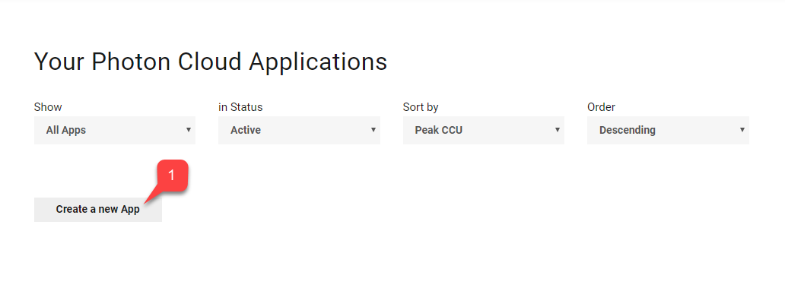  

In the example shown below:

- Select **Realtime Application** type **(1)**.
- Choose a **Name (2)**.
- Create a **Description (3)**. 
- Submit by selecting **Create (4)**.

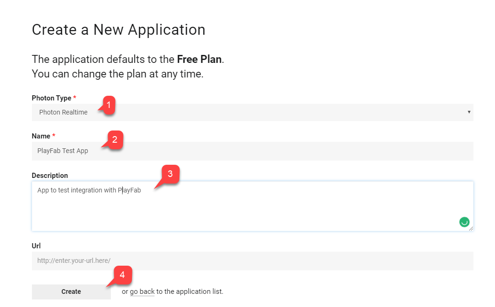  

## Setting up authentication

Find the newly created Application in the list and select **Manage (1)**.

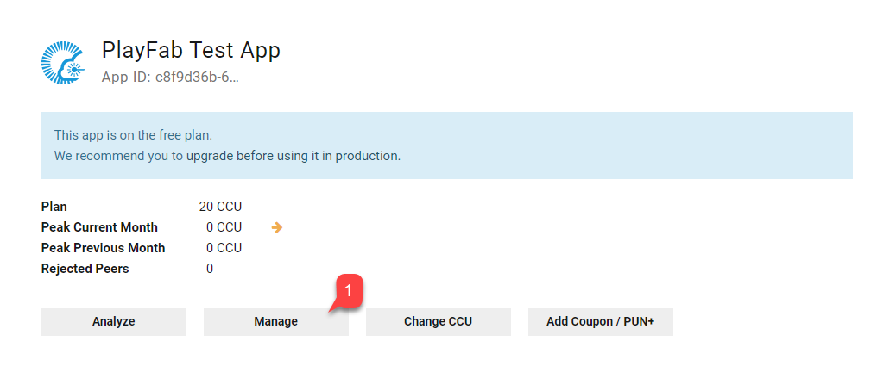  

- The **Application** dashboard will open.

- Find and save the **App ID (1)** located under the page **Title**.

  

- Then locate the **Authentication** section **(1)**.
- Select the **Custom Server (2)**.

  

The next page will let you configure the **Authentication URL** for **Photon**.
The format is shown below.

```html
https://{PlayFabTitleId}.playfabapi.com/photon/authenticate
```
Replace the **Title Id** place holder with your own **Title Id**.

```html
{PlayFabTitleId}
```

Enter the **URL (1)** and submit by selecting the **Create** button **(2)**.

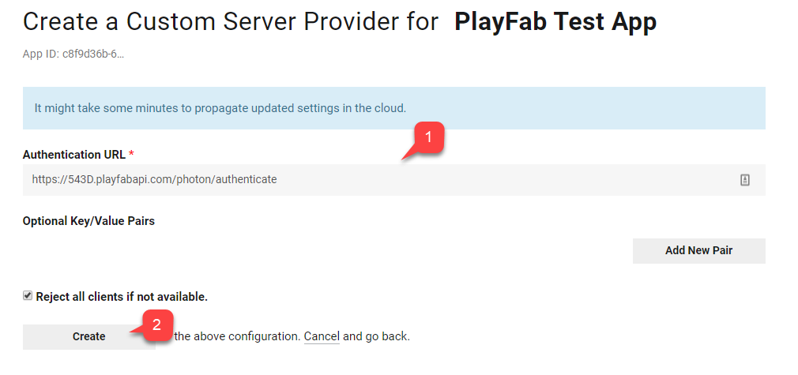  

## Setting up a PlayFab title for Photon

Navigate to your title's **Game Manager** page, then:
- Navigate to **Add-ons** tab **(1)**.
- In the list of **Add-ons**, find and select **Photon (2)**, as shown in the example provided below.

  

The **Photon Add-on** page will allow you to install **Photon** by specifying your **Photon Realtime Application ID (1)**.

- Optionally, you may specify **Chat App ID**.
- Once you install the **Add-on (3)**, a **Photon secret Key** will be generated **(2)**.
- Save it for future use when configuring web-hooks. 

> [!NOTE]
> Remember to save your Photon secret key in a safe and easily accessible place. It will come in handy when configuring Webhooks.
  
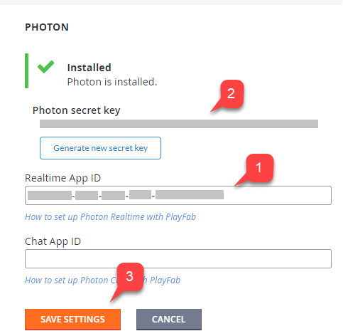  

## Setting Photon Webhooks

As an optional integration, Photon may transmit certain events to your PlayFab **CloudScript**. This is done by means of Webhooks:

- You specify a **Base URL**.
- Then you specify path for each of the available **Events**.
- A path is, effectively, a handler name implemented in your **CloudScript**.

The base URL will have the following format:

```html
https://{PlayFabTitleId}.playfablogic.com/webhook/1/prod/{PhotonSecretKey}
```

Make sure to replace **Title Id** placeholder with your own **Title Id**.

```html
{PlayFabTitleId}
```

Make sure to replace **Photon Secret Key** token with the **Secret Key** you generated on the **Photon Add-on** page.

```html
{PhotonSecretKey}
```

- Fill in the **Base URL (1)**.
- Assign a **CloudScript** handler **Name** for each of the available **Events (2)**.
- Remove any **CustomHttpHeaders (3)**.
- Submit this by selecting the **Save** button **(4)**.

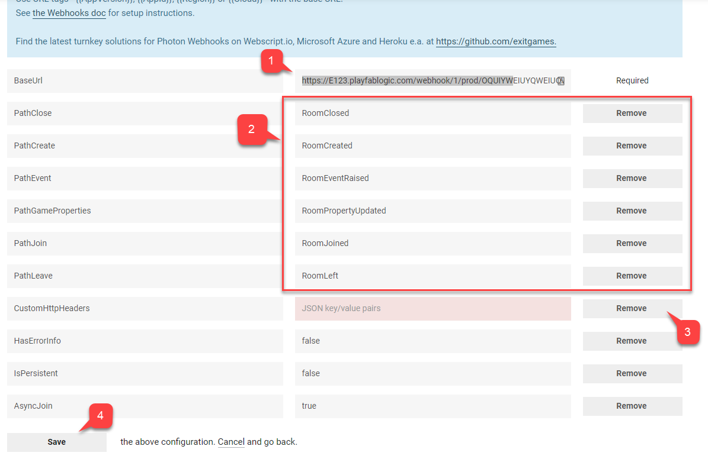  

## Setting up a Unity project

The guide assumes you already have PlayFab SDK imported, set up, and the title setting configured.

- Start by navigating to the **Asset Store**.
- Locate [Photon Unity Networking Free package](https://www.assetstore.unity3d.com/en/#!/content/1786).
- Select **Import (1)**.
- You may inspect the imported files.
- Then select **Import (2)**.

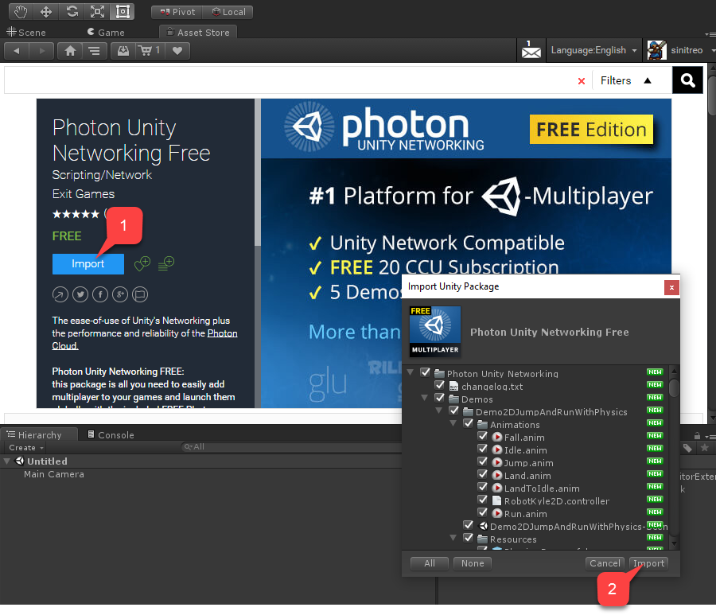  

Right after import process finishes, the **PUN Setup** window will open.

- Enter your **Realtime Application ID (1)** found in the **Photon Application Dashboard** for the **Photon App** you created.
- Select **Setup Project (2)**.
- Once the setup finishes, select **Close (3)**.

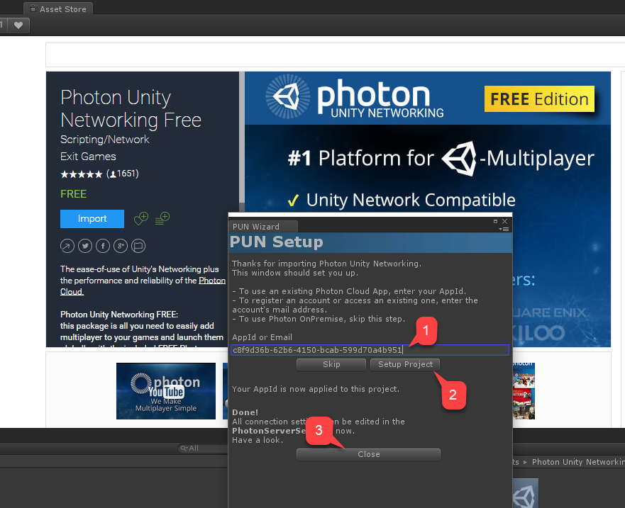  

If **AppId** was accepted, the **Photon Server Settings** object will be selected and viewable in the **Unity Inspector** window. To manually access the **Server Settings** object:

- Navigate to the top window panel.
- Select **Window**.
- Then select **Photon Unity Networking (1)**.
- Finally select **Highlight Server Settings (2)**.
- The **Standard Unity** project window will reveal the **PhotonServerSettings (3)** object. 
- Select the object to reveal its settings in the **Unity Inspector** window.

  

> [!NOTE]
> As part of **PhotonServerSettings**, you have the option to assign the **Chat Application ID**.

At this point the project is configured.

## Implementing PlayFab to Photon authentication

When you enable the Photon Add-on for your title in the PlayFab Game Manager, and configure the authentication on the Photon Application dashboard, PlayFab allows you to authenticate existing PlayFab players inside the Photon environment.

This means you may completely avoid implementing any user management for Photon.

- Navigate to **DemoHub-Scene-V2** scene **(1)** from the **Photon Unity Networking Free** package, the **Classic** version.
- This scene is a hub for all the examples from the package.
- As it is the *first* scene to load, let's add a small script to enable authenticating PlayFab with Photon.
- Create an empty **GameObject** called **PlayFabAuthenticator (2)**.
- Then in the **Unity Inspector** window, add a component with the same name to this **GameObject (3)**.

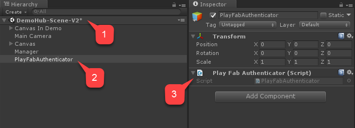

Select the gear icon, then choose to edit the script from the drop-down menu. Copy and paste the code for the **PlayFabAuthenticator** component as illustrated below (please, read the comments for the explanation), and save and close the file.

```csharp
using PlayFab;
using PlayFab.ClientModels;
using UnityEngine;

public class PlayFabAuthenticator : MonoBehaviour {

    private string _playFabPlayerIdCache;

    //Run the entire thing on awake
    public void Awake() {
        AuthenticateWithPlayFab();
    }

    /*
     * Step 1
     * We authenticate current PlayFab user normally.
     * In this case we use LoginWithCustomID API call for simplicity.
     * You can absolutely use any Login method you want.
     * We use PlayFabSettings.DeviceUniqueIdentifier as our custom ID.
     * We pass RequestPhotonToken as a callback to be our next step, if
     * authentication was successful.
     */
    private void AuthenticateWithPlayFab(){
        LogMessage("PlayFab authenticating using Custom ID...");

        PlayFabClientAPI.LoginWithCustomID(new LoginWithCustomIDRequest()
        {
            CreateAccount = true,
            CustomId = PlayFabSettings.DeviceUniqueIdentifier
        }, RequestPhotonToken, OnPlayFabError);
    }

    /*
    * Step 2
    * We request Photon authentication token from PlayFab.
    * This is a crucial step, because Photon uses different authentication tokens
    * than PlayFab. Thus, you cannot directly use PlayFab SessionTicket and
    * you need to explicitly request a token. This API call requires you to
    * pass Photon App ID. App ID may be hardcoded, but, in this example,
    * We are accessing it using convenient static field on PhotonNetwork class
    * We pass in AuthenticateWithPhoton as a callback to be our next step, if
    * we have acquired token succesfully
    */
    private void RequestPhotonToken(LoginResult obj) {
        LogMessage("PlayFab authenticated. Requesting photon token...");
        
        //We can player PlayFabId. This will come in handy during next step
        _playFabPlayerIdCache = obj.PlayFabId;

        PlayFabClientAPI.GetPhotonAuthenticationToken(new GetPhotonAuthenticationTokenRequest()
        {
            PhotonApplicationId = PhotonNetwork.PhotonServerSettings.AppID
        }, AuthenticateWithPhoton, OnPlayFabError);
    }

    /*
     * Step 3
     * This is the final and the simplest step. We create new AuthenticationValues instance.
     * This class describes how to authenticate a players inside Photon environment.
     */
    private void AuthenticateWithPhoton(GetPhotonAuthenticationTokenResult obj) {
        LogMessage("Photon token acquired: " + obj.PhotonCustomAuthenticationToken + "  Authentication complete.");

        //We set AuthType to custom, meaning we bring our own, PlayFab authentication procedure.
        var customAuth = new AuthenticationValues { AuthType = CustomAuthenticationType.Custom };
        
        //We add "username" parameter. Do not let it confuse you: PlayFab is expecting this parameter to contain player PlayFab ID (!) and not username.
        customAuth.AddAuthParameter("username", _playFabPlayerIdCache);    // expected by PlayFab custom auth service
       
        //We add "token" parameter. PlayFab expects it to contain Photon Authentication Token issues to your during previous step.
        customAuth.AddAuthParameter("token", obj.PhotonCustomAuthenticationToken);
        
        //We finally tell Photon to use this authentication parameters throughout the entire application.
        PhotonNetwork.AuthValues = customAuth;
    }

    private void OnPlayFabError(PlayFabError obj) {
        LogMessage(obj.GenerateErrorReport());
    }

    public void LogMessage(string message) {
        Debug.Log("PlayFab + Photon Example: " + message);
    }
}
```

## Testing PlayFab to Photon authentication

Start the scene **(1)** and inspect the flow of console messages **(2)**.
Control that:

 1. Authentication to PlayFab itself was successful **(3)**
 2. The Photon token was acquired **(4)**

The following picture illustrates the correct flow.

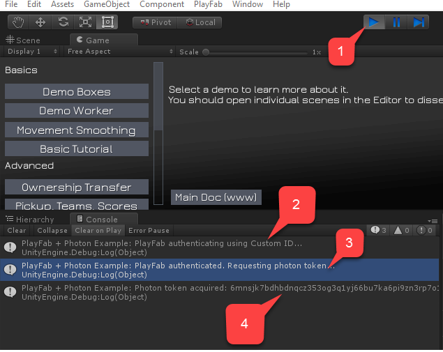  

Once the Photon token has been acquired, and authentication is complete, we are okay to check out the Photon demos.

For example, start a demo called **Demo Boxes**. Ensure that the PlayFab authentication is complete, select **Demo Boxes (1)**, then select **Load Demo (2)**, as shown on the following picture.

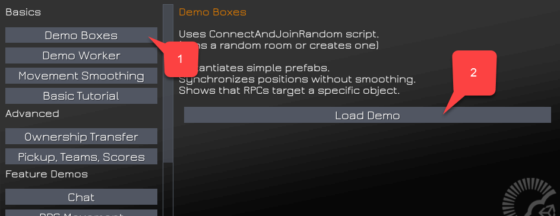  

Photon will start outputting debug messages. By simply monitoring your console, you can easily spot if you have any authentication issues.

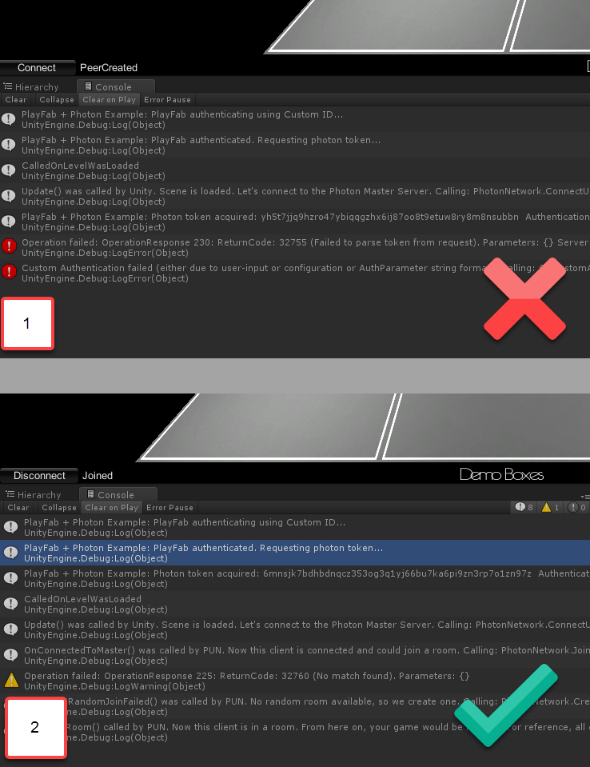  

Ensure that no **Authentication Denied** errors are present in the console. At this point, you have set up minimal PlayFab and Photon integration.

## Photon room event + CloudScript

Photon matchmaking system has the concept of a *Room*. If you are not familiar with this concept, please consult with the [Photon Matchmaking Guide](https://doc.photonengine.com/en-us/realtime/current/reference/matchmaking-and-lobby).

PlayFab allows you to intercept various room events. The following room events require only **CloudScript** to be intercepted:

- **RoomCreated**
- **RoomJoined**
- **RoomLeft**
- **RoomClosed**

The following events will require additional control over **Unity** code to be intercepted (details are given later in this document):

- **RoomPropertyUpdated**
- **RoomEventRaised**

> [!NOTE]  
> Once you introduce a handler for a room event, it becomes an essential part of the event handling flow. So errors produced while running your **CloudScript** may cause problems for the *entire* system. For example, if the **RoomCreated** handler throws an error, your clients will throw an error as well, and will not be able to connect properly.

Let's construct a PlayFab CloudScript by defining a handler for each event type one-by-one.

### Room Created

The Room Created handler is invoked every time a Photon room is created. The following **CloudScript** handler will intercept such event.

```javascript
// Triggered automatically when a Photon room is first created
handlers.RoomCreated = function (args) {
    return { ResultCode : 0, Message: 'Success' }; 
};
```

> [!NOTE]
> You may acquire additional data about the event using the "args" argument. The example of args payload is given below.


```javascript
{
  "ActorNr": 1,
  "AppVersion": "1.2_1.85",
  "AppId": "bfd5f98b-c6a4-4763-80d9-824d20db842b",
  // Options with which the room was created.
  "CreateOptions": {
    "MaxPlayers": 4,
    "LobbyId": null,
    "LobbyType": 0,
    "CustomProperties": {
      
    },
    "EmptyRoomTTL": 0,
    "PlayerTTL": 0,
    "CheckUserOnJoin": false,
    "DeleteCacheOnLeave": true,
    "SuppressRoomEvents": false,
    "PublishUserId": false,
    "ExpectedUsers": null
  },
  // Unique game identifier
  "GameId": "8b8322de-096d-4481-a2b2-8db8bb45cfef",
  "Region": "EU",
  "Type": "Create",
  // User that caused the room to be created
  "UserId": "834D5AA5BAB1DFB6",
  "Username": ""
}
```

### Room Joined

The Room Joined handler is invoked every time a player joins the room. The following **CloudScript** handler will intercept such an event.

```javascript
// Triggered automatically when a player joins a Photon room
handlers.RoomJoined = function (args) {
    return { ResultCode : 0, Message: 'Success' }; 
};
```

This callback is not invoked for the very first user entering the room. Use **Room Created** to intercept the first player that joins. You may acquire additional data about the event using the "args" argument.

The example of args payload is shown below.

```javascript
{
  "ActorNr": 2,
  "AppVersion": "1.2_1.85",
  "AppId": "bfd5f98b-c6a4-4763-80d9-824d20db842b",
  // Unique Game Identifier
  "GameId": "b0f55a2e-431d-402a-9809-b0240443267e",
  "Region": "EU",
  "Type": "Join",
  // Id of the player that has joined
  "UserId": "AAC7634BF46289DF",
  "Username": ""
}
```

### Room Left

The Room Left handler is invoked every time a player leaves the room. The following **CloudScript** handler will intercept such event.

```javascript
// Triggered automatically when a player leaves a Photon room
handlers.RoomLeft = function (args) {
    return { ResultCode : 0, Message: 'Success' }; 
};
```

You may acquire additional data about the event using "args" argument. The example of args payload is shown below.

```javascript
{
  "ActorNr": 2,
  "AppVersion": "1.2_1.85",
  "AppId": "bfd5f98b-c6a4-4763-80d9-824d20db842b",
  // Unique Game Identifier
  "GameId": "b0f55a2e-431d-402a-9809-b0240443267e",
  "IsInactive": false,
  "Reason": "0",
  "Region": "EU",
  "Type": "ClientDisconnect",
  // Id of the user that has left the room
  "UserId": "AAC7634BF46289DF",
  "Username": ""
}
```

### Room Closed

The Room Closed handler is invoked every time the last player leaves the room and room has no players left. The following **CloudScript** handler will intercept such event*.

```javascript
// Triggered automatically when a Photon room closes
// Note: currentPlayerId is undefined in this function
handlers.RoomClosed = function (args) {
    return { ResultCode : 0, Message: 'Success' };
};
```

You may acquire additional data about the event using "args" argument. The example of args payload is shown below.

```javascript
  "ActorCount": 0,
  "ActorNr": 1,
  "AppVersion": "1.2_1.85",
  "AppId": "bfd5f98b-c6a4-4763-80d9-824d20db842b",
  // Unique game identifier
  "GameId": "b0f55a2e-431d-402a-9809-b0240443267e",
  "Region": "EU",
  "State2": {
    "ActorList": [
      
    ]
  },
  "Type": "Close"
}
```

### Room Property Updated

The Room Property Updated handler is invoked every time the room property is changed. The following **CloudScript** handler will intercept such an event.

```javascript
// Triggered automatically when a Photon room game property is updated.
// Note: currentPlayerId is undefined in this function
handlers.RoomPropertyUpdated = function (args) {
    return { ResultCode : 0, Message: 'Success' }; 
};
```

> [!NOTE]
> The **currentPlayerId** is undefined in this handler. If the room property was changed from the client, you may use the "args" argument, and refer to the **UserId** to acquire the player in charge.

You may acquire additional data about the event using "args" argument. The example of args payload is shown below.

```javascript
{
  "ActorNr": 1,
  "AppVersion": "1.2_1.85",
  "AppId": "bfd5f98b-c6a4-4763-80d9-824d20db842b",
  // Custom Room Properties
  "Properties": {
    "CustomProperty": "It's Value"
  },
  "GameId": "8b8322de-096d-4481-a2b2-8db8bb45cfef",
  "Region": "EU",
  "State": {
    "ActorCounter": 1,
    "ActorList": [
      {
        "ActorNr": 1,
        "UserId": "834D5AA5BAB1DFB6",
        "Username": "",
        "IsActive": true,
        "Binary": "RGIAAAEBRAAAAAFi\/3MAAA==",
        "DEBUG_BINARY": {
          "1": {
            "255": ""
          }
        }
      }
    ],
    "Binary": {
      "18": "RAAAAANi+nkAAHNzAA1QbGF5ZXJJbmRleGVzRGlpAAEAAAABAAAAAHMADkN1c3RvbVByb3BlcnR5cwAKSXQncyBWYWx1ZQ=="
    },
    "CheckUserOnJoin": false,
    "CustomProperties": {
      
    },
    "DeleteCacheOnLeave": true,
    "EmptyRoomTTL": 0,
    "IsOpen": true,
    "IsVisible": true,
    "LobbyType": 0,
    "LobbyProperties": [
      
    ],
    "MaxPlayers": 4,
    "PlayerTTL": 0,
    "SuppressRoomEvents": false,
    "Slice": 0,
    "DebugInfo": {
      "DEBUG_PROPERTIES_18": {
        "250": [
          
        ],
        "PlayerIndexes": {
          "1": 0
        },
        "CustomProperty": "It's Value"
      }
    },
    "ExcludedActors": [
      
    ],
    "PublishUserId": false,
    "ExpectedUsers": [
      
    ]
  },
  "Type": "Game",
  "UserId": "834D5AA5BAB1DFB6",
  "Username": ""
}
```

When changing custom Room properties using the **Unity** Photon client, *it is important to mark the call*, so that it passes the event to WebHook (PlayFab in this case).

```csharp
// Properties updates ( this hashtable contains the properties to be changed. Properties not mentioned here will stay as is
var properties = new ExitGames.Client.Photon.Hashtable() { { "CustomProperty" , "It's Value" } };

// Control set. Empty in this case, because our property has not existed before. 
// Otherwise you would include previous value of the property.
var expectedProperties = new ExitGames.Client.Photon.Hashtable();

// Set Custom Properties call. Notice the last argument set to "true"
// This tells Photon to forward event to the webhook.
PhotonNetwork.room.SetCustomProperties(properties, expectedProperties, true);
```

### Room Event Raised

The **Room Event Raised** is called every time a custom room event is raised. The following **CloudScript** handler will intercept such an event.

```javascript
// Triggered by calling "OpRaiseEvent" on the Photon client. The "args.Data" property is
// set to the value of the "customEventContent" HashTable parameter, so you can use
// it to pass in arbitrary data.
handlers.RoomEventRaised= function (args) {
    return { ResultCode : 0, Message: 'Success' };
};
```

You may acquire additional data about the event using "args" argument. The example of args payload is shown below.

```javascript
{
  "ActorNr": 1,
  "AppVersion": "1.2_1.85",
  "AppId": "bfd5f98b-c6a4-4763-80d9-824d20db842b",
  // Custom event data
  "Data": {
    "Hello": "World"
  },
  "GameId": "8b8322de-096d-4481-a2b2-8db8bb45cfef",
  "Region": "EU",
  "State": {
    "ActorCounter": 1,
    "ActorList": [
      {
        "ActorNr": 1,
        "UserId": "834D5AA5BAB1DFB6",
        "Username": "",
        "IsActive": true,
        "Binary": "RGIAAAEBRAAAAAFi\/3MAAA==",
        "DEBUG_BINARY": {
          "1": {
            "255": ""
          }
        }
      }
    ],
    "Binary": {
      "18": "RAAAAAJi+nkAAHNzAA1QbGF5ZXJJbmRleGVzRGlpAAEAAAABAAAAAA=="
    },
    "CheckUserOnJoin": false,
    "CustomProperties": {
      
    },
    "DeleteCacheOnLeave": true,
    "EmptyRoomTTL": 0,
    "IsOpen": true,
    "IsVisible": true,
    "LobbyType": 0,
    "LobbyProperties": [
      
    ],
    "MaxPlayers": 4,
    "PlayerTTL": 0,
    "SuppressRoomEvents": false,
    "Slice": 0,
    "DebugInfo": {
      "DEBUG_PROPERTIES_18": {
        "250": [
          
        ],
        "PlayerIndexes": {
          "1": 0
        }
      }
    },
    "ExcludedActors": [
      
    ],
    "PublishUserId": false,
    "ExpectedUsers": [
      
    ]
  },
  "Type": "Event",
  // PlayFab User Id if he/she was the source of the event
  "UserId": "834D5AA5BAB1DFB6",
  "Username": "",
  // Event code
  "EvCode": 15
}
```

When raising custom room events using **Unity** Photon client, it is important to mark the call so that it passes the event to WebHooks (PlayFab in this case).

```csharp
var data = new Dictionary<string,object>() {
    { "Hello" , "World" }
};

// Raise custom room event
// Replace 15 with any custom event code of your choice [0..299]
PhotonNetwork.RaiseEvent(15, data, true, new RaiseEventOptions() {
    ForwardToWebhook = true, // Mark call to pass event to WebHook (PlayFab in this case)
});
```

## Testing Room Event Handlers

This example extends the previous example (PlayFab + Photon authentication).

Upload the following **CloudScript** for your title.

```javascript
handlers.RoomCreated = function (args) {
    server.WriteTitleEvent({
    	EventName : "room_created"
    });
    return { ResultCode : 0, Message: 'Success' };
};

handlers.RoomJoined = function (args) {
    server.WriteTitleEvent({
    	EventName : "room_joined"
    });
    return { ResultCode : 0, Message: 'Success' };
};

handlers.RoomLeft = function (args) {
    server.WriteTitleEvent({
    	EventName : "room_left"
    });
    return { ResultCode : 0, Message: 'Success' };
};

handlers.RoomClosed = function (args) {
    server.WriteTitleEvent({
    	EventName : "room_closed"
    });
    return { ResultCode : 0, Message: 'Success' };
};

handlers.RoomPropertyUpdated = function (args) {
    server.WriteTitleEvent({
    	EventName : "room_property_changed"
    });
    return { ResultCode : 0, Message: 'Success' };
};

handlers.RoomEventRaised = function (args) {
    server.WriteTitleEvent({
    	EventName : "room_event_raised"
    });
    return { ResultCode : 0, Message: 'Success' };
};
```

The code does nothing more than posting a new title event whenever a Photon callback is invoked. Being of no use in production, this example will let us clearly see how the callbacks are invoked.

Extend the **PlayFabAuthenticator** script by including new example code that will raise custom event, and set custom room property. The extended version also utilizes an **Awake** method to not destroy object between scene loads.

```csharp
using System.Collections.Generic;
using PlayFab;
using PlayFab.ClientModels;
using UnityEngine;

public class PlayFabAuthenticator : MonoBehaviour {

    private string _playFabPlayerIdCache;


    //Run the entire thing on awake
    public void Awake() {
        AuthenticateWithPlayFab();
        DontDestroyOnLoad(gameObject);
    }


    /*
     * Step 1
     * We authenticate current PlayFab user normally. 
     * In this case we use LoginWithCustomID API call for simplicity.
     * You can absolutely use any Login method you want.
     * We use PlayFabSettings.DeviceUniqueIdentifier as our custom ID.
     * We pass RequestPhotonToken as a callback to be our next step, if 
     * authentication was successful.
     */
    private void AuthenticateWithPlayFab()  {
        LogMessage("PlayFab authenticating using Custom ID...");

        PlayFabClientAPI.LoginWithCustomID(new LoginWithCustomIDRequest()
        {
            CreateAccount = true,
            CustomId = PlayFabSettings.DeviceUniqueIdentifier+"EDITOR"
        }, RequestPhotonToken, OnPlayFabError);
    }

    /*
    * Step 2
    * We request Photon authentication token from PlayFab.
    * This is a crucial step, because Photon uses different authentication tokens
    * than PlayFab. Thus, you cannot directly use PlayFab SessionTicket and
    * you need to explicitely request a token. This API call requires you to 
    * pass Photon App ID. App ID may be hardcoded, but, in this example,
    * We are accessing it using convenient static field on PhotonNetwork class
    * We pass in AuthenticateWithPhoton as a callback to be our next step, if 
    * we have acquired token succesfully
    */
    private void RequestPhotonToken(LoginResult obj) {
        LogMessage("PlayFab authenticated. Requesting photon token...");
        
        //We can player PlayFabId. This will come in handy during next step
        _playFabPlayerIdCache = obj.PlayFabId;

        PlayFabClientAPI.GetPhotonAuthenticationToken(new GetPhotonAuthenticationTokenRequest()
        {
            PhotonApplicationId = PhotonNetwork.PhotonServerSettings.AppID
        }, AuthenticateWithPhoton, OnPlayFabError);
    }

    /*
     * Step 3
     * This is the final and the simplest step. We create new AuthenticationValues instance.
     * This class describes how to authenticate a players inside Photon environment.
     */
    private void AuthenticateWithPhoton(GetPhotonAuthenticationTokenResult obj) {
        LogMessage("Photon token acquired: " + obj.PhotonCustomAuthenticationToken + "  Authentication complete.");

        //We set AuthType to custom, meaning we bring our own, PlayFab authentication procedure.
        var customAuth = new AuthenticationValues { AuthType = CustomAuthenticationType.Custom };

        //We add "username" parameter. Do not let it confuse you: PlayFab is expecting this parameter to contain player PlayFab ID (!) and not username.
        customAuth.AddAuthParameter("username", _playFabPlayerIdCache);    // expected by PlayFab custom auth service
       
        //We add "token" parameter. PlayFab expects it to contain Photon Authentication Token issues to your during previous step.
        customAuth.AddAuthParameter("token", obj.PhotonCustomAuthenticationToken);
        
        //We finally tell Photon to use this authentication parameters throughout the entire application.
        PhotonNetwork.AuthValues = customAuth;
    }

    private void OnPlayFabError(PlayFabError obj) {
        LogMessage(obj.ErrorMessage);
    }

    public void LogMessage(string message) {
        Debug.Log("PlayFab + Photon Example: " + message);
    }


    // Add small button to launch our example code 
    public void OnGUI() {
        if (GUILayout.Button("Execute Example ")) ExecuteExample(); 
    }


    // Example code which raises custom room event, then sets custom room property
    private void ExecuteExample() {

        // Raise custom room event
        var data = new Dictionary<string, object>() { {"Hello","World"} };
        var result = PhotonNetwork.RaiseEvent(15, data, true, new RaiseEventOptions()
        {
            ForwardToWebhook = true,
        });
        LogMessage("New Room Event Post: "+result);

        // Set custom room property
        var properties = new ExitGames.Client.Photon.Hashtable() { { "CustomProperty", "It's Value" } };
        var expectedProperties = new ExitGames.Client.Photon.Hashtable();
        PhotonNetwork.room.SetCustomProperties(properties, expectedProperties, true);
        LogMessage("New Room Properties Set");
    }

}
```

- Run the hub scene and wait for PlayFab authentication to complete **(1)**.
- Then load the **Boxes Demo** scene **(2)**.

  

- Once the scene loads, wait for the peer to connect newly created room **(1)**.
- Then select **Execute Example** in the top left corner **(2)**.
- Observe the console output **(3)**.
- Make sure no errors have occurred.

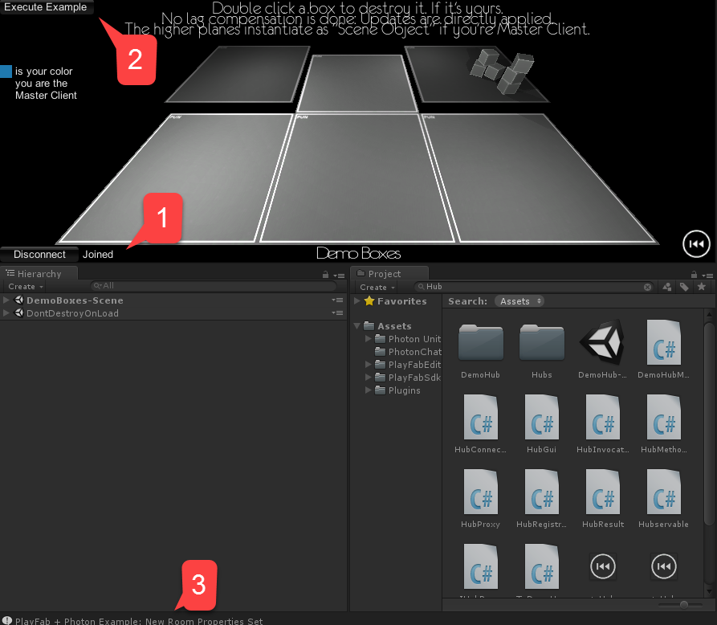

Don't forget to stop **Unity** from playing. This is done to ensure that we also receive **RoomLeft** and **RoomClosed** events.

Navigate to title Game Manager page, and observe the **PlayStream** panel. You should be able to see events generated as a result of our **CloudScript** code handling Photon events.

 1. Initially, our Photon instance had no opened room. When we launched the example, Photon has created the room for the Boxes Demo.
 2. The first player to join is the player who requested the room. So no **RoomJoined Event** was recorded. We then executed our example code:
     - First, we raised a custom **Room Event**.
     - Then, we set a custom **Room Property**.
     - Then we stopped the **Unity** play mode. This resulted in our client leaving the room.
 3. Since our disconnected client was the last one, there are no more clients and Photon closes the room.

All the events should be logged into the **PlayStream** event flow, as shown on the following picture.

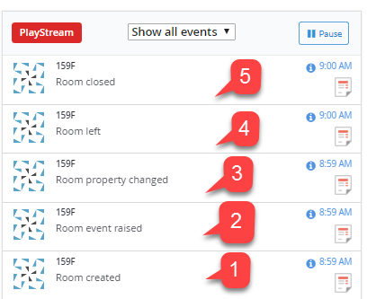

At this point, you have fully integrated Photon event support into your PlayFab title.
