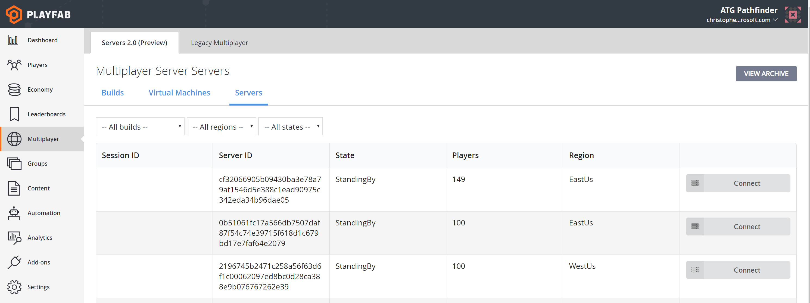
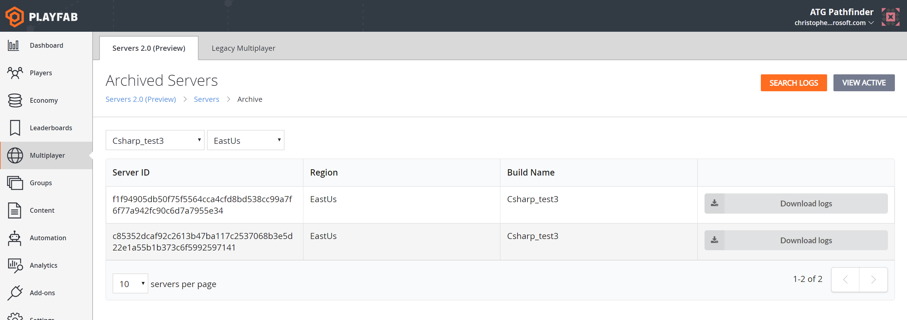

# Archiving and retrieving multiplayer server logs

In several scenarios you may want to retain logs or other arbitrary file content from your game servers for later analysis. The Game Server **SDK** provides an **API** that allows you to write to a log file or access a logging directory. See [Integrating game servers with the PlayFab game server SDK (GSDK)](integrating-game-servers-with-gsdk.md) to learn more about these logging mechanisms.

**Archived Servers** is the vehicle for retrieving these logs after the game server has terminated.

First, go to the **Servers** page in the **Multiplayer Servers 2.0 tab** and select **View Archive** on the top right, as shown below.

To do this programmatically, use the [ListArchivedMultiplayerServers](xref:titleid.playfabapi.com.multiplayer.multiplayerserver.listarchivedmultiplayerservers) method.

Use the **Search Logs** button to download logs for a specific server by **Server ID**. The programmatic equivalent is the [GetMultiplayerServerLogs](xref:titleid.playfabapi.com.multiplayer.multiplayerserver.getmultiplayerserverlogs) method.

