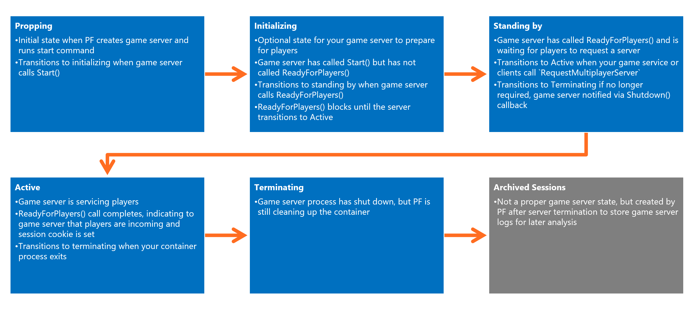

# Basics of a PlayFab game server

PlayFab operates game servers as containerized applications. This tutorial describes how game servers are packaged and integrated with PlayFab systems.

## Containerizing and packaging game servers

Typically you package the game server executable and other files as zip files, and upload them as game assets. Assets are combined with a container image to create your game server build.

The base container image provides the **Windows** operating system files and the execution environment that allows the game to run. PlayFab provides a set of managed container images to use for **Windows** builds.

When a build is created through Game Manager or **APIs** like [CreateBuildWithManagedContainer()](xref:titleid.playfabapi.com.multiplayer.multiplayerserver.createbuildwithmanagedcontainer), you specify the assets and where they should be mounted within the container's file system. You also specify the shell command to start the game (`StartGameCommand`), this might be:

```cmd
C:\GameCoreApp\GameServer.exe -mode RETAIL
```

The **start game** command must start an application that uses the PlayFab Game Server **SDK** to call `ReadyForPlayers` when ready to serve game clients. The container will be terminated and recycled when the application process exits.

## Managed Containers

PlayFab currently supports one managed container; the *PlayFab Multiplayer* container image, based on Windows Server Core. You can download this container through [Docker Hub](https://hub.docker.com/r/microsoft/playfab-multiplayer/) so that your local environment matches the runtime environment in **Azure**.

There are debugging tools that allow you to step through the multiplayer server state machine locally on your dev box.

For more information, check out [Locally debugging game servers and integration with PlayFab](locally-debugging-game-servers-and-integration-with-playfab.md).

The following image shows the key flows for uploading a game server and combining this package with a selected container.


### Managed container updates

Managed containers are the easiest integration option for **Windows** projects, and a good place to start if you are unfamiliar with containers.

A key feature of managed containers is that PlayFab will automatically update the base image with critical security fixes to ensure reliable play. Generally, security updates happen every month, and should not cause service interruption.

During an upgrade, standing-by sessions that are naturally being recycled will be replaced with an updated container image and the same game server package.

When PlayFab intends to update a managed container image that you are using, you will receive **PlayStream** events.

## Integrating the PlayFab Game Server SDK

*Learn more at:* [Integrating game servers with the PlayFab game server SDK (GSDK)](integrating-game-servers-with-gsdk.md)

The PlayFab Game Server **SDK** (**GSDK**) is provided in  **C++** and **C#** versions. The **GSDK** connects your game server to a local agent installed on the VM. This agent facilitates key server interactions with the PlayFab control infrastructure.


When your game server is initialized it will be put into a **preparing state**, with PlayFab waiting for your game server to call `ReadyForPlayers()`. Once this is called, the game server is put into a **standing by state** and waits for allocation requests from your matchmaking service into PlayFab via `RequestMultiplayerServer`.

The following image shows the **States of a PlayFab multiplayer server**:



Ostensibly calling `ReadyForPlayers()` is the only requirement to get your game server to run and continue running. However, there are several callbacks/events that you may want to process in order to provide the best user experience.

## Server scripts and PlayFab-configured environment variables

In some cases you may want game servers to run a **CMD**, **PowerShell** or bash script (a "bootstrapper"), which then launches your compiled game server executable. This script may configure the container's internal environment, pass command-line arguments to the executable, or any other task you don't want to execute in the game server executable itself.

As a convenience, PlayFab configures some build information as the following environmental variables in the container. These can also be accessed through the **GSDK**, but using the environmental variables can be easier from a script.

- **PF_TITLE_ID** - Title Id for the session host
- **PF_BUILD_ID** - Build Id for the session host
- **PF_REGION** - **Azure** Region for the session host
